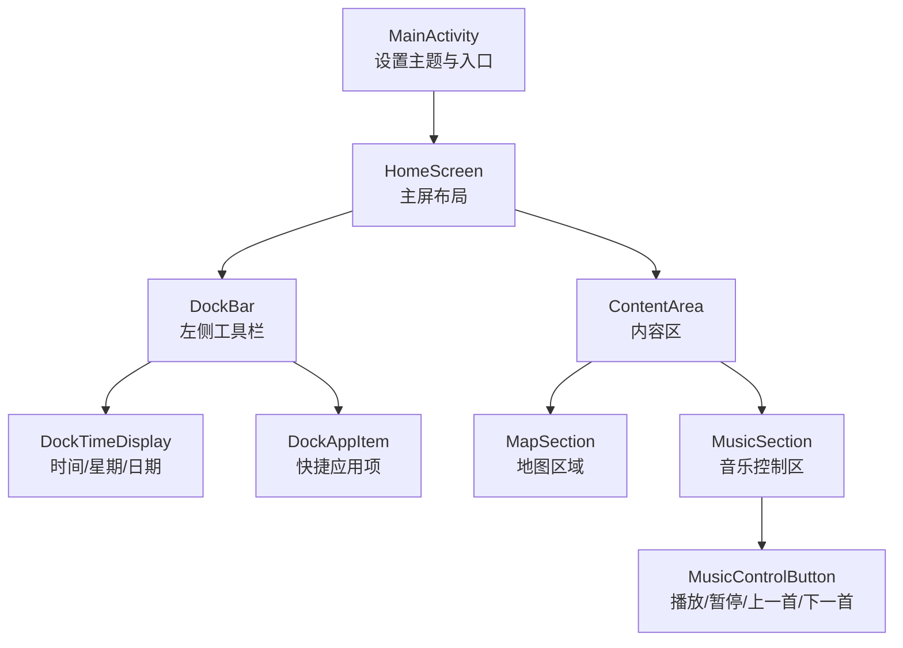
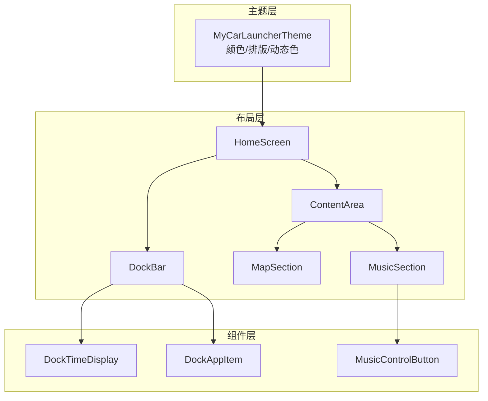
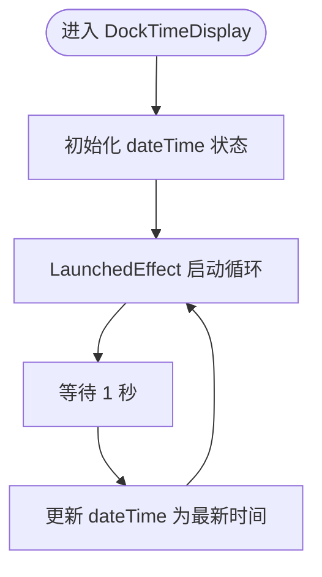
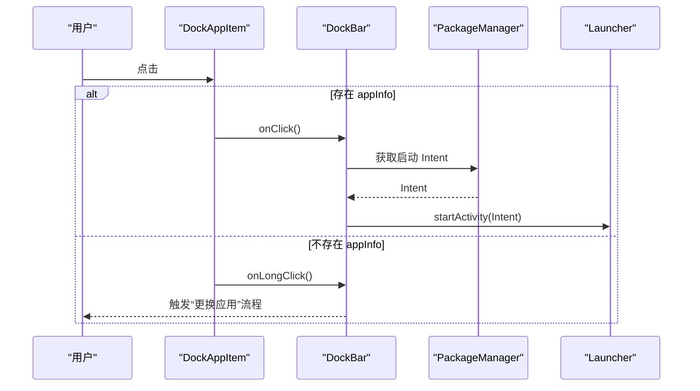
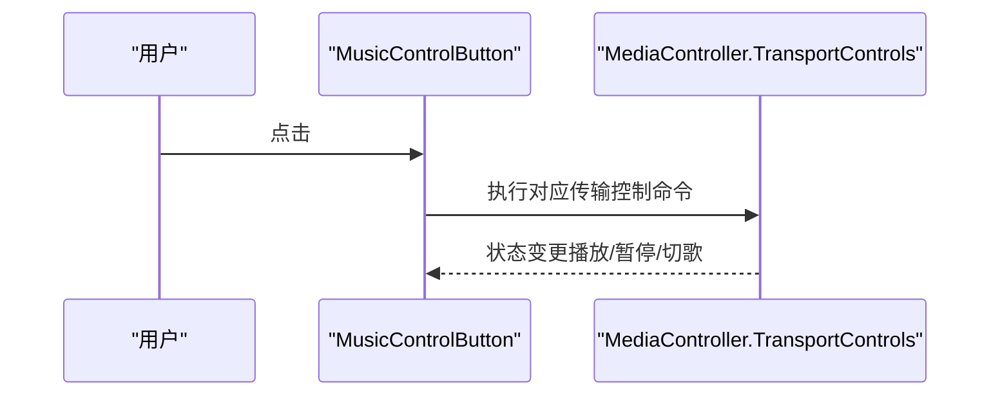
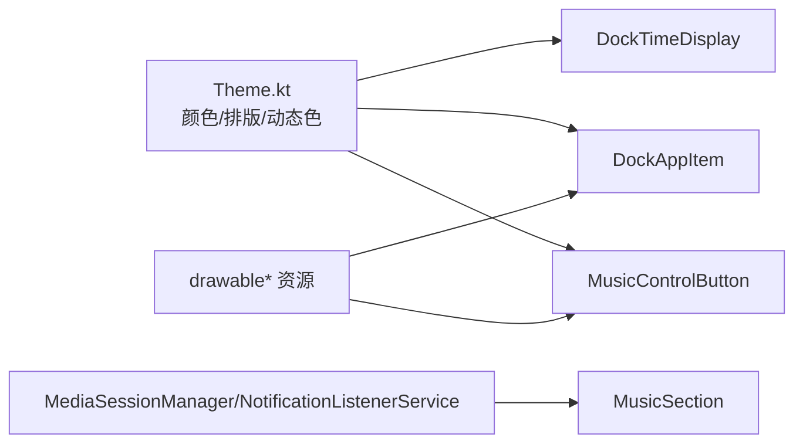

# UI组件

<cite>
**本文引用的文件**
- [MainActivity.kt](file://app/src/main/java/com/sephp/mycarlauncher/MainActivity.kt)
- [Theme.kt](file://app/src/main/java/com/sephp/mycarlauncher/ui/theme/Theme.kt)
- [Color.kt](file://app/src/main/java/com/sephp/mycarlauncher/ui/theme/Color.kt)
- [Type.kt](file://app/src/main/java/com/sephp/mycarlauncher/ui/theme/Type.kt)
- [strings.xml](file://app/src/main/res/values/strings.xml)
- [colors.xml](file://app/src/main/res/values/colors.xml)
- [ic_action_apps.xml](file://app/src/main/res/drawable-anydpi/ic_action_apps.xml)
- [play_arrow.xml](file://app/src/main/res/drawable/play_arrow.xml)
- [pause.xml](file://app/src/main/res/drawable/pause.xml)
- [skip_next.xml](file://app/src/main/res/drawable/skip_next.xml)
- [skip_previous.xml](file://app/src/main/res/drawable/skip_previous.xml)
</cite>

## 目录
1. [简介](#简介)
2. [项目结构](#项目结构)
3. [核心组件](#核心组件)
4. [架构总览](#架构总览)
5. [组件详解](#组件详解)
6. [依赖关系分析](#依赖关系分析)
7. [性能与可读性](#性能与可读性)
8. [故障排查指南](#故障排查指南)
9. [结论](#结论)
10. [附录：使用示例与组合建议](#附录使用示例与组合建议)

## 简介
本文件系统化梳理 MyCarLauncher 中的可复用 UI 组件，重点覆盖 DockTimeDisplay、DockAppItem、MusicControlButton 等关键组件。内容涵盖：
- 视觉外观与行为特征
- 参数与回调接口
- 内部状态管理与动画效果
- 在车载场景下的可读性与主题适配
- 使用示例与组合建议

## 项目结构
该应用采用 Jetpack Compose 构建界面，主题通过 Material3 配置，并在 MainActivity 中组织主屏布局。UI 主要由以下模块构成：
- 主屏与容器：HomeScreen、ContentArea、MapSection、MusicSection
- 工具栏与时间显示：DockBar、DockTimeDisplay
- 应用列表与选择器：AppListOverlay、AppSelectorDialog、AppItem
- 媒体控制：MusicControlButton、MusicNotificationListener
- 主题与资源：Theme、Color、Type、strings/colors 资源

图表来源
- [MainActivity.kt](file://app/src/main/java/com/sephp/mycarlauncher/MainActivity.kt#L64-L118)
- [MainActivity.kt](file://app/src/main/java/com/sephp/mycarlauncher/MainActivity.kt#L136-L206)
- [MainActivity.kt](file://app/src/main/java/com/sephp/mycarlauncher/MainActivity.kt#L227-L244)
- [MainActivity.kt](file://app/src/main/java/com/sephp/mycarlauncher/MainActivity.kt#L254-L351)
- [MainActivity.kt](file://app/src/main/java/com/sephp/mycarlauncher/MainActivity.kt#L367-L375)

章节来源
- [MainActivity.kt](file://app/src/main/java/com/sephp/mycarlauncher/MainActivity.kt#L64-L118)

## 核心组件
本节聚焦三个可复用组件：DockTimeDisplay、DockAppItem、MusicControlButton 的职责、参数、状态与交互。

- DockTimeDisplay
  - 作用：在 DockBar 顶部显示当前时间、星期与日期，每秒刷新一次。
  - 参数：无外部参数，内部通过 remember + LaunchedEffect 实现自驱动更新。
  - 状态：本地状态维护当前三元组（时分、星期、年月日）。
  - 动画：无显式动画，但通过定时刷新实现时间滚动效果。
  - 可读性：文本颜色统一为白色，支持深浅主题切换。

- DockAppItem
  - 作用：单个 Dock 快捷应用项，支持点击启动应用、长按进入“更换应用”流程。
  - 参数：appInfo（应用信息或空）、onClick（点击回调）、onLongClick（长按回调）、iconColor（图标颜色）。
  - 状态：无内部状态，依赖传入的 appInfo 判断是否为空。
  - 行为：当 appInfo 为空时显示“+”号占位；否则显示应用图标；点击行为根据是否存在 appInfo 分支处理。
  - 可读性：图标颜色随主题自动调整；圆角背景与点击反馈增强可识别度。

- MusicControlButton
  - 作用：媒体控制按钮，支持主控（播放/暂停）与辅助控件（上一首/下一首）。
  - 参数：icon（矢量图标）、contentDescription（无障碍描述）、isMain（是否为主控）、onClick（点击回调）。
  - 状态：无内部状态，仅根据 isMain 决定尺寸、背景与颜色。
  - 行为：点击触发对应 MediaController.TransportControls 操作；主控按钮具有更醒目的视觉强调。
  - 可读性：主控按钮使用高对比色背景与更粗图标，便于远距离识别。

章节来源
- [MainActivity.kt](file://app/src/main/java/com/sephp/mycarlauncher/MainActivity.kt#L120-L134)
- [MainActivity.kt](file://app/src/main/java/com/sephp/mycarlauncher/MainActivity.kt#L208-L226)
- [MainActivity.kt](file://app/src/main/java/com/sephp/mycarlauncher/MainActivity.kt#L367-L375)

## 架构总览
整体采用“主题包裹 + 组合式布局”的架构：
- 主题层：Material3 颜色方案与 Typography，支持动态色与深浅主题。
- 布局层：HomeScreen 组织 DockBar 与 ContentArea；ContentArea 再拆分为 MapSection 与 MusicSection。
- 组件层：各可复用组件通过 @Composable 函数暴露参数与回调，实现低耦合、高内聚。

图表来源
- [Theme.kt](file://app/src/main/java/com/sephp/mycarlauncher/ui/theme/Theme.kt#L35-L58)
- [MainActivity.kt](file://app/src/main/java/com/sephp/mycarlauncher/MainActivity.kt#L64-L118)
- [MainActivity.kt](file://app/src/main/java/com/sephp/mycarlauncher/MainActivity.kt#L136-L206)
- [MainActivity.kt](file://app/src/main/java/com/sephp/mycarlauncher/MainActivity.kt#L227-L244)
- [MainActivity.kt](file://app/src/main/java/com/sephp/mycarlauncher/MainActivity.kt#L254-L351)
- [MainActivity.kt](file://app/src/main/java/com/sephp/mycarlauncher/MainActivity.kt#L367-L375)

## 组件详解

### DockTimeDisplay 组件
- 视觉外观
  - 文本层级：时分（较大字号与加粗）、星期与日期（较小字号与半透明）。
  - 颜色：统一白色，支持深浅主题切换。
- 行为特征
  - 定时刷新：每秒更新一次，保证时间实时性。
  - 无障碍：无显式 contentDescription，适合纯视觉显示。
- 参数与回调
  - 无外部参数；内部通过 remember 记忆当前时间三元组。
- 内部状态管理
  - 使用 LaunchedEffect 启动协程循环，delay 1 秒后更新状态。
- 动画效果
  - 无显式动画；通过状态变更触发布局重绘。
- 可读性与主题
  - 文字颜色固定为白色，确保在深色背景上清晰可见；浅色主题下可配合背景色调整对比度。

图表来源
- [MainActivity.kt](file://app/src/main/java/com/sephp/mycarlauncher/MainActivity.kt#L120-L134)

章节来源
- [MainActivity.kt](file://app/src/main/java/com/sephp/mycarlauncher/MainActivity.kt#L120-L134)

### DockAppItem 组件
- 视觉外观
  - 尺寸：正方形容器，边长 50dp；圆角 12dp。
  - 图标：应用图标居中显示；若无应用则显示“+”占位。
  - 颜色：图标颜色由外部传入（随主题深浅自动调整）。
- 行为特征
  - 点击：若存在 appInfo 则启动应用；否则触发 onLongClick。
  - 长按：始终触发 onLongClick，用于“更换应用”流程。
  - 无障碍：图标与文字均提供 contentDescription。
- 参数与回调
  - appInfo：应用信息或空。
  - onClick：点击回调。
  - onLongClick：长按回调。
  - iconColor：图标颜色。
- 内部状态管理
  - 无内部状态，完全受控于外部传参。
- 动画效果
  - 无显式动画；点击与长按反馈通过 combinedClickable 提供。
- 可读性与主题
  - 图标颜色随 isSystemInDarkTheme 自动切换，确保在不同背景下具备足够对比度。

图表来源
- [MainActivity.kt](file://app/src/main/java/com/sephp/mycarlauncher/MainActivity.kt#L136-L206)
- [MainActivity.kt](file://app/src/main/java/com/sephp/mycarlauncher/MainActivity.kt#L208-L226)

章节来源
- [MainActivity.kt](file://app/src/main/java/com/sephp/mycarlauncher/MainActivity.kt#L136-L206)
- [MainActivity.kt](file://app/src/main/java/com/sephp/mycarlauncher/MainActivity.kt#L208-L226)

### MusicControlButton 组件
- 视觉外观
  - 形状：圆形背景。
  - 尺寸：主控按钮更大（64dp），辅助按钮较小（48dp）。
  - 颜色：主控按钮使用高对比色背景与主色图标；辅助按钮使用较淡背景与白色图标。
- 行为特征
  - 点击：触发 MediaController.TransportControls 对应操作（播放/暂停/上一首/下一首）。
  - 无障碍：提供 contentDescription，便于读屏识别。
- 参数与回调
  - icon：矢量图标资源。
  - contentDescription：按钮用途描述。
  - isMain：是否为主控按钮。
  - onClick：点击回调。
- 内部状态管理
  - 无内部状态，仅根据 isMain 决定渲染样式。
- 动画效果
  - 无显式动画；点击反馈通过 clickable 提供。
- 可读性与主题
  - 主控按钮强调色与更大尺寸，满足车载远距离操作需求。

图表来源
- [MainActivity.kt](file://app/src/main/java/com/sephp/mycarlauncher/MainActivity.kt#L338-L347)
- [MainActivity.kt](file://app/src/main/java/com/sephp/mycarlauncher/MainActivity.kt#L367-L375)

章节来源
- [MainActivity.kt](file://app/src/main/java/com/sephp/mycarlauncher/MainActivity.kt#L338-L347)
- [MainActivity.kt](file://app/src/main/java/com/sephp/mycarlauncher/MainActivity.kt#L367-L375)

## 依赖关系分析
- 组件间依赖
  - DockBar 依赖 DockTimeDisplay 与 DockAppItem。
  - MusicSection 依赖 MusicControlButton。
  - AppListOverlay 与 AppSelectorDialog 依赖 AppItem。
- 外部依赖
  - 主题：MyCarLauncherTheme 提供颜色与排版。
  - 资源：图标资源来自 drawable 与 drawable-anydpi。
  - 系统服务：MediaSessionManager、NotificationListenerService 用于音乐控制。
- 主题与可读性
  - 主题通过 isSystemInDarkTheme 切换图标颜色；文字颜色统一为白色，确保在深色背景上清晰。
  - Typography 默认字号与行距适合车载场景阅读。

图表来源
- [Theme.kt](file://app/src/main/java/com/sephp/mycarlauncher/ui/theme/Theme.kt#L35-L58)
- [MainActivity.kt](file://app/src/main/java/com/sephp/mycarlauncher/MainActivity.kt#L120-L134)
- [MainActivity.kt](file://app/src/main/java/com/sephp/mycarlauncher/MainActivity.kt#L208-L226)
- [MainActivity.kt](file://app/src/main/java/com/sephp/mycarlauncher/MainActivity.kt#L367-L375)

章节来源
- [Theme.kt](file://app/src/main/java/com/sephp/mycarlauncher/ui/theme/Theme.kt#L35-L58)
- [Color.kt](file://app/src/main/java/com/sephp/mycarlauncher/ui/theme/Color.kt#L1-L11)
- [Type.kt](file://app/src/main/java/com/sephp/mycarlauncher/ui/theme/Type.kt#L1-L34)
- [strings.xml](file://app/src/main/res/values/strings.xml#L1-L3)
- [colors.xml](file://app/src/main/res/values/colors.xml#L1-L10)
- [ic_action_apps.xml](file://app/src/main/res/drawable-anydpi/ic_action_apps.xml)
- [play_arrow.xml](file://app/src/main/res/drawable/play_arrow.xml)
- [pause.xml](file://app/src/main/res/drawable/pause.xml)
- [skip_next.xml](file://app/src/main/res/drawable/skip_next.xml)
- [skip_previous.xml](file://app/src/main/res/drawable/skip_previous.xml)

## 性能与可读性
- 性能
  - DockBar 异步加载应用图标，避免阻塞主线程。
  - DockTimeDisplay 使用协程每秒刷新，频率合理且开销可控。
  - MusicSection 异步加载专辑封面，避免主线程阻塞。
- 可读性
  - 文字颜色统一为白色，确保在深色背景上清晰。
  - 主控按钮尺寸更大、颜色更突出，满足车载远距离操作需求。
  - 字体大小与行距符合 Material3 默认配置，适合仪表盘场景。

## 故障排查指南
- 时间不刷新
  - 检查 DockTimeDisplay 是否处于可见状态；确认 LaunchedEffect 生命周期正确。
  - 参考路径：[DockTimeDisplay](file://app/src/main/java/com/sephp/mycarlauncher/MainActivity.kt#L120-L134)
- 应用图标不显示
  - 确认 DockPreferences 中保存的应用包名有效；检查 PackageManager 是否能解析到应用信息。
  - 参考路径：[DockBar 加载应用](file://app/src/main/java/com/sephp/mycarlauncher/MainActivity.kt#L146-L166)
- 媒体控制无效
  - 确认已授予通知访问权限；检查 MediaSessionManager 是否能获取到活动会话。
  - 参考路径：[MusicSection 回调与监听](file://app/src/main/java/com/sephp/mycarlauncher/MainActivity.kt#L285-L322)
- 图标颜色异常
  - 检查 isSystemInDarkTheme 切换逻辑；确认 DockBar 传入的 iconColor 正确。
  - 参考路径：[DockBar 主题颜色](file://app/src/main/java/com/sephp/mycarlauncher/MainActivity.kt#L168-L170)

章节来源
- [MainActivity.kt](file://app/src/main/java/com/sephp/mycarlauncher/MainActivity.kt#L120-L134)
- [MainActivity.kt](file://app/src/main/java/com/sephp/mycarlauncher/MainActivity.kt#L146-L166)
- [MainActivity.kt](file://app/src/main/java/com/sephp/mycarlauncher/MainActivity.kt#L285-L322)
- [MainActivity.kt](file://app/src/main/java/com/sephp/mycarlauncher/MainActivity.kt#L168-L170)

## 结论
本项目通过简洁的 Compose 组件实现了车载场景下的高效主屏体验。DockTimeDisplay、DockAppItem、MusicControlButton 三大组件职责清晰、参数明确、主题友好，既保证了可读性，又兼顾了交互效率。建议在扩展新功能时遵循现有参数与回调约定，确保组件复用性与一致性。

## 附录：使用示例与组合建议
- 在 DockBar 中添加新的快捷应用项
  - 使用 DockAppItem 并传入 appInfo、onClick、onLongClick、iconColor。
  - 参考路径：[DockAppItem](file://app/src/main/java/com/sephp/mycarlauncher/MainActivity.kt#L208-L226)
- 在音乐控制区添加更多按钮
  - 使用 MusicControlButton 并传入 icon、contentDescription、isMain、onClick。
  - 参考路径：[MusicControlButton](file://app/src/main/java/com/sephp/mycarlauncher/MainActivity.kt#L367-L375)
- 在内容区组合地图与音乐区域
  - 使用 ContentArea 包裹 MapSection 与 MusicSection。
  - 参考路径：[ContentArea](file://app/src/main/java/com/sephp/mycarlauncher/MainActivity.kt#L228-L234)、[MapSection](file://app/src/main/java/com/sephp/mycarlauncher/MainActivity.kt#L236-L244)、[MusicSection](file://app/src/main/java/com/sephp/mycarlauncher/MainActivity.kt#L254-L351)