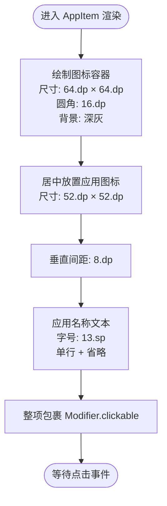

# 应用列表项组件

<cite>
**本文引用的文件**
- [MainActivity.kt](file://app/src/main/java/com/sephp/mycarlauncher/MainActivity.kt)
- [Theme.kt](file://app/src/main/java/com/sephp/mycarlauncher/ui/theme/Theme.kt)
- [Color.kt](file://app/src/main/java/com/sephp/mycarlauncher/ui/theme/Color.kt)
- [Type.kt](file://app/src/main/java/com/sephp/mycarlauncher/ui/theme/Type.kt)
</cite>

## 目录
1. [简介](#简介)
2. [项目结构](#项目结构)
3. [核心组件](#核心组件)
4. [架构总览](#架构总览)
5. [详细组件分析](#详细组件分析)
6. [依赖关系分析](#依赖关系分析)
7. [性能考量](#性能考量)
8. [故障排查指南](#故障排查指南)
9. [结论](#结论)
10. [附录](#附录)

## 简介
本文件系统性文档化 AppItem 组件，该组件用于在全屏应用列表与应用选择器对话框中显示单个应用。其 UI 结构采用“图标 + 应用名称”的垂直布局：上方为应用图标（深灰背景、圆角矩形），下方为应用名称文本。组件通过 LazyVerticalGrid 进行网格化布局，并使用 Modifier.clickable 实现点击启动应用。文本采用 13.sp 小字号并启用 TextOverflow.Ellipsis 处理超长应用名。在 6×6 或 5×5 网格中，组件尺寸与间距经过精心设计，确保在车载大屏上具备良好的可触控性与可读性。文档还给出如何将 PackageManager 查询到的应用信息（AppInfo）传递给组件进行渲染的示例路径。

## 项目结构
AppItem 组件位于主界面文件中，作为 Compose 函数直接定义于 MainActivity.kt 内部，同时配合主题与类型系统使用 Material3 的基础组件与样式。

图表来源
- [MainActivity.kt](file://app/src/main/java/com/sephp/mycarlauncher/MainActivity.kt#L388-L462)
- [Theme.kt](file://app/src/main/java/com/sephp/mycarlauncher/ui/theme/Theme.kt#L36-L58)
- [Color.kt](file://app/src/main/java/com/sephp/mycarlauncher/ui/theme/Color.kt#L1-L11)
- [Type.kt](file://app/src/main/java/com/sephp/mycarlauncher/ui/theme/Type.kt#L1-L34)

章节来源
- [MainActivity.kt](file://app/src/main/java/com/sephp/mycarlauncher/MainActivity.kt#L388-L462)
- [Theme.kt](file://app/src/main/java/com/sephp/mycarlauncher/ui/theme/Theme.kt#L36-L58)

## 核心组件
- AppItem：单个应用项的 UI 组合，负责渲染图标与名称，处理点击事件。
- 调用方：
  - AppListOverlay：全屏应用列表弹层，使用 6 列网格展示应用。
  - AppSelectorDialog：应用选择器对话框，使用 5 列网格展示应用。
- 数据模型：AppInfo，承载应用标签、包名与图标资源。

章节来源
- [MainActivity.kt](file://app/src/main/java/com/sephp/mycarlauncher/MainActivity.kt#L428-L439)
- [MainActivity.kt](file://app/src/main/java/com/sephp/mycarlauncher/MainActivity.kt#L388-L426)
- [MainActivity.kt](file://app/src/main/java/com/sephp/mycarlauncher/MainActivity.kt#L471-L508)
- [MainActivity.kt](file://app/src/main/java/com/sephp/mycarlauncher/MainActivity.kt#L441-L442)

## 架构总览
AppItem 所在的调用链路如下：HomeScreen 触发 AppListOverlay 或 AppSelectorDialog，二者内部通过 LazyVerticalGrid 渲染 AppItem；AppItem 使用 Modifier.clickable 包裹整个项，点击后调用 launchApp 启动对应应用。

图表来源
- [MainActivity.kt](file://app/src/main/java/com/sephp/mycarlauncher/MainActivity.kt#L388-L462)
- [MainActivity.kt](file://app/src/main/java/com/sephp/mycarlauncher/MainActivity.kt#L471-L508)

## 详细组件分析

### AppItem 组件结构与交互
- 布局结构
  - 上方：图标容器，尺寸 64.dp，圆角 16.dp，深灰背景，内部居中放置应用图标，图标自身尺寸 52.dp。
  - 下方：应用名称文本，字号 13.sp，单行显示，超出省略。
- 点击行为
  - 整个项使用 Modifier.clickable 包裹，点击时执行传入的 onClick 回调。
- 文本截断策略
  - 使用 maxLines = 1 与 TextOverflow.Ellipsis，保证长名称不会换行影响布局。
- 间距与尺寸
  - 图标容器与文本之间使用 8.dp 的垂直间距。
  - 每个 AppItem 外围使用 4.dp 的内边距，便于网格对齐与触摸反馈。
- 适用网格
  - 在 6×6 网格中，列数固定为 6，水平间距 20.dp，垂直间距 24.dp。
  - 在 5×5 网格中，列数固定为 5，水平间距 16.dp，垂直间距 16.dp。
- 可触控性
  - 图标容器 64.dp × 64.dp，符合车载大屏的可触控尺寸要求。
  - 文本 13.sp 字号在大屏上清晰可读，且 Ellipsis 避免长名称遮挡。

图表来源
- [MainActivity.kt](file://app/src/main/java/com/sephp/mycarlauncher/MainActivity.kt#L428-L439)

章节来源
- [MainActivity.kt](file://app/src/main/java/com/sephp/mycarlauncher/MainActivity.kt#L428-L439)

### 调用方：全屏应用列表 AppListOverlay
- 网格配置
  - GridCells.Fixed(6)，水平间距 20.dp，垂直间距 24.dp。
- 数据来源
  - 通过 getInstalledApps(context) 异步查询系统已安装应用，返回 AppInfo 列表。
- 交互流程
  - 点击 AppItem 后，调用 launchApp 并关闭弹层。

图表来源
- [MainActivity.kt](file://app/src/main/java/com/sephp/mycarlauncher/MainActivity.kt#L388-L426)

章节来源
- [MainActivity.kt](file://app/src/main/java/com/sephp/mycarlauncher/MainActivity.kt#L388-L426)

### 调用方：应用选择器对话框 AppSelectorDialog
- 网格配置
  - GridCells.Fixed(5)，水平间距 16.dp，垂直间距 16.dp。
- 数据来源
  - 同样通过 getInstalledApps(context) 异步查询应用列表。
- 交互流程
  - 点击 AppItem 后，回调 onAppSelected(AppInfo)，由调用方保存到 Dock 并刷新界面。

图表来源
- [MainActivity.kt](file://app/src/main/java/com/sephp/mycarlauncher/MainActivity.kt#L471-L508)

章节来源
- [MainActivity.kt](file://app/src/main/java/com/sephp/mycarlauncher/MainActivity.kt#L471-L508)

### 数据模型：AppInfo
- 字段
  - label：应用名称字符串
  - packageName：应用包名字符串
  - icon：应用图标 Drawable（可空）
- 创建方式
  - 通过 PackageManager 查询系统已安装应用，提取 applicationInfo 并构造 AppInfo。
- 排序
  - 按 label 的小写形式排序，提升浏览体验。

图表来源
- [MainActivity.kt](file://app/src/main/java/com/sephp/mycarlauncher/MainActivity.kt#L441-L442)
- [MainActivity.kt](file://app/src/main/java/com/sephp/mycarlauncher/MainActivity.kt#L443-L452)

章节来源
- [MainActivity.kt](file://app/src/main/java/com/sephp/mycarlauncher/MainActivity.kt#L441-L442)
- [MainActivity.kt](file://app/src/main/java/com/sephp/mycarlauncher/MainActivity.kt#L443-L452)

### 主题与样式
- 主题入口
  - MyCarLauncherTheme 提供暗/亮主题与动态色支持。
- 颜色与字体
  - Color.kt 定义了 Material 风格的颜色常量。
  - Type.kt 定义了默认字体排版，AppItem 文本使用 13.sp，符合大屏阅读与触控需求。

章节来源
- [Theme.kt](file://app/src/main/java/com/sephp/mycarlauncher/ui/theme/Theme.kt#L36-L58)
- [Color.kt](file://app/src/main/java/com/sephp/mycarlauncher/ui/theme/Color.kt#L1-L11)
- [Type.kt](file://app/src/main/java/com/sephp/mycarlauncher/ui/theme/Type.kt#L1-L34)

## 依赖关系分析
- 组件耦合
  - AppItem 仅依赖 AppInfo 数据模型与上下文（用于启动应用）。
  - 调用方通过 LazyVerticalGrid 与 items 绑定数据，耦合度低。
- 外部依赖
  - PackageManager：用于查询应用信息与启动 Intent。
  - Material3 Compose：用于布局、网格、点击与文本组件。
- 潜在循环依赖
  - 无循环依赖，AppItem 为纯 UI 组合，不反向依赖调用方。

图表来源
- [MainActivity.kt](file://app/src/main/java/com/sephp/mycarlauncher/MainActivity.kt#L443-L452)
- [MainActivity.kt](file://app/src/main/java/com/sephp/mycarlauncher/MainActivity.kt#L471-L508)
- [MainActivity.kt](file://app/src/main/java/com/sephp/mycarlauncher/MainActivity.kt#L388-L426)

章节来源
- [MainActivity.kt](file://app/src/main/java/com/sephp/mycarlauncher/MainActivity.kt#L443-L452)
- [MainActivity.kt](file://app/src/main/java/com/sephp/mycarlauncher/MainActivity.kt#L471-L508)
- [MainActivity.kt](file://app/src/main/java/com/sephp/mycarlauncher/MainActivity.kt#L388-L426)

## 性能考量
- 异步加载
  - 调用方均通过协程在 IO 线程加载应用列表，避免阻塞主线程。
- 网格渲染
  - LazyVerticalGrid 按需渲染可见项，减少不必要的重组与绘制。
- 图标缓存
  - 使用 rememberDrawablePainter 缓存图标绘制对象，降低重复绘制开销。
- 文本截断
  - 单行 + 省略避免长名称导致的测量与布局抖动。
- 大屏优化
  - 64.dp 图标与 13.sp 文本在车载大屏上具备良好可读性与可触控性。

章节来源
- [MainActivity.kt](file://app/src/main/java/com/sephp/mycarlauncher/MainActivity.kt#L388-L426)
- [MainActivity.kt](file://app/src/main/java/com/sephp/mycarlauncher/MainActivity.kt#L471-L508)

## 故障排查指南
- 应用图标为空
  - 检查 AppInfo.icon 是否为 null；若为空，确认 PackageManager 查询是否成功。
- 启动失败
  - 检查 launchApp 中的 getLaunchIntentForPackage 返回值；异常时会提示失败信息。
- 列表加载失败
  - AppListOverlay 与 AppSelectorDialog 在加载异常时会显示错误提示并终止加载状态。
- 文本过长被截断
  - 13.sp 字号与单行省略是预期行为；如需更长显示，可调整字号或网格密度（需重新评估可触控性）。

章节来源
- [MainActivity.kt](file://app/src/main/java/com/sephp/mycarlauncher/MainActivity.kt#L454-L462)
- [MainActivity.kt](file://app/src/main/java/com/sephp/mycarlauncher/MainActivity.kt#L388-L426)
- [MainActivity.kt](file://app/src/main/java/com/sephp/mycarlauncher/MainActivity.kt#L471-L508)

## 结论
AppItem 组件以简洁的“图标 + 名称”布局为核心，结合 LazyVerticalGrid 的网格化渲染与 Modifier.clickable 的点击交互，实现了在全屏应用列表与应用选择器对话框中的高效展示与启动能力。通过合理的尺寸、间距与文本策略，组件在车载大屏环境中具备良好的可触控性与可读性。数据模型 AppInfo 与 PackageManager 的配合，使组件能够稳定地从系统中获取应用信息并驱动 UI 渲染。

## 附录
- 示例：如何将 PackageManager 查询的应用信息传递给 AppItem
  - 步骤一：调用 getInstalledApps(context) 获取 AppInfo 列表
  - 步骤二：在 LazyVerticalGrid 的 items 中为每个 AppInfo 构建 AppItem
  - 步骤三：在 AppItem 的 onClick 中调用 launchApp 启动应用
- 参考路径
  - 全屏应用列表：[AppListOverlay](file://app/src/main/java/com/sephp/mycarlauncher/MainActivity.kt#L388-L426)
  - 应用选择器对话框：[AppSelectorDialog](file://app/src/main/java/com/sephp/mycarlauncher/MainActivity.kt#L471-L508)
  - AppItem 组件：[AppItem](file://app/src/main/java/com/sephp/mycarlauncher/MainActivity.kt#L428-L439)
  - 数据模型与查询：[AppInfo](file://app/src/main/java/com/sephp/mycarlauncher/MainActivity.kt#L441-L442)、[getInstalledApps](file://app/src/main/java/com/sephp/mycarlauncher/MainActivity.kt#L443-L452)
  - 启动逻辑：[launchApp](file://app/src/main/java/com/sephp/mycarlauncher/MainActivity.kt#L454-L462)