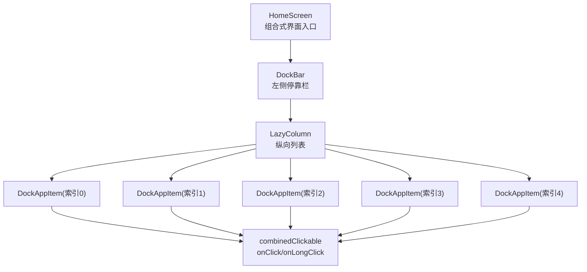
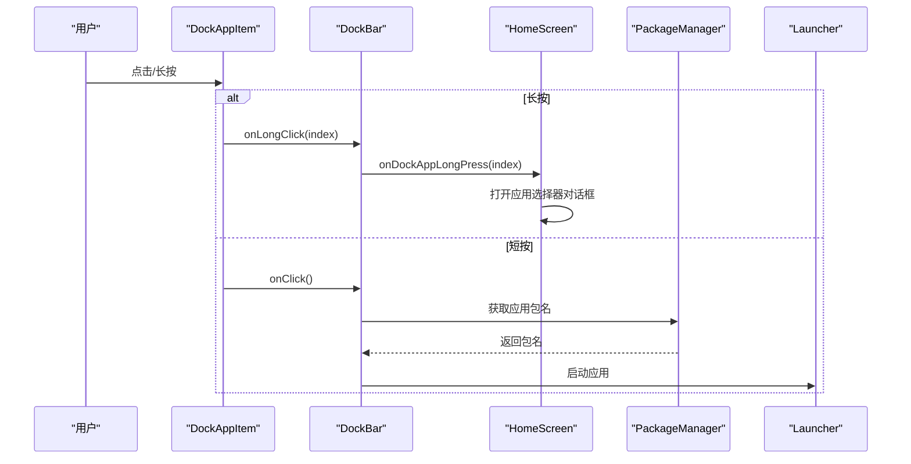
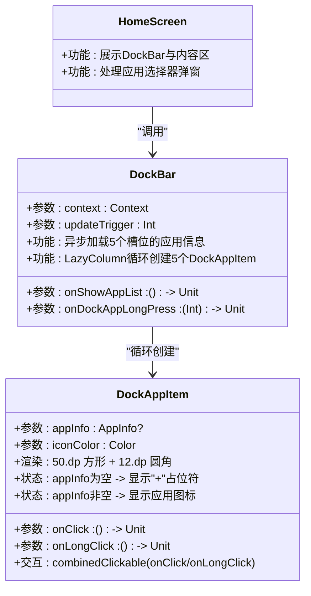
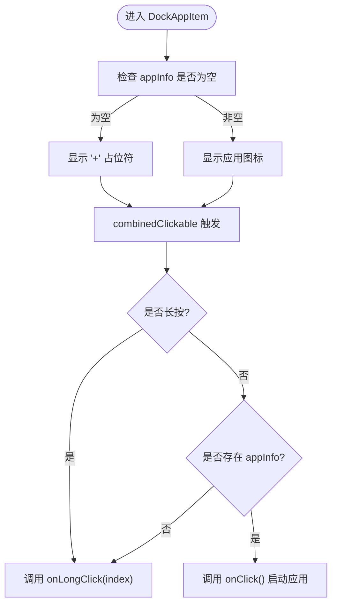
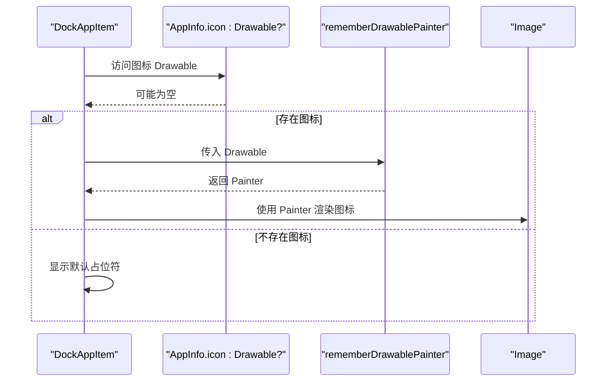
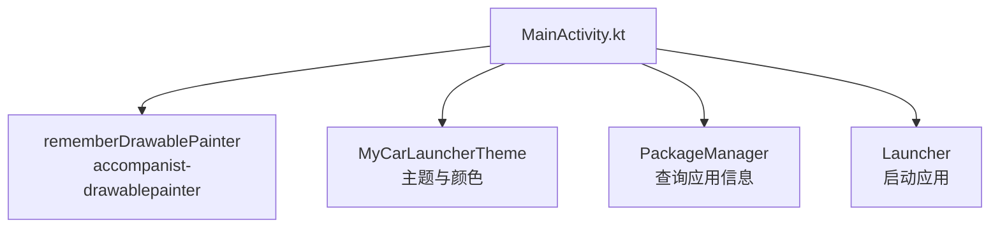

# 应用图标组件

<cite>
**本文引用的文件**
- [MainActivity.kt](file://app/src/main/java/com/sephp/mycarlauncher/MainActivity.kt)
- [Theme.kt](file://app/src/main/java/com/sephp/mycarlauncher/ui/theme/Theme.kt)
- [build.gradle.kts](file://app/build.gradle.kts)
</cite>

## 目录
1. [简介](#简介)
2. [项目结构](#项目结构)
3. [核心组件](#核心组件)
4. [架构总览](#架构总览)
5. [详细组件分析](#详细组件分析)
6. [依赖关系分析](#依赖关系分析)
7. [性能考量](#性能考量)
8. [故障排查指南](#故障排查指南)
9. [结论](#结论)
10. [附录](#附录)

## 简介
本文件系统性文档化 DockAppItem 组件，该组件用于在车载场景的 Dock 栏中渲染单个应用图标。它支持两种状态：
- 当 appInfo 为空时显示“+”号，表示当前槽位可编辑；
- 当存在应用信息时显示对应应用图标。

交互上，组件通过 combinedClickable 实现双态行为：短按启动应用、长按进入编辑模式。渲染方面，组件使用 rememberDrawablePainter 将 Android Drawable 转换为 Compose Painter 进行绘制。此外，组件在车载环境下采用固定尺寸与圆角设计，以提升触控体验与视觉一致性。

## 项目结构
DockAppItem 位于主界面文件中，作为 DockBar 的子项被循环创建并放置于 LazyColumn 中。DockBar 负责异步加载已绑定的应用信息，并将点击/长按事件回调给上层容器，从而实现“点击启动应用、长按进入编辑”的完整交互闭环。

图表来源
- [MainActivity.kt](file://app/src/main/java/com/sephp/mycarlauncher/MainActivity.kt#L136-L206)
- [MainActivity.kt](file://app/src/main/java/com/sephp/mycarlauncher/MainActivity.kt#L209-L226)

章节来源
- [MainActivity.kt](file://app/src/main/java/com/sephp/mycarlauncher/MainActivity.kt#L136-L206)
- [MainActivity.kt](file://app/src/main/java/com/sephp/mycarlauncher/MainActivity.kt#L209-L226)

## 核心组件
DockAppItem 是一个组合式 UI 组件，负责：
- 渲染固定尺寸与圆角的图标区域；
- 在无应用信息时显示“+”号占位符；
- 在有应用信息时显示应用图标；
- 通过 combinedClickable 实现短按启动应用、长按进入编辑模式的交互。

关键实现要点：
- 尺寸与圆角：统一使用 50.dp 的方形区域与 12.dp 圆角，适配车载大屏触控；
- 可变状态：根据 appInfo 是否为空决定渲染内容；
- 交互策略：短按触发 onClick（若存在 appInfo），长按触发 onLongClick；
- 图标渲染：使用 rememberDrawablePainter 将 Android Drawable 转为 Compose Painter。

章节来源
- [MainActivity.kt](file://app/src/main/java/com/sephp/mycarlauncher/MainActivity.kt#L209-L226)

## 架构总览
DockAppItem 所在的整体架构如下：HomeScreen 搭建左右布局，左侧为 DockBar，右侧为内容区；DockBar 内部通过 LazyColumn 循环生成 5 个 DockAppItem 实例，每个实例绑定一个可能为空的应用槽位。点击事件由 DockAppItem 向上传递，最终由 DockBar 的调用方处理。

图表来源
- [MainActivity.kt](file://app/src/main/java/com/sephp/mycarlauncher/MainActivity.kt#L136-L206)
- [MainActivity.kt](file://app/src/main/java/com/sephp/mycarlauncher/MainActivity.kt#L209-L226)

章节来源
- [MainActivity.kt](file://app/src/main/java/com/sephp/mycarlauncher/MainActivity.kt#L136-L206)
- [MainActivity.kt](file://app/src/main/java/com/sephp/mycarlauncher/MainActivity.kt#L209-L226)

## 详细组件分析

### 组件类图

图表来源
- [MainActivity.kt](file://app/src/main/java/com/sephp/mycarlauncher/MainActivity.kt#L136-L206)
- [MainActivity.kt](file://app/src/main/java/com/sephp/mycarlauncher/MainActivity.kt#L209-L226)

章节来源
- [MainActivity.kt](file://app/src/main/java/com/sephp/mycarlauncher/MainActivity.kt#L136-L206)
- [MainActivity.kt](file://app/src/main/java/com/sephp/mycarlauncher/MainActivity.kt#L209-L226)

### 交互流程（点击与长按）

图表来源
- [MainActivity.kt](file://app/src/main/java/com/sephp/mycarlauncher/MainActivity.kt#L209-L226)

章节来源
- [MainActivity.kt](file://app/src/main/java/com/sephp/mycarlauncher/MainActivity.kt#L209-L226)

### 渲染流程（Drawable 到 Painter）

图表来源
- [MainActivity.kt](file://app/src/main/java/com/sephp/mycarlauncher/MainActivity.kt#L209-L226)

章节来源
- [MainActivity.kt](file://app/src/main/java/com/sephp/mycarlauncher/MainActivity.kt#L209-L226)

### 在 LazyColumn 中循环创建多个实例
- DockBar 内部使用 LazyColumn 的 items(5) 生成 5 个槽位；
- 每次迭代创建一个 DockAppItem，并传入对应的 appInfo、onClick、onLongClick 以及 iconColor；
- 通过 key(app?.packageName ?: "empty_$index") 保证列表更新时的稳定性。

章节来源
- [MainActivity.kt](file://app/src/main/java/com/sephp/mycarlauncher/MainActivity.kt#L175-L192)

## 依赖关系分析
- Compose 基础能力：组合式 UI、状态管理、Lazy 列表、形状与交互修饰；
- Accompanist：rememberDrawablePainter 提供从 Android Drawable 到 Compose Painter 的桥接；
- 主题与颜色：通过 MyCarLauncherTheme 控制深浅色主题，影响图标颜色与对比度；
- 外部服务：PackageManager 用于查询应用信息与启动意图；系统通知监听用于音乐控制（与 DockAppItem 无直接耦合）。

图表来源
- [MainActivity.kt](file://app/src/main/java/com/sephp/mycarlauncher/MainActivity.kt#L1-L60)
- [build.gradle.kts](file://app/build.gradle.kts#L44-L65)
- [Theme.kt](file://app/src/main/java/com/sephp/mycarlauncher/ui/theme/Theme.kt#L1-L58)

章节来源
- [build.gradle.kts](file://app/build.gradle.kts#L44-L65)
- [Theme.kt](file://app/src/main/java/com/sephp/mycarlauncher/ui/theme/Theme.kt#L1-L58)
- [MainActivity.kt](file://app/src/main/java/com/sephp/mycarlauncher/MainActivity.kt#L1-L60)

## 性能考量
- 列表懒加载：DockBar 使用 LaunchedEffect 与 Dispatchers.IO 异步加载应用信息，避免阻塞主线程；
- 列表复用：LazyColumn 自动回收不可见项，减少内存占用；
- 图标渲染：rememberDrawablePainter 缓存 Painter，避免重复转换带来的开销；
- 状态最小化：DockAppItem 仅持有必要参数，降低重组成本；
- 触控区域优化：固定尺寸与圆角提升误触容错，减少不必要的重组。

章节来源
- [MainActivity.kt](file://app/src/main/java/com/sephp/mycarlauncher/MainActivity.kt#L148-L166)
- [MainActivity.kt](file://app/src/main/java/com/sephp/mycarlauncher/MainActivity.kt#L209-L226)

## 故障排查指南
- 图标不显示或空白
  - 检查 appInfo.icon 是否为空；若为空，组件会显示“+”占位符；
  - 确认 rememberDrawablePainter 已正确传入 Drawable；
  - 确认 DockBar 的异步加载是否成功返回有效图标。
- 点击无效或无法启动应用
  - 确认 onClick 回调中传入了有效的包名；
  - 确认系统已允许目标应用启动；
  - 检查 launchApp 是否抛出异常。
- 长按无效
  - 确认 onLongClick 回调已正确传递到 DockBar；
  - 确认 HomeScreen 已处理长按并打开应用选择器。
- 触控体验不佳
  - 确认尺寸与圆角设置一致（50.dp × 50.dp，12.dp 圆角）；
  - 检查图标大小与内容对齐是否合理。

章节来源
- [MainActivity.kt](file://app/src/main/java/com/sephp/mycarlauncher/MainActivity.kt#L148-L166)
- [MainActivity.kt](file://app/src/main/java/com/sephp/mycarlauncher/MainActivity.kt#L181-L191)
- [MainActivity.kt](file://app/src/main/java/com/sephp/mycarlauncher/MainActivity.kt#L209-L226)

## 结论
DockAppItem 通过简洁的状态机与交互策略，在车载环境中提供了直观且高效的停靠图标体验。其固定尺寸与圆角设计提升了触控准确性，combinedClickable 的双态交互满足了“启动应用”和“编辑槽位”的核心需求。配合 DockBar 的异步加载与 Lazy 列表，整体具备良好的性能与可维护性。

## 附录

### 使用示例（在 LazyColumn 中循环创建多个 DockAppItem）
- 在 DockBar 中使用 LazyColumn 的 items(5) 生成 5 个槽位；
- 为每个槽位传入：
  - appInfo：可能为空的应用信息；
  - onClick：当存在 appInfo 时启动应用；
  - onLongClick：触发编辑模式；
  - iconColor：根据主题动态选择图标颜色。

章节来源
- [MainActivity.kt](file://app/src/main/java/com/sephp/mycarlauncher/MainActivity.kt#L175-L192)

### 尺寸与圆角设计说明
- 尺寸：50.dp × 50.dp，适合车载大屏与单手触控；
- 圆角：12.dp，提升视觉柔和度与触控容错；
- 与主题联动：iconColor 根据深浅主题自动切换，确保高对比度。

章节来源
- [MainActivity.kt](file://app/src/main/java/com/sephp/mycarlauncher/MainActivity.kt#L168-L170)
- [MainActivity.kt](file://app/src/main/java/com/sephp/mycarlauncher/MainActivity.kt#L209-L226)
- [Theme.kt](file://app/src/main/java/com/sephp/mycarlauncher/ui/theme/Theme.kt#L1-L58)