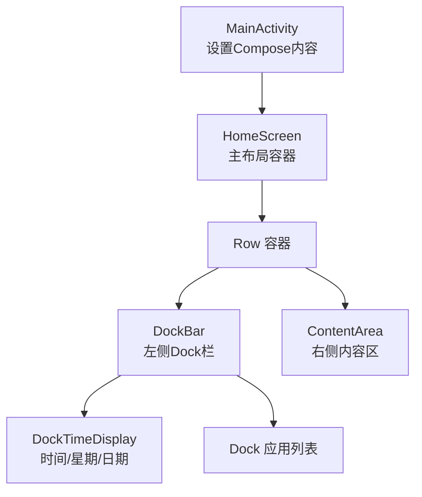
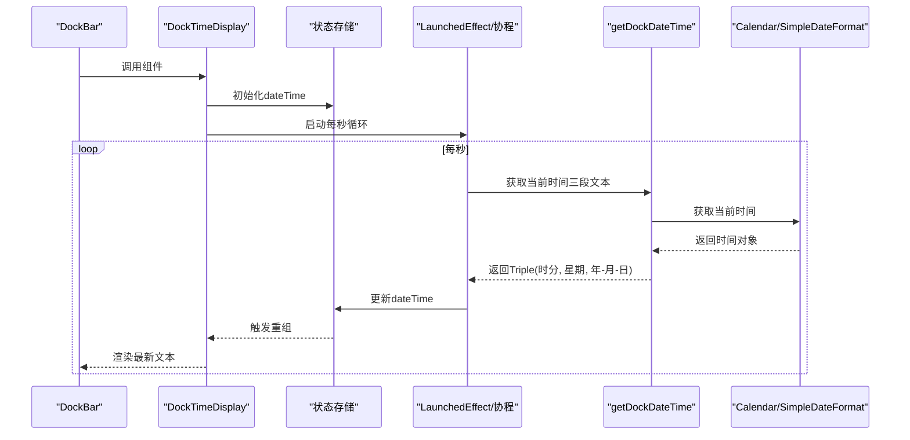
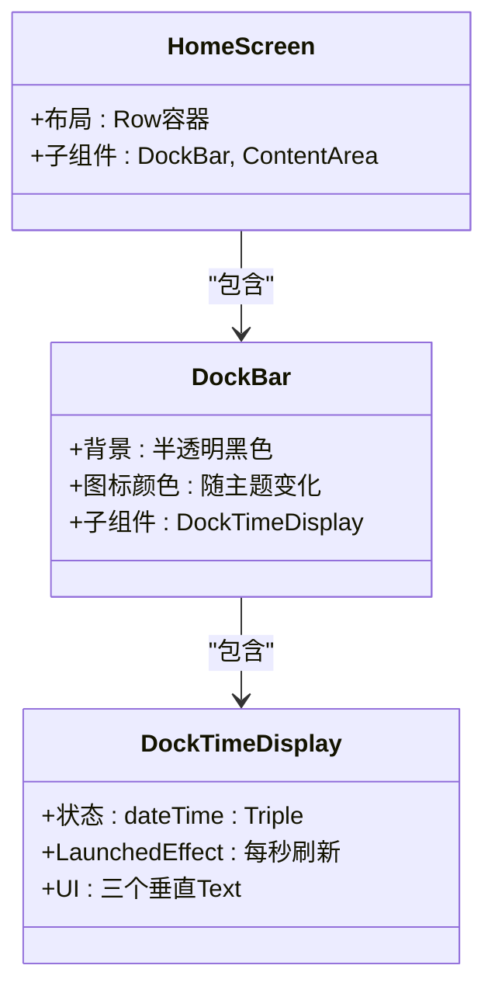
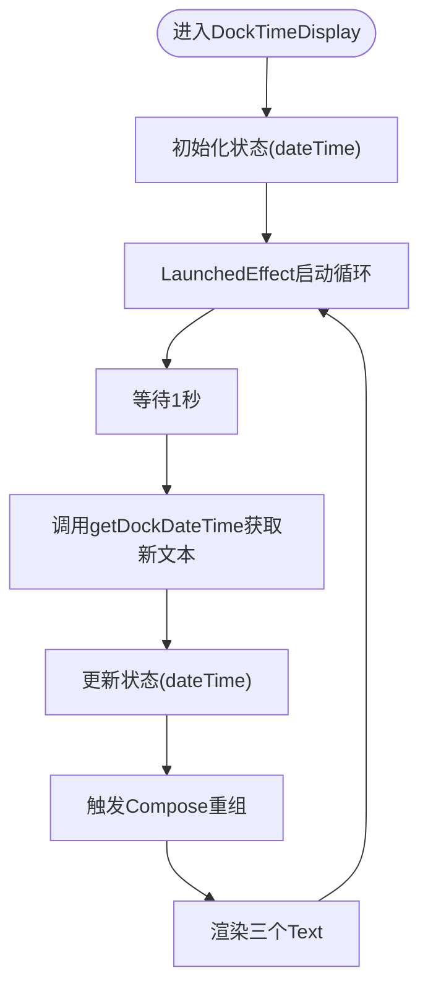
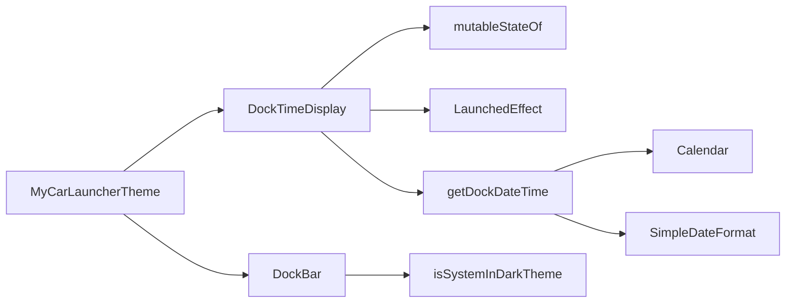

# 时间显示组件

<cite>
**本文引用的文件**
- [MainActivity.kt](file://app/src/main/java/com/sephp/mycarlauncher/MainActivity.kt)
- [Theme.kt](file://app/src/main/java/com/sephp/mycarlauncher/ui/theme/Theme.kt)
- [Color.kt](file://app/src/main/java/com/sephp/mycarlauncher/ui/theme/Color.kt)
- [Type.kt](file://app/src/main/java/com/sephp/mycarlauncher/ui/theme/Type.kt)
</cite>

## 目录
1. [简介](#简介)
2. [项目结构](#项目结构)
3. [核心组件](#核心组件)
4. [架构总览](#架构总览)
5. [详细组件分析](#详细组件分析)
6. [依赖关系分析](#依赖关系分析)
7. [性能考量](#性能考量)
8. [故障排查指南](#故障排查指南)
9. [结论](#结论)
10. [附录](#附录)

## 简介
本文件面向“DockTimeDisplay”组件，这是一个在车载场景下用于在Dock栏中实时显示时间、星期与日期的Compose组件。它通过mutableStateOf与LaunchedEffect实现每秒自动刷新，UI由三个垂直排列的文本组成：第一行显示时分（较大字号），第二行显示星期，第三行显示年-月-日。该组件依赖SimpleDateFormat与Calendar进行时间格式化；同时，其UI采用高对比度白色文字，适合在车载环境中提升可读性。此外，该组件会根据系统明暗主题动态调整背景色与图标颜色，确保在不同环境下均具备良好的视觉效果。

## 项目结构
该组件位于主活动页面的Dock栏中，整体布局采用Row容器，左侧为DockBar，右侧为主内容区。DockBar内部包含一个垂直方向的Column，顶部即为DockTimeDisplay组件，下方是应用列表等其他功能模块。

图表来源
- [MainActivity.kt](file://app/src/main/java/com/sephp/mycarlauncher/MainActivity.kt#L64-L118)
- [MainActivity.kt](file://app/src/main/java/com/sephp/mycarlauncher/MainActivity.kt#L138-L206)

章节来源
- [MainActivity.kt](file://app/src/main/java/com/sephp/mycarlauncher/MainActivity.kt#L64-L118)
- [MainActivity.kt](file://app/src/main/java/com/sephp/mycarlauncher/MainActivity.kt#L138-L206)

## 核心组件
- 组件名称：DockTimeDisplay
- 所属位置：DockBar顶部，作为Dock栏的一部分
- 功能概述：
  - 使用mutableStateOf维护当前时间数据
  - 使用LaunchedEffect循环每秒更新一次
  - UI由三个垂直排列的Text组成，分别展示时分、星期、年-月-日
  - 文字颜色统一为高对比度白色，带透明度的副标题增强层次感
- 数据来源：getDockDateTime返回Triple<String, String, String>，包含时分、星期、年-月-日三段文本
- 主题适配：通过isSystemInDarkTheme判断系统主题，DockBar背景采用半透明黑色，图标颜色随主题变化

章节来源
- [MainActivity.kt](file://app/src/main/java/com/sephp/mycarlauncher/MainActivity.kt#L120-L134)
- [MainActivity.kt](file://app/src/main/java/com/sephp/mycarlauncher/MainActivity.kt#L168-L170)
- [MainActivity.kt](file://app/src/main/java/com/sephp/mycarlauncher/MainActivity.kt#L465-L468)

## 架构总览
DockTimeDisplay属于UI层组件，其刷新逻辑与数据生成相互独立：
- 刷新逻辑：LaunchedEffect启动协程，每秒调用一次getDockDateTime并更新状态
- 数据生成：getDockDateTime使用Calendar与SimpleDateFormat按本地化规则生成三段文本
- UI渲染：Compose基于状态变更触发重组，重新绘制三个Text

图表来源
- [MainActivity.kt](file://app/src/main/java/com/sephp/mycarlauncher/MainActivity.kt#L120-L134)
- [MainActivity.kt](file://app/src/main/java/com/sephp/mycarlauncher/MainActivity.kt#L465-L468)

## 详细组件分析

### 组件类图（概念）

图表来源
- [MainActivity.kt](file://app/src/main/java/com/sephp/mycarlauncher/MainActivity.kt#L120-L134)
- [MainActivity.kt](file://app/src/main/java/com/sephp/mycarlauncher/MainActivity.kt#L138-L206)

### 刷新机制流程图

图表来源
- [MainActivity.kt](file://app/src/main/java/com/sephp/mycarlauncher/MainActivity.kt#L120-L134)
- [MainActivity.kt](file://app/src/main/java/com/sephp/mycarlauncher/MainActivity.kt#L465-L468)

### UI结构与排版
- 布局容器：Column，水平居中对齐
- 字体层级：
  - 第一行：时分，较大字号、粗体
  - 第二行：星期，常规字号
  - 第三行：年-月-日，较小字号，带透明度降低的白色
- 颜色策略：统一使用高对比度白色文字，确保在深色背景下清晰可见

章节来源
- [MainActivity.kt](file://app/src/main/java/com/sephp/mycarlauncher/MainActivity.kt#L120-L134)

### 数据生成与格式化
- 数据来源：Calendar.getInstance()
- 格式化方式：SimpleDateFormat
  - 时分：HH:mm
  - 星期：EEEE
  - 年-月-日：yyyy-MM-dd
- 本地化：使用Locale.getDefault()，支持系统语言环境

章节来源
- [MainActivity.kt](file://app/src/main/java/com/sephp/mycarlauncher/MainActivity.kt#L465-L468)

### 主题适配与背景
- 系统主题检测：isSystemInDarkTheme()
- DockBar背景：半透明黑色，保证文字可读性
- 图标颜色：根据主题切换浅色或深色，确保在不同背景下均有良好对比度

章节来源
- [MainActivity.kt](file://app/src/main/java/com/sephp/mycarlauncher/MainActivity.kt#L168-L170)

### 在其他Compose界面中集成
- 步骤一：在目标界面中引入Compose上下文与主题
- 步骤二：将DockTimeDisplay直接放入你的布局容器中（例如Column或Box）
- 步骤三：如需自定义样式，可在调用处传入Modifier或调整字体大小、颜色
- 注意：组件内部已处理每秒刷新与本地化格式化，无需额外逻辑

章节来源
- [MainActivity.kt](file://app/src/main/java/com/sephp/mycarlauncher/MainActivity.kt#L120-L134)
- [MainActivity.kt](file://app/src/main/java/com/sephp/mycarlauncher/MainActivity.kt#L138-L206)

## 依赖关系分析
- 组件依赖
  - mutableStateOf：用于保存当前时间三段文本的状态
  - LaunchedEffect：用于启动每秒刷新的协程
  - getDockDateTime：封装时间格式化逻辑
  - Calendar/SimpleDateFormat：负责时间解析与格式化
  - isSystemInDarkTheme：用于判断系统主题，影响DockBar背景与图标颜色
- 外部主题系统
  - MyCarLauncherTheme：Material3主题入口，支持动态色彩与明暗主题
  - Color.kt/Type.kt：提供颜色与字体基础配置

图表来源
- [MainActivity.kt](file://app/src/main/java/com/sephp/mycarlauncher/MainActivity.kt#L120-L134)
- [MainActivity.kt](file://app/src/main/java/com/sephp/mycarlauncher/MainActivity.kt#L168-L170)
- [MainActivity.kt](file://app/src/main/java/com/sephp/mycarlauncher/MainActivity.kt#L465-L468)
- [Theme.kt](file://app/src/main/java/com/sephp/mycarlauncher/ui/theme/Theme.kt#L36-L58)
- [Color.kt](file://app/src/main/java/com/sephp/mycarlauncher/ui/theme/Color.kt#L1-L11)
- [Type.kt](file://app/src/main/java/com/sephp/mycarlauncher/ui/theme/Type.kt#L1-L34)

章节来源
- [MainActivity.kt](file://app/src/main/java/com/sephp/mycarlauncher/MainActivity.kt#L120-L134)
- [MainActivity.kt](file://app/src/main/java/com/sephp/mycarlauncher/MainActivity.kt#L168-L170)
- [MainActivity.kt](file://app/src/main/java/com/sephp/mycarlauncher/MainActivity.kt#L465-L468)
- [Theme.kt](file://app/src/main/java/com/sephp/mycarlauncher/ui/theme/Theme.kt#L36-L58)
- [Color.kt](file://app/src/main/java/com/sephp/mycarlauncher/ui/theme/Color.kt#L1-L11)
- [Type.kt](file://app/src/main/java/com/sephp/mycarlauncher/ui/theme/Type.kt#L1-L34)

## 性能考量
- 刷新频率：每秒一次，开销极低，适合在车载UI中长期运行
- 状态粒度：使用Triple一次性传递三段文本，减少多次状态更新
- IO与线程：格式化逻辑在主线程执行，但仅涉及轻量计算，不会造成卡顿
- 主题切换：isSystemInDarkTheme为轻量状态查询，无额外IO
- 可读性优化：白色高对比度文字与半透明背景组合，在强光环境下仍具可读性

[本节为通用性能建议，不直接分析具体文件]

## 故障排查指南
- 现象：时间不刷新
  - 排查：确认LaunchedEffect是否正常启动，delay是否生效
  - 参考路径：[DockTimeDisplay刷新逻辑](file://app/src/main/java/com/sephp/mycarlauncher/MainActivity.kt#L120-L134)
- 现象：文本格式不符合预期
  - 排查：检查SimpleDateFormat模式与Locale设置
  - 参考路径：[时间格式化实现](file://app/src/main/java/com/sephp/mycarlauncher/MainActivity.kt#L465-L468)
- 现象：文字颜色在深色背景下不清晰
  - 排查：确认DockBar背景与文字颜色搭配，必要时调整透明度
  - 参考路径：[DockBar背景与图标颜色](file://app/src/main/java/com/sephp/mycarlauncher/MainActivity.kt#L168-L170)
- 现象：主题切换后颜色不一致
  - 排查：确认isSystemInDarkTheme与主题入口配置
  - 参考路径：[主题入口与明暗主题](file://app/src/main/java/com/sephp/mycarlauncher/MainActivity.kt#L168-L170), [Theme.kt](file://app/src/main/java/com/sephp/mycarlauncher/ui/theme/Theme.kt#L36-L58)

章节来源
- [MainActivity.kt](file://app/src/main/java/com/sephp/mycarlauncher/MainActivity.kt#L120-L134)
- [MainActivity.kt](file://app/src/main/java/com/sephp/mycarlauncher/MainActivity.kt#L168-L170)
- [MainActivity.kt](file://app/src/main/java/com/sephp/mycarlauncher/MainActivity.kt#L465-L468)
- [Theme.kt](file://app/src/main/java/com/sephp/mycarlauncher/ui/theme/Theme.kt#L36-L58)

## 结论
DockTimeDisplay组件通过简洁的状态管理与稳定的刷新机制，实现了在Dock栏中高效、准确地显示时间、星期与日期。其高对比度文字与半透明背景设计，结合系统明暗主题适配，满足了车载环境对可读性的严格要求。开发者可在任意Compose界面中直接复用该组件，无需额外复杂逻辑即可获得一致的时间显示体验。

[本节为总结性内容，不直接分析具体文件]

## 附录
- 组件集成要点
  - 将DockTimeDisplay放入你的布局容器中
  - 如需自定义样式，可在调用处传入Modifier或调整字体大小、颜色
  - 保持每秒刷新逻辑不变，确保时间实时性
- 车载环境优势
  - 大字号与高对比度设计提升远距离可读性
  - 每秒刷新确保时间精度
  - 主题适配避免强光或夜间使用时的视觉疲劳

[本节为通用建议，不直接分析具体文件]