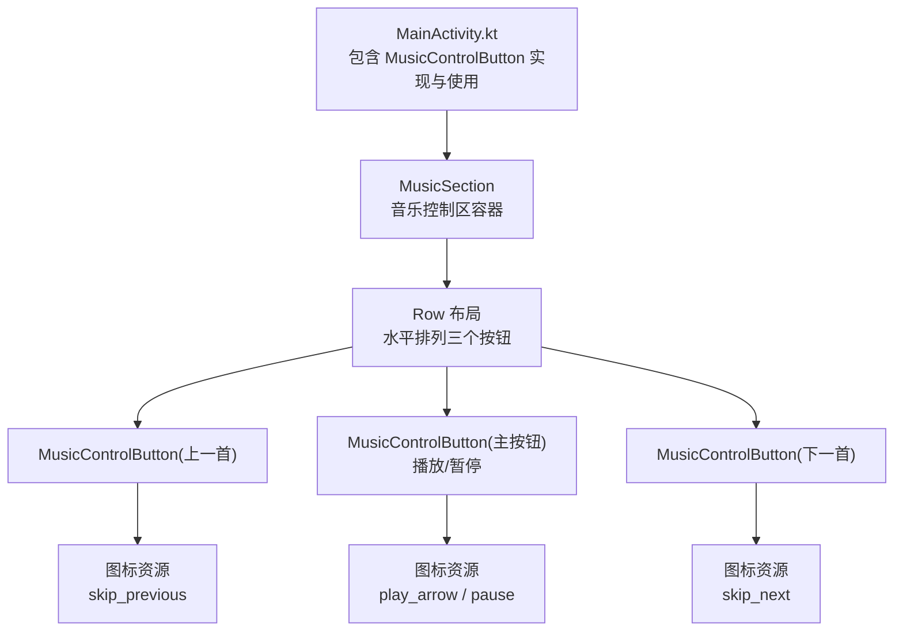
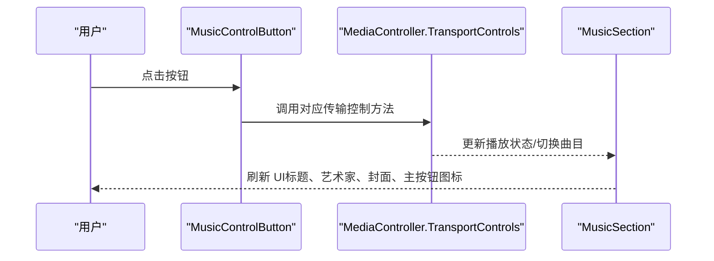
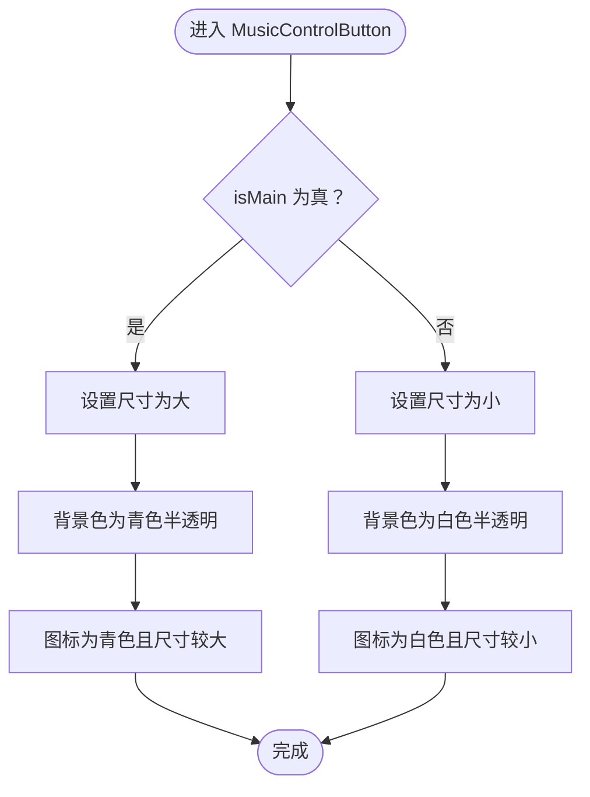
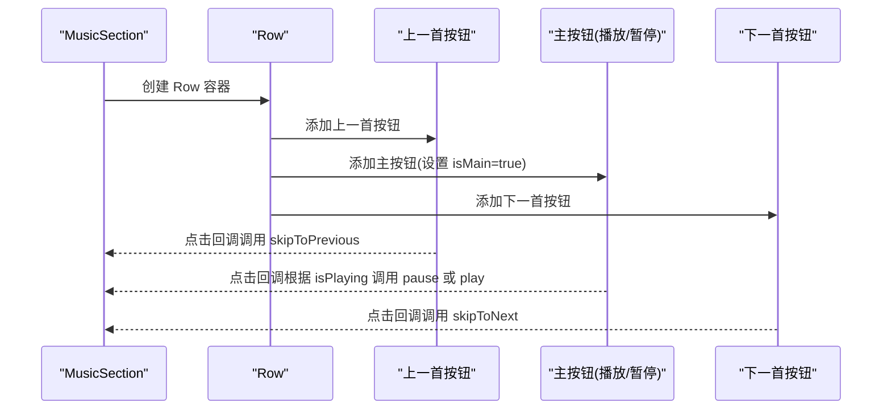
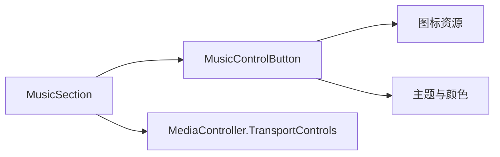

# 音乐控制按钮组件

<cite>
**本文引用的文件**
- [MainActivity.kt](file://app/src/main/java/com/sephp/mycarlauncher/MainActivity.kt)
- [Theme.kt](file://app/src/main/java/com/sephp/mycarlauncher/ui/theme/Theme.kt)
- [Color.kt](file://app/src/main/java/com/sephp/mycarlauncher/ui/theme/Color.kt)
- [play_arrow.xml](file://app/src/main/res/drawable/play_arrow.xml)
- [pause.xml](file://app/src/main/res/drawable/pause.xml)
- [skip_previous.xml](file://app/src/main/res/drawable/skip_previous.xml)
- [skip_next.xml](file://app/src/main/res/drawable/skip_next.xml)
</cite>

## 目录
1. [简介](#简介)
2. [项目结构](#项目结构)
3. [核心组件](#核心组件)
4. [架构总览](#架构总览)
5. [详细组件分析](#详细组件分析)
6. [依赖关系分析](#依赖关系分析)
7. [性能考量](#性能考量)
8. [故障排查指南](#故障排查指南)
9. [结论](#结论)
10. [附录](#附录)

## 简介
本文件系统性文档化 MusicControlButton 组件，该组件用于构建音乐播放控制区的播放/暂停、上一首、下一首按钮。文档覆盖以下内容：
- 参数说明：icon（图标）、contentDescription（无障碍描述）、isMain（是否为主按钮，即播放/暂停按钮）、onClick（点击回调）
- 动态尺寸与背景色策略：主按钮更大且使用青色高亮，非主按钮相对较小并采用较低透明度背景
- 视觉实现：通过 CircleShape 裁剪实现圆形按钮，并使用 clickable 修饰符提供点击反馈
- 使用示例：在 Row 布局中组合三个 MusicControlButton 的方式
- 低光照车载环境下的可辨识度设计：高对比度颜色与清晰图标

## 项目结构
MusicControlButton 组件位于应用主界面文件中，与音乐播放区域共同组织在一个模块化的界面结构内。其主要职责是作为统一的控制按钮抽象，供音乐控制区复用。

图表来源
- [MainActivity.kt](file://app/src/main/java/com/sephp/mycarlauncher/MainActivity.kt#L324-L375)
- [play_arrow.xml](file://app/src/main/res/drawable/play_arrow.xml#L1-L10)
- [pause.xml](file://app/src/main/res/drawable/pause.xml#L1-L10)
- [skip_previous.xml](file://app/src/main/res/drawable/skip_previous.xml#L1-L10)
- [skip_next.xml](file://app/src/main/res/drawable/skip_next.xml#L1-L10)

章节来源
- [MainActivity.kt](file://app/src/main/java/com/sephp/mycarlauncher/MainActivity.kt#L324-L375)

## 核心组件
MusicControlButton 是一个 Compose 可组合函数，负责渲染圆形控制按钮并处理点击事件。其关键特性如下：
- 参数
  - icon：图标矢量资源，用于按钮中心显示
  - contentDescription：无障碍描述，用于屏幕阅读器读取
  - isMain：布尔值，指示是否为主按钮（播放/暂停）
  - onClick：点击回调，触发媒体控制器的相应操作
- 动态样式
  - 尺寸：isMain 为真时更大；否则相对较小
  - 背景色：isMain 使用青色半透明背景；非主按钮使用白色半透明背景
  - 图标尺寸与颜色：isMain 使用较大尺寸与青色；非主按钮使用较小尺寸与白色
- 形状与交互
  - 使用 CircleShape 进行圆形裁剪
  - 使用 clickable 修饰符提供点击反馈

章节来源
- [MainActivity.kt](file://app/src/main/java/com/sephp/mycarlauncher/MainActivity.kt#L367-L375)

## 架构总览
MusicControlButton 在音乐控制区中被三个实例复用：上一首、主按钮（播放/暂停）、下一首。它们共同位于 Row 容器中，形成横向控制条。

图表来源
- [MainActivity.kt](file://app/src/main/java/com/sephp/mycarlauncher/MainActivity.kt#L338-L347)
- [MainActivity.kt](file://app/src/main/java/com/sephp/mycarlauncher/MainActivity.kt#L340-L346)

章节来源
- [MainActivity.kt](file://app/src/main/java/com/sephp/mycarlauncher/MainActivity.kt#L324-L375)

## 详细组件分析

### 组件参数与行为
- icon：传入矢量图标资源，作为按钮中心的图标显示
- contentDescription：传入字符串，作为无障碍描述
- isMain：决定按钮尺寸、背景色与图标的颜色
- onClick：接收无参回调，通常绑定到媒体控制器的传输控制方法

动态样式逻辑（基于 isMain 的三元表达式）：
- 尺寸：主按钮更大，非主按钮较小
- 背景：主按钮使用青色半透明背景，非主按钮使用白色半透明背景
- 图标：主按钮使用青色与较大尺寸，非主按钮使用白色与较小尺寸

图表来源
- [MainActivity.kt](file://app/src/main/java/com/sephp/mycarlauncher/MainActivity.kt#L367-L375)

章节来源
- [MainActivity.kt](file://app/src/main/java/com/sephp/mycarlauncher/MainActivity.kt#L367-L375)

### 视觉实现与交互
- 圆形裁剪：使用 CircleShape 对按钮进行圆形裁剪，确保视觉统一
- 点击反馈：使用 clickable 修饰符，提供触控反馈
- 主按钮高亮：通过青色半透明背景与青色图标突出主按钮，便于在低光照环境下识别

章节来源
- [MainActivity.kt](file://app/src/main/java/com/sephp/mycarlauncher/MainActivity.kt#L367-L375)

### 在 Row 中组合三个按钮
MusicSection 中通过 Row 水平排列三个 MusicControlButton，分别对应“上一首”、“主按钮（播放/暂停）”、“下一首”。主按钮通过 isMain 参数启用更大的尺寸与青色高亮。

图表来源
- [MainActivity.kt](file://app/src/main/java/com/sephp/mycarlauncher/MainActivity.kt#L338-L347)

章节来源
- [MainActivity.kt](file://app/src/main/java/com/sephp/mycarlauncher/MainActivity.kt#L324-L375)

### 低光照车载环境下的可辨识度设计
- 高对比度颜色：主按钮使用青色半透明背景与青色图标，非主按钮使用白色半透明背景与白色图标，保证在深色背景下仍具高对比度
- 清晰图标：使用矢量图标资源，确保在不同尺寸下保持清晰锐利
- 大尺寸主按钮：主按钮尺寸更大，便于驾驶员在驾驶过程中快速识别与操作

章节来源
- [MainActivity.kt](file://app/src/main/java/com/sephp/mycarlauncher/MainActivity.kt#L367-L375)
- [Theme.kt](file://app/src/main/java/com/sephp/mycarlauncher/ui/theme/Theme.kt#L1-L58)
- [Color.kt](file://app/src/main/java/com/sephp/mycarlauncher/ui/theme/Color.kt#L1-L11)

## 依赖关系分析
- 组件依赖
  - 图标资源：play_arrow、pause、skip_previous、skip_next
  - 主题与颜色：Material3 主题与自定义颜色方案
- 组件耦合
  - MusicControlButton 与 MusicSection 通过参数传递耦合，主按钮通过 isMain 控制样式
  - onClick 回调与媒体控制器解耦，便于测试与替换

图表来源
- [MainActivity.kt](file://app/src/main/java/com/sephp/mycarlauncher/MainActivity.kt#L324-L375)
- [play_arrow.xml](file://app/src/main/res/drawable/play_arrow.xml#L1-L10)
- [pause.xml](file://app/src/main/res/drawable/pause.xml#L1-L10)
- [skip_previous.xml](file://app/src/main/res/drawable/skip_previous.xml#L1-L10)
- [skip_next.xml](file://app/src/main/res/drawable/skip_next.xml#L1-L10)
- [Theme.kt](file://app/src/main/java/com/sephp/mycarlauncher/ui/theme/Theme.kt#L1-L58)
- [Color.kt](file://app/src/main/java/com/sephp/mycarlauncher/ui/theme/Color.kt#L1-L11)

章节来源
- [MainActivity.kt](file://app/src/main/java/com/sephp/mycarlauncher/MainActivity.kt#L324-L375)

## 性能考量
- 图标渲染：使用矢量图标资源，避免位图缩放带来的质量损失与内存浪费
- 状态更新：主按钮图标根据 isPlaying 动态切换，避免不必要的重组
- 布局开销：Row 水平排列三个固定尺寸的按钮，布局计算简单高效

## 故障排查指南
- 无障碍描述缺失
  - 现象：屏幕阅读器无法读取按钮功能
  - 排查：确认 contentDescription 参数已正确传入
  - 参考路径：[MusicControlButton 参数](file://app/src/main/java/com/sephp/mycarlauncher/MainActivity.kt#L367-L375)
- 主按钮样式异常
  - 现象：主按钮未显示为青色或尺寸未增大
  - 排查：确认 isMain 参数为 true；检查主题颜色与透明度设置
  - 参考路径：[主按钮样式逻辑](file://app/src/main/java/com/sephp/mycarlauncher/MainActivity.kt#L367-L375)
- 图标显示不清晰
  - 现象：图标模糊或失真
  - 排查：确认使用矢量图标资源；检查 Modifier.size 设置
  - 参考路径：[图标资源](file://app/src/main/res/drawable/play_arrow.xml#L1-L10)
- 点击无响应
  - 现象：点击按钮无任何反应
  - 排查：确认 onClick 回调已正确绑定至媒体控制器的传输控制方法
  - 参考路径：[按钮使用示例](file://app/src/main/java/com/sephp/mycarlauncher/MainActivity.kt#L338-L347)

章节来源
- [MainActivity.kt](file://app/src/main/java/com/sephp/mycarlauncher/MainActivity.kt#L338-L375)
- [play_arrow.xml](file://app/src/main/res/drawable/play_arrow.xml#L1-L10)

## 结论
MusicControlButton 通过简洁的参数与动态样式策略，实现了统一、高可辨识度的音乐控制按钮。其在 Row 中的组合方式与主按钮的高亮设计，特别适合低光照车载环境下的快速操作。配合矢量图标与主题色彩，组件在视觉与交互层面均具备良好的可用性与扩展性。

## 附录
- 参数速览
  - icon：图标矢量资源
  - contentDescription：无障碍描述
  - isMain：是否为主按钮（播放/暂停）
  - onClick：点击回调
- 使用示例参考路径
  - [Row 中三个按钮的组合](file://app/src/main/java/com/sephp/mycarlauncher/MainActivity.kt#L338-L347)
  - [主按钮（播放/暂停）的 isMain 与图标切换](file://app/src/main/java/com/sephp/mycarlauncher/MainActivity.kt#L340-L346)