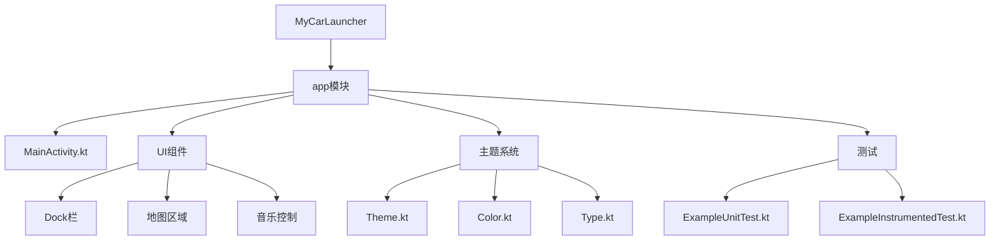

# 开发指南

<cite>
**本文档中引用的文件**  
- [libs.versions.toml](file://gradle/libs.versions.toml)
- [settings.gradle.kts](file://settings.gradle.kts)
- [build.gradle.kts](file://build.gradle.kts)
- [app/build.gradle.kts](file://app/build.gradle.kts)
- [MainActivity.kt](file://app/src/main/java/com/sephp/mycarlauncher/MainActivity.kt)
- [Theme.kt](file://app/src/main/java/com/sephp/mycarlauncher/ui/theme/Theme.kt)
- [AndroidManifest.xml](file://app/src/main/AndroidManifest.xml)
- [ExampleUnitTest.kt](file://app/src/test/java/com/sephp/mycarlauncher/ExampleUnitTest.kt)
- [ExampleInstrumentedTest.kt](file://app/src/androidTest/java/com/sephp/mycarlauncher/ExampleInstrumentedTest.kt)
</cite>

## 目录
1. [项目结构](#项目结构)
2. [依赖管理](#依赖管理)
3. [UI组件开发](#ui组件开发)
4. [调试技巧](#调试技巧)
5. [功能扩展](#功能扩展)
6. [代码规范与测试](#代码规范与测试)

## 项目结构

本项目采用标准的Android项目结构，基于Jetpack Compose构建现代化的汽车启动器界面。项目主要由以下几个部分组成：

- `app/`：主模块，包含应用的核心代码和资源
- `gradle/`：Gradle配置文件，包括依赖版本管理
- `src/main/java/`：Kotlin源代码，采用Compose函数式UI编程
- `src/main/res/`：资源文件，包括图标、颜色和布局
- `src/test/` 和 `src/androidTest/`：单元测试和仪器化测试



**图表来源**
- [MainActivity.kt](file://app/src/main/java/com/sephp/mycarlauncher/MainActivity.kt#L64-L474)
- [Theme.kt](file://app/src/main/java/com/sephp/mycarlauncher/ui/theme/Theme.kt#L1-L58)

**章节来源**
- [MainActivity.kt](file://app/src/main/java/com/sephp/mycarlauncher/MainActivity.kt#L1-L474)
- [app/build.gradle.kts](file://app/build.gradle.kts#L1-L65)

## 依赖管理

项目使用Gradle的`libs.versions.toml`文件进行依赖版本管理，这是一种现代化的依赖管理方式，提供了类型安全的访问和集中的版本控制。

### 依赖版本配置

在`gradle/libs.versions.toml`文件中定义了所有依赖的版本号：

```toml
[versions]
agp = "8.13.2"
kotlin = "2.0.21"
coreKtx = "1.10.1"
composeBom = "2024.09.00"
material3 = "1.4.0"
```

### 依赖声明

在`app/build.gradle.kts`中通过别名引用这些依赖：

```kotlin
dependencies {
    implementation(libs.androidx.core.ktx)
    implementation(libs.androidx.lifecycle.runtime.ktx)
    implementation(libs.androidx.activity.compose)
    implementation(platform(libs.androidx.compose.bom))
    implementation(libs.androidx.compose.ui)
    implementation(libs.androidx.compose.ui.graphics)
    implementation(libs.androidx.compose.ui.tooling.preview)
    implementation(libs.androidx.compose.material3)
}
```

这种管理方式的优势包括：
- **集中管理**：所有版本号集中在一个文件中，便于升级和维护
- **类型安全**：通过`libs`访问依赖，避免拼写错误
- **BOM支持**：使用Compose BOM确保所有Compose库版本兼容
- **可读性强**：清晰的别名使依赖意图更加明确

**章节来源**
- [libs.versions.toml](file://gradle/libs.versions.toml#L1-L35)
- [app/build.gradle.kts](file://app/build.gradle.kts#L44-L65)
- [settings.gradle.kts](file://settings.gradle.kts#L14-L20)

## UI组件开发

项目采用Jetpack Compose构建响应式UI，主要UI组件包括Dock栏、地图区域和音乐控制面板。

### 主要UI组件

#### Dock栏组件
Dock栏位于屏幕左侧，包含时间显示、固定应用和应用列表入口。通过`DockBar`可组合函数实现：

```kotlin
@Composable
fun DockBar(
    modifier: Modifier = Modifier,
    onShowAppList: () -> Unit = {},
    onDockAppLongPress: (Int) -> Unit = {},
    context: Context,
    updateTrigger: Int = 0
)
```

#### 内容区域组件
内容区域分为地图和音乐两个主要部分，通过`ContentArea`可组合函数组织：

```kotlin
@Composable
fun ContentArea(modifier: Modifier = Modifier) {
    Column(modifier = modifier, verticalArrangement = Arrangement.spacedBy(8.dp)) {
        MapSection(modifier = Modifier.fillMaxWidth().weight(1f))
        MusicSection(modifier = Modifier.fillMaxWidth().weight(1f))
    }
}
```

### 预览功能

项目充分利用Compose Preview功能进行UI开发和调试：

```kotlin
@Preview(showBackground = true, widthDp = 1280, heightDp = 720)
@Composable
fun HomeScreenPreview() {
    MyCarLauncherTheme { HomeScreen() }
}
```

**章节来源**
- [MainActivity.kt](file://app/src/main/java/com/sephp/mycarlauncher/MainActivity.kt#L76-L474)
- [Theme.kt](file://app/src/main/java/com/sephp/mycarlauncher/ui/theme/Theme.kt#L37-L58)

## 调试技巧

### 使用Compose Preview

Compose Preview是开发UI组件的强大工具，可以：

- 实时预览UI组件在不同设备尺寸下的表现
- 测试不同主题（明暗模式）下的UI外观
- 快速迭代UI设计而无需安装应用

在Android Studio中，可以通过点击预览注解旁边的"Preview"按钮来查看UI预览。

### 检查媒体会话状态

音乐控制功能依赖于媒体会话状态，调试时需要注意：

1. **权限检查**：确保应用已获得通知访问权限
2. **会话监听**：通过`MediaSessionManager`监听活跃的媒体会话
3. **回调注册**：正确注册`MediaController.Callback`以接收状态更新

```kotlin
val callback = object : MediaController.Callback() {
    override fun onMetadataChanged(metadata: MediaMetadata?) {
        // 处理元数据变化
    }
    
    override fun onPlaybackStateChanged(state: PlaybackState?) {
        // 处理播放状态变化
    }
}
```

### 分析应用启动性能

应用启动性能对用户体验至关重要，建议使用以下方法进行分析：

1. **启动时间测量**：在`MainActivity.onCreate`中添加时间戳
2. **Profile Installer**：利用AndroidX Profile Installer优化启动性能
3. **异步加载**：将耗时操作（如应用列表加载）移到后台线程

```kotlin
LaunchedEffect(updateTrigger) {
    val loadedApps = withContext(Dispatchers.IO) {
        // 在IO调度器中执行耗时操作
    }
    dockApps = loadedApps
}
```

**章节来源**
- [MainActivity.kt](file://app/src/main/java/com/sephp/mycarlauncher/MainActivity.kt#L271-L386)
- [AndroidManifest.xml](file://app/src/main/AndroidManifest.xml#L25-L33)

## 功能扩展

### 扩展Dock栏应用数量

默认Dock栏支持5个应用，可以通过以下步骤扩展：

1. **修改应用数量常量**：在`DockBar`相关代码中找到硬编码的5，改为可配置的常量
2. **调整UI布局**：根据新的应用数量调整`LazyColumn`的间距和尺寸
3. **更新存储逻辑**：确保`DockPreferences`能处理更多的应用位置

```kotlin
// 在DockBar中修改应用数量
val DOCK_APP_COUNT = 8 // 扩展到8个位置

// 更新偏好设置键名生成
private const val KEY_DOCK_APP = "dock_app_"
```

### 添加新的控制按钮

要在音乐控制区域添加新的按钮，可以按照以下步骤：

1. **创建新的可组合函数**：

```kotlin
@Composable
fun MusicControlButton(icon: ImageVector, contentDescription: String, isMain: Boolean = false, onClick: () -> Unit)
```

2. **在MusicSection中集成新按钮**：

```kotlin
Row(verticalAlignment = Alignment.CenterVertically, horizontalArrangement = Arrangement.spacedBy(16.dp)) {
    MusicControlButton(icon = ImageVector.vectorResource(R.drawable.skip_previous), contentDescription = "Previous", onClick = { controller?.transportControls?.skipToPrevious() })
    MusicControlButton(
        icon = ImageVector.vectorResource(if (musicState.isPlaying) R.drawable.pause else R.drawable.play_arrow),
        contentDescription = if (musicState.isPlaying) "Pause" else "Play",
        isMain = true,
        onClick = { if (musicState.isPlaying) controller?.transportControls?.pause() else controller?.transportControls?.play() }
    )
    MusicControlButton(icon = ImageVector.vectorResource(R.drawable.skip_next), contentDescription = "Next", onClick = { controller?.transportControls?.skipToNext() })
    // 可以在这里添加更多按钮
}
```

3. **更新权限和功能**：如果新按钮需要额外权限，记得在`AndroidManifest.xml`中声明。

**章节来源**
- [MainActivity.kt](file://app/src/main/java/com/sephp/mycarlauncher/MainActivity.kt#L138-L206)
- [DockPreferences.kt](file://app/src/main/java/com/sephp/mycarlauncher/MainActivity.kt#L440-L445)

## 代码规范与测试

### 代码组织规范

项目遵循以下代码组织规范：

1. **包结构**：采用功能导向的包结构
   - `com.sephp.mycarlauncher`：主包
   - `com.sephp.mycarlauncher.ui.theme`：UI主题相关

2. **命名约定**：
   - 类名：PascalCase（如`MainActivity`）
   - 函数名：camelCase（如`getInstalledApps`）
   - 常量：UPPER_SNAKE_CASE（如`PREFS_NAME`）

3. **Compose最佳实践**：
   - 使用`@Composable`注解标记可组合函数
   - 避免在可组合函数中执行耗时操作
   - 使用`remember`保存UI状态

### 测试策略

项目包含两种类型的测试：

#### 单元测试

位于`src/test/java/`目录下，用于测试业务逻辑：

```kotlin
class ExampleUnitTest {
    @Test
    fun addition_isCorrect() {
        assertEquals(4, 2 + 2)
    }
}
```

#### 仪器化测试

位于`src/androidTest/java/`目录下，用于测试Android特定功能：

```kotlin
@RunWith(AndroidJUnit4::class)
class ExampleInstrumentedTest {
    @Test
    fun useAppContext() {
        val appContext = InstrumentationRegistry.getInstrumentation().targetContext
        assertEquals("com.sephp.mycarlauncher", appContext.packageName)
    }
}
```

测试覆盖范围建议：
- **核心业务逻辑**：如应用启动、偏好设置读写
- **UI交互**：如Dock栏应用拖拽、音乐控制
- **权限处理**：如通知访问权限检查

**章节来源**
- [ExampleUnitTest.kt](file://app/src/test/java/com/sephp/mycarlauncher/ExampleUnitTest.kt#L1-L17)
- [ExampleInstrumentedTest.kt](file://app/src/androidTest/java/com/sephp/mycarlauncher/ExampleInstrumentedTest.kt#L1-L24)
- [MainActivity.kt](file://app/src/main/java/com/sephp/mycarlauncher/MainActivity.kt#L440-L445)