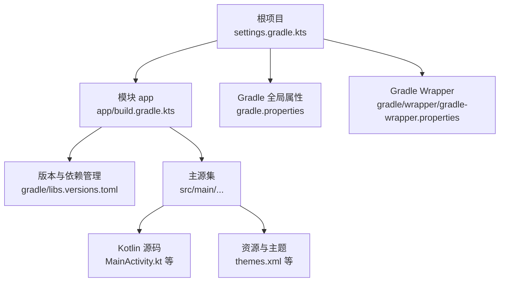
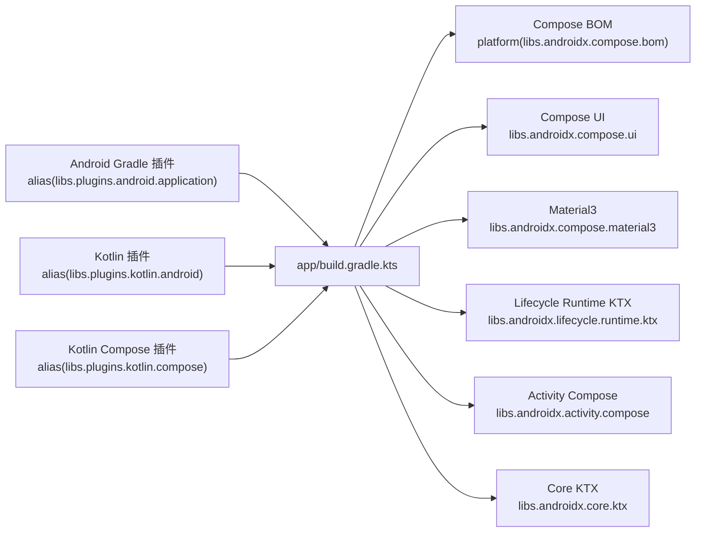
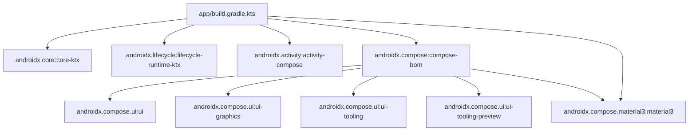

# 开发环境配置

<cite>
**本文引用的文件**
- [gradle/libs.versions.toml](file://gradle/libs.versions.toml)
- [app/build.gradle.kts](file://app/build.gradle.kts)
- [build.gradle.kts](file://build.gradle.kts)
- [gradle.properties](file://gradle.properties)
- [settings.gradle.kts](file://settings.gradle.kts)
- [gradle/wrapper/gradle-wrapper.properties](file://gradle/wrapper/gradle-wrapper.properties)
- [app/src/main/java/com/sephp/mycarlauncher/MainActivity.kt](file://app/src/main/java/com/sephp/mycarlauncher/MainActivity.kt)
- [app/src/main/java/com/sephp/mycarlauncher/ui/theme/Theme.kt](file://app/src/main/java/com/sephp/mycarlauncher/ui/theme/Theme.kt)
- [app/src/main/res/values/themes.xml](file://app/src/main/res/values/themes.xml)
</cite>

## 目录
1. [简介](#简介)
2. [项目结构](#项目结构)
3. [核心组件](#核心组件)
4. [架构总览](#架构总览)
5. [详细组件分析](#详细组件分析)
6. [依赖关系分析](#依赖关系分析)
7. [性能与构建特性](#性能与构建特性)
8. [故障排查指南](#故障排查指南)
9. [结论](#结论)
10. [附录](#附录)

## 简介
本指南面向需要在本地搭建 Android/Kotlin/Jetpack Compose 开发环境的工程师，围绕本仓库的构建配置进行系统化说明。重点包括：
- 如何配置 Kotlin、Android Gradle 插件（AGP）与 Jetpack Compose 开发环境
- 解释 libs.versions.toml 中的依赖版本管理机制（AndroidX 核心库、Compose BOM、Material3 组件）
- 配置 JDK 11 及相应编译选项
- 完整的构建配置说明：compileSdk、minSdk、targetSdk 的设置，以及 buildFeatures 中 Compose 支持的启用方式
- 常见环境配置问题的排查方案（依赖解析失败、构建缓存问题等）

## 项目结构
该仓库采用标准 Android 项目结构，根目录包含 Gradle 版本与全局配置，app 模块为应用实现主体，资源与 Compose 主题位于主源集内。

图表来源
- [settings.gradle.kts](file://settings.gradle.kts#L1-L24)
- [app/build.gradle.kts](file://app/build.gradle.kts#L1-L65)
- [gradle.properties](file://gradle.properties#L1-L23)
- [gradle/wrapper/gradle-wrapper.properties](file://gradle/wrapper/gradle-wrapper.properties#L1-L9)
- [gradle/libs.versions.toml](file://gradle/libs.versions.toml#L1-L35)

章节来源
- [settings.gradle.kts](file://settings.gradle.kts#L1-L24)
- [app/build.gradle.kts](file://app/build.gradle.kts#L1-L65)
- [gradle.properties](file://gradle.properties#L1-L23)
- [gradle/wrapper/gradle-wrapper.properties](file://gradle/wrapper/gradle-wrapper.properties#L1-L9)
- [gradle/libs.versions.toml](file://gradle/libs.versions.toml#L1-L35)

## 核心组件
- 版本与依赖管理：通过 libs.versions.toml 统一声明版本号与依赖坐标，并在模块中以别名形式引用，确保版本一致性与可维护性。
- 构建脚本：app/build.gradle.kts 使用 Kotlin DSL，集中配置命名空间、SDK 版本、编译选项、Compose 支持与依赖。
- 全局 Gradle 属性：开启 AndroidX、非传递 R 类等，提升兼容性与构建效率。
- 仓库与插件管理：settings.gradle.kts 统一配置仓库源与插件管理策略，保证依赖解析稳定可靠。

章节来源
- [gradle/libs.versions.toml](file://gradle/libs.versions.toml#L1-L35)
- [app/build.gradle.kts](file://app/build.gradle.kts#L1-L65)
- [gradle.properties](file://gradle.properties#L1-L23)
- [settings.gradle.kts](file://settings.gradle.kts#L1-L24)

## 架构总览
下图展示从 Gradle 插件到 Compose UI 的关键依赖链路，体现版本管理与 BOM 的作用。

图表来源
- [app/build.gradle.kts](file://app/build.gradle.kts#L1-L65)
- [gradle/libs.versions.toml](file://gradle/libs.versions.toml#L1-L35)

## 详细组件分析

### 1) 依赖版本管理与 libs.versions.toml
- 版本集中定义：在 [gradle/libs.versions.toml](file://gradle/libs.versions.toml#L1-L35) 中通过 [versions] 区块统一声明各依赖的版本号，如 AGP、Kotlin、Core KTX、Lifecycle、Activity Compose、Compose BOM、Material3 等。
- 依赖条目：在 [libraries] 区块中以 group:name 形式声明具体依赖，并通过 version.ref 引用 [versions] 中的版本键，避免重复与不一致。
- 插件别名：在 [plugins] 区块中为 Android 应用、Kotlin Android 与 Kotlin Compose 插件提供别名，便于在模块中以 alias(...) 方式使用。

建议实践
- 新增依赖时优先在 libs.versions.toml 中添加条目与版本键，再在模块 build.gradle.kts 中以 alias 引用，保持版本统一。
- 若需锁定特定版本，可在对应 [versions] 键处直接调整数值；若为平台依赖（如 Compose BOM），优先通过 platform(...) 引入，减少版本冲突。

章节来源
- [gradle/libs.versions.toml](file://gradle/libs.versions.toml#L1-L35)

### 2) 构建脚本与 Compose 支持
- 插件应用：在 app 模块的 [app/build.gradle.kts](file://app/build.gradle.kts#L1-L65) 中，通过 alias(...) 应用 Android 应用、Kotlin Android 与 Kotlin Compose 插件。
- SDK 版本：compileSdk 设置为 36，minSdk 为 33，targetSdk 为 36，满足当前 Compose 与 AndroidX 版本要求。
- 编译选项：sourceCompatibility 与 targetCompatibility 均设为 Java 11，kotlinOptions 的 jvmTarget 同步为 11。
- Compose 支持：buildFeatures.compose 设为 true，启用 Compose 编译与预览能力。
- 依赖引入：通过 platform(...) 引入 Compose BOM，随后按需添加 Compose UI、UI Graphics、UI Tooling Preview、Material3 等；同时引入 Core KTX、Lifecycle Runtime KTX、Activity Compose 与 Material3。

章节来源
- [app/build.gradle.kts](file://app/build.gradle.kts#L1-L65)

### 3) 全局 Gradle 属性与仓库管理
- AndroidX 启用：android.useAndroidX=true，确保迁移至 AndroidX。
- 非传递 R 类：android.nonTransitiveRClass=true，减小 R 类体积，降低依赖冲突风险。
- 仓库策略：settings.gradle.kts 中设置 RepositoriesMode.FAIL_ON_PROJECT_REPOS，强制使用统一仓库源（Google、Maven Central），避免项目级仓库污染。
- Gradle Wrapper：gradle/wrapper/gradle-wrapper.properties 指定 Gradle 分发版本，确保团队成员使用一致的构建工具。

章节来源
- [gradle.properties](file://gradle.properties#L1-L23)
- [settings.gradle.kts](file://settings.gradle.kts#L1-L24)
- [gradle/wrapper/gradle-wrapper.properties](file://gradle/wrapper/gradle-wrapper.properties#L1-L9)

### 4) Compose 主题与 UI 结构
- 主题入口：在 [app/src/main/java/com/sephp/mycarlauncher/ui/theme/Theme.kt](file://app/src/main/java/com/sephp/mycarlauncher/ui/theme/Theme.kt#L1-L58) 中定义深浅色与动态色方案，并通过 MaterialTheme 应用。
- 主界面：在 [app/src/main/java/com/sephp/mycarlauncher/MainActivity.kt](file://app/src/main/java/com/sephp/mycarlauncher/MainActivity.kt#L1-L475) 中启用边缘到边缘与 Compose 内容，使用自定义主题包裹界面。
- 资源主题：在 [app/src/main/res/values/themes.xml](file://app/src/main/res/values/themes.xml#L1-L8) 中设置窗口背景透明与壁纸显示，适配车载场景。

章节来源
- [app/src/main/java/com/sephp/mycarlauncher/ui/theme/Theme.kt](file://app/src/main/java/com/sephp/mycarlauncher/ui/theme/Theme.kt#L1-L58)
- [app/src/main/java/com/sephp/mycarlauncher/MainActivity.kt](file://app/src/main/java/com/sephp/mycarlauncher/MainActivity.kt#L1-L475)
- [app/src/main/res/values/themes.xml](file://app/src/main/res/values/themes.xml#L1-L8)

## 依赖关系分析
下图展示 app 模块对关键依赖的依赖关系，突出 Compose BOM 的统一约束作用。

图表来源
- [app/build.gradle.kts](file://app/build.gradle.kts#L1-L65)
- [gradle/libs.versions.toml](file://gradle/libs.versions.toml#L1-L35)

章节来源
- [app/build.gradle.kts](file://app/build.gradle.kts#L1-L65)
- [gradle/libs.versions.toml](file://gradle/libs.versions.toml#L1-L35)

## 性能与构建特性
- 并行构建：gradle.properties 中注释掉 org.gradle.parallel，建议在 CI 或本地机器上根据 CPU 核心数开启以提升构建速度（需评估内存占用）。
- 内存参数：通过 org.gradle.jvmargs 调整 JVM 内存上限，避免大项目构建时 OOM。
- 非传递 R 类：android.nonTransitiveRClass=true，有助于减小 R 类大小，降低编译与链接开销。
- Compose 预览：buildFeatures.compose=true，配合 UI Tooling Preview，显著提升 UI 开发效率。

章节来源
- [gradle.properties](file://gradle.properties#L1-L23)
- [app/build.gradle.kts](file://app/build.gradle.kts#L1-L65)

## 故障排查指南
- 依赖解析失败
  - 现象：Gradle 同步报错，提示找不到依赖或版本冲突。
  - 排查要点：
    - 确认 settings.gradle.kts 中仓库源已正确配置（Google、Maven Central），且未被项目级仓库覆盖。
    - 确认 libs.versions.toml 中版本键与依赖坐标无误，模块中以 alias(...) 引用。
    - 若使用 Compose，请确认通过 platform(...) 引入 BOM，避免手动指定子模块版本导致不一致。
  - 参考文件
    - [settings.gradle.kts](file://settings.gradle.kts#L1-L24)
    - [gradle/libs.versions.toml](file://gradle/libs.versions.toml#L1-L35)
    - [app/build.gradle.kts](file://app/build.gradle.kts#L1-L65)

- 构建缓存问题
  - 现象：构建缓慢、产物不一致或缓存损坏。
  - 排查要点：
    - 清理 Gradle 缓存：执行 gradlew clean 与删除 .gradle/caches 目录后重试。
    - 关闭并重新打开 Android Studio，刷新 Gradle 项目视图。
    - 检查 gradle.properties 中的 JVM 参数是否过低，适当提高内存上限。
  - 参考文件
    - [gradle.properties](file://gradle.properties#L1-L23)
    - [gradle/wrapper/gradle-wrapper.properties](file://gradle/wrapper/gradle-wrapper.properties#L1-L9)

- JDK/编译选项不匹配
  - 现象：编译报错，提示 Java 版本不兼容。
  - 排查要点：
    - 确认 Android Studio 使用 JDK 11（或与 sourceCompatibility/targetCompatibility 对齐的版本）。
    - 确认 app/build.gradle.kts 中 compileOptions 与 kotlinOptions 的 Java 版本一致。
  - 参考文件
    - [app/build.gradle.kts](file://app/build.gradle.kts#L1-L65)
    - [gradle.properties](file://gradle.properties#L1-L23)

- Compose 预览不可用
  - 现象：预览窗口空白或报错。
  - 排查要点：
    - 确认 buildFeatures.compose=true 已启用。
    - 确认 Compose BOM 已通过 platform(...) 引入，且 UI Tooling Preview 已添加。
    - 在 Android Studio 中点击“Sync Now”同步 Gradle。
  - 参考文件
    - [app/build.gradle.kts](file://app/build.gradle.kts#L1-L65)
    - [gradle/libs.versions.toml](file://gradle/libs.versions.toml#L1-L35)

## 结论
本指南基于仓库现有配置，系统阐述了 Kotlin、AGP 与 Jetpack Compose 的开发环境搭建要点，并结合 libs.versions.toml 的版本管理机制与 app/build.gradle.kts 的构建配置，给出了 JDK 11 配置、SDK 版本设置与 Compose 支持启用的完整说明。同时提供了针对依赖解析失败与构建缓存问题的排查路径，帮助开发者快速定位并解决问题。

## 附录
- 快速核对清单
  - Gradle Wrapper 版本：参见 [gradle/wrapper/gradle-wrapper.properties](file://gradle/wrapper/gradle-wrapper.properties#L1-L9)
  - 仓库源与插件管理：参见 [settings.gradle.kts](file://settings.gradle.kts#L1-L24)
  - 版本与依赖：参见 [gradle/libs.versions.toml](file://gradle/libs.versions.toml#L1-L35)
  - 构建配置与 Compose 支持：参见 [app/build.gradle.kts](file://app/build.gradle.kts#L1-L65)
  - 全局属性：参见 [gradle.properties](file://gradle.properties#L1-L23)
  - 主题与 UI：参见 [app/src/main/java/com/sephp/mycarlauncher/ui/theme/Theme.kt](file://app/src/main/java/com/sephp/mycarlauncher/ui/theme/Theme.kt#L1-L58)、[app/src/main/java/com/sephp/mycarlauncher/MainActivity.kt](file://app/src/main/java/com/sephp/mycarlauncher/MainActivity.kt#L1-L475)、[app/src/main/res/values/themes.xml](file://app/src/main/res/values/themes.xml#L1-L8)