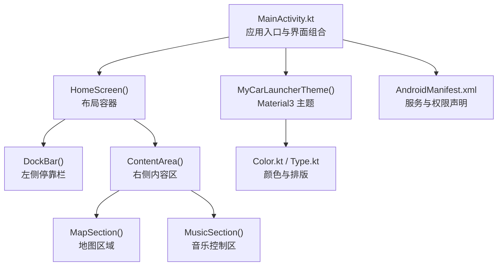
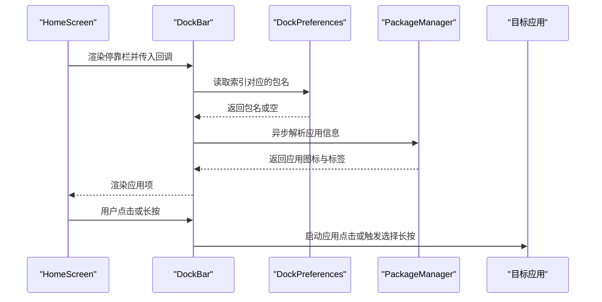
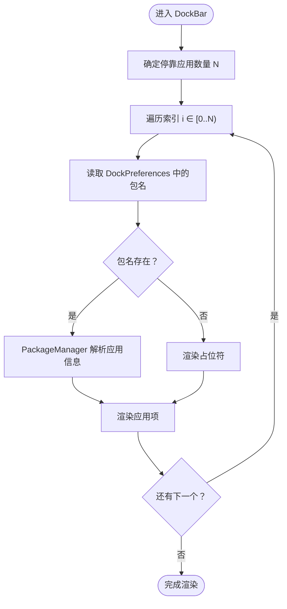
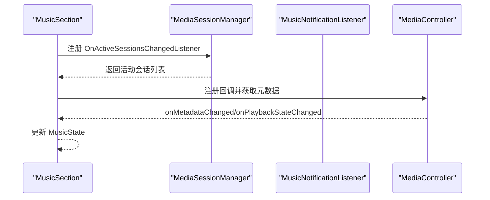
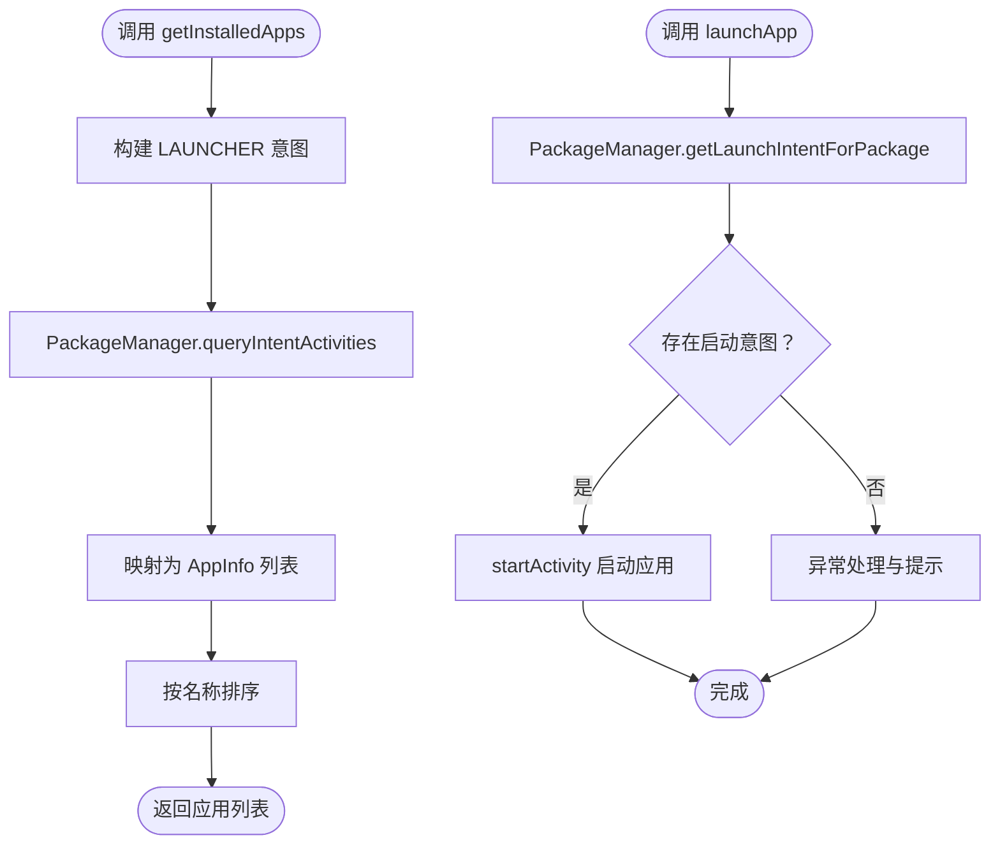
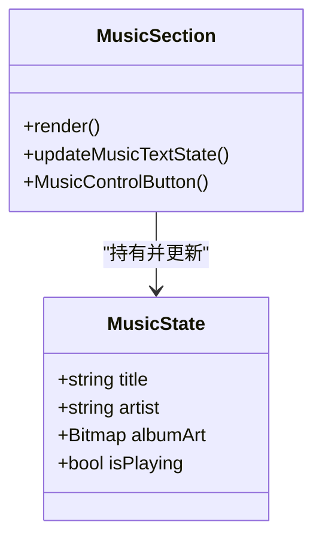
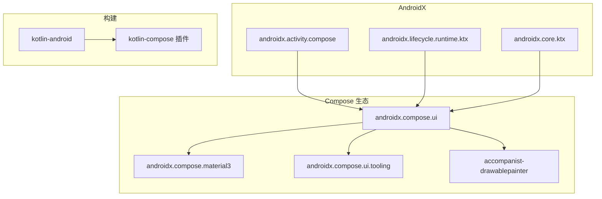

# 扩展开发

<cite>
**本文引用的文件**
- [MainActivity.kt](file://app/src/main/java/com/sephp/mycarlauncher/MainActivity.kt)
- [Theme.kt](file://app/src/main/java/com/sephp/mycarlauncher/ui/theme/Theme.kt)
- [Color.kt](file://app/src/main/java/com/sephp/mycarlauncher/ui/theme/Color.kt)
- [Type.kt](file://app/src/main/java/com/sephp/mycarlauncher/ui/theme/Type.kt)
- [AndroidManifest.xml](file://app/src/main/AndroidManifest.xml)
- [colors.xml](file://app/src/main/res/values/colors.xml)
- [themes.xml](file://app/src/main/res/values/themes.xml)
- [build.gradle.kts](file://app/build.gradle.kts)
- [settings.gradle.kts](file://settings.gradle.kts)
</cite>

## 目录
1. [简介](#简介)
2. [项目结构](#项目结构)
3. [核心组件](#核心组件)
4. [架构总览](#架构总览)
5. [详细组件分析](#详细组件分析)
6. [依赖分析](#依赖分析)
7. [性能考虑](#性能考虑)
8. [故障排查指南](#故障排查指南)
9. [结论](#结论)
10. [附录](#附录)

## 简介
本指南面向希望在现有车载启动器基础上进行扩展开发的工程师，围绕以下目标提供系统化指导：
- 基于 DockPreferences 对象扩展 Dock 栏应用数量
- 添加新的 UI 组件（如额外的控制按钮、信息显示区域）
- 集成新的系统服务（如通知监听、媒体会话）
- 遵循现有 Compose 组件模式创建可复用 UI 元素，保持与 Material Design 3 主题一致
- 使用 PackageManager 查询与启动其他应用
- 扩展音乐控制功能，支持更多媒体操作
- 代码组织最佳实践与状态管理建议

## 项目结构
该项目采用 Compose for Android 的现代 UI 架构，核心入口为 Activity，使用 Material3 主题，Dock 栏与内容区通过组合式布局组织，音乐控制通过媒体会话与通知监听服务集成。

图表来源
- [MainActivity.kt](file://app/src/main/java/com/sephp/mycarlauncher/MainActivity.kt#L64-L118)
- [Theme.kt](file://app/src/main/java/com/sephp/mycarlauncher/ui/theme/Theme.kt#L36-L58)
- [AndroidManifest.xml](file://app/src/main/AndroidManifest.xml#L15-L47)

章节来源
- [MainActivity.kt](file://app/src/main/java/com/sephp/mycarlauncher/MainActivity.kt#L64-L118)
- [Theme.kt](file://app/src/main/java/com/sephp/mycarlauncher/ui/theme/Theme.kt#L36-L58)
- [AndroidManifest.xml](file://app/src/main/AndroidManifest.xml#L15-L47)

## 核心组件
- 主界面与布局
  - HomeScreen：顶层布局容器，协调 Dock 栏与内容区，管理弹窗状态
  - DockBar：左侧停靠栏，展示固定数量的应用图标，支持长按替换与点击启动
  - ContentArea：右侧内容区，包含地图与音乐两个区域
- 音乐控制
  - MusicSection：展示专辑封面、标题与艺术家，提供上一首/播放暂停/下一首控制
  - MusicNotificationListener：通知监听服务占位类
- 应用选择与安装列表
  - AppListOverlay：全屏应用列表覆盖层
  - AppSelectorDialog：停靠栏应用选择对话框
  - AppItem：单个应用项
- 存储与偏好
  - DockPreferences：持久化停靠栏应用索引到包名映射
- 工具函数
  - getInstalledApps：查询已安装应用
  - launchApp：启动指定包名应用
  - getDockDateTime：停靠时间显示数据
- 主题与样式
  - MyCarLauncherTheme：Material3 动态/静态配色方案
  - Color.kt / Type.kt：颜色与排版定义
  - themes.xml：窗口背景与壁纸相关设置

章节来源
- [MainActivity.kt](file://app/src/main/java/com/sephp/mycarlauncher/MainActivity.kt#L76-L118)
- [MainActivity.kt](file://app/src/main/java/com/sephp/mycarlauncher/MainActivity.kt#L136-L206)
- [MainActivity.kt](file://app/src/main/java/com/sephp/mycarlauncher/MainActivity.kt#L228-L351)
- [MainActivity.kt](file://app/src/main/java/com/sephp/mycarlauncher/MainActivity.kt#L383-L386)
- [MainActivity.kt](file://app/src/main/java/com/sephp/mycarlauncher/MainActivity.kt#L389-L426)
- [MainActivity.kt](file://app/src/main/java/com/sephp/mycarlauncher/MainActivity.kt#L471-L508)
- [MainActivity.kt](file://app/src/main/java/com/sephp/mycarlauncher/MainActivity.kt#L441-L463)
- [MainActivity.kt](file://app/src/main/java/com/sephp/mycarlauncher/MainActivity.kt#L510-L514)
- [Theme.kt](file://app/src/main/java/com/sephp/mycarlauncher/ui/theme/Theme.kt#L14-L58)
- [Color.kt](file://app/src/main/java/com/sephp/mycarlauncher/ui/theme/Color.kt#L1-L11)
- [Type.kt](file://app/src/main/java/com/sephp/mycarlauncher/ui/theme/Type.kt#L1-L34)
- [themes.xml](file://app/src/main/res/values/themes.xml#L1-L8)

## 架构总览
整体采用“组合式 UI + 状态驱动”的架构，Dock 栏与内容区通过状态共享与回调解耦；音乐控制通过媒体会话与通知监听服务连接系统媒体栈；主题统一由 Material3 提供。

图表来源
- [MainActivity.kt](file://app/src/main/java/com/sephp/mycarlauncher/MainActivity.kt#L136-L206)
- [MainActivity.kt](file://app/src/main/java/com/sephp/mycarlauncher/MainActivity.kt#L441-L463)
- [MainActivity.kt](file://app/src/main/java/com/sephp/mycarlauncher/MainActivity.kt#L464-L469)

## 详细组件分析

### 扩展 Dock 栏应用数量
当前 DockBar 固定渲染 5 个应用项，可通过以下方式扩展：
- 修改 DockBar 的渲染数量：将 items(5) 改为 items(N) 并调整布局间距与尺寸
- 修改 DockPreferences 的键空间：将 KEY_DOCK_APP + index 的写法改为支持 N 个索引
- 更新异步加载逻辑：将 (0 until 5) 改为 (0 until N)，确保图标与标签正确加载
- 调整停靠时间显示与底部“全部应用”按钮的布局权重

图表来源
- [MainActivity.kt](file://app/src/main/java/com/sephp/mycarlauncher/MainActivity.kt#L136-L206)
- [MainActivity.kt](file://app/src/main/java/com/sephp/mycarlauncher/MainActivity.kt#L464-L469)

章节来源
- [MainActivity.kt](file://app/src/main/java/com/sephp/mycarlauncher/MainActivity.kt#L136-L206)
- [MainActivity.kt](file://app/src/main/java/com/sephp/mycarlauncher/MainActivity.kt#L464-L469)

### 添加新的 UI 组件（控制按钮/信息显示）
新增组件应遵循现有模式：
- 可复用组件：以 @Composable 函数形式封装，接收参数（如图标、文案、点击回调）
- 状态管理：使用 remember/mutableStateOf 或更细粒度的状态对象（如 MusicState）
- 主题一致性：使用 Material3 的 Color、Typography，配合本地主题切换
- 交互行为：使用 clickable/combinedClickable 等修饰符，保持触控反馈一致

示例参考：
- 控制按钮：参考 MusicControlButton 的设计与尺寸
- 列表网格：参考 AppListOverlay/AppSelectorDialog 的 LazyVerticalGrid 使用
- 时间显示：参考 DockTimeDisplay 的状态更新与刷新策略

章节来源
- [MainActivity.kt](file://app/src/main/java/com/sephp/mycarlauncher/MainActivity.kt#L367-L375)
- [MainActivity.kt](file://app/src/main/java/com/sephp/mycarlauncher/MainActivity.kt#L389-L426)
- [MainActivity.kt](file://app/src/main/java/com/sephp/mycarlauncher/MainActivity.kt#L471-L508)
- [MainActivity.kt](file://app/src/main/java/com/sephp/mycarlauncher/MainActivity.kt#L120-L134)
- [Theme.kt](file://app/src/main/java/com/sephp/mycarlauncher/ui/theme/Theme.kt#L36-L58)
- [Type.kt](file://app/src/main/java/com/sephp/mycarlauncher/ui/theme/Type.kt#L1-L34)

### 集成新的系统服务
- 通知监听服务
  - 在 AndroidManifest 中声明服务与权限
  - 实现 NotificationListenerService 子类（参考 MusicNotificationListener）
  - 在 MusicSection 中通过 MediaSessionManager 获取活动控制器并注册回调
- 权限与引导
  - 若未启用通知访问权限，提示用户前往设置开启

图表来源
- [MainActivity.kt](file://app/src/main/java/com/sephp/mycarlauncher/MainActivity.kt#L271-L322)
- [AndroidManifest.xml](file://app/src/main/AndroidManifest.xml#L25-L33)

章节来源
- [MainActivity.kt](file://app/src/main/java/com/sephp/mycarlauncher/MainActivity.kt#L271-L322)
- [AndroidManifest.xml](file://app/src/main/AndroidManifest.xml#L25-L33)

### 使用 PackageManager 查询与启动其他应用
- 查询已安装应用：通过 queryIntentActivities 获取 LAUNCHER 类别应用，解析应用信息
- 启动应用：通过 getLaunchIntentForPackage 获取启动意图并启动

图表来源
- [MainActivity.kt](file://app/src/main/java/com/sephp/mycarlauncher/MainActivity.kt#L443-L463)

章节来源
- [MainActivity.kt](file://app/src/main/java/com/sephp/mycarlauncher/MainActivity.kt#L443-L463)

### 扩展音乐控制功能
当前支持上一首/播放暂停/下一首，可进一步扩展：
- 增加更多 TransportControls 操作（如跳转、重复/随机模式切换等）
- 将状态抽象为 MusicState 并在回调中统一更新
- 为每个按钮提供明确的图标与描述，保持主次按钮视觉差异

图表来源
- [MainActivity.kt](file://app/src/main/java/com/sephp/mycarlauncher/MainActivity.kt#L246-L251)
- [MainActivity.kt](file://app/src/main/java/com/sephp/mycarlauncher/MainActivity.kt#L353-L365)
- [MainActivity.kt](file://app/src/main/java/com/sephp/mycarlauncher/MainActivity.kt#L367-L375)

章节来源
- [MainActivity.kt](file://app/src/main/java/com/sephp/mycarlauncher/MainActivity.kt#L246-L251)
- [MainActivity.kt](file://app/src/main/java/com/sephp/mycarlauncher/MainActivity.kt#L353-L365)
- [MainActivity.kt](file://app/src/main/java/com/sephp/mycarlauncher/MainActivity.kt#L367-L375)

### 代码组织最佳实践与状态管理建议
- 组件拆分
  - 将可复用 UI 抽象为独立 @Composable，避免在单一文件中堆积逻辑
  - 将业务逻辑（如查询应用、保存偏好）抽离为工具函数或对象
- 状态管理
  - 使用 remember/mutableStateOf 管理本地 UI 状态
  - 使用 LaunchedEffect/DisposableEffect 管理副作用（如异步加载、媒体会话监听）
  - 将跨组件共享的状态提升至父级，通过回调传递
- 性能优化
  - 异步执行耗时任务（如解析图标、查询应用），避免阻塞主线程
  - 使用 key 与 remember 优化重组范围
- 主题与一致性
  - 使用 Material3 的颜色与排版，结合动态配色
  - 保持图标、圆角、边距等视觉规范一致

章节来源
- [MainActivity.kt](file://app/src/main/java/com/sephp/mycarlauncher/MainActivity.kt#L136-L206)
- [MainActivity.kt](file://app/src/main/java/com/sephp/mycarlauncher/MainActivity.kt#L271-L322)
- [Theme.kt](file://app/src/main/java/com/sephp/mycarlauncher/ui/theme/Theme.kt#L36-L58)
- [Type.kt](file://app/src/main/java/com/sephp/mycarlauncher/ui/theme/Type.kt#L1-L34)

## 依赖分析
- Compose 生态
  - Compose UI、Material3、Tooling、Accompanist（drawable painter）
- 运行时依赖
  - AndroidX Lifecycle、Activity Compose
- 构建与插件
  - Kotlin、Compose 插件、Gradle 版本管理

图表来源
- [build.gradle.kts](file://app/build.gradle.kts#L44-L65)

章节来源
- [build.gradle.kts](file://app/build.gradle.kts#L44-L65)
- [settings.gradle.kts](file://settings.gradle.kts#L1-L24)

## 性能考虑
- 异步加载：对包管理器查询与图片解析使用 IO 线程，避免阻塞 UI
- 组合重排：合理使用 remember 与 key，减少不必要的重组
- 图标缓存：可考虑对常用图标进行缓存，降低重复绘制成本
- 主题切换：Material3 动态色在 Android 12+ 下按系统主题切换，注意暗/亮色下的对比度

## 故障排查指南
- 通知访问权限
  - 若未启用通知访问权限，音乐信息无法获取。代码会提示并引导用户前往设置
- 应用启动失败
  - 当目标应用无启动意图或被系统限制时，会捕获异常并提示
- 媒体会话不可用
  - 若无活动会话或权限不足，回调不会生效，需检查媒体应用是否支持标准会话

章节来源
- [MainActivity.kt](file://app/src/main/java/com/sephp/mycarlauncher/MainActivity.kt#L285-L290)
- [MainActivity.kt](file://app/src/main/java/com/sephp/mycarlauncher/MainActivity.kt#L454-L462)
- [AndroidManifest.xml](file://app/src/main/AndroidManifest.xml#L25-L33)

## 结论
通过遵循现有 Compose 组件模式与 Material3 主题规范，开发者可以安全地扩展 Dock 栏应用数量、新增 UI 组件与系统服务，并通过 PackageManager 与媒体会话机制增强音乐控制能力。建议在扩展过程中坚持模块化、状态分离与异步处理原则，确保界面流畅与体验一致。

## 附录
- 主题与颜色
  - Material3 配色方案与动态色开关
  - 自定义颜色与排版样式
- 窗口与壁纸
  - 窗口背景透明与壁纸显示设置

章节来源
- [Theme.kt](file://app/src/main/java/com/sephp/mycarlauncher/ui/theme/Theme.kt#L14-L58)
- [Color.kt](file://app/src/main/java/com/sephp/mycarlauncher/ui/theme/Color.kt#L1-L11)
- [Type.kt](file://app/src/main/java/com/sephp/mycarlauncher/ui/theme/Type.kt#L1-L34)
- [themes.xml](file://app/src/main/res/values/themes.xml#L1-L8)