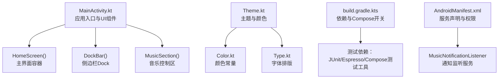
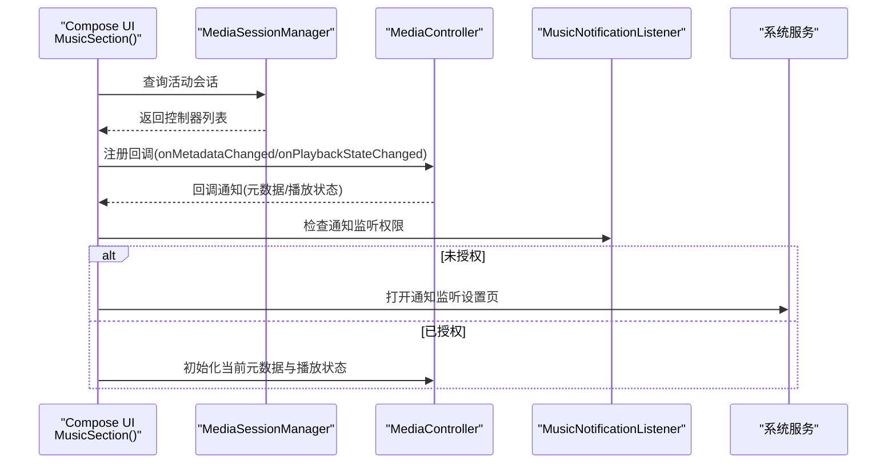
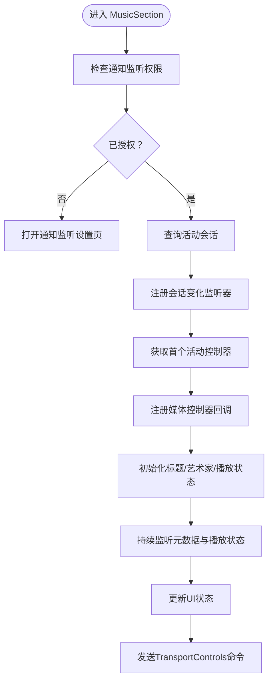
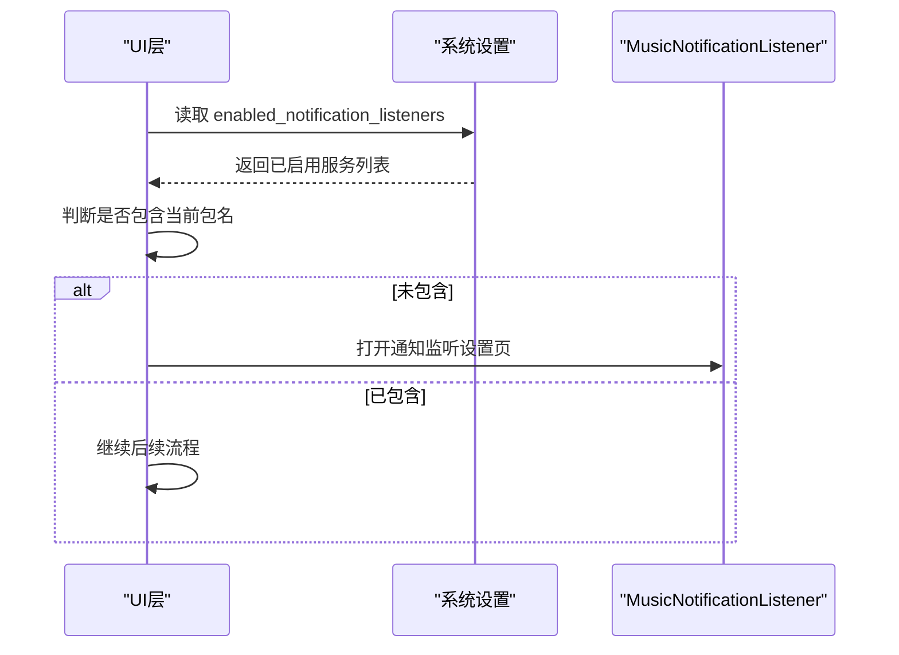
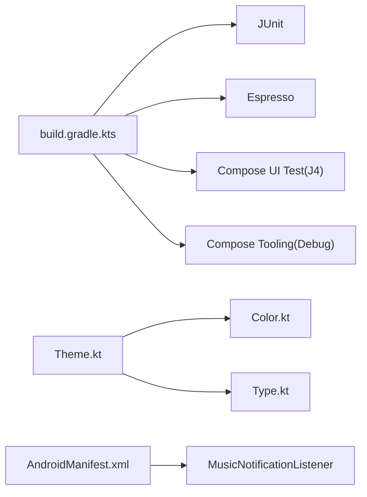

# 调试与测试

<cite>
**本文引用的文件列表**
- [MainActivity.kt](file://app/src/main/java/com/sephp/mycarlauncher/MainActivity.kt)
- [ExampleUnitTest.kt](file://app/src/test/java/com/sephp/mycarlauncher/ExampleUnitTest.kt)
- [ExampleInstrumentedTest.kt](file://app/src/androidTest/java/com/sephp/mycarlauncher/ExampleInstrumentedTest.kt)
- [build.gradle.kts](file://app/build.gradle.kts)
- [AndroidManifest.xml](file://app/src/main/AndroidManifest.xml)
- [Theme.kt](file://app/src/main/java/com/sephp/mycarlauncher/ui/theme/Theme.kt)
- [Color.kt](file://app/src/main/java/com/sephp/mycarlauncher/ui/theme/Color.kt)
- [Type.kt](file://app/src/main/java/com/sephp/mycarlauncher/ui/theme/Type.kt)
</cite>

## 目录
1. [简介](#简介)
2. [项目结构](#项目结构)
3. [核心组件](#核心组件)
4. [架构总览](#架构总览)
5. [详细组件分析](#详细组件分析)
6. [依赖关系分析](#依赖关系分析)
7. [性能考虑](#性能考虑)
8. [故障排查指南](#故障排查指南)
9. [结论](#结论)
10. [附录](#附录)

## 简介
本指南面向开发者，聚焦于本项目的调试与测试实践，覆盖以下方面：
- 使用 Compose Preview 实时预览 HomeScreen、DockBar 等 UI 组件，并支持不同屏幕尺寸与横竖屏配置。
- 调试音乐播放状态监听机制，包括 MediaSessionManager 的会话监控与回调处理。
- NotificationListenerService 权限调试方案，确保音乐信息展示正常。
- 应用启动性能分析技巧（基于已集成的 profileinstaller）。
- 示例测试文件结构与测试用例编写规范，包括 JUnit 单元测试与 Espresso 仪器化测试。

## 项目结构
本项目采用 Compose 驱动的 Activity 入口，UI 主题与资源位于 ui/theme 包中；测试分为本地单元测试与设备端仪器化测试；构建脚本启用 Compose 并引入测试依赖。

图表来源
- [MainActivity.kt](file://app/src/main/java/com/sephp/mycarlauncher/MainActivity.kt#L64-L118)
- [Theme.kt](file://app/src/main/java/com/sephp/mycarlauncher/ui/theme/Theme.kt#L36-L58)
- [Color.kt](file://app/src/main/java/com/sephp/mycarlauncher/ui/theme/Color.kt#L1-L11)
- [Type.kt](file://app/src/main/java/com/sephp/mycarlauncher/ui/theme/Type.kt#L1-L34)
- [build.gradle.kts](file://app/build.gradle.kts#L43-L65)
- [AndroidManifest.xml](file://app/src/main/AndroidManifest.xml#L25-L33)

章节来源
- [MainActivity.kt](file://app/src/main/java/com/sephp/mycarlauncher/MainActivity.kt#L64-L118)
- [build.gradle.kts](file://app/build.gradle.kts#L43-L65)
- [AndroidManifest.xml](file://app/src/main/AndroidManifest.xml#L25-L33)

## 核心组件
- 应用入口与主题：应用通过 Activity 设置 Compose 内容，使用自定义主题包裹 UI。
- HomeScreen：主界面容器，包含 DockBar 与内容区域。
- DockBar：侧边 Dock 栏，支持异步加载应用图标、长按替换应用、点击打开应用。
- MusicSection：音乐控制区，使用 MediaSessionManager 监听播放状态与元数据变化。
- NotificationListenerService：声明为通知监听服务，用于权限检查与后续扩展。
- 测试：本地单元测试与仪器化测试示例，以及 Compose 测试依赖。

章节来源
- [MainActivity.kt](file://app/src/main/java/com/sephp/mycarlauncher/MainActivity.kt#L64-L118)
- [MainActivity.kt](file://app/src/main/java/com/sephp/mycarlauncher/MainActivity.kt#L136-L206)
- [MainActivity.kt](file://app/src/main/java/com/sephp/mycarlauncher/MainActivity.kt#L246-L351)
- [AndroidManifest.xml](file://app/src/main/AndroidManifest.xml#L25-L33)
- [ExampleUnitTest.kt](file://app/src/test/java/com/sephp/mycarlauncher/ExampleUnitTest.kt#L1-L17)
- [ExampleInstrumentedTest.kt](file://app/src/androidTest/java/com/sephp/mycarlauncher/ExampleInstrumentedTest.kt#L1-L24)

## 架构总览
下图展示了从 UI 到系统服务的交互路径，重点体现音乐状态监听与通知权限检查流程。

图表来源
- [MainActivity.kt](file://app/src/main/java/com/sephp/mycarlauncher/MainActivity.kt#L271-L322)
- [MainActivity.kt](file://app/src/main/java/com/sephp/mycarlauncher/MainActivity.kt#L377-L386)
- [AndroidManifest.xml](file://app/src/main/AndroidManifest.xml#L25-L33)

## 详细组件分析

### Compose 预览与多尺寸/横竖屏调试
- 预览入口：项目已在主界面容器上添加 Compose 预览注解，可直接在 IDE 中预览主界面。
- 多尺寸与横竖屏：可在预览参数中调整宽度、高度与设备方向，验证布局适配。
- DockBar 预览：可单独对 DockBar 组件进行预览，验证图标加载、长按行为与点击跳转逻辑。
- 主题与暗黑模式：预览时可切换深浅主题，观察颜色与对比度表现。

章节来源
- [MainActivity.kt](file://app/src/main/java/com/sephp/mycarlauncher/MainActivity.kt#L469-L475)
- [Theme.kt](file://app/src/main/java/com/sephp/mycarlauncher/ui/theme/Theme.kt#L36-L58)
- [Color.kt](file://app/src/main/java/com/sephp/mycarlauncher/ui/theme/Color.kt#L1-L11)
- [Type.kt](file://app/src/main/java/com/sephp/mycarlauncher/ui/theme/Type.kt#L1-L34)

### 音乐播放状态监听机制调试
- 会话监控：通过 MediaSessionManager 获取活动会话列表，注册 OnActiveSessionsChangedListener 监听会话变化。
- 回调处理：在回调中更新当前控制器并注册 MediaController.Callback，监听元数据与播放状态变更。
- 元数据与播放状态：从 MediaController 获取标题、艺术家、专辑封面与播放状态，驱动 UI 更新。
- 权限检查：若未授予通知监听权限，提示用户前往设置开启，并引导到通知监听设置页。
- 控制按钮：通过 TransportControls 发送上一首/下一首/播放/暂停命令。

图表来源
- [MainActivity.kt](file://app/src/main/java/com/sephp/mycarlauncher/MainActivity.kt#L271-L322)
- [MainActivity.kt](file://app/src/main/java/com/sephp/mycarlauncher/MainActivity.kt#L353-L365)
- [MainActivity.kt](file://app/src/main/java/com/sephp/mycarlauncher/MainActivity.kt#L377-L386)

章节来源
- [MainActivity.kt](file://app/src/main/java/com/sephp/mycarlauncher/MainActivity.kt#L271-L322)
- [MainActivity.kt](file://app/src/main/java/com/sephp/mycarlauncher/MainActivity.kt#L353-L365)
- [MainActivity.kt](file://app/src/main/java/com/sephp/mycarlauncher/MainActivity.kt#L377-L386)

### NotificationListenerService 权限调试
- 服务声明：在清单中声明 MusicNotificationListener 为通知监听服务，并设置绑定权限。
- 权限检查：运行时读取系统设置中的已启用通知监听服务，判断是否包含当前包名。
- 用户引导：若未启用，弹出提示并跳转至通知监听设置页面。

图表来源
- [MainActivity.kt](file://app/src/main/java/com/sephp/mycarlauncher/MainActivity.kt#L377-L386)
- [AndroidManifest.xml](file://app/src/main/AndroidManifest.xml#L25-L33)

章节来源
- [MainActivity.kt](file://app/src/main/java/com/sephp/mycarlauncher/MainActivity.kt#L377-L386)
- [AndroidManifest.xml](file://app/src/main/AndroidManifest.xml#L25-L33)

### UI 组件与交互调试要点
- DockBar：验证异步加载应用图标、长按触发选择器、点击打开应用的行为；可通过预览切换深浅主题观察对比度。
- MusicSection：验证封面加载、标题/艺术家文本更新、播放状态切换按钮；结合会话监听与 TransportControls 进行交互测试。
- AppListOverlay/AppSelectorDialog：验证网格布局、滚动与点击事件；确保点击后正确关闭覆盖层。

章节来源
- [MainActivity.kt](file://app/src/main/java/com/sephp/mycarlauncher/MainActivity.kt#L136-L206)
- [MainActivity.kt](file://app/src/main/java/com/sephp/mycarlauncher/MainActivity.kt#L246-L351)
- [MainActivity.kt](file://app/src/main/java/com/sephp/mycarlauncher/MainActivity.kt#L388-L463)

## 依赖关系分析
- Compose 与测试依赖：构建脚本启用了 Compose，并引入了 JUnit、Espresso、Compose UI 测试工具与调试工具。
- 主题与字体：Theme.kt 依赖 Color.kt 与 Type.kt 提供的颜色与排版配置。
- 清单声明：声明了通知监听服务及绑定权限，便于权限调试与服务生命周期管理。

图表来源
- [build.gradle.kts](file://app/build.gradle.kts#L43-L65)
- [Theme.kt](file://app/src/main/java/com/sephp/mycarlauncher/ui/theme/Theme.kt#L36-L58)
- [Color.kt](file://app/src/main/java/com/sephp/mycarlauncher/ui/theme/Color.kt#L1-L11)
- [Type.kt](file://app/src/main/java/com/sephp/mycarlauncher/ui/theme/Type.kt#L1-L34)
- [AndroidManifest.xml](file://app/src/main/AndroidManifest.xml#L25-L33)

章节来源
- [build.gradle.kts](file://app/build.gradle.kts#L43-L65)
- [Theme.kt](file://app/src/main/java/com/sephp/mycarlauncher/ui/theme/Theme.kt#L36-L58)
- [AndroidManifest.xml](file://app/src/main/AndroidManifest.xml#L25-L33)

## 性能考虑
- 启动性能分析：项目已集成 profileinstaller，可用于安装/保存/跳过/基准操作等场景，建议在开发阶段使用其提供的动作进行性能分析与优化。
- I/O 与协程：DockBar 与音乐封面加载均在 IO 线程执行，避免阻塞主线程；注意在预览与测试中模拟网络/磁盘延迟，验证 UI 响应性。
- 预览与渲染：在预览中切换不同屏幕密度与方向，观察布局重绘与合成开销；必要时减少不必要的重组或使用 remember 等优化手段。

章节来源
- [build.gradle.kts](file://app/build.gradle.kts#L43-L65)
- [MainActivity.kt](file://app/src/main/java/com/sephp/mycarlauncher/MainActivity.kt#L148-L166)
- [MainActivity.kt](file://app/src/main/java/com/sephp/mycarlauncher/MainActivity.kt#L261-L269)

## 故障排查指南
- 预览无法显示或报错
  - 确认 Compose 预览注解已正确标注在可组合函数上。
  - 在预览参数中设置合适的宽高与设备方向，避免布局溢出。
  - 若主题相关报错，检查 Theme.kt 的颜色与排版配置是否完整。
- 音乐信息不显示或无播放控制
  - 检查通知监听权限是否已授予；若未授予，UI 会提示并跳转设置页。
  - 确认存在正在播放的媒体会话；若无会话，UI 将显示默认文案。
  - 检查 TransportControls 是否可用，确认回调已注册。
- 服务声明问题
  - 确认清单中已声明 MusicNotificationListener 且具备绑定权限。
- 测试失败
  - 单元测试：确保测试类与断言逻辑正确，参考示例测试文件。
  - 仪器化测试：确保测试运行器配置正确，参考示例测试文件。

章节来源
- [MainActivity.kt](file://app/src/main/java/com/sephp/mycarlauncher/MainActivity.kt#L285-L322)
- [MainActivity.kt](file://app/src/main/java/com/sephp/mycarlauncher/MainActivity.kt#L377-L386)
- [AndroidManifest.xml](file://app/src/main/AndroidManifest.xml#L25-L33)
- [ExampleUnitTest.kt](file://app/src/test/java/com/sephp/mycarlauncher/ExampleUnitTest.kt#L1-L17)
- [ExampleInstrumentedTest.kt](file://app/src/androidTest/java/com/sephp/mycarlauncher/ExampleInstrumentedTest.kt#L1-L24)

## 结论
本项目提供了完整的 Compose UI 预览、音乐播放状态监听与通知权限调试能力，并具备基础的单元与仪器化测试骨架。通过合理使用预览参数、权限检查与服务声明、以及测试依赖，可以高效完成 UI 与业务逻辑的调试与验证。

## 附录

### 测试文件结构与规范
- 单元测试（本地）
  - 示例：位于测试目录，使用 JUnit 断言进行基本逻辑验证。
  - 规范：保持测试简单、可重复、无外部依赖；适合验证纯函数与数据转换。
- 仪器化测试（设备端）
  - 示例：位于 androidTest 目录，使用 AndroidJUnit4 与 InstrumentationRegistry 获取上下文。
  - 规范：适用于 UI 与系统服务交互场景；需关注设备兼容性与权限。

章节来源
- [ExampleUnitTest.kt](file://app/src/test/java/com/sephp/mycarlauncher/ExampleUnitTest.kt#L1-L17)
- [ExampleInstrumentedTest.kt](file://app/src/androidTest/java/com/sephp/mycarlauncher/ExampleInstrumentedTest.kt#L1-L24)
- [build.gradle.kts](file://app/build.gradle.kts#L43-L65)