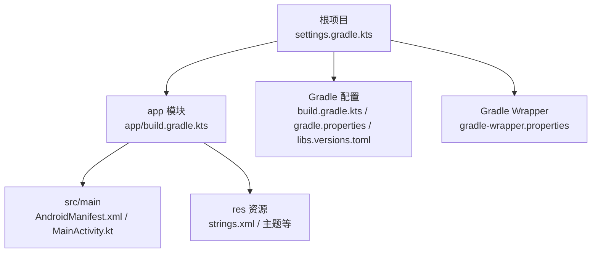
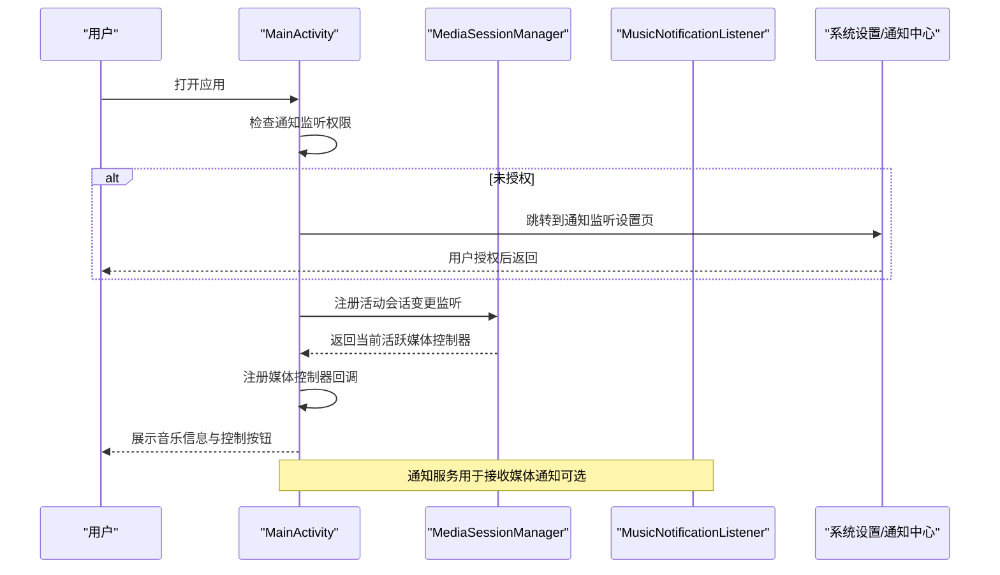
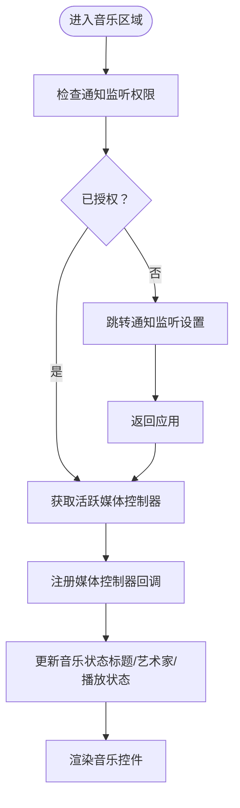
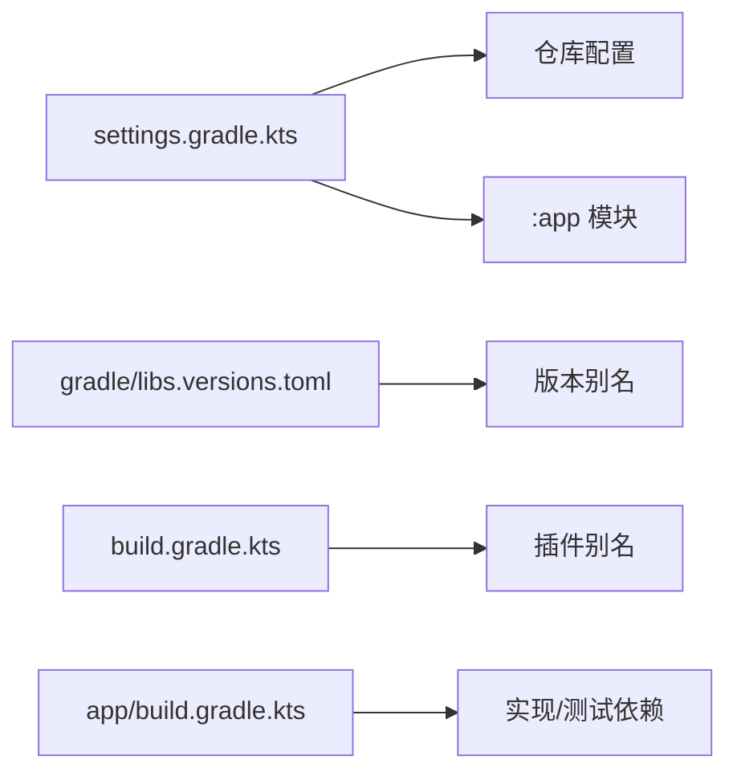

# 快速入门

<cite>
**本文引用的文件**
- [app/build.gradle.kts](file://app/build.gradle.kts)
- [build.gradle.kts](file://build.gradle.kts)
- [settings.gradle.kts](file://settings.gradle.kts)
- [gradle.properties](file://gradle.properties)
- [gradle/wrapper/gradle-wrapper.properties](file://gradle/wrapper/gradle-wrapper.properties)
- [gradle/libs.versions.toml](file://gradle/libs.versions.toml)
- [app/src/main/AndroidManifest.xml](file://app/src/main/AndroidManifest.xml)
- [app/src/main/java/com/sephp/mycarlauncher/MainActivity.kt](file://app/src/main/java/com/sephp/mycarlauncher/MainActivity.kt)
- [app/src/main/java/com/sephp/mycarlauncher/ui/theme/Theme.kt](file://app/src/main/java/com/sephp/mycarlauncher/ui/theme/Theme.kt)
- [app/src/main/res/values/strings.xml](file://app/src/main/res/values/strings.xml)
</cite>

## 目录
1. [简介](#简介)
2. [项目结构](#项目结构)
3. [核心组件](#核心组件)
4. [架构总览](#架构总览)
5. [详细组件分析](#详细组件分析)
6. [依赖关系分析](#依赖关系分析)
7. [性能与构建建议](#性能与构建建议)
8. [故障排除指南](#故障排除指南)
9. [结论](#结论)
10. [附录：从零到运行](#附录从零到运行)

## 简介
本指南面向首次接触 MyCarLauncher 的开发者，帮助你从零开始完成开发环境搭建、依赖安装、权限配置与构建运行。你将学会：
- 在 Android Studio 中导入项目并正确配置 SDK、Gradle 与 Kotlin/Compose 版本
- 配置通知访问权限与媒体会话相关权限
- 选择合适的构建变体并在模拟器或真机上部署
- 处理常见构建错误与运行期问题（如包查询权限、媒体会话绑定）

## 项目结构
该项目采用标准 Android 应用模块结构，使用 Gradle Kotlin DSL、AndroidX Compose 与 Kotlin 编写 UI。根目录包含 Gradle 配置与仓库聚合；app 模块包含源码、资源与清单文件。

图表来源
- [settings.gradle.kts](file://settings.gradle.kts#L1-L24)
- [app/build.gradle.kts](file://app/build.gradle.kts#L1-L65)
- [gradle.properties](file://gradle.properties#L1-L23)
- [gradle/libs.versions.toml](file://gradle/libs.versions.toml#L1-L35)
- [gradle/wrapper/gradle-wrapper.properties](file://gradle/wrapper/gradle-wrapper.properties#L1-L9)
- [app/src/main/AndroidManifest.xml](file://app/src/main/AndroidManifest.xml#L1-L50)
- [app/src/main/java/com/sephp/mycarlauncher/MainActivity.kt](file://app/src/main/java/com/sephp/mycarlauncher/MainActivity.kt#L1-L475)

章节来源
- [settings.gradle.kts](file://settings.gradle.kts#L1-L24)
- [app/build.gradle.kts](file://app/build.gradle.kts#L1-L65)
- [gradle.properties](file://gradle.properties#L1-L23)
- [gradle/libs.versions.toml](file://gradle/libs.versions.toml#L1-L35)
- [gradle/wrapper/gradle-wrapper.properties](file://gradle/wrapper/gradle-wrapper.properties#L1-L9)

## 核心组件
- 构建系统与版本
  - Gradle Kotlin DSL：app/build.gradle.kts 使用 plugins、android、dependencies 块组织配置
  - Gradle Wrapper：固定分发版本，确保团队一致性
  - 版本管理：通过 gradle/libs.versions.toml 统一管理依赖版本
- Android 配置
  - compileSdk/targetSdk/minSdk：compileSdk 36、targetSdk 36、minSdk 33
  - Java/Kotlin 目标兼容：Java 11、Kotlin JVM 目标 11
  - Compose：启用 buildFeatures.compose
- 权限与服务
  - 通知监听服务：声明 BIND_NOTIFICATION_LISTENER_SERVICE 并导出
  - 包查询权限：使用 QUERY_ALL_PACKAGES（受工具忽略）
  - 查询意图：允许查询 LAUNCHER 类型的 Intent
- 运行入口
  - MainActivity：作为 LAUNCHER、HOME、DEFAULT 启动入口，横屏单任务模式

章节来源
- [app/build.gradle.kts](file://app/build.gradle.kts#L1-L65)
- [gradle/libs.versions.toml](file://gradle/libs.versions.toml#L1-L35)
- [gradle/wrapper/gradle-wrapper.properties](file://gradle/wrapper/gradle-wrapper.properties#L1-L9)
- [app/src/main/AndroidManifest.xml](file://app/src/main/AndroidManifest.xml#L1-L50)
- [app/src/main/java/com/sephp/mycarlauncher/MainActivity.kt](file://app/src/main/java/com/sephp/mycarlauncher/MainActivity.kt#L1-L475)

## 架构总览
下图展示应用启动与媒体控制的关键交互路径：MainActivity 通过 MediaSessionManager 获取媒体控制器回调，同时检查并引导用户开启通知监听权限。

图表来源
- [app/src/main/java/com/sephp/mycarlauncher/MainActivity.kt](file://app/src/main/java/com/sephp/mycarlauncher/MainActivity.kt#L285-L322)
- [app/src/main/AndroidManifest.xml](file://app/src/main/AndroidManifest.xml#L25-L33)

## 详细组件分析

### 构建与版本配置
- Gradle 插件与版本
  - 应用插件、Kotlin Android 插件、Kotlin Compose 插件由 libs.versions.toml 统一管理
  - 根 build.gradle.kts 将插件标记为不自动应用，避免重复应用
- SDK 与语言级别
  - compileSdk 36、targetSdk 36、minSdk 33
  - Java 11、Kotlin JVM 目标 11
- Compose 支持
  - buildFeatures.compose 开启
- 依赖范围
  - 实现依赖：AndroidX Compose、Material3、Accompanist 等
  - 测试依赖：JUnit、Espresso、Compose Test
  - Debug 依赖：Compose Tooling 与测试清单

章节来源
- [app/build.gradle.kts](file://app/build.gradle.kts#L1-L65)
- [build.gradle.kts](file://build.gradle.kts#L1-L6)
- [gradle/libs.versions.toml](file://gradle/libs.versions.toml#L1-L35)

### 清单与权限
- 通知监听服务
  - 声明了绑定通知监听服务的权限，并导出服务
- 包查询权限
  - 使用 QUERY_ALL_PACKAGES（工具忽略）
- 查询意图
  - 允许查询 LAUNCHER 类型的主入口
- 应用入口
  - MainActivity 同时声明 MAIN、LAUNCHER、HOME、DEFAULT 四个类别，横屏单任务

章节来源
- [app/src/main/AndroidManifest.xml](file://app/src/main/AndroidManifest.xml#L1-L50)

### 主界面与主题
- 主界面
  - MainActivity 设置 Edge-to-Edge 与 Compose 内容，调用 HomeScreen
  - HomeScreen 包含 DockBar 与内容区，支持应用列表覆盖层与应用选择对话框
- 主题
  - 根据系统深色模式与 Android 12 动态色策略选择颜色方案
  - 字体与排版由 Theme.kt 提供

章节来源
- [app/src/main/java/com/sephp/mycarlauncher/MainActivity.kt](file://app/src/main/java/com/sephp/mycarlauncher/MainActivity.kt#L64-L118)
- [app/src/main/java/com/sephp/mycarlauncher/ui/theme/Theme.kt](file://app/src/main/java/com/sephp/mycarlauncher/ui/theme/Theme.kt#L1-L58)
- [app/src/main/res/values/strings.xml](file://app/src/main/res/values/strings.xml#L1-L3)

### 媒体会话与通知监听
- 媒体会话绑定流程
  - 通过 MediaSessionManager 获取活跃控制器
  - 注册回调以更新标题、艺术家与播放状态
  - 若未启用通知监听，弹出提示并跳转设置页
- 通知监听服务
  - 声明服务并导出，用于接收媒体通知（可选）

图表来源
- [app/src/main/java/com/sephp/mycarlauncher/MainActivity.kt](file://app/src/main/java/com/sephp/mycarlauncher/MainActivity.kt#L285-L322)

章节来源
- [app/src/main/java/com/sephp/mycarlauncher/MainActivity.kt](file://app/src/main/java/com/sephp/mycarlauncher/MainActivity.kt#L285-L322)
- [app/src/main/AndroidManifest.xml](file://app/src/main/AndroidManifest.xml#L25-L33)

## 依赖关系分析
- 依赖解析与仓库
  - pluginManagement 与 dependencyResolutionManagement 确保仓库一致
  - Google、Maven Central 作为默认仓库
- 版本集中管理
  - libs.versions.toml 定义 AGP、Kotlin、Compose、AndroidX 等版本
- 插件与模块
  - settings.gradle.kts 声明包含 app 模块
  - 根 build.gradle.kts 对插件进行统一别名管理

图表来源
- [settings.gradle.kts](file://settings.gradle.kts#L1-L24)
- [gradle/libs.versions.toml](file://gradle/libs.versions.toml#L1-L35)
- [build.gradle.kts](file://build.gradle.kts#L1-L6)
- [app/build.gradle.kts](file://app/build.gradle.kts#L44-L65)

章节来源
- [settings.gradle.kts](file://settings.gradle.kts#L1-L24)
- [gradle/libs.versions.toml](file://gradle/libs.versions.toml#L1-L35)
- [build.gradle.kts](file://build.gradle.kts#L1-L6)
- [app/build.gradle.kts](file://app/build.gradle.kts#L44-L65)

## 性能与构建建议
- 使用 Gradle Wrapper 固定版本，避免本地环境差异导致的构建失败
- 合理设置 JVM 参数与并行构建选项，提升大项目编译速度
- Compose 预览与调试依赖仅在 debug 下生效，release 关闭混淆以减少体积
- 避免在主线程执行耗时操作，已通过协程与 IO 线程处理媒体封面加载与应用列表查询

章节来源
- [gradle/wrapper/gradle-wrapper.properties](file://gradle/wrapper/gradle-wrapper.properties#L1-L9)
- [gradle.properties](file://gradle.properties#L1-L23)
- [app/build.gradle.kts](file://app/build.gradle.kts#L23-L42)
- [app/src/main/java/com/sephp/mycarlauncher/MainActivity.kt](file://app/src/main/java/com/sephp/mycarlauncher/MainActivity.kt#L148-L166)

## 故障排除指南
- 包查询权限（QUERY_ALL_PACKAGES）
  - 现象：应用无法枚举其他应用或出现包查询相关异常
  - 解决：在清单中保留 QUERY_ALL_PACKAGES 权限声明；若目标 SDK 为 11+，需在设置中明确授权
  - 参考：清单中的 QUERY_ALL_PACKAGES 声明与工具忽略注释
- 通知访问权限（通知监听服务）
  - 现象：音乐区域无法显示播放信息或控制按钮无效
  - 解决：应用会在未授权时提示并跳转到通知监听设置页面；授权后返回应用即可
  - 参考：音乐区域初始化逻辑与通知监听服务声明
- 媒体会话绑定失败（SecurityException）
  - 现象：注册会话监听或获取控制器时抛出安全异常
  - 解决：确认通知监听权限已授予；检查系统版本与权限状态；必要时重启应用或系统
- 构建错误
  - AGP/Kotlin/Compose 版本不匹配：根据 libs.versions.toml 与 Gradle 插件版本保持一致
  - 仓库不可达：检查 pluginManagement 与 repositories 配置是否包含 Google/Maven Central
  - Java/Kotlin 目标不兼容：确保 Java 11 与 Kotlin JVM 目标 11
- 设备与模拟器
  - minSdk 33：确保模拟器或真机系统版本满足要求
  - 横屏单任务：确保设备方向与启动模式符合预期

章节来源
- [app/src/main/AndroidManifest.xml](file://app/src/main/AndroidManifest.xml#L1-L50)
- [app/src/main/java/com/sephp/mycarlauncher/MainActivity.kt](file://app/src/main/java/com/sephp/mycarlauncher/MainActivity.kt#L285-L322)
- [gradle/libs.versions.toml](file://gradle/libs.versions.toml#L1-L35)
- [settings.gradle.kts](file://settings.gradle.kts#L1-L24)

## 结论
通过本指南，你可以基于现有配置快速完成 MyCarLauncher 的开发环境搭建与运行。重点在于：
- 正确配置 Gradle、SDK 与 Kotlin/Compose 版本
- 授权通知访问权限以启用媒体控制
- 使用固定 Gradle Wrapper 与集中版本管理降低环境差异风险
遇到问题时，优先检查权限与系统版本，再核对依赖与仓库配置

## 附录：从零到运行
- 克隆仓库并打开项目
  - 在 Android Studio 中选择“Open”并指向仓库根目录
  - 等待 Gradle 同步完成
- 验证 Gradle 配置
  - 确认 gradle-wrapper.properties 使用的分发版本与本地可用版本一致
  - 确认 libs.versions.toml 中的 AGP、Kotlin、Compose 版本与 Android Studio 插件匹配
- 准备运行环境
  - 使用 API 33+ 的模拟器或真机
  - 授予通知访问权限（应用会在未授权时引导）
- 构建与运行
  - 选择构建变体：debug（默认，包含调试依赖）或 release（关闭混淆）
  - 在模拟器或真机上运行 MainActivity
- 常见问题定位
  - 若应用无法显示音乐信息：检查通知监听权限是否已授予
  - 若包查询异常：确认 QUERY_ALL_PACKAGES 权限声明有效
  - 若构建失败：核对 Java/Kotlin 目标与仓库配置

章节来源
- [gradle/wrapper/gradle-wrapper.properties](file://gradle/wrapper/gradle-wrapper.properties#L1-L9)
- [gradle/libs.versions.toml](file://gradle/libs.versions.toml#L1-L35)
- [app/src/main/AndroidManifest.xml](file://app/src/main/AndroidManifest.xml#L1-L50)
- [app/src/main/java/com/sephp/mycarlauncher/MainActivity.kt](file://app/src/main/java/com/sephp/mycarlauncher/MainActivity.kt#L285-L322)