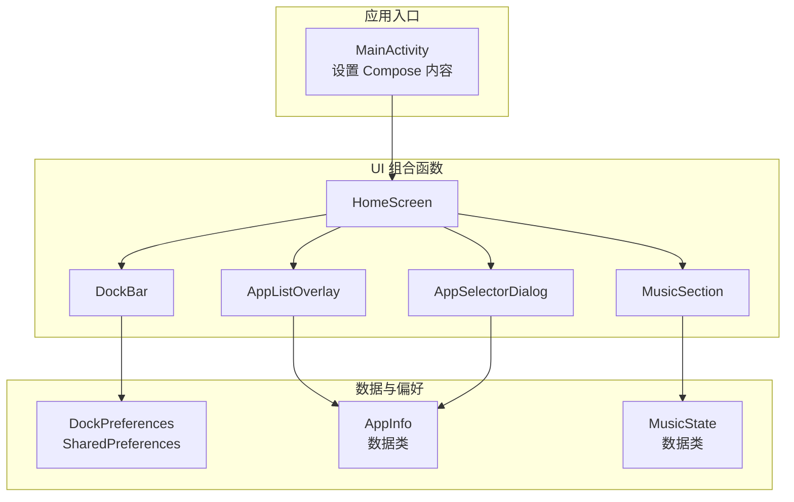
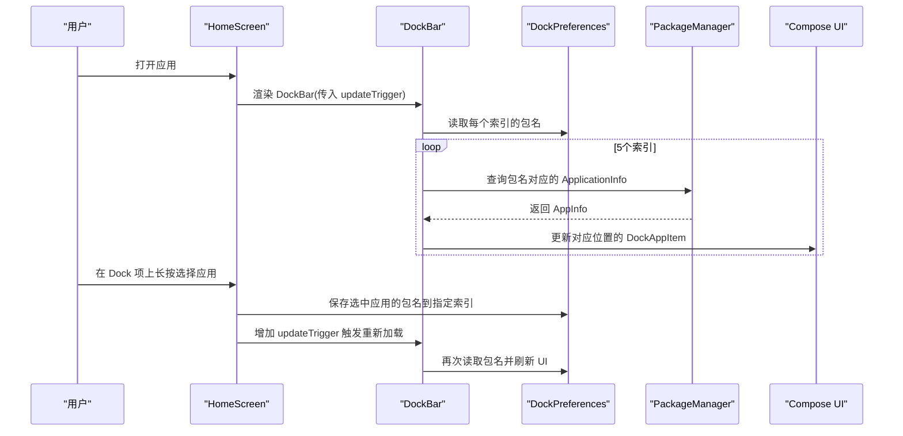
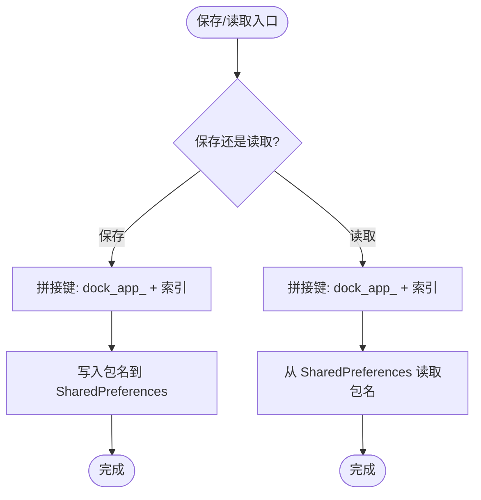
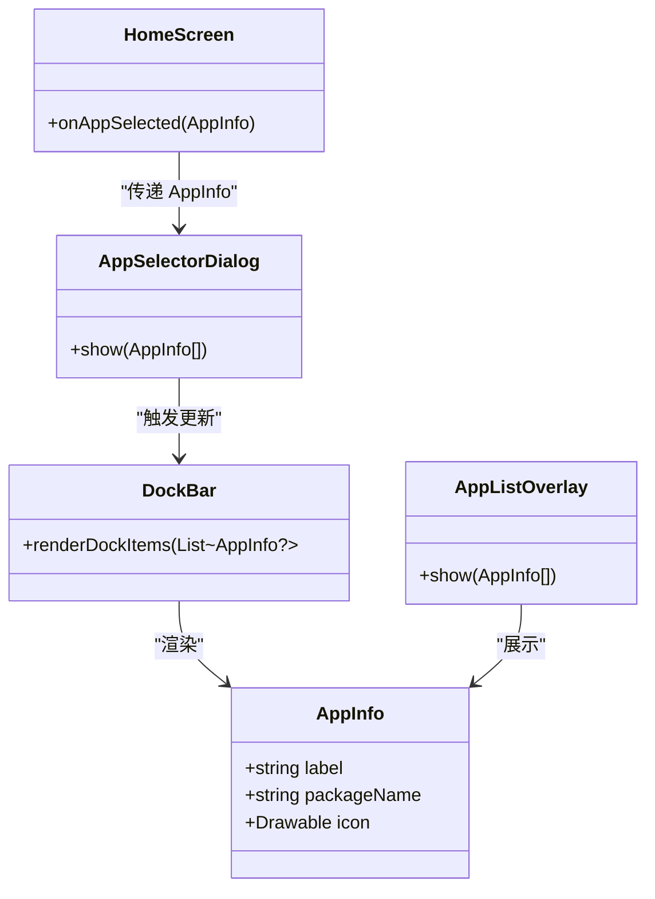
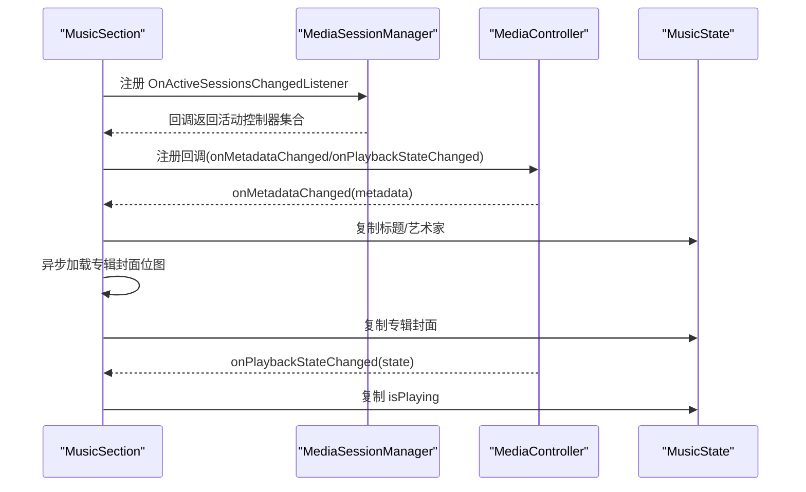
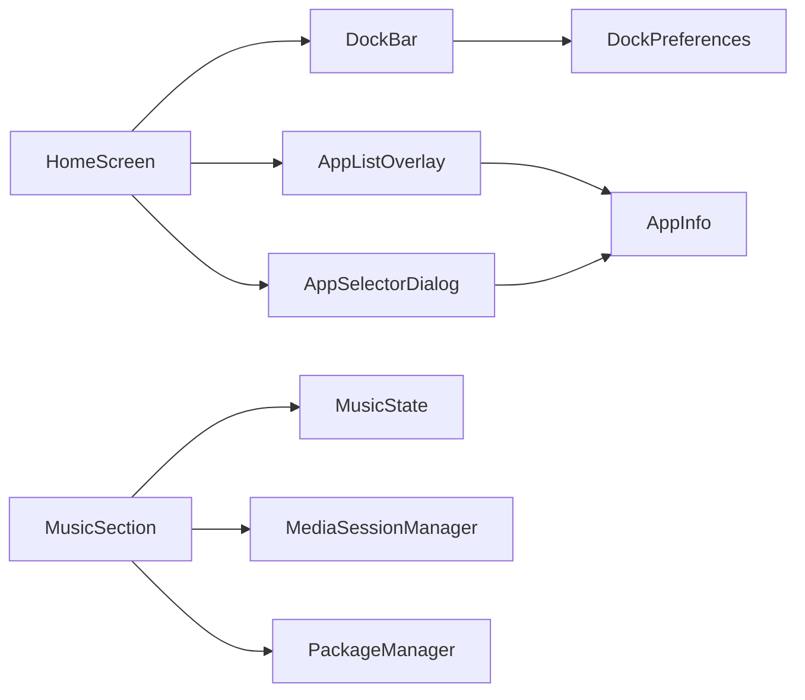

# 数据管理

<cite>
**本文引用的文件**
- [MainActivity.kt](file://app/src/main/java/com/sephp/mycarlauncher/MainActivity.kt)
- [Theme.kt](file://app/src/main/java/com/sephp/mycarlauncher/ui/theme/Theme.kt)
</cite>

## 目录
1. [简介](#简介)
2. [项目结构](#项目结构)
3. [核心组件](#核心组件)
4. [架构总览](#架构总览)
5. [组件详解](#组件详解)
6. [依赖关系分析](#依赖关系分析)
7. [性能考量](#性能考量)
8. [故障排查指南](#故障排查指南)
9. [结论](#结论)

## 简介
本文件聚焦于数据管理与持久化，围绕以下关键点展开：
- DockPreferences 对象：基于 SharedPreferences 的 Dock 栏应用配置存储方案，包括键值设计、读写流程与持久化机制。
- AppInfo 数据类：应用信息结构及在应用列表中的传递方式。
- MusicState 数据模型：音乐播放状态的数据结构及其在 UI 组件间的流动方式。
- 数据访问最佳实践与线程安全考虑：如何在 Compose 中正确使用 remember、LaunchedEffect、withContext 等以保证性能与一致性。

## 项目结构
本项目采用 Compose 驱动的界面组织方式，数据层与 UI 层通过 Compose 的状态机制进行解耦。DockPreferences 作为轻量级配置存储，AppInfo 作为应用信息载体，MusicState 作为音乐播放状态的不可变数据模型。

图表来源
- [MainActivity.kt](file://app/src/main/java/com/sephp/mycarlauncher/MainActivity.kt#L64-L118)
- [MainActivity.kt](file://app/src/main/java/com/sephp/mycarlauncher/MainActivity.kt#L136-L206)
- [MainActivity.kt](file://app/src/main/java/com/sephp/mycarlauncher/MainActivity.kt#L236-L351)
- [MainActivity.kt](file://app/src/main/java/com/sephp/mycarlauncher/MainActivity.kt#L388-L463)
- [MainActivity.kt](file://app/src/main/java/com/sephp/mycarlauncher/MainActivity.kt#L440-L445)

章节来源
- [MainActivity.kt](file://app/src/main/java/com/sephp/mycarlauncher/MainActivity.kt#L64-L118)
- [MainActivity.kt](file://app/src/main/java/com/sephp/mycarlauncher/MainActivity.kt#L136-L206)
- [MainActivity.kt](file://app/src/main/java/com/sephp/mycarlauncher/MainActivity.kt#L236-L351)
- [MainActivity.kt](file://app/src/main/java/com/sephp/mycarlauncher/MainActivity.kt#L388-L463)
- [MainActivity.kt](file://app/src/main/java/com/sephp/mycarlauncher/MainActivity.kt#L440-L445)

## 核心组件
- DockPreferences：封装对 SharedPreferences 的访问，提供保存与读取 Dock 应用索引到包名的映射。
- AppInfo：不可变数据类，承载应用标签、包名与图标等信息。
- MusicState：不可变数据类，承载当前音乐标题、艺术家、专辑封面位图与播放状态。

章节来源
- [MainActivity.kt](file://app/src/main/java/com/sephp/mycarlauncher/MainActivity.kt#L440-L445)
- [MainActivity.kt](file://app/src/main/java/com/sephp/mycarlauncher/MainActivity.kt#L246-L251)
- [MainActivity.kt](file://app/src/main/java/com/sephp/mycarlauncher/MainActivity.kt#L420-L421)

## 架构总览
下图展示从用户交互到数据持久化与 UI 更新的整体流程，包括 Dock 应用选择、配置保存、UI 刷新与音乐状态更新。

图表来源
- [MainActivity.kt](file://app/src/main/java/com/sephp/mycarlauncher/MainActivity.kt#L76-L118)
- [MainActivity.kt](file://app/src/main/java/com/sephp/mycarlauncher/MainActivity.kt#L136-L206)
- [MainActivity.kt](file://app/src/main/java/com/sephp/mycarlauncher/MainActivity.kt#L440-L445)

## 组件详解

### DockPreferences：SharedPreferences 配置存储
- 键值设计
  - 使用统一前缀与索引组合形成键：例如“dock_app_0”、“dock_app_1”…“dock_app_4”，分别对应 Dock 栏的 5 个槽位。
  - 值为应用包名字符串，便于后续通过 PackageManager 解析出应用信息。
- 读写操作
  - 读取：根据索引拼接键后从 SharedPreferences 获取字符串包名；若不存在返回空。
  - 保存：将包名写入对应键，使用 edit 操作提交。
- 数据持久化机制
  - 通过 Context.MODE_PRIVATE 访问私有偏好文件，确保数据隔离。
  - 保存后立即生效，下次启动或触发更新时可直接读取。
- 更新触发
  - 当用户更换 Dock 应用时，HomeScreen 会增加一个整型触发器，从而让 DockBar 重新加载应用列表，避免 UI 缓存导致的不一致。

图表来源
- [MainActivity.kt](file://app/src/main/java/com/sephp/mycarlauncher/MainActivity.kt#L440-L445)

章节来源
- [MainActivity.kt](file://app/src/main/java/com/sephp/mycarlauncher/MainActivity.kt#L76-L118)
- [MainActivity.kt](file://app/src/main/java/com/sephp/mycarlauncher/MainActivity.kt#L136-L206)
- [MainActivity.kt](file://app/src/main/java/com/sephp/mycarlauncher/MainActivity.kt#L440-L445)

### AppInfo：应用信息数据模型与传递
- 结构
  - 字段包含应用标签、包名与图标（可空），用于 UI 展示与启动应用。
- 传递方式
  - 应用列表与选择器通过 Compose 的参数将 AppInfo 传递给 UI 组件，点击后调用启动逻辑。
  - DockBar 在加载时将 AppInfo 列表渲染为 DockAppItem，支持点击启动或长按更换应用。
- 列表构建
  - 通过查询系统启动器 Intent 获取已安装应用，并转换为 AppInfo 列表，排序后供 UI 使用。

图表来源
- [MainActivity.kt](file://app/src/main/java/com/sephp/mycarlauncher/MainActivity.kt#L420-L421)
- [MainActivity.kt](file://app/src/main/java/com/sephp/mycarlauncher/MainActivity.kt#L388-L405)
- [MainActivity.kt](file://app/src/main/java/com/sephp/mycarlauncher/MainActivity.kt#L447-L463)
- [MainActivity.kt](file://app/src/main/java/com/sephp/mycarlauncher/MainActivity.kt#L136-L206)

章节来源
- [MainActivity.kt](file://app/src/main/java/com/sephp/mycarlauncher/MainActivity.kt#L420-L421)
- [MainActivity.kt](file://app/src/main/java/com/sephp/mycarlauncher/MainActivity.kt#L388-L405)
- [MainActivity.kt](file://app/src/main/java/com/sephp/mycarlauncher/MainActivity.kt#L447-L463)
- [MainActivity.kt](file://app/src/main/java/com/sephp/mycarlauncher/MainActivity.kt#L136-L206)

### MusicState：音乐播放状态模型与 UI 流动
- 数据模型
  - 包含标题、艺术家、专辑封面位图与播放状态布尔值，均提供默认值，保证 UI 初始化时的健壮性。
- 数据来源与更新
  - 通过 MediaSessionManager 获取活动的媒体控制器，注册回调监听元数据变化与播放状态变化。
  - 元数据变化时异步加载专辑封面位图，完成后复制到新的 MusicState 并更新 UI。
  - 播放状态变化时直接更新 isPlaying。
- 权限提示
  - 若未启用通知访问权限，会弹出提示并引导用户前往设置开启。

图表来源
- [MainActivity.kt](file://app/src/main/java/com/sephp/mycarlauncher/MainActivity.kt#L236-L351)

章节来源
- [MainActivity.kt](file://app/src/main/java/com/sephp/mycarlauncher/MainActivity.kt#L246-L251)
- [MainActivity.kt](file://app/src/main/java/com/sephp/mycarlauncher/MainActivity.kt#L253-L351)

## 依赖关系分析
- 组件耦合
  - DockBar 依赖 DockPreferences 进行配置读取；HomeScreen 通过 updateTrigger 控制 DockBar 的刷新，降低耦合度。
  - AppListOverlay 与 AppSelectorDialog 依赖 AppInfo 列表进行展示与选择。
  - MusicSection 依赖系统媒体会话服务与权限状态，通过回调驱动 UI 更新。
- 外部依赖
  - SharedPreferences：用于轻量配置持久化。
  - PackageManager：用于解析应用信息。
  - MediaSessionManager：用于获取媒体控制器并监听播放状态。
- 可能的循环依赖
  - 无明显循环依赖；各模块职责清晰，数据单向流动。

图表来源
- [MainActivity.kt](file://app/src/main/java/com/sephp/mycarlauncher/MainActivity.kt#L76-L118)
- [MainActivity.kt](file://app/src/main/java/com/sephp/mycarlauncher/MainActivity.kt#L136-L206)
- [MainActivity.kt](file://app/src/main/java/com/sephp/mycarlauncher/MainActivity.kt#L236-L351)
- [MainActivity.kt](file://app/src/main/java/com/sephp/mycarlauncher/MainActivity.kt#L388-L463)
- [MainActivity.kt](file://app/src/main/java/com/sephp/mycarlauncher/MainActivity.kt#L440-L445)

章节来源
- [MainActivity.kt](file://app/src/main/java/com/sephp/mycarlauncher/MainActivity.kt#L76-L118)
- [MainActivity.kt](file://app/src/main/java/com/sephp/mycarlauncher/MainActivity.kt#L136-L206)
- [MainActivity.kt](file://app/src/main/java/com/sephp/mycarlauncher/MainActivity.kt#L236-L351)
- [MainActivity.kt](file://app/src/main/java/com/sephp/mycarlauncher/MainActivity.kt#L388-L463)
- [MainActivity.kt](file://app/src/main/java/com/sephp/mycarlauncher/MainActivity.kt#L440-L445)

## 性能考量
- 线程安全与后台任务
  - 使用 withContext(Dispatchers.IO) 将包信息解析与专辑封面位图加载移至 IO 线程，避免阻塞主线程。
  - 通过 remember 与 LaunchedEffect 管理状态生命周期，减少不必要的重组与重复计算。
- 数据访问最佳实践
  - 使用 remember(updateTrigger) 仅在必要时重建 DockApps 列表，避免每次重组都执行昂贵的包查询。
  - 使用 LaunchedEffect 监听 currentMetadata 变化，异步加载位图后再更新 UI，避免同步阻塞。
  - 使用 edit 提交 SharedPreferences 修改，确保一次性写入。
- UI 与数据一致性
  - 通过不可变数据类（AppInfo、MusicState）与 Compose 状态机制，保证 UI 与数据的一致性与可预测性。
  - DockBar 的 updateTrigger 机制确保配置变更后 UI 即时刷新，避免缓存导致的陈旧数据。

章节来源
- [MainActivity.kt](file://app/src/main/java/com/sephp/mycarlauncher/MainActivity.kt#L145-L166)
- [MainActivity.kt](file://app/src/main/java/com/sephp/mycarlauncher/MainActivity.kt#L260-L269)
- [MainActivity.kt](file://app/src/main/java/com/sephp/mycarlauncher/MainActivity.kt#L440-L445)

## 故障排查指南
- Dock 应用未显示或显示异常
  - 检查 DockPreferences 是否成功保存包名到对应索引键。
  - 确认 updateTrigger 是否递增以触发 DockBar 重新加载。
  - 排查 PackageManager 是否能解析该包名对应的 ApplicationInfo。
- 音乐信息不显示
  - 确认已授予通知访问权限；若未授予，会弹出提示并跳转设置页面。
  - 检查 MediaSessionManager 是否能获取到活动控制器；若为空，MusicState 将回退到默认值。
  - 确认回调是否注册成功，onMetadataChanged 与 onPlaybackStateChanged 是否被调用。
- 图标或封面加载失败
  - AlbumArt 加载可能抛出异常，需捕获并回退到默认占位图。
  - 确保包名有效且应用存在，避免解析异常导致的空值。

章节来源
- [MainActivity.kt](file://app/src/main/java/com/sephp/mycarlauncher/MainActivity.kt#L76-L118)
- [MainActivity.kt](file://app/src/main/java/com/sephp/mycarlauncher/MainActivity.kt#L136-L206)
- [MainActivity.kt](file://app/src/main/java/com/sephp/mycarlauncher/MainActivity.kt#L236-L351)
- [MainActivity.kt](file://app/src/main/java/com/sephp/mycarlauncher/MainActivity.kt#L377-L386)

## 结论
本项目通过轻量的 DockPreferences 实现 Dock 栏应用配置的持久化，结合 Compose 的状态与协程机制，实现了高效、线程安全且易于维护的数据管理方案。AppInfo 与 MusicState 作为不可变数据模型，配合系统服务与回调，确保了 UI 的实时更新与一致性。建议在后续迭代中：
- 为 DockPreferences 增加更完善的错误处理与日志记录。
- 考虑引入更高级的数据持久化方案（如 Room）以支持复杂场景。
- 对音乐状态的封面加载增加缓存策略，提升性能与用户体验。