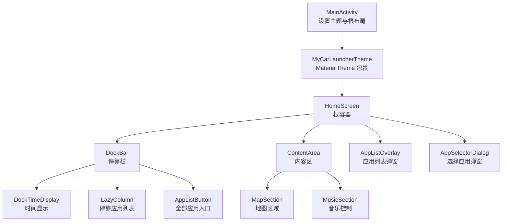
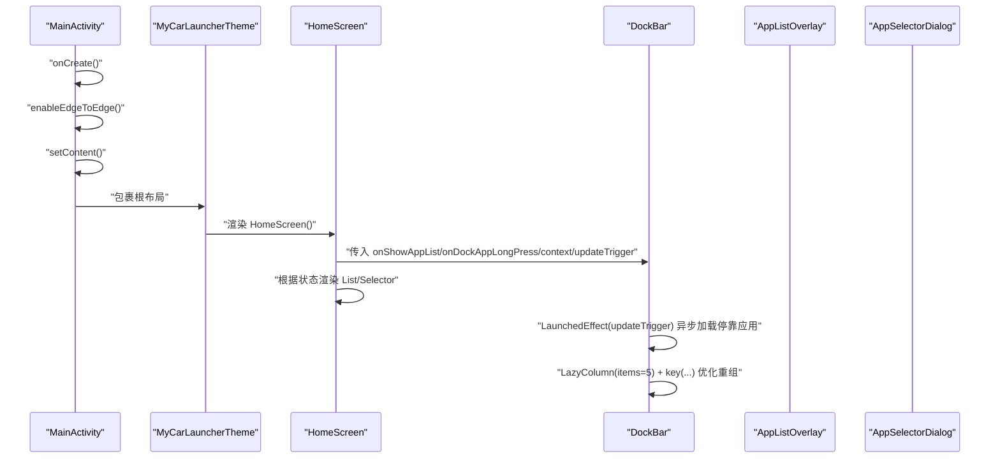
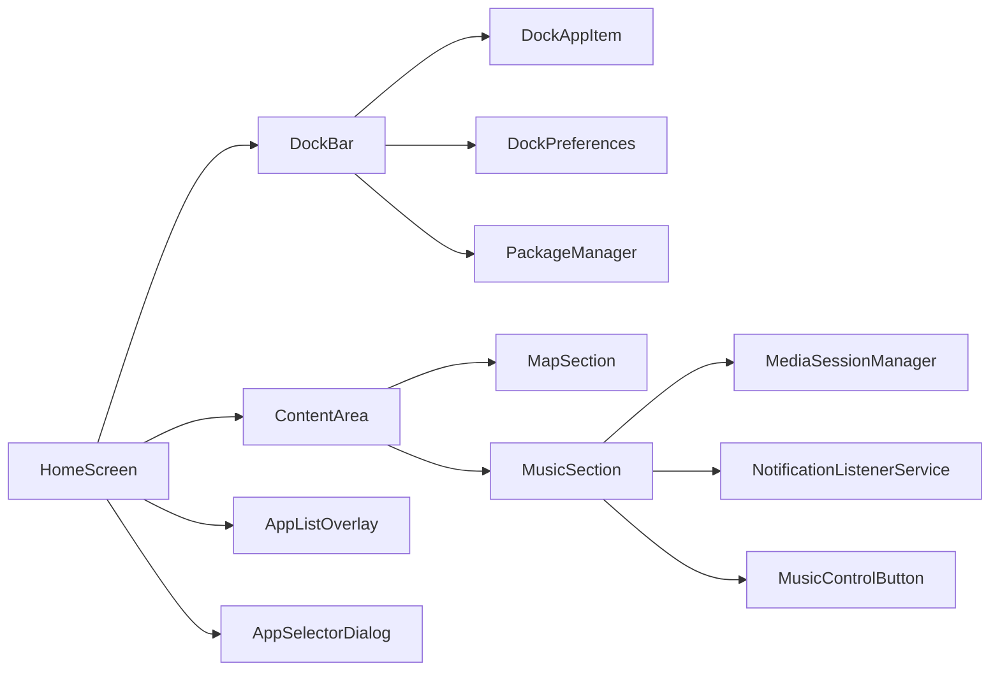
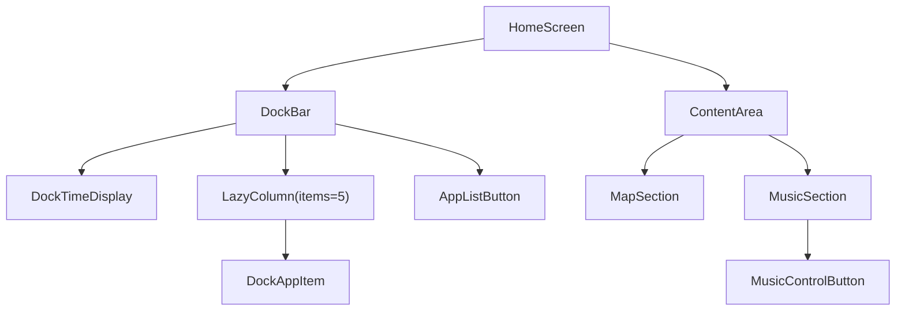

# UI架构

<cite>
**本文引用的文件**
- [MainActivity.kt](file://app/src/main/java/com/sephp/mycarlauncher/MainActivity.kt)
- [Theme.kt](file://app/src/main/java/com/sephp/mycarlauncher/ui/theme/Theme.kt)
- [Color.kt](file://app/src/main/java/com/sephp/mycarlauncher/ui/theme/Color.kt)
- [Type.kt](file://app/src/main/java/com/sephp/mycarlauncher/ui/theme/Type.kt)
</cite>

## 目录
1. [简介](#简介)
2. [项目结构](#项目结构)
3. [核心组件](#核心组件)
4. [架构总览](#架构总览)
5. [组件详解](#组件详解)
6. [依赖关系分析](#依赖关系分析)
7. [性能考量](#性能考量)
8. [故障排查指南](#故障排查指南)
9. [结论](#结论)
10. [附录](#附录)

## 简介
本文件系统性梳理 MyCarLauncher 基于 Jetpack Compose 的声明式 UI 架构，围绕 MainActivity 的 setContent 入口，深入解析 HomeScreen 根布局如何组织 DockBar（停靠栏）与 ContentArea（内容区）两大区域；阐明 Box、Row、Column 等布局容器的嵌套关系；解释 LazyColumn 在 Dock 栏中的性能优化策略；梳理 UI 组件间回调链路（如 onShowAppList、onDockAppLongPress 等）；结合 key() 函数在列表重组中的优化策略与 Modifier 链式调用的布局控制方式，提供组件树结构图，帮助开发者快速理解从根视图到叶子节点的完整 UI 层级。

## 项目结构
- 应用入口：MainActivity 中通过 setContent 设置根主题与 HomeScreen。
- 主题层：ui/theme 提供颜色、字体与 MaterialTheme 包装，统一全局视觉风格。
- UI 层：HomeScreen 作为根容器，内部包含 DockBar 与 ContentArea；ContentArea 下包含 MapSection 与 MusicSection；DockBar 内部包含 DockTimeDisplay、LazyColumn 列表与“全部应用”入口；AppListOverlay 与 AppSelectorDialog 为弹窗层。

图表来源
- [MainActivity.kt](file://app/src/main/java/com/sephp/mycarlauncher/MainActivity.kt#L64-L118)
- [Theme.kt](file://app/src/main/java/com/sephp/mycarlauncher/ui/theme/Theme.kt#L36-L58)

章节来源
- [MainActivity.kt](file://app/src/main/java/com/sephp/mycarlauncher/MainActivity.kt#L64-L118)
- [Theme.kt](file://app/src/main/java/com/sephp/mycarlauncher/ui/theme/Theme.kt#L36-L58)

## 核心组件
- HomeScreen：应用根布局，采用 Box 容器承载 Row，左侧 DockBar，右侧 ContentArea，并根据状态渲染弹窗层。
- DockBar：垂直方向的停靠栏，顶部显示 DockTimeDisplay，中部使用 LazyColumn 渲染固定数量的应用项，底部提供“全部应用”入口。
- ContentArea：垂直分栏布局，上半部分 MapSection，下半部分 MusicSection。
- DockAppItem：停靠应用项，支持点击启动与长按选择替换。
- AppListOverlay/AppSelectorDialog：弹窗层，分别用于展示全部应用与选择停靠应用。

章节来源
- [MainActivity.kt](file://app/src/main/java/com/sephp/mycarlauncher/MainActivity.kt#L76-L206)
- [MainActivity.kt](file://app/src/main/java/com/sephp/mycarlauncher/MainActivity.kt#L228-L463)

## 架构总览
从入口到根视图再到叶子节点的调用链如下：
- MainActivity.onCreate -> enableEdgeToEdge -> setContent -> MyCarLauncherTheme -> HomeScreen
- HomeScreen 内部 Row 水平排列 DockBar 与 ContentArea；根据状态条件渲染 AppListOverlay 与 AppSelectorDialog。
- DockBar 使用 LazyColumn 渲染 5 个停靠位，配合 key() 与 remember(updateTrigger) 控制重组与异步加载。
- ContentArea 内部 MapSection 与 MusicSection 平分高度，MusicSection 通过 MediaSessionManager 获取音乐元数据并驱动 UI 更新。

图表来源
- [MainActivity.kt](file://app/src/main/java/com/sephp/mycarlauncher/MainActivity.kt#L64-L118)
- [MainActivity.kt](file://app/src/main/java/com/sephp/mycarlauncher/MainActivity.kt#L136-L206)
- [MainActivity.kt](file://app/src/main/java/com/sephp/mycarlauncher/MainActivity.kt#L388-L463)

## 组件详解

### HomeScreen 根布局与状态管理
- 采用 Box 承载 Row，Row 左侧 DockBar（宽度 80dp），右侧 ContentArea（带内边距）。
- 通过 remember 管理 showAppList、showAppSelector、selectedDockIndex、dockUpdateTrigger 等状态。
- 条件渲染 AppListOverlay 与 AppSelectorDialog，实现弹窗交互。
- 回调链路：
  - DockBar.onShowAppList -> HomeScreen 修改 showAppList
  - DockBar.onDockAppLongPress(index) -> HomeScreen 记录 selectedDockIndex 并打开 AppSelectorDialog
  - AppSelectorDialog.onAppSelected -> 保存停靠应用至偏好，触发 dockUpdateTrigger++，刷新 DockBar

章节来源
- [MainActivity.kt](file://app/src/main/java/com/sephp/mycarlauncher/MainActivity.kt#L76-L118)

### DockBar 停靠栏
- 垂直布局：顶部 DockTimeDisplay，中部 LazyColumn 列表，底部“全部应用”入口。
- 异步加载：LaunchedEffect(updateTrigger) 在 IO 线程读取 SharedPreferences 中的停靠应用包名，再通过 PackageManager 解析 AppInfo，避免阻塞主线程。
- 性能优化：
  - remember(updateTrigger) 限定状态范围，仅当 updateTrigger 变化时重建列表状态。
  - LazyColumn(items=5) + key(app?.packageName ?: "empty_$index) 确保列表项稳定标识，减少重组成本。
- 交互：
  - DockAppItem 支持 combinedClickable：无应用占位时长按触发 onDockAppLongPress，有应用时点击启动。
  - “全部应用”入口触发 onShowAppList。

章节来源
- [MainActivity.kt](file://app/src/main/java/com/sephp/mycarlauncher/MainActivity.kt#L136-L206)
- [MainActivity.kt](file://app/src/main/java/com/sephp/mycarlauncher/MainActivity.kt#L208-L226)

### DockAppItem 应用项
- 使用 Box + clip + combinedClickable 实现点击与长按双击。
- 有图标则绘制应用图标，否则显示“+”占位符。
- 通过 Modifier 链式调用控制尺寸、圆角、点击行为与内容对齐。

章节来源
- [MainActivity.kt](file://app/src/main/java/com/sephp/mycarlauncher/MainActivity.kt#L208-L226)

### ContentArea 内容区
- 两列等高布局：MapSection 占上半，MusicSection 占下半。
- MapSection：简单占位文本，强调区域划分。
- MusicSection：包含专辑封面、标题/艺术家、主控按钮（上一首/播放/下一首）；通过 MediaSessionManager 与 NotificationListenerService 获取媒体信息，异步加载封面图，LaunchedEffect 触发更新。

章节来源
- [MainActivity.kt](file://app/src/main/java/com/sephp/mycarlauncher/MainActivity.kt#L228-L244)
- [MainActivity.kt](file://app/src/main/java/com/sephp/mycarlauncher/MainActivity.kt#L253-L351)

### DockTimeDisplay 时间显示
- 使用 LaunchedEffect 循环更新时间三元组，每秒刷新一次。
- 垂直居中显示时分、星期、年月日。

章节来源
- [MainActivity.kt](file://app/src/main/java/com/sephp/mycarlauncher/MainActivity.kt#L120-L134)

### 弹窗层：AppListOverlay 与 AppSelectorDialog
- AppListOverlay：全屏半透明背景，中心弹出框，网格展示全部应用，点击后启动应用并关闭弹窗。
- AppSelectorDialog：选择停靠应用的弹窗，网格展示全部应用，选中后回调 onAppSelected，写入偏好并触发 DockBar 刷新。

章节来源
- [MainActivity.kt](file://app/src/main/java/com/sephp/mycarlauncher/MainActivity.kt#L388-L405)
- [MainActivity.kt](file://app/src/main/java/com/sephp/mycarlauncher/MainActivity.kt#L447-L463)

### 主题与样式
- MyCarLauncherTheme：根据系统深色模式与动态色能力选择颜色方案，包装 MaterialTheme。
- Color.kt/Type.kt：提供基础颜色与字体样式，供主题与组件使用。

章节来源
- [Theme.kt](file://app/src/main/java/com/sephp/mycarlauncher/ui/theme/Theme.kt#L14-L58)
- [Color.kt](file://app/src/main/java/com/sephp/mycarlauncher/ui/theme/Color.kt#L1-L11)
- [Type.kt](file://app/src/main/java/com/sephp/mycarlauncher/ui/theme/Type.kt#L1-L34)

## 依赖关系分析
- 组件耦合：
  - HomeScreen 依赖 DockBar、ContentArea、AppListOverlay、AppSelectorDialog。
  - DockBar 依赖 DockPreferences、PackageManager、DockAppItem。
  - MusicSection 依赖 MediaSessionManager、NotificationListenerService、MusicControlButton。
- 外部依赖：
  - Jetpack Compose 布局与状态管理。
  - Android 系统服务（PackageManager、MediaSessionManager、Settings）。
- 关键接口契约：
  - DockBar 接收 onShowAppList、onDockAppLongPress 回调，HomeScreen 负责状态协调与持久化。
  - AppSelectorDialog 接收 onAppSelected，写入偏好并触发 DockBar 重新加载。

图表来源
- [MainActivity.kt](file://app/src/main/java/com/sephp/mycarlauncher/MainActivity.kt#L76-L206)
- [MainActivity.kt](file://app/src/main/java/com/sephp/mycarlauncher/MainActivity.kt#L228-L463)

## 性能考量
- 列表重组优化：
  - DockBar 使用 LazyColumn(items=5) + key(app?.packageName ?: "empty_$index) 稳定标识每个停靠位，避免不必要的重组。
  - remember(updateTrigger) 限定状态重建范围，仅在停靠应用变更时刷新列表状态。
- 异步加载：
  - LaunchedEffect(updateTrigger) 在 Dispatchers.IO 中加载应用信息，避免阻塞主线程。
  - MusicSection 对专辑封面进行异步加载，LaunchedEffect 响应 metadata 变化。
- 布局与绘制：
  - Modifier 链式调用控制尺寸、圆角、点击反馈与内容对齐，减少额外修饰层开销。
  - 使用权重与填充组合实现自适应布局，降低测量复杂度。

章节来源
- [MainActivity.kt](file://app/src/main/java/com/sephp/mycarlauncher/MainActivity.kt#L136-L206)
- [MainActivity.kt](file://app/src/main/java/com/sephp/mycarlauncher/MainActivity.kt#L253-L351)

## 故障排查指南
- 无法显示音乐信息：
  - 现象：音乐区域显示默认文案。
  - 排查：确认已授予通知访问权限；检查 MediaSessionManager 是否能获取到活动会话；确认回调是否注册成功。
- 停靠应用不显示或空白：
  - 现象：停靠位显示“+”占位符。
  - 排查：检查 DockPreferences 中对应索引的包名是否存在；确认 PackageManager 能正确解析应用信息；观察 updateTrigger 是否被正确递增以触发刷新。
- 弹窗无法关闭或点击无效：
  - 现象：AppListOverlay/AppSelectorDialog 点击背景无响应。
  - 排查：确认弹窗外层 Box 使用 clickable(onDismiss)；内部弹窗容器禁用点击穿透（clickable(enabled=false)）。

章节来源
- [MainActivity.kt](file://app/src/main/java/com/sephp/mycarlauncher/MainActivity.kt#L285-L322)
- [MainActivity.kt](file://app/src/main/java/com/sephp/mycarlauncher/MainActivity.kt#L388-L405)
- [MainActivity.kt](file://app/src/main/java/com/sephp/mycarlauncher/MainActivity.kt#L447-L463)

## 结论
MyCarLauncher 的 UI 架构以 HomeScreen 为根，通过 Box/Row/Column 等布局容器清晰划分 DockBar 与 ContentArea；DockBar 使用 LazyColumn 与 key() 优化停靠应用列表的重组与渲染；通过回调链路与状态管理实现弹窗交互与停靠应用的动态配置；主题层提供一致的视觉风格。整体设计遵循 Compose 的声明式与可组合原则，具备良好的扩展性与可维护性。

## 附录

### 组件树结构图（从根视图到叶子节点）

图表来源
- [MainActivity.kt](file://app/src/main/java/com/sephp/mycarlauncher/MainActivity.kt#L76-L206)
- [MainActivity.kt](file://app/src/main/java/com/sephp/mycarlauncher/MainActivity.kt#L228-L351)