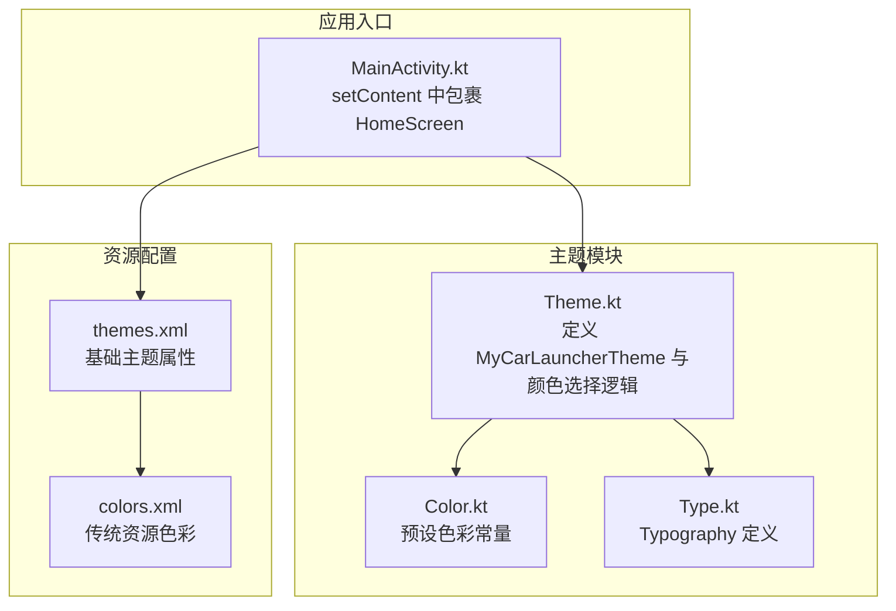
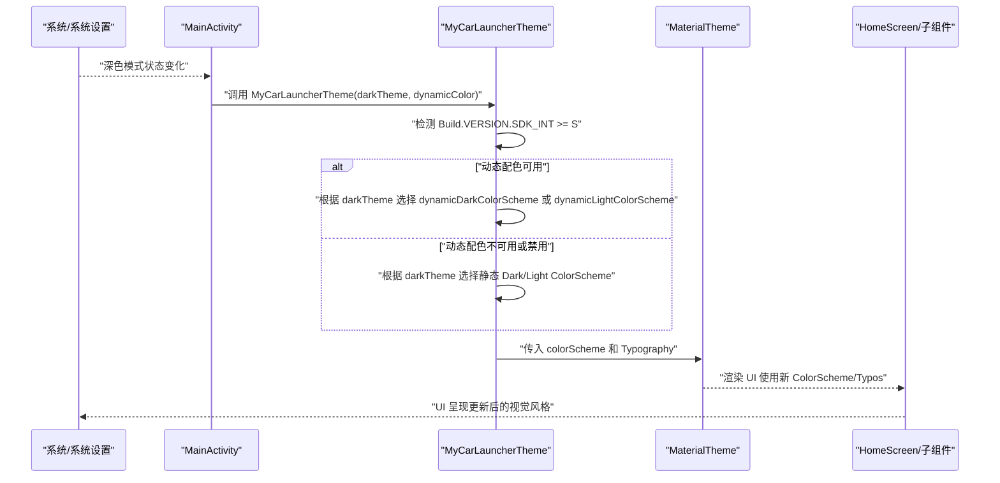
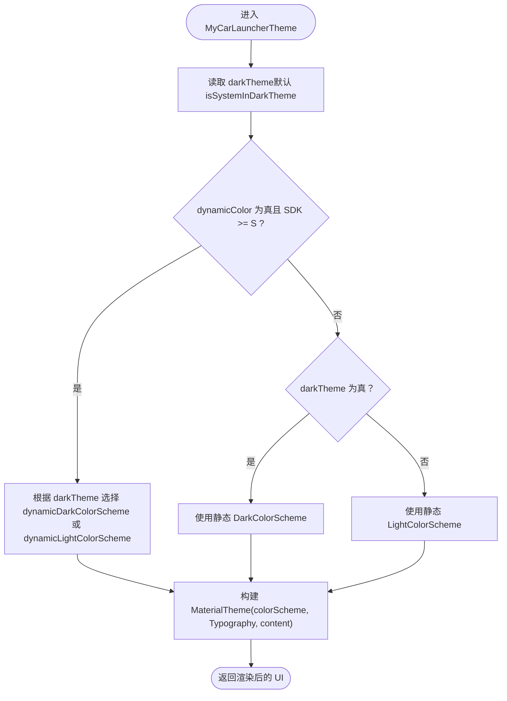
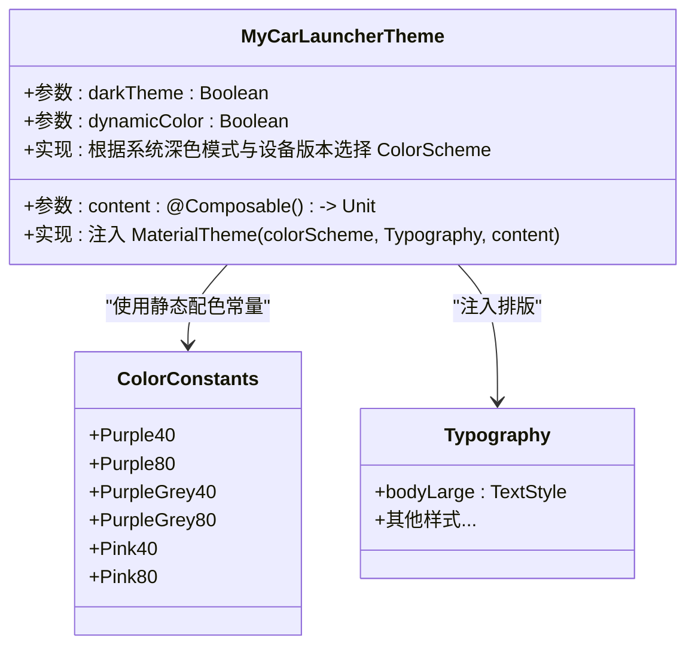
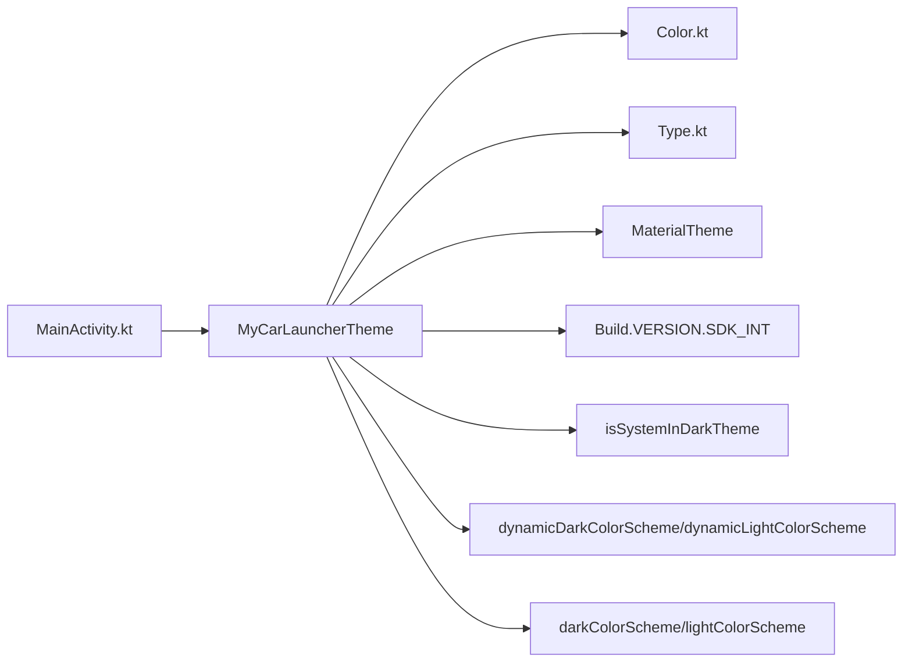

# 主题系统

<cite>
**本文引用的文件**
- [Theme.kt](file://app/src/main/java/com/sephp/mycarlauncher/ui/theme/Theme.kt)
- [Color.kt](file://app/src/main/java/com/sephp/mycarlauncher/ui/theme/Color.kt)
- [Type.kt](file://app/src/main/java/com/sephp/mycarlauncher/ui/theme/Type.kt)
- [MainActivity.kt](file://app/src/main/java/com/sephp/mycarlauncher/MainActivity.kt)
- [themes.xml](file://app/src/main/res/values/themes.xml)
- [colors.xml](file://app/src/main/res/values/colors.xml)
</cite>

## 目录
1. [简介](#简介)
2. [项目结构](#项目结构)
3. [核心组件](#核心组件)
4. [架构总览](#架构总览)
5. [详细组件分析](#详细组件分析)
6. [依赖关系分析](#依赖关系分析)
7. [性能考量](#性能考量)
8. [故障排查指南](#故障排查指南)
9. [结论](#结论)
10. [附录](#附录)

## 简介
本文件系统性解析 MyCarLauncher 的主题系统，重点围绕 MyCarLauncherTheme 可组合函数的实现机制展开，涵盖：
- darkTheme 参数如何基于系统深色模式自动适配（通过 isSystemInDarkTheme）。
- Android 12+ 动态配色（dynamicColor）的实现逻辑与回退策略。
- MaterialTheme 如何封装 ColorScheme、Typography 等设计语言元素。
- LightColorScheme 与 DarkColorScheme 的色彩定义策略。
- 主题在 HomeScreen 中的调用方式及其对整个应用 UI 的全局影响。
- 主题切换流程图：从系统环境变化到 UI 重绘的全过程。

## 项目结构
主题系统位于 ui/theme 包中，由三个核心文件组成：
- Theme.kt：定义 MyCarLauncherTheme 可组合函数及颜色方案选择逻辑。
- Color.kt：定义预设色彩常量（用于静态配色）。
- Type.kt：定义 Typography 设计语言。

此外，MainActivity.kt 负责在应用入口处包裹 HomeScreen 并应用主题；themes.xml 提供基础 Android 主题属性；colors.xml 提供传统资源色彩值。

图表来源
- [Theme.kt](file://app/src/main/java/com/sephp/mycarlauncher/ui/theme/Theme.kt#L1-L58)
- [Color.kt](file://app/src/main/java/com/sephp/mycarlauncher/ui/theme/Color.kt#L1-L11)
- [Type.kt](file://app/src/main/java/com/sephp/mycarlauncher/ui/theme/Type.kt#L1-L34)
- [MainActivity.kt](file://app/src/main/java/com/sephp/mycarlauncher/MainActivity.kt#L64-L74)
- [themes.xml](file://app/src/main/res/values/themes.xml#L1-L8)
- [colors.xml](file://app/src/main/res/values/colors.xml#L1-L10)

章节来源
- [Theme.kt](file://app/src/main/java/com/sephp/mycarlauncher/ui/theme/Theme.kt#L1-L58)
- [Color.kt](file://app/src/main/java/com/sephp/mycarlauncher/ui/theme/Color.kt#L1-L11)
- [Type.kt](file://app/src/main/java/com/sephp/mycarlauncher/ui/theme/Type.kt#L1-L34)
- [MainActivity.kt](file://app/src/main/java/com/sephp/mycarlauncher/MainActivity.kt#L64-L74)
- [themes.xml](file://app/src/main/res/values/themes.xml#L1-L8)
- [colors.xml](file://app/src/main/res/values/colors.xml#L1-L10)

## 核心组件
- MyCarLauncherTheme：可组合函数，负责根据系统深色模式与设备版本选择合适的 ColorScheme，并将 Typography 一并注入 MaterialTheme。
- 颜色常量：Purple40/Purple80、PurpleGrey40/PurpleGrey80、Pink40/Pink80，分别用于浅色/深色静态配色。
- Typography：Material3 默认排版样式集合，作为主题的一部分注入。

章节来源
- [Theme.kt](file://app/src/main/java/com/sephp/mycarlauncher/ui/theme/Theme.kt#L14-L34)
- [Color.kt](file://app/src/main/java/com/sephp/mycarlauncher/ui/theme/Color.kt#L1-L11)
- [Type.kt](file://app/src/main/java/com/sephp/mycarlauncher/ui/theme/Type.kt#L1-L34)

## 架构总览
MyCarLauncherTheme 的职责是“选择颜色方案并封装为 MaterialTheme”。其核心流程如下：
- 读取系统深色模式状态（默认使用 isSystemInDarkTheme）。
- 判断是否启用动态配色且设备版本满足 Android 12+。
- 若满足动态配色条件，则根据深色模式选择动态暗/亮配色；否则回退到静态配色（深色/浅色）。
- 将选定的 ColorScheme 与 Typography 注入 MaterialTheme，并将内容视图传递给 MaterialTheme 渲染。

图表来源
- [Theme.kt](file://app/src/main/java/com/sephp/mycarlauncher/ui/theme/Theme.kt#L36-L58)
- [MainActivity.kt](file://app/src/main/java/com/sephp/mycarlauncher/MainActivity.kt#L64-L74)

## 详细组件分析

### MyCarLauncherTheme 可组合函数
- 参数与默认值
  - darkTheme：默认值来自 isSystemInDarkTheme，用于感知系统深色模式。
  - dynamicColor：默认 true，表示允许使用 Android 12+ 的动态配色。
- 选择逻辑
  - 当 dynamicColor 为真且设备版本满足 Android 12+（SDK >= S），则使用动态暗/亮配色方案。
  - 否则回退到静态深色/浅色配色方案。
- 注入 MaterialTheme
  - 将选定的 ColorScheme 与 Typography 传入 MaterialTheme，content 作为根视图。

图表来源
- [Theme.kt](file://app/src/main/java/com/sephp/mycarlauncher/ui/theme/Theme.kt#L36-L58)

章节来源
- [Theme.kt](file://app/src/main/java/com/sephp/mycarlauncher/ui/theme/Theme.kt#L36-L58)

### 动态配色（Android 12+）实现逻辑
- 条件判断
  - dynamicColor 为真且 Build.VERSION.SDK_INT >= Build.VERSION_CODES.S。
- 选择策略
  - 若 darkTheme 为真，使用 dynamicDarkColorScheme(context)。
  - 否则使用 dynamicLightColorScheme(context)。
- 回退条件
  - 当 dynamicColor 为假或设备版本低于 Android 12+ 时，回退到静态配色方案。

章节来源
- [Theme.kt](file://app/src/main/java/com/sephp/mycarlauncher/ui/theme/Theme.kt#L43-L47)

### 静态配色方案（LightColorScheme 与 DarkColorScheme）
- 定义位置：Theme.kt 内部私有常量。
- 色彩来源：Color.kt 中的 Purple40/Purple80、PurpleGrey40/PurpleGrey80、Pink40/Pink80。
- 设计策略
  - 浅色方案：primary/secondary/tertiary 使用较深的 40 色阶，确保在浅背景上具备良好对比度。
  - 深色方案：primary/secondary/tertiary 使用较浅的 80 色阶，避免过亮导致眩光。
- 备注：Theme.kt 中还保留了其他可覆盖字段的注释，表明可按需扩展背景、表面、文本等颜色。

章节来源
- [Theme.kt](file://app/src/main/java/com/sephp/mycarlauncher/ui/theme/Theme.kt#L14-L34)
- [Color.kt](file://app/src/main/java/com/sephp/mycarlauncher/ui/theme/Color.kt#L1-L11)

### MaterialTheme 封装的设计语言元素
- ColorScheme：由动态或静态逻辑生成，决定主色、次色、强调色等。
- Typography：统一的排版风格，包含字体族、字重、字号、行高、字距等。
- Content：将主题注入到 HomeScreen 及其子组件，使整棵 Compose 树共享同一套设计语言。

章节来源
- [Theme.kt](file://app/src/main/java/com/sephp/mycarlauncher/ui/theme/Theme.kt#L53-L57)
- [Type.kt](file://app/src/main/java/com/sephp/mycarlauncher/ui/theme/Type.kt#L1-L34)

### HomeScreen 中的主题调用与全局影响
- 入口调用
  - MainActivity 在 setContent 中直接包裹 HomeScreen，并通过 MyCarLauncherTheme 应用主题。
- 全局影响
  - HomeScreen 及其子组件（如 DockBar、ContentArea、AppListOverlay 等）均继承 MaterialTheme 的 ColorScheme 与 Typography。
  - 即便部分组件在局部使用了自定义颜色（例如 DockBar 中根据 isSystemInDarkTheme 计算图标颜色），整体 UI 的主色、文本、控件等仍受 MaterialTheme 统一约束。

章节来源
- [MainActivity.kt](file://app/src/main/java/com/sephp/mycarlauncher/MainActivity.kt#L64-L74)
- [MainActivity.kt](file://app/src/main/java/com/sephp/mycarlauncher/MainActivity.kt#L136-L206)

### 类关系图（代码级）

图表来源
- [Theme.kt](file://app/src/main/java/com/sephp/mycarlauncher/ui/theme/Theme.kt#L14-L34)
- [Color.kt](file://app/src/main/java/com/sephp/mycarlauncher/ui/theme/Color.kt#L1-L11)
- [Type.kt](file://app/src/main/java/com/sephp/mycarlauncher/ui/theme/Type.kt#L1-L34)

## 依赖关系分析
- MyCarLauncherTheme 依赖
  - Android 版本判定：Build.VERSION.SDK_INT。
  - 系统深色模式：isSystemInDarkTheme。
  - 动态配色 API：dynamicDarkColorScheme/dynamicLightColorScheme。
  - 静态配色 API：darkColorScheme/lightColorScheme。
  - MaterialTheme：统一注入 ColorScheme 与 Typography。
- MainActivity 依赖
  - MyCarLauncherTheme：作为应用入口的主题容器。
  - isSystemInDarkTheme：在局部 UI 中用于图标颜色计算（非主题注入）。

图表来源
- [MainActivity.kt](file://app/src/main/java/com/sephp/mycarlauncher/MainActivity.kt#L64-L74)
- [Theme.kt](file://app/src/main/java/com/sephp/mycarlauncher/ui/theme/Theme.kt#L36-L58)
- [Color.kt](file://app/src/main/java/com/sephp/mycarlauncher/ui/theme/Color.kt#L1-L11)
- [Type.kt](file://app/src/main/java/com/sephp/mycarlauncher/ui/theme/Type.kt#L1-L34)

章节来源
- [MainActivity.kt](file://app/src/main/java/com/sephp/mycarlauncher/MainActivity.kt#L64-L74)
- [Theme.kt](file://app/src/main/java/com/sephp/mycarlauncher/ui/theme/Theme.kt#L36-L58)

## 性能考量
- 动态配色仅在 Android 12+ 且启用 dynamicColor 时生效，避免在旧设备上进行无效调用。
- 颜色方案选择逻辑为轻量分支判断，MaterialTheme 注入成本低，适合在应用入口一次性完成。
- 若需要频繁切换主题，建议保持 darkTheme 与 dynamicColor 的默认值，让系统状态驱动主题变化，减少手动刷新开销。

## 故障排查指南
- 动态配色未生效
  - 检查设备版本是否满足 Android 12+（SDK >= S）。
  - 确认 dynamicColor 参数未被显式置为 false。
  - 确认系统深色模式设置已改变，以便 darkTheme 参数正确反映。
- 静态配色不符合预期
  - 检查 Color.kt 中的预设色阶是否符合设计规范。
  - 如需扩展背景/表面/文本颜色，参考 Theme.kt 中注释的可覆盖字段。
- 局部颜色与主题不一致
  - MainActivity 中某些组件会根据 isSystemInDarkTheme 自行计算图标颜色，这属于局部 UI 逻辑，不影响 MaterialTheme 的全局注入。

章节来源
- [Theme.kt](file://app/src/main/java/com/sephp/mycarlauncher/ui/theme/Theme.kt#L36-L58)
- [MainActivity.kt](file://app/src/main/java/com/sephp/mycarlauncher/MainActivity.kt#L168-L170)

## 结论
MyCarLauncher 的主题系统以 MyCarLauncherTheme 为核心，通过简洁的条件分支实现了对系统深色模式与 Android 12+ 动态配色的无缝支持。MaterialTheme 将 ColorScheme 与 Typography 统一封装，HomeScreen 及其子组件继承该设计语言，形成全局一致的视觉体验。静态配色方案与动态配色回退逻辑保证了在不同设备与系统版本上的稳定性与兼容性。

## 附录
- 资源主题与传统色彩
  - themes.xml 提供基础主题属性（如透明背景、壁纸显示）。
  - colors.xml 提供传统资源色彩值，与 Compose 主题解耦，便于兼容旧组件或资源层使用。

章节来源
- [themes.xml](file://app/src/main/res/values/themes.xml#L1-L8)
- [colors.xml](file://app/src/main/res/values/colors.xml#L1-L10)