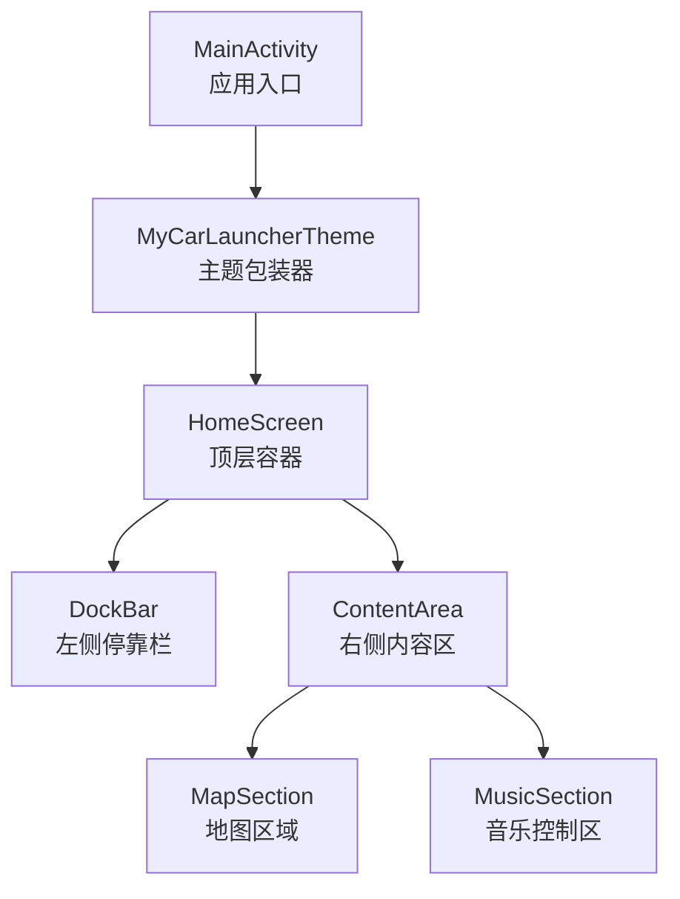
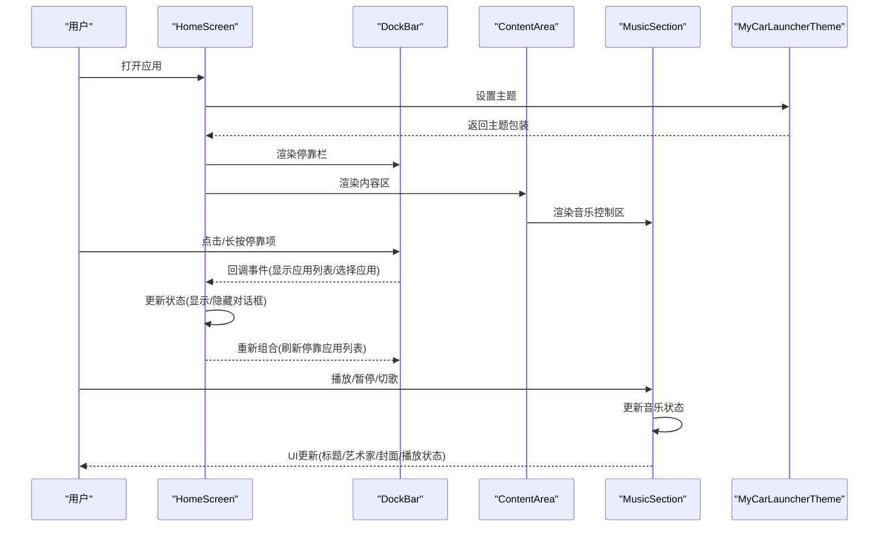
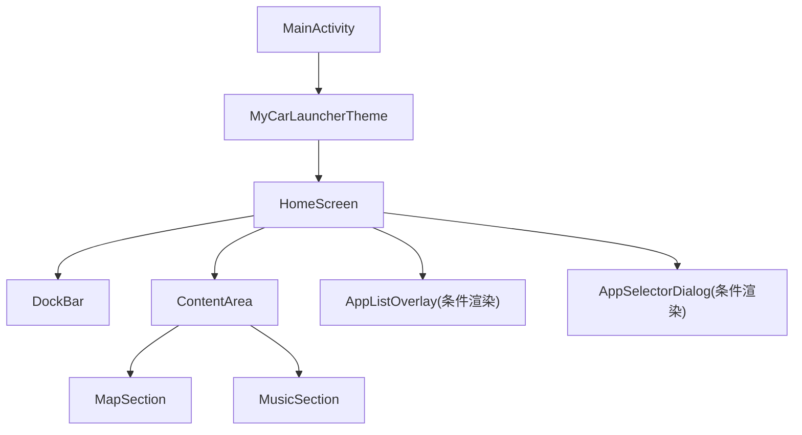
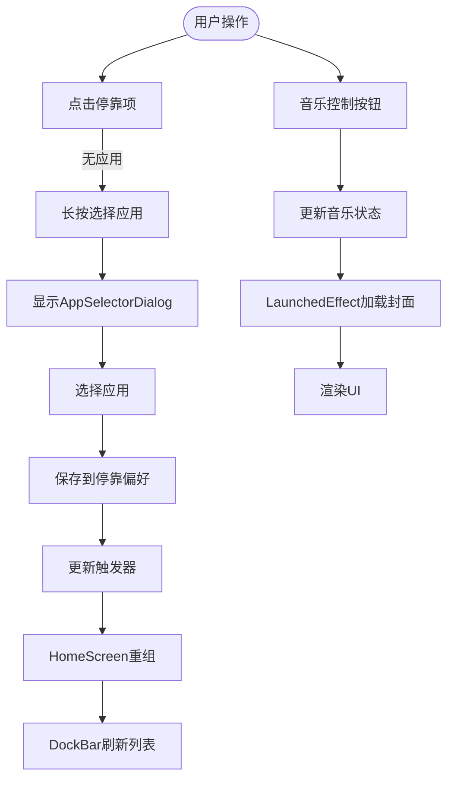
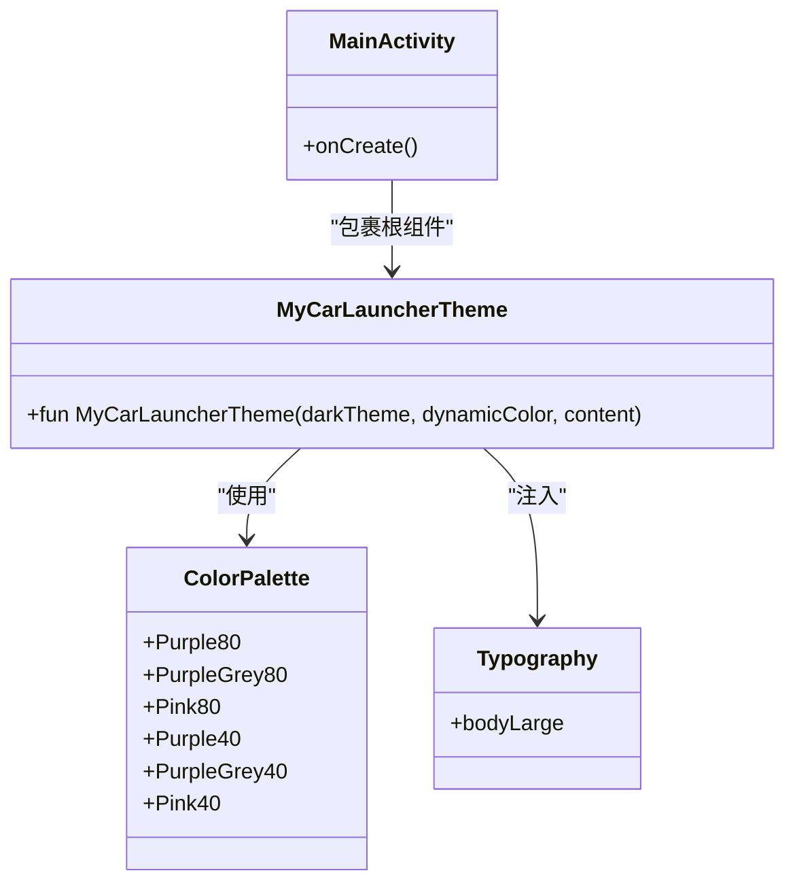
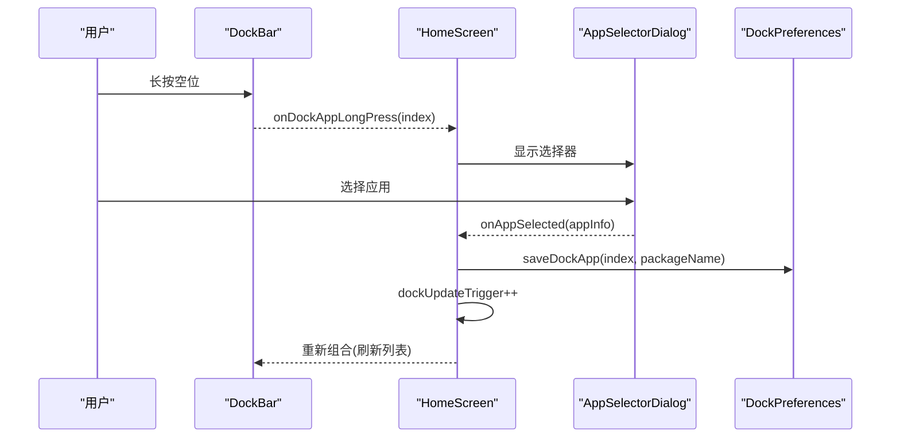
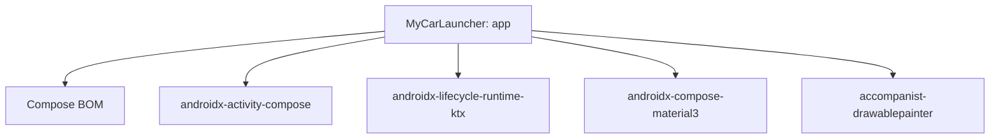

# 架构设计

<cite>
**本文引用的文件**
- [MainActivity.kt](file://app/src/main/java/com/sephp/mycarlauncher/MainActivity.kt)
- [Theme.kt](file://app/src/main/java/com/sephp/mycarlauncher/ui/theme/Theme.kt)
- [Color.kt](file://app/src/main/java/com/sephp/mycarlauncher/ui/theme/Color.kt)
- [Type.kt](file://app/src/main/java/com/sephp/mycarlauncher/ui/theme/Type.kt)
- [build.gradle.kts](file://app/build.gradle.kts)
- [settings.gradle.kts](file://settings.gradle.kts)
- [gradle/libs.versions.toml](file://gradle/libs.versions.toml)
</cite>

## 目录
1. [简介](#简介)
2. [项目结构](#项目结构)
3. [核心组件](#核心组件)
4. [架构总览](#架构总览)
5. [组件详细分析](#组件详细分析)
6. [依赖关系分析](#依赖关系分析)
7. [性能考量](#性能考量)
8. [故障排查指南](#故障排查指南)
9. [结论](#结论)

## 简介
本架构文档聚焦于MyCarLauncher的Jetpack Compose声明式UI架构，围绕MainActivity作为根节点，系统性梳理HomeScreen、DockBar、ContentArea等主要UI组件的层次关系与职责边界；阐释单向数据流在组件间的状态与事件传递机制，以及mutableStateOf如何驱动UI更新；解析主题系统MyCarLauncherTheme的实现与Material Design 3集成方式；并提供组件交互图，展示用户操作如何通过回调链影响应用状态。

## 项目结构
- 应用入口：MainActivity负责启用边缘到边缘显示并设置Compose内容，将根主题包装器与HomeScreen组合为根组件。
- 主题层：ui/theme目录下包含颜色、类型与主题装配逻辑，统一提供Material 3色彩方案与排版。
- UI层：HomeScreen作为顶层容器，组织DockBar与ContentArea两大区域；ContentArea进一步拆分为MapSection与MusicSection两个子区域。
- 音乐控制：通过MediaSessionManager与MediaController监听媒体会话变化，并使用LaunchedEffect与DisposableEffect管理异步加载与生命周期。

图表来源
- [MainActivity.kt](file://app/src/main/java/com/sephp/mycarlauncher/MainActivity.kt#L64-L74)
- [Theme.kt](file://app/src/main/java/com/sephp/mycarlauncher/ui/theme/Theme.kt#L36-L58)

章节来源
- [MainActivity.kt](file://app/src/main/java/com/sephp/mycarlauncher/MainActivity.kt#L64-L74)
- [Theme.kt](file://app/src/main/java/com/sephp/mycarlauncher/ui/theme/Theme.kt#L36-L58)

## 核心组件
- MainActivity：继承自ComponentActivity，启用边缘到边缘显示，调用setContent设置Compose内容，将MyCarLauncherTheme作为根主题包装器，内部渲染HomeScreen。
- HomeScreen：顶层容器，持有多个可变状态（如是否显示应用列表、是否显示应用选择器、选中的停靠索引、停靠应用更新触发器），协调DockBar与ContentArea的布局与交互。
- DockBar：左侧停靠栏，支持时间显示、垂直排列的5个停靠项、长按替换应用、点击打开“全部应用”列表。
- ContentArea：右侧内容区，采用两列等高布局，包含MapSection与MusicSection。
- MusicSection：音乐控制区，异步加载专辑封面，监听媒体会话元数据与播放状态，提供上一首/主控播放/下一首控制按钮。
- MyCarLauncherTheme：主题装配器，根据系统深色模式与设备版本动态选择Material 3色彩方案，并注入Typography。

章节来源
- [MainActivity.kt](file://app/src/main/java/com/sephp/mycarlauncher/MainActivity.kt#L64-L74)
- [MainActivity.kt](file://app/src/main/java/com/sephp/mycarlauncher/MainActivity.kt#L76-L118)
- [MainActivity.kt](file://app/src/main/java/com/sephp/mycarlauncher/MainActivity.kt#L136-L206)
- [MainActivity.kt](file://app/src/main/java/com/sephp/mycarlauncher/MainActivity.kt#L228-L244)
- [MainActivity.kt](file://app/src/main/java/com/sephp/mycarlauncher/MainActivity.kt#L246-L351)
- [Theme.kt](file://app/src/main/java/com/sephp/mycarlauncher/ui/theme/Theme.kt#L36-L58)

## 架构总览
MyCarLauncher采用单向数据流的声明式UI架构：
- 数据源：各Composable内部通过remember/mutableStateOf维护局部状态；跨组件共享通过回调向上游传递事件，上游状态变更后重新组合。
- 更新机制：mutableStateOf变更触发重组，Compose根据不可变状态计算最小化UI变更，完成渲染。
- 主题系统：MyCarLauncherTheme基于Material 3，支持动态色彩（Android 12+），并注入Typography。

图表来源
- [MainActivity.kt](file://app/src/main/java/com/sephp/mycarlauncher/MainActivity.kt#L64-L74)
- [MainActivity.kt](file://app/src/main/java/com/sephp/mycarlauncher/MainActivity.kt#L76-L118)
- [MainActivity.kt](file://app/src/main/java/com/sephp/mycarlauncher/MainActivity.kt#L136-L206)
- [MainActivity.kt](file://app/src/main/java/com/sephp/mycarlauncher/MainActivity.kt#L228-L351)
- [Theme.kt](file://app/src/main/java/com/sephp/mycarlauncher/ui/theme/Theme.kt#L36-L58)

## 组件详细分析

### 组件树与层次关系
- 根节点：MainActivity
- 主题包装：MyCarLauncherTheme
- 顶层容器：HomeScreen
  - 左侧停靠栏：DockBar
  - 右侧内容区：ContentArea
    - 地图区域：MapSection
    - 音乐控制：MusicSection
- 对话框：AppListOverlay、AppSelectorDialog

图表来源
- [MainActivity.kt](file://app/src/main/java/com/sephp/mycarlauncher/MainActivity.kt#L64-L74)
- [MainActivity.kt](file://app/src/main/java/com/sephp/mycarlauncher/MainActivity.kt#L76-L118)
- [MainActivity.kt](file://app/src/main/java/com/sephp/mycarlauncher/MainActivity.kt#L228-L351)

章节来源
- [MainActivity.kt](file://app/src/main/java/com/sephp/mycarlauncher/MainActivity.kt#L64-L74)
- [MainActivity.kt](file://app/src/main/java/com/sephp/mycarlauncher/MainActivity.kt#L76-L118)
- [MainActivity.kt](file://app/src/main/java/com/sephp/mycarlauncher/MainActivity.kt#L228-L351)

### 单向数据流与状态更新
- 局部状态：HomeScreen通过remember/mutableStateOf维护显示/隐藏状态与选中索引；DockBar通过updateTrigger与remember的键值实现列表刷新。
- 事件回传：DockBar通过回调向上游传递“显示应用列表”和“长按选择应用”的事件；HomeScreen在收到事件后更新状态并触发重组。
- 异步更新：MusicSection使用LaunchedEffect监听元数据变化，withContext在IO线程加载专辑封面，完成后复制到MusicState，触发UI更新。
- 生命周期管理：使用DisposableEffect注册媒体会话监听器，在卸载时移除监听，避免泄漏。

图表来源
- [MainActivity.kt](file://app/src/main/java/com/sephp/mycarlauncher/MainActivity.kt#L76-L118)
- [MainActivity.kt](file://app/src/main/java/com/sephp/mycarlauncher/MainActivity.kt#L136-L206)
- [MainActivity.kt](file://app/src/main/java/com/sephp/mycarlauncher/MainActivity.kt#L246-L351)

章节来源
- [MainActivity.kt](file://app/src/main/java/com/sephp/mycarlauncher/MainActivity.kt#L76-L118)
- [MainActivity.kt](file://app/src/main/java/com/sephp/mycarlauncher/MainActivity.kt#L136-L206)
- [MainActivity.kt](file://app/src/main/java/com/sephp/mycarlauncher/MainActivity.kt#L246-L351)

### 主题系统与Material Design 3集成
- 色彩方案：定义深色与浅色基础色板，支持Android 12+动态色彩方案（动态暗/亮）。
- 排版：通过Typography提供默认文本样式，可扩展覆盖其他样式。
- 注入与使用：MyCarLauncherTheme根据系统深色模式与设备版本选择合适色彩方案，并将Typography注入MaterialTheme；MainActivity在setContent时包裹该主题。

图表来源
- [Theme.kt](file://app/src/main/java/com/sephp/mycarlauncher/ui/theme/Theme.kt#L14-L35)
- [Theme.kt](file://app/src/main/java/com/sephp/mycarlauncher/ui/theme/Theme.kt#L36-L58)
- [Color.kt](file://app/src/main/java/com/sephp/mycarlauncher/ui/theme/Color.kt#L1-L11)
- [Type.kt](file://app/src/main/java/com/sephp/mycarlauncher/ui/theme/Type.kt#L1-L34)
- [MainActivity.kt](file://app/src/main/java/com/sephp/mycarlauncher/MainActivity.kt#L64-L74)

章节来源
- [Theme.kt](file://app/src/main/java/com/sephp/mycarlauncher/ui/theme/Theme.kt#L14-L35)
- [Theme.kt](file://app/src/main/java/com/sephp/mycarlauncher/ui/theme/Theme.kt#L36-L58)
- [Color.kt](file://app/src/main/java/com/sephp/mycarlauncher/ui/theme/Color.kt#L1-L11)
- [Type.kt](file://app/src/main/java/com/sephp/mycarlauncher/ui/theme/Type.kt#L1-L34)
- [MainActivity.kt](file://app/src/main/java/com/sephp/mycarlauncher/MainActivity.kt#L64-L74)

### 组件交互图（用户操作到状态更新）
- 停靠栏交互：点击空位触发长按选择应用，选择后保存到偏好并增加触发器，HomeScreen重组后DockBar刷新列表。
- 音乐控制交互：点击播放/暂停/切歌，通过MediaController.transportControls发送命令，MediaController回调更新MusicState，LaunchedEffect加载封面后渲染。

图表来源
- [MainActivity.kt](file://app/src/main/java/com/sephp/mycarlauncher/MainActivity.kt#L76-L118)
- [MainActivity.kt](file://app/src/main/java/com/sephp/mycarlauncher/MainActivity.kt#L440-L445)
- [MainActivity.kt](file://app/src/main/java/com/sephp/mycarlauncher/MainActivity.kt#L447-L463)

章节来源
- [MainActivity.kt](file://app/src/main/java/com/sephp/mycarlauncher/MainActivity.kt#L76-L118)
- [MainActivity.kt](file://app/src/main/java/com/sephp/mycarlauncher/MainActivity.kt#L440-L445)
- [MainActivity.kt](file://app/src/main/java/com/sephp/mycarlauncher/MainActivity.kt#L447-L463)

## 依赖关系分析
- Compose生态：通过Compose BOM统一版本，引入UI、工具预览、Material3等依赖。
- Accompanist：使用accompanist-drawablepainter支持Drawable绘制。
- AndroidX：Activity Compose、Lifecycle Runtime Ktx等。
- 版本管理：libs.versions.toml集中管理版本号，确保一致性。

图表来源
- [build.gradle.kts](file://app/build.gradle.kts#L44-L65)
- [gradle/libs.versions.toml](file://gradle/libs.versions.toml#L13-L29)

章节来源
- [build.gradle.kts](file://app/build.gradle.kts#L44-L65)
- [gradle/libs.versions.toml](file://gradle/libs.versions.toml#L13-L29)
- [settings.gradle.kts](file://settings.gradle.kts#L1-L24)

## 性能考量
- 异步加载：DockBar与MusicSection均使用withContext在IO线程执行耗时任务，避免阻塞主线程。
- 记忆化与重组：remember与LaunchedEffect合理使用，减少不必要的重组与重复计算。
- 列表渲染：LazyColumn/LazyVerticalGrid按需渲染，提升滚动性能。
- 主题切换：动态色彩仅在Android 12+生效，降低旧设备兼容成本。

## 故障排查指南
- 通知访问权限：MusicSection在启动时检查通知监听权限，若未开启则提示并引导至系统设置页面。
- 媒体会话监听：通过MediaSessionManager监听活跃会话变化，注册回调并在卸载时移除，避免资源泄漏。
- 应用图标加载：DockBar与AppListOverlay加载应用图标时使用rememberDrawablePainter缓存，异常捕获避免崩溃。

章节来源
- [MainActivity.kt](file://app/src/main/java/com/sephp/mycarlauncher/MainActivity.kt#L285-L322)
- [MainActivity.kt](file://app/src/main/java/com/sephp/mycarlauncher/MainActivity.kt#L377-L381)
- [MainActivity.kt](file://app/src/main/java/com/sephp/mycarlauncher/MainActivity.kt#L146-L166)
- [MainActivity.kt](file://app/src/main/java/com/sephp/mycarlauncher/MainActivity.kt#L390-L405)

## 结论
MyCarLauncher以MainActivity为根节点，通过MyCarLauncherTheme统一主题风格，采用HomeScreen组织DockBar与ContentArea的声明式UI架构。单向数据流贯穿组件间状态与事件传递，mutableStateOf驱动UI更新；主题系统深度集成Material Design 3，支持动态色彩与Typography注入。组件交互通过回调链实现，结合LaunchedEffect与DisposableEffect保障异步与生命周期安全，整体架构清晰、可维护性强且具备良好的性能表现。