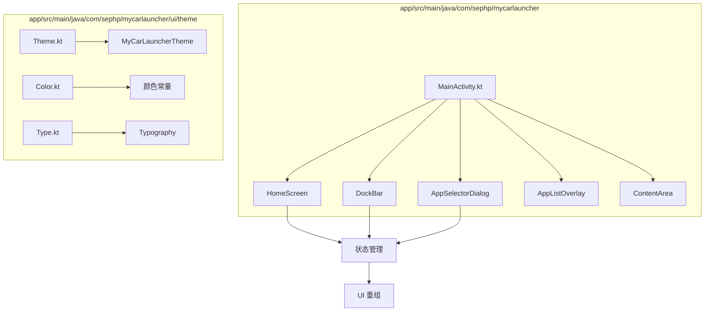
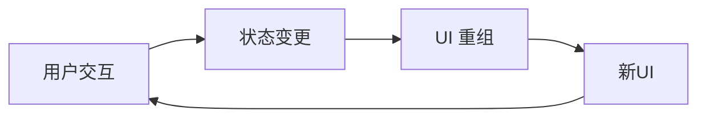
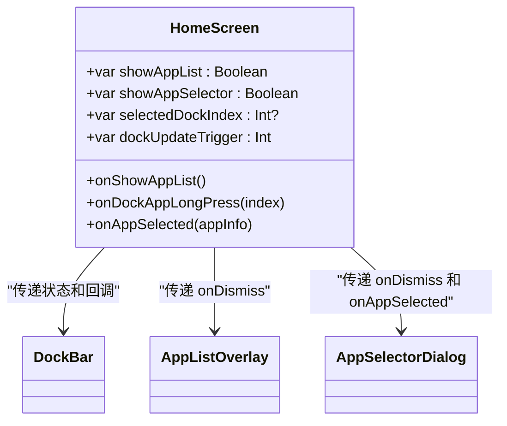
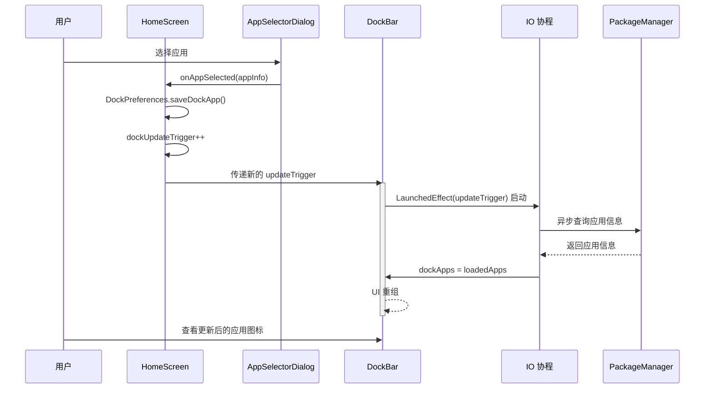
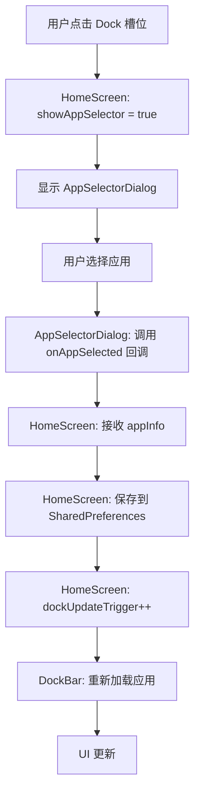
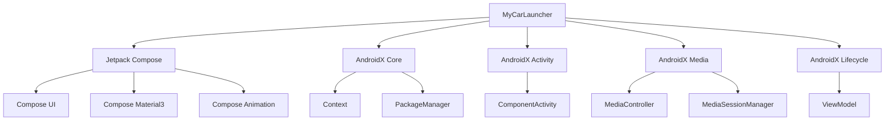

# 状态管理

<cite>
**本文档引用的文件**   
- [MainActivity.kt](file://app/src/main/java/com/sephp/mycarlauncher/MainActivity.kt)
- [Theme.kt](file://app/src/main/java/com/sephp/mycarlauncher/ui/theme/Theme.kt)
- [Color.kt](file://app/src/main/java/com/sephp/mycarlauncher/ui/theme/Color.kt)
- [Type.kt](file://app/src/main/java/com/sephp/mycarlauncher/ui/theme/Type.kt)
</cite>

## 目录
1. [简介](#简介)
2. [项目结构](#项目结构)
3. [核心组件](#核心组件)
4. [架构概述](#架构概述)
5. [详细组件分析](#详细组件分析)
6. [依赖分析](#依赖分析)
7. [性能考虑](#性能考虑)
8. [故障排除指南](#故障排除指南)
9. [结论](#结论)
10. [附录](#附录)（如有必要）

## 简介
MyCarLauncher 是一个专为车载环境设计的 Android 启动器应用，其核心功能依赖于 Jetpack Compose 的声明式 UI 框架。本技术文档深入剖析了该应用的状态管理机制，重点阐述了基于 `mutableStateOf` 和 `remember` 的状态驱动模式。文档详细解释了在 `HomeScreen` 中，`showAppList`、`showAppSelector`、`dockUpdateTrigger` 等状态变量如何作为单一数据源（Single Source of Truth）触发 UI 重组。同时，分析了 `LaunchedEffect` 在 `DockBar` 组件中如何实现异步加载应用信息并安全地更新状态。文档还探讨了单向数据流设计原则，即用户交互触发状态变更，状态变化自动刷新 UI。此外，还讨论了状态提升模式在 `AppSelectorDialog` 与父组件间的数据传递实现。

## 项目结构
MyCarLauncher 项目遵循典型的 Android 应用结构，其核心逻辑和 UI 组件集中在 `app/src/main/java/com/sephp/mycarlauncher` 目录下。UI 主题相关的配置（颜色、字体、主题）被组织在 `ui/theme` 包中，而应用的主入口和核心 Composable 函数则位于 `MainActivity.kt` 文件中。这种结构清晰地分离了关注点，使得状态管理逻辑与 UI 展示逻辑紧密结合，同时保持了代码的可维护性。

**图源**
- [MainActivity.kt](file://app/src/main/java/com/sephp/mycarlauncher/MainActivity.kt#L76-L117)
- [Theme.kt](file://app/src/main/java/com/sephp/mycarlauncher/ui/theme/Theme.kt#L37-L58)

**本节来源**
- [MainActivity.kt](file://app/src/main/java/com/sephp/mycarlauncher/MainActivity.kt)
- [Theme.kt](file://app/src/main/java/com/sephp/mycarlauncher/ui/theme/Theme.kt)

## 核心组件

`HomeScreen` 是应用的根 Composable 函数，它定义了整个界面的布局和核心状态。该组件通过 `var showAppList by remember { mutableStateOf(false) }` 等声明，创建了多个可观察的状态变量。这些变量是 UI 重组的驱动力。`DockBar` 组件负责显示底部的应用坞，它接收来自 `HomeScreen` 的状态和回调函数，并通过 `LaunchedEffect(updateTrigger)` 实现了对 Dock 应用的异步加载。`AppSelectorDialog` 是一个模态对话框，用于让用户选择要添加到 Dock 的应用，它通过状态提升的方式，将用户的选择结果传递回调用者。

**本节来源**
- [MainActivity.kt](file://app/src/main/java/com/sephp/mycarlauncher/MainActivity.kt#L76-L117)
- [MainActivity.kt](file://app/src/main/java/com/sephp/mycarlauncher/MainActivity.kt#L138-L206)
- [MainActivity.kt](file://app/src/main/java/com/sephp/mycarlauncher/MainActivity.kt#L447-L463)

## 架构概述

MyCarLauncher 采用基于 Jetpack Compose 的声明式架构，其核心是单向数据流和状态驱动的 UI。用户交互（如点击、长按）会触发状态变更，这些变更会自动导致依赖该状态的 Composable 函数重新执行，从而更新 UI。这种模式简化了状态管理，避免了手动操作视图的复杂性。

**图源**
- [MainActivity.kt](file://app/src/main/java/com/sephp/mycarlauncher/MainActivity.kt#L76-L117)

## 详细组件分析

### HomeScreen 状态管理分析
`HomeScreen` 组件是状态管理的中心。它使用 `remember` 和 `mutableStateOf` 创建了多个状态变量，这些变量构成了应用的单一数据源。

- `showAppList`：控制“所有应用”列表的显示与隐藏。当用户点击 Dock 上的“所有应用”图标时，此状态被设置为 `true`，触发 `AppListOverlay` 的显示。
- `showAppSelector`：控制“应用选择器”对话框的显示与隐藏。当用户长按 Dock 上的某个应用槽位时，此状态被设置为 `true`，触发 `AppSelectorDialog` 的显示。
- `selectedDockIndex`：记录用户长按的 Dock 槽位索引，用于确定将哪个应用保存到哪个位置。
- `dockUpdateTrigger`：这是一个关键的 `mutableIntStateOf` 状态，用作更新触发器。当用户通过 `AppSelectorDialog` 选择了一个新应用并将其保存到 Dock 时，此变量的值会递增（`dockUpdateTrigger++`）。这个值的变化会作为 `DockBar` 组件的 `updateTrigger` 参数，从而触发 `LaunchedEffect` 的重新执行，强制重新加载 Dock 应用列表。

**图源**
- [MainActivity.kt](file://app/src/main/java/com/sephp/mycarlauncher/MainActivity.kt#L76-L117)

**本节来源**
- [MainActivity.kt](file://app/src/main/java/com/sephp/mycarlauncher/MainActivity.kt#L76-L117)

### DockBar 异步加载分析
`DockBar` 组件通过 `LaunchedEffect` 实现了异步加载应用信息的功能，这是状态管理中处理副作用的关键。

- **状态声明**：`var dockApps by remember(updateTrigger) { mutableStateOf<List<AppInfo?>>(List(5) { null }) }`。这里使用了 `remember(updateTrigger)`，意味着当 `updateTrigger` 的值发生变化时，`dockApps` 状态会被重新创建和初始化。
- **副作用处理**：`LaunchedEffect(updateTrigger)` 块会在 `updateTrigger` 变化时启动一个协程。该协程在 `Dispatchers.IO` 上下文中执行，从 `DockPreferences` 中读取已保存的应用包名，并通过 `PackageManager` 异步获取应用的图标、标签等信息。加载完成后，通过 `dockApps = loadedApps` 更新状态，这会触发 `DockBar` 及其子组件的重组，从而显示最新的应用信息。

**图源**
- [MainActivity.kt](file://app/src/main/java/com/sephp/mycarlauncher/MainActivity.kt#L138-L166)

**本节来源**
- [MainActivity.kt](file://app/src/main/java/com/sephp/mycarlauncher/MainActivity.kt#L138-L166)

### 单向数据流与状态提升分析
MyCarLauncher 完美地体现了单向数据流和状态提升的设计模式。

- **单向数据流**：数据流是单向的。用户交互（如点击“+”号）触发状态变更（`showAppSelector = true`），状态变更导致 UI 重组（显示 `AppSelectorDialog`），用户在对话框中做出选择后，通过回调函数将数据（`appInfo`）传回父组件，父组件更新状态（`dockUpdateTrigger++`），再次触发 UI 重组。整个过程没有反向的数据流，保证了状态的可预测性。
- **状态提升**：`AppSelectorDialog` 本身不持有任何持久状态。它通过 `onDismiss` 和 `onAppSelected` 两个回调函数，将用户的操作结果“提升”到 `HomeScreen` 组件中进行处理。`HomeScreen` 作为状态的持有者，负责决定如何响应这些事件（更新 `DockPreferences` 和 `dockUpdateTrigger`）。这种模式使得 `AppSelectorDialog` 成为一个纯粹的、可复用的展示组件。

**图源**
- [MainActivity.kt](file://app/src/main/java/com/sephp/mycarlauncher/MainActivity.kt#L106-L116)
- [MainActivity.kt](file://app/src/main/java/com/sephp/mycarlauncher/MainActivity.kt#L447-L463)

**本节来源**
- [MainActivity.kt](file://app/src/main/java/com/sephp/mycarlauncher/MainActivity.kt#L106-L116)
- [MainActivity.kt](file://app/src/main/java/com/sephp/mycarlauncher/MainActivity.kt#L447-L463)

## 依赖分析

MyCarLauncher 的依赖关系清晰，主要依赖于 Android Jetpack 组件。

**图源**
- [MainActivity.kt](file://app/src/main/java/com/sephp/mycarlauncher/MainActivity.kt#L3-L17)
- [build.gradle.kts](file://app/build.gradle.kts)

**本节来源**
- [MainActivity.kt](file://app/src/main/java/com/sephp/mycarlauncher/MainActivity.kt#L3-L17)
- [app/build.gradle.kts](file://app/build.gradle.kts)

## 性能考虑

该应用的状态管理机制在性能方面表现良好。通过将状态变量（如 `installedApps`）包裹在 `remember` 中，避免了在每次重组时都重复调用 `getInstalledApps(context)` 这样耗时的操作。`LaunchedEffect` 的使用确保了异步操作（如应用信息加载）不会阻塞主线程，保证了 UI 的流畅性。`key(app?.packageName ?: "empty_$index")` 的使用优化了 `LazyColumn` 的重组过程，只有当应用包名变化时，对应的 `DockAppItem` 才会重组，而不是整个列表。

## 故障排除指南

- **问题：Dock 应用图标未更新**
  - **原因**：`dockUpdateTrigger` 未正确递增，或 `LaunchedEffect(updateTrigger)` 未被触发。
  - **解决方案**：检查 `AppSelectorDialog` 的 `onAppSelected` 回调是否正确执行了 `dockUpdateTrigger++`。

- **问题：应用选择器对话框无法显示**
  - **原因**：`showAppSelector` 状态未被正确设置，或 `selectedDockIndex` 为 `null`。
  - **解决方案**：检查 `onDockAppLongPress` 回调是否正确设置了 `selectedDockIndex` 并将 `showAppSelector` 设为 `true`。

- **问题：音乐信息无法显示**
  - **原因**：未授予通知访问权限。
  - **解决方案**：检查 `isNotificationListenerEnabled` 函数的返回值，并引导用户前往设置页面授予权限。

**本节来源**
- [MainActivity.kt](file://app/src/main/java/com/sephp/mycarlauncher/MainActivity.kt#L106-L116)
- [MainActivity.kt](file://app/src/main/java/com/sephp/mycarlauncher/MainActivity.kt#L286-L289)
- [MainActivity.kt](file://app/src/main/java/com/sephp/mycarlauncher/MainActivity.kt#L377-L380)

## 结论

MyCarLauncher 的状态管理机制是 Jetpack Compose 最佳实践的一个典范。它通过 `mutableStateOf` 和 `remember` 创建了清晰的单一数据源，利用 `LaunchedEffect` 安全地处理异步副作用，并通过单向数据流和状态提升模式实现了组件间的松耦合。`updateTrigger` 机制巧妙地解决了强制刷新的问题。整体设计简洁、高效且易于维护，为构建复杂的声明式 UI 提供了坚实的基础。