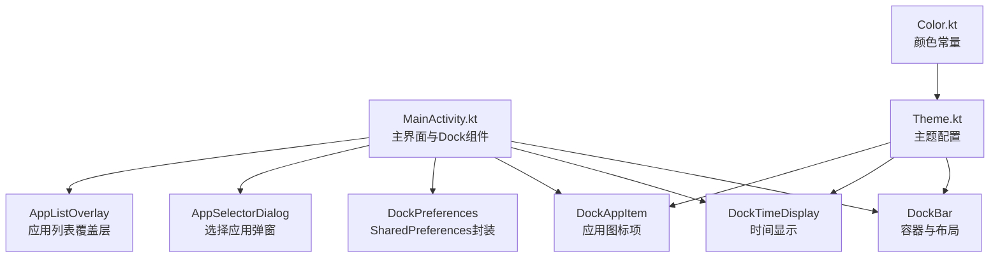
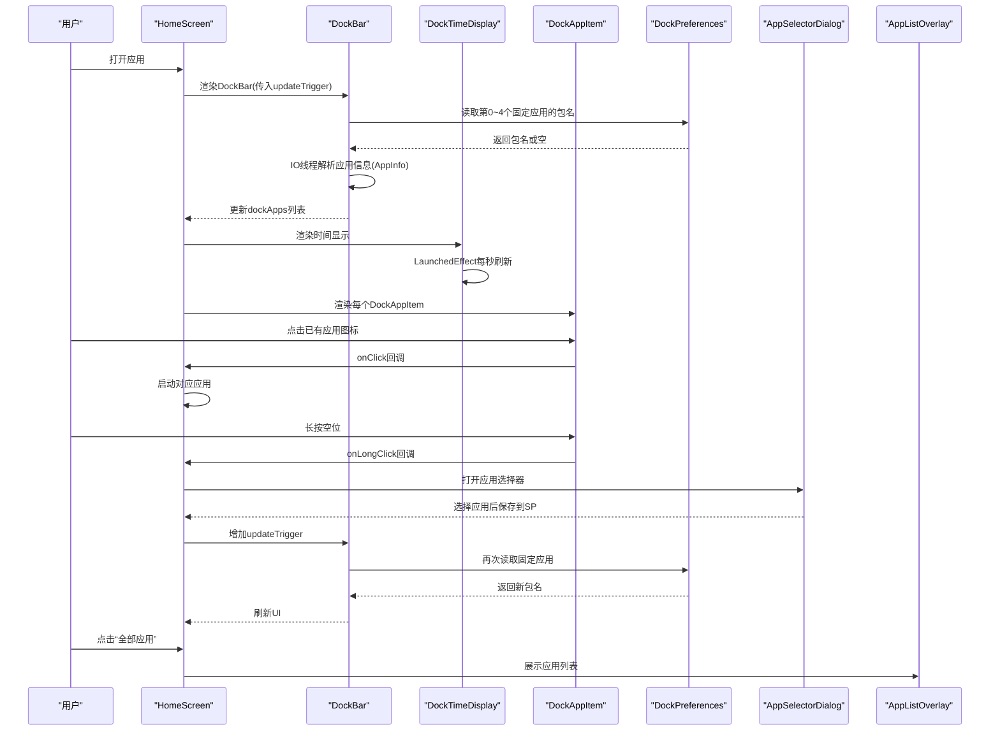
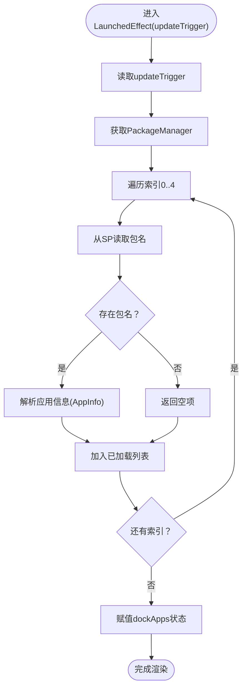
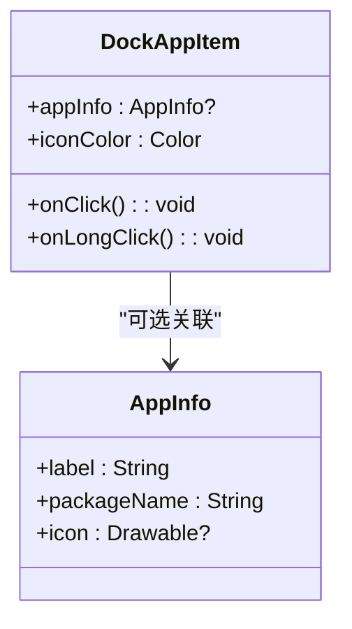
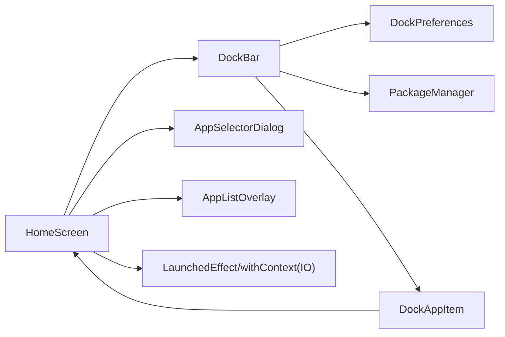

# Dock栏

<cite>
**本文引用的文件**
- [MainActivity.kt](file://app/src/main/java/com/sephp/mycarlauncher/MainActivity.kt)
- [Theme.kt](file://app/src/main/java/com/sephp/mycarlauncher/ui/theme/Theme.kt)
- [Color.kt](file://app/src/main/java/com/sephp/mycarlauncher/ui/theme/Color.kt)
</cite>

## 目录
1. [简介](#简介)
2. [项目结构](#项目结构)
3. [核心组件](#核心组件)
4. [架构总览](#架构总览)
5. [组件详解](#组件详解)
6. [依赖关系分析](#依赖关系分析)
7. [性能考量](#性能考量)
8. [故障排查指南](#故障排查指南)
9. [结论](#结论)
10. [附录](#附录)

## 简介
本文件系统性梳理MyCarLauncher中Dock栏的实现机制，重点覆盖以下方面：
- 时间显示组件DockTimeDisplay如何通过LaunchedEffect每秒更新时间
- DockAppItem如何处理点击与长按事件（含空位“+”号的呈现）
- DockBar如何通过DockPreferences从SharedPreferences中读取并异步加载固定应用，使用LaunchedEffect与Dispatchers.IO避免主线程阻塞
- 应用图标加载逻辑与图标着色处理
- 状态管理、事件回调与UI渲染的完整流程
- 与AppSelectorDialog和AppListOverlay的交互关系

## 项目结构
Dock栏相关代码集中在主界面文件中，采用Compose函数式组件化设计，配合主题与资源文件实现视觉风格与交互行为。

图表来源
- [MainActivity.kt](file://app/src/main/java/com/sephp/mycarlauncher/MainActivity.kt#L76-L226)
- [Theme.kt](file://app/src/main/java/com/sephp/mycarlauncher/ui/theme/Theme.kt#L1-L58)
- [Color.kt](file://app/src/main/java/com/sephp/mycarlauncher/ui/theme/Color.kt#L1-L11)

章节来源
- [MainActivity.kt](file://app/src/main/java/com/sephp/mycarlauncher/MainActivity.kt#L76-L226)
- [Theme.kt](file://app/src/main/java/com/sephp/mycarlauncher/ui/theme/Theme.kt#L1-L58)
- [Color.kt](file://app/src/main/java/com/sephp/mycarlauncher/ui/theme/Color.kt#L1-L11)

## 核心组件
- DockBar：Dock栏容器，负责时间显示区、应用图标区与“全部应用”入口的布局与交互；通过LaunchedEffect与IO线程异步加载已固定应用。
- DockTimeDisplay：时间显示组件，使用LaunchedEffect循环更新时分、星期与日期。
- DockAppItem：单个Dock应用项，支持点击启动应用与长按触发上层回调；当无应用时显示“+”号占位。
- DockPreferences：SharedPreferences封装，提供固定应用的读写接口。
- AppSelectorDialog：应用选择对话框，用于为Dock空位绑定应用。
- AppListOverlay：应用列表覆盖层，展示所有已安装应用供快速启动。

章节来源
- [MainActivity.kt](file://app/src/main/java/com/sephp/mycarlauncher/MainActivity.kt#L120-L226)
- [MainActivity.kt](file://app/src/main/java/com/sephp/mycarlauncher/MainActivity.kt#L440-L463)

## 架构总览
Dock栏整体采用“状态驱动”的Compose模式：HomeScreen维护显示开关与选中索引等状态，DockBar根据updateTrigger触发异步加载，DockTimeDisplay通过LaunchedEffect维持时间刷新，DockAppItem统一处理点击/长按事件，AppSelectorDialog与AppListOverlay作为交互入口与覆盖层参与状态流转。

图表来源
- [MainActivity.kt](file://app/src/main/java/com/sephp/mycarlauncher/MainActivity.kt#L76-L118)
- [MainActivity.kt](file://app/src/main/java/com/sephp/mycarlauncher/MainActivity.kt#L136-L206)
- [MainActivity.kt](file://app/src/main/java/com/sephp/mycarlauncher/MainActivity.kt#L120-L134)
- [MainActivity.kt](file://app/src/main/java/com/sephp/mycarlauncher/MainActivity.kt#L207-L226)
- [MainActivity.kt](file://app/src/main/java/com/sephp/mycarlauncher/MainActivity.kt#L440-L463)

## 组件详解

### DockTimeDisplay：每秒更新的时间显示
- 实现要点
  - 使用remember保存当前时间三元组（时分、星期、年月日），避免不必要的重绘。
  - 使用LaunchedEffect(Unit)启动无限循环，每次循环更新时间后延迟1000毫秒，从而实现每秒刷新。
  - UI层以垂直列排布三个文本，分别展示时分、星期与日期，颜色与透明度符合主题风格。
- 性能与可靠性
  - 循环内仅更新状态变量，不进行耗时操作，保证UI流畅。
  - 由于是无限循环，Compose生命周期结束后会自动取消协程，无需手动清理。
- 可扩展点
  - 可将刷新频率参数化，或根据系统时钟变化策略调整刷新时机。

章节来源
- [MainActivity.kt](file://app/src/main/java/com/sephp/mycarlauncher/MainActivity.kt#L120-L134)
- [MainActivity.kt](file://app/src/main/java/com/sephp/mycarlauncher/MainActivity.kt#L465-L468)

### DockBar：异步加载固定应用与布局
- 实现要点
  - 接收context与updateTrigger，使用LaunchedEffect(updateTrigger)监听变更，触发异步加载。
  - 在withContext(Dispatchers.IO)中遍历0~4索引，从DockPreferences读取包名，再通过PackageManager解析为AppInfo（标签、包名、图标）。
  - 加载完成后将结果赋值给dockApps状态，随后在LazyColumn中渲染5个位置。
  - 主题适配：根据系统深浅主题动态选择图标颜色，并使用半透明背景增强可读性。
  - “全部应用”入口：底部一个可点击的圆角矩形，内部放置矢量图标，点击触发onShowAppList回调。
- 关键流程图（异步加载）

图表来源
- [MainActivity.kt](file://app/src/main/java/com/sephp/mycarlauncher/MainActivity.kt#L136-L166)
- [MainActivity.kt](file://app/src/main/java/com/sephp/mycarlauncher/MainActivity.kt#L440-L445)

章节来源
- [MainActivity.kt](file://app/src/main/java/com/sephp/mycarlauncher/MainActivity.kt#L136-L206)
- [MainActivity.kt](file://app/src/main/java/com/sephp/mycarlauncher/MainActivity.kt#L440-L445)

### DockAppItem：点击与长按事件处理
- 实现要点
  - 使用combinedClickable统一处理点击与长按：若当前项有应用则执行onClick（启动应用），否则执行onLongClick（提示绑定应用）。
  - 当存在应用时，使用rememberDrawablePainter加载图标；不存在应用时显示“+”号占位，颜色随主题深浅自动调整。
- 事件流
  - 点击：由上层传入的onClick回调触发，若存在包名则调用launchApp启动应用。
  - 长按：由上层传入的onLongClick回调触发，通常用于打开应用选择器绑定应用。
- 可视化类图

图表来源
- [MainActivity.kt](file://app/src/main/java/com/sephp/mycarlauncher/MainActivity.kt#L207-L226)
- [MainActivity.kt](file://app/src/main/java/com/sephp/mycarlauncher/MainActivity.kt#L420-L421)

章节来源
- [MainActivity.kt](file://app/src/main/java/com/sephp/mycarlauncher/MainActivity.kt#L207-L226)

### DockPreferences：SharedPreferences封装
- 功能
  - 提供saveDockApp与getDockApp两个方法，分别用于保存与读取指定索引处的固定应用包名。
  - 使用私有偏好文件名与键前缀，确保命名空间隔离。
- 使用场景
  - DockBar在异步加载时读取固定应用包名。
  - AppSelectorDialog保存用户选择的应用包名后，HomeScreen通过增加updateTrigger触发DockBar重新加载。

章节来源
- [MainActivity.kt](file://app/src/main/java/com/sephp/mycarlauncher/MainActivity.kt#L440-L445)

### AppSelectorDialog与AppListOverlay：与Dock交互
- AppSelectorDialog
  - 展示应用选择界面，网格列出所有已安装应用，点击后回调onAppSelected，保存至SharedPreferences并触发DockBar刷新。
- AppListOverlay
  - 展示所有应用列表，点击后直接启动应用并关闭覆盖层。
- 与Dock的联动
  - HomeScreen维护showAppSelector与selectedDockIndex，长按空位时打开AppSelectorDialog，选择后通过DockPreferences保存并增加updateTrigger，促使DockBar重新加载。
  - 点击Dock底部“全部应用”入口打开AppListOverlay，用于快速启动任意应用。

章节来源
- [MainActivity.kt](file://app/src/main/java/com/sephp/mycarlauncher/MainActivity.kt#L76-L118)
- [MainActivity.kt](file://app/src/main/java/com/sephp/mycarlauncher/MainActivity.kt#L388-L405)
- [MainActivity.kt](file://app/src/main/java/com/sephp/mycarlauncher/MainActivity.kt#L447-L463)

## 依赖关系分析
- 组件耦合
  - DockBar依赖DockPreferences进行数据持久化，依赖PackageManager进行应用解析，依赖LaunchedEffect与Dispatchers.IO进行异步加载。
  - DockAppItem依赖上层传递的onClick/onLongClick回调，内部根据是否存在应用决定渲染内容。
  - HomeScreen协调AppSelectorDialog与AppListOverlay的状态切换，并通过updateTrigger驱动DockBar刷新。
- 外部依赖
  - SharedPreferences：用于存储固定应用的包名。
  - PackageManager：用于查询应用信息与启动意图。
  - Compose运行时：LaunchedEffect、remember、withContext等用于状态与协程管理。
- 潜在循环依赖
  - 无直接循环依赖，各组件通过回调与状态传递解耦。

图表来源
- [MainActivity.kt](file://app/src/main/java/com/sephp/mycarlauncher/MainActivity.kt#L76-L118)
- [MainActivity.kt](file://app/src/main/java/com/sephp/mycarlauncher/MainActivity.kt#L136-L206)
- [MainActivity.kt](file://app/src/main/java/com/sephp/mycarlauncher/MainActivity.kt#L440-L445)

## 性能考量
- 异步加载
  - DockBar在IO线程中解析应用信息，避免阻塞主线程，提升滚动与渲染性能。
- 状态最小化
  - DockTimeDisplay仅更新时间状态，DockBar通过updateTrigger精确触发重载，减少不必要的重组。
- 图标加载
  - 使用rememberDrawablePainter缓存图标绘制对象，降低重复绘制成本。
- 主题适配
  - 根据系统深浅主题动态选择图标颜色，避免额外计算与重绘。

[本节为通用性能建议，不直接分析具体文件]

## 故障排查指南
- 固定应用无法显示
  - 检查DockPreferences是否正确保存了包名；确认包名仍有效且应用未被卸载。
  - 触发DockBar的updateTrigger增加逻辑，确保重新加载。
- 点击无响应
  - 确认onClick回调中传入的包名非空；检查launchApp是否能获取到启动Intent。
- 长按无效
  - 确认onLongClick回调被正确传递至DockAppItem；检查HomeScreen是否打开AppSelectorDialog。
- 时间不刷新
  - 确认LaunchedEffect循环未被异常中断；检查设备时钟与系统时间设置。

章节来源
- [MainActivity.kt](file://app/src/main/java/com/sephp/mycarlauncher/MainActivity.kt#L120-L134)
- [MainActivity.kt](file://app/src/main/java/com/sephp/mycarlauncher/MainActivity.kt#L136-L206)
- [MainActivity.kt](file://app/src/main/java/com/sephp/mycarlauncher/MainActivity.kt#L433-L438)
- [MainActivity.kt](file://app/src/main/java/com/sephp/mycarlauncher/MainActivity.kt#L440-L445)

## 结论
该Dock栏实现以Compose为核心，结合LaunchedEffect与IO线程实现了高效的时间刷新与应用加载；通过DockPreferences与HomeScreen的状态协调，完成了固定应用的持久化与动态刷新；DockAppItem统一处理点击与长按事件，既支持应用启动也支持占位绑定。整体架构清晰、职责分离明确，具备良好的可扩展性与可维护性。

[本节为总结性内容，不直接分析具体文件]

## 附录
- 主题与颜色
  - 主题通过Material3方案与系统深浅主题联动，Dock栏采用半透明背景与对比色图标，确保在不同环境下均具可读性。
- 资源与图标
  - Dock底部“全部应用”入口使用矢量图标，颜色通过ColorFilter.tint动态着色，与主题保持一致。

章节来源
- [Theme.kt](file://app/src/main/java/com/sephp/mycarlauncher/ui/theme/Theme.kt#L1-L58)
- [Color.kt](file://app/src/main/java/com/sephp/mycarlauncher/ui/theme/Color.kt#L1-L11)
- [MainActivity.kt](file://app/src/main/java/com/sephp/mycarlauncher/MainActivity.kt#L136-L206)