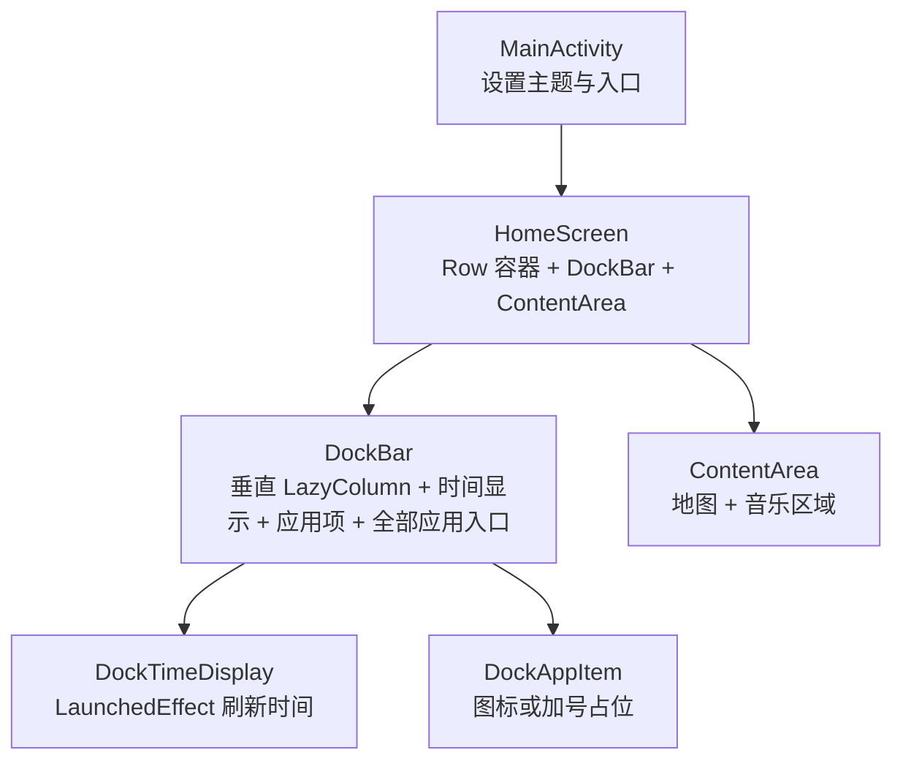
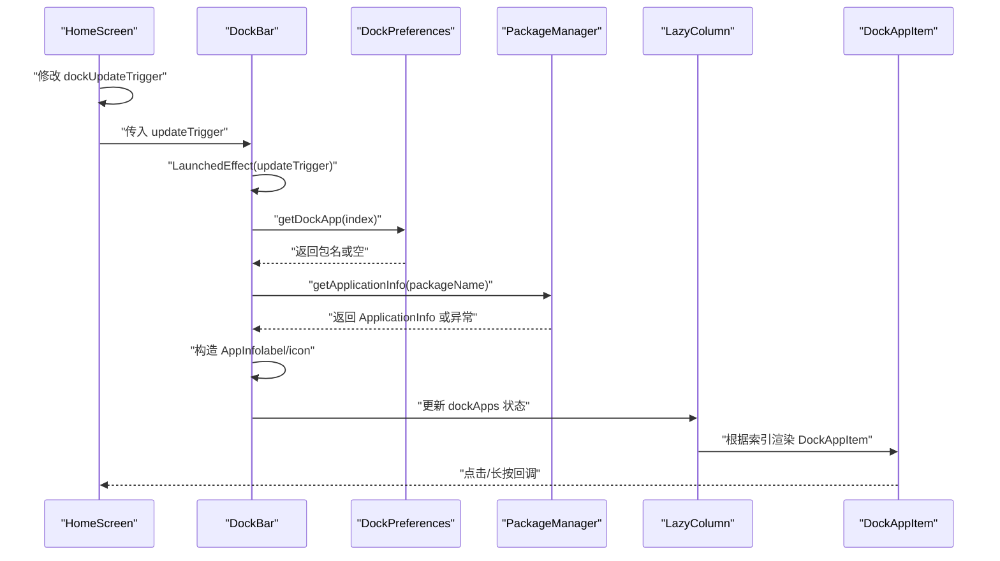
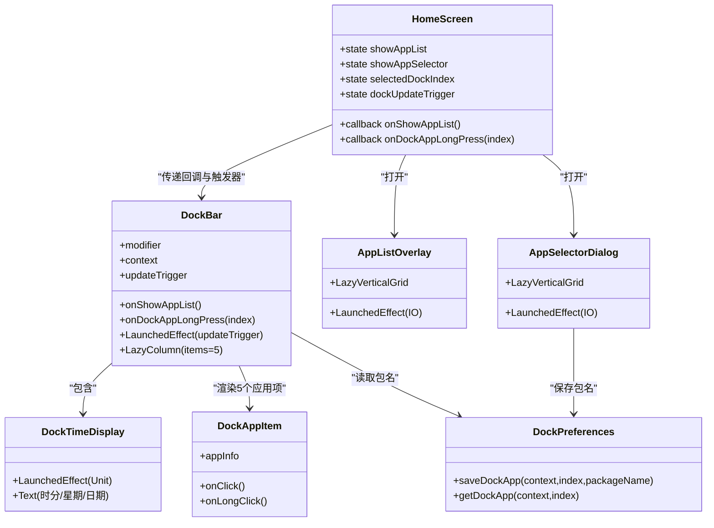

# 布局结构

<cite>
**本文引用的文件**
- [MainActivity.kt](file://app/src/main/java/com/sephp/mycarlauncher/MainActivity.kt)
- [Theme.kt](file://app/src/main/java/com/sephp/mycarlauncher/ui/theme/Theme.kt)
- [Color.kt](file://app/src/main/java/com/sephp/mycarlauncher/ui/theme/Color.kt)
- [Type.kt](file://app/src/main/java/com/sephp/mycarlauncher/ui/theme/Type.kt)
</cite>

## 目录
1. [简介](#简介)
2. [项目结构](#项目结构)
3. [核心组件](#核心组件)
4. [架构总览](#架构总览)
5. [详细组件分析](#详细组件分析)
6. [依赖分析](#依赖分析)
7. [性能考量](#性能考量)
8. [故障排查指南](#故障排查指南)
9. [结论](#结论)
10. [附录](#附录)

## 简介
本文件面向“DockBar”的整体布局结构与数据加载机制进行系统化解析，重点覆盖：
- DockBar 使用 LazyColumn 垂直排列时间显示、5 个应用项与应用列表入口的布局组织。
- 通过 LaunchedEffect 和 Dispatchers.IO 异步从 DockPreferences 读取 SharedPreferences 中保存的应用包名，并使用 PackageManager 异步加载应用信息的完整流程。
- updateTrigger 机制如何触发界面刷新。
- DockBar 与 HomeScreen 的状态交互关系，包括 onShowAppList 与 onDockAppLongPress 回调的传递与处理。
- 提供状态管理、异步数据加载与 UI 组合的最佳实践示例路径（以源码路径代替具体代码）。

## 项目结构
该项目采用 Compose 单 Activity 架构，主入口为 MainActivity，内容由 HomeScreen 组合而成。DockBar 作为左侧停靠栏，与右侧内容区并列布局；DockBar 内部包含时间显示、应用列表与“全部应用”入口。

图表来源
- [MainActivity.kt](file://app/src/main/java/com/sephp/mycarlauncher/MainActivity.kt#L64-L118)
- [MainActivity.kt](file://app/src/main/java/com/sephp/mycarlauncher/MainActivity.kt#L136-L206)

章节来源
- [MainActivity.kt](file://app/src/main/java/com/sephp/mycarlauncher/MainActivity.kt#L64-L118)
- [MainActivity.kt](file://app/src/main/java/com/sephp/mycarlauncher/MainActivity.kt#L136-L206)

## 核心组件
- DockBar：左侧停靠栏，负责渲染时间、5 个应用项与“全部应用”入口。
- DockTimeDisplay：顶部时间显示，每秒刷新一次。
- DockAppItem：单个应用项，支持点击启动与长按选择替换。
- HomeScreen：顶层容器，持有 showAppList、showAppSelector、selectedDockIndex、dockUpdateTrigger 等状态，并向 DockBar 传递回调与更新触发器。
- DockPreferences：基于 SharedPreferences 的轻量存储，键空间为 dock_app_0..4。
- AppListOverlay/AppSelectorDialog：应用列表与选择对话框，均采用 IO 线程异步加载应用列表。

章节来源
- [MainActivity.kt](file://app/src/main/java/com/sephp/mycarlauncher/MainActivity.kt#L76-L118)
- [MainActivity.kt](file://app/src/main/java/com/sephp/mycarlauncher/MainActivity.kt#L120-L206)
- [MainActivity.kt](file://app/src/main/java/com/sephp/mycarlauncher/MainActivity.kt#L388-L508)
- [MainActivity.kt](file://app/src/main/java/com/sephp/mycarlauncher/MainActivity.kt#L464-L469)

## 架构总览
DockBar 的数据流自上而下：HomeScreen 通过 updateTrigger 控制 DockBar 的重新加载；DockBar 在 LaunchedEffect 中以 IO 线程读取 SharedPreferences 并查询 PackageManager 获取应用信息，完成后写回本地状态，驱动 LazyColumn 重绘。

图表来源
- [MainActivity.kt](file://app/src/main/java/com/sephp/mycarlauncher/MainActivity.kt#L76-L118)
- [MainActivity.kt](file://app/src/main/java/com/sephp/mycarlauncher/MainActivity.kt#L136-L206)
- [MainActivity.kt](file://app/src/main/java/com/sephp/mycarlauncher/MainActivity.kt#L464-L469)

## 详细组件分析

### DockBar 布局与数据加载
- 布局结构
  - 顶部：DockTimeDisplay 垂直居中显示时分、星期、年月日三行文本。
  - 中部：LazyColumn 垂直排列 5 个 DockAppItem，间距统一，上下留白。
  - 底部：一个可点击的圆角容器，内部放置“全部应用”图标，用于打开应用列表。
- 数据加载流程
  - 使用 remember(updateTrigger) 初始化长度为 5 的可空 AppInfo 列表。
  - LaunchedEffect(updateTrigger) 触发 IO 线程任务：
    - 依次读取每个索引对应的包名（若存在）。
    - 使用 PackageManager 查询 ApplicationInfo 并构造 AppInfo（包含 label 与 icon）。
    - 将结果写回 dockApps，触发 UI 重绘。
  - 若某索引无包名或查询异常，则对应位置保持 null，渲染为“+”占位。
- 交互
  - 点击：若存在 AppInfo 则启动该应用。
  - 长按：回调 onDockAppLongPress(index)，交由 HomeScreen 打开 AppSelectorDialog。
  - “全部应用”入口：回调 onShowAppList，交由 HomeScreen 打开 AppListOverlay。

章节来源
- [MainActivity.kt](file://app/src/main/java/com/sephp/mycarlauncher/MainActivity.kt#L136-L206)
- [MainActivity.kt](file://app/src/main/java/com/sephp/mycarlauncher/MainActivity.kt#L464-L469)

### DockTimeDisplay 时间刷新机制
- 使用 LaunchedEffect(Unit) 循环刷新，每秒更新一次本地状态，从而驱动文本重绘。
- 该实现避免了不必要的协程泄漏，且仅在可见时运行。

章节来源
- [MainActivity.kt](file://app/src/main/java/com/sephp/mycarlauncher/MainActivity.kt#L120-L134)

### DockAppItem 渲染与交互
- 当存在 AppInfo 时，绘制应用图标；否则显示“+”占位。
- combinedClickable 支持点击启动与长按选择替换。
- 图标颜色根据系统深浅主题动态选择。

章节来源
- [MainActivity.kt](file://app/src/main/java/com/sephp/mycarlauncher/MainActivity.kt#L208-L226)

### HomeScreen 状态与回调传递
- 状态管理
  - showAppList：控制 AppListOverlay 是否显示。
  - showAppSelector：控制 AppSelectorDialog 是否显示。
  - selectedDockIndex：记录被长按的应用槽位索引。
  - dockUpdateTrigger：整型触发器，每次选择新应用后自增，强制 DockBar 重新加载。
- 回调传递
  - onShowAppList：打开应用列表。
  - onDockAppLongPress：打开应用选择器，并将选中的应用写入 DockPreferences 对应索引。
- 选择完成后的刷新
  - 保存成功后，HomeScreen 自增 dockUpdateTrigger，触发 DockBar 的 LaunchedEffect 重新执行，从而刷新 UI。

章节来源
- [MainActivity.kt](file://app/src/main/java/com/sephp/mycarlauncher/MainActivity.kt#L76-L118)
- [MainActivity.kt](file://app/src/main/java/com/sephp/mycarlauncher/MainActivity.kt#L464-L469)

### DockPreferences 存储机制
- 键空间：dock_app_0 到 dock_app_4。
- 读写方法：
  - getDockApp(context, index)：读取指定索引的包名。
  - saveDockApp(context, index, packageName)：写入指定索引的包名。
- 作用：持久化用户配置，供 DockBar 异步加载应用信息使用。

章节来源
- [MainActivity.kt](file://app/src/main/java/com/sephp/mycarlauncher/MainActivity.kt#L464-L469)

### 应用列表与选择对话框（异步加载）
- AppListOverlay/AppSelectorDialog 均在 LaunchedEffect 中使用 Dispatchers.IO 异步加载已安装应用列表，完成后写入本地状态并渲染 LazyVerticalGrid。
- 该模式与 DockBar 的异步加载策略一致，确保主线程不被阻塞。

章节来源
- [MainActivity.kt](file://app/src/main/java/com/sephp/mycarlauncher/MainActivity.kt#L388-L426)
- [MainActivity.kt](file://app/src/main/java/com/sephp/mycarlauncher/MainActivity.kt#L471-L508)

### 类关系图（代码级）

图表来源
- [MainActivity.kt](file://app/src/main/java/com/sephp/mycarlauncher/MainActivity.kt#L76-L118)
- [MainActivity.kt](file://app/src/main/java/com/sephp/mycarlauncher/MainActivity.kt#L136-L206)
- [MainActivity.kt](file://app/src/main/java/com/sephp/mycarlauncher/MainActivity.kt#L120-L134)
- [MainActivity.kt](file://app/src/main/java/com/sephp/mycarlauncher/MainActivity.kt#L464-L469)
- [MainActivity.kt](file://app/src/main/java/com/sephp/mycarlauncher/MainActivity.kt#L388-L508)

## 依赖分析
- 组件耦合
  - DockBar 依赖 DockPreferences 进行数据持久化，依赖 PackageManager 进行应用信息查询。
  - HomeScreen 通过回调与状态驱动 DockBar 的刷新，形成单向数据流。
- 外部依赖
  - AndroidX Compose（Material3、Foundation、Lazy）。
  - Kotlinx Coroutines（Dispatchers.IO、LaunchedEffect、delay）。
  - Android 系统服务（PackageManager、Settings）。

章节来源
- [MainActivity.kt](file://app/src/main/java/com/sephp/mycarlauncher/MainActivity.kt#L1-L63)
- [MainActivity.kt](file://app/src/main/java/com/sephp/mycarlauncher/MainActivity.kt#L136-L206)
- [MainActivity.kt](file://app/src/main/java/com/sephp/mycarlauncher/MainActivity.kt#L464-L469)

## 性能考量
- 异步加载
  - DockBar、AppListOverlay、AppSelectorDialog 均在 IO 线程加载，避免阻塞主线程。
- 状态最小化
  - DockBar 使用 remember(updateTrigger) 缓存初始空列表，仅在触发器变化时重建。
- 列表渲染
  - LazyColumn/LazyVerticalGrid 按需渲染，减少不必要的重组。
- 主题与资源
  - 使用系统深浅主题色，减少自定义色值计算成本。

[本节为通用指导，无需列出具体文件来源]

## 故障排查指南
- 应用图标为空
  - 可能是包名无效或应用卸载。DockBar 在查询异常时会返回 null，渲染为“+”。可在保存前校验包名有效性。
  - 参考路径：[DockBar 加载逻辑](file://app/src/main/java/com/sephp/mycarlauncher/MainActivity.kt#L148-L166)
- 无法打开应用
  - 启动意图为空或抛出异常。建议捕获异常并提示用户。
  - 参考路径：[launchApp 实现](file://app/src/main/java/com/sephp/mycarlauncher/MainActivity.kt#L454-L462)
- 应用列表加载失败
  - IO 线程异常会被捕获并提示，确认权限与网络状态。
  - 参考路径：[AppListOverlay 加载](file://app/src/main/java/com/sephp/mycarlauncher/MainActivity.kt#L388-L405)
- 时间不刷新
  - LaunchedEffect(Unit) 依赖可见性运行，确保 Composable 处于可见状态。
  - 参考路径：[DockTimeDisplay](file://app/src/main/java/com/sephp/mycarlauncher/MainActivity.kt#L120-L128)

章节来源
- [MainActivity.kt](file://app/src/main/java/com/sephp/mycarlauncher/MainActivity.kt#L120-L128)
- [MainActivity.kt](file://app/src/main/java/com/sephp/mycarlauncher/MainActivity.kt#L148-L166)
- [MainActivity.kt](file://app/src/main/java/com/sephp/mycarlauncher/MainActivity.kt#L388-L405)
- [MainActivity.kt](file://app/src/main/java/com/sephp/mycarlauncher/MainActivity.kt#L454-L462)

## 结论
DockBar 通过 updateTrigger 与 LaunchedEffect 的组合，实现了对 SharedPreferences 的异步读取与 PackageManager 的异步查询，最终以 LazyColumn 驱动的 5 个应用项进行渲染。HomeScreen 通过回调与整型触发器，将用户选择与界面刷新解耦，形成清晰的数据流向与状态管理模式。该设计兼顾了性能与可维护性，适合在车载场景等对流畅度有要求的环境中使用。

[本节为总结性内容，无需列出具体文件来源]

## 附录
- 主题与排版
  - 主题：根据系统深浅主题动态选择颜色方案。
  - 字体：Material 默认排版样式。
  - 参考路径：
    - [Theme.kt](file://app/src/main/java/com/sephp/mycarlauncher/ui/theme/Theme.kt#L1-L58)
    - [Color.kt](file://app/src/main/java/com/sephp/mycarlauncher/ui/theme/Color.kt#L1-L11)
    - [Type.kt](file://app/src/main/java/com/sephp/mycarlauncher/ui/theme/Type.kt#L1-L34)

章节来源
- [Theme.kt](file://app/src/main/java/com/sephp/mycarlauncher/ui/theme/Theme.kt#L1-L58)
- [Color.kt](file://app/src/main/java/com/sephp/mycarlauncher/ui/theme/Color.kt#L1-L11)
- [Type.kt](file://app/src/main/java/com/sephp/mycarlauncher/ui/theme/Type.kt#L1-L34)