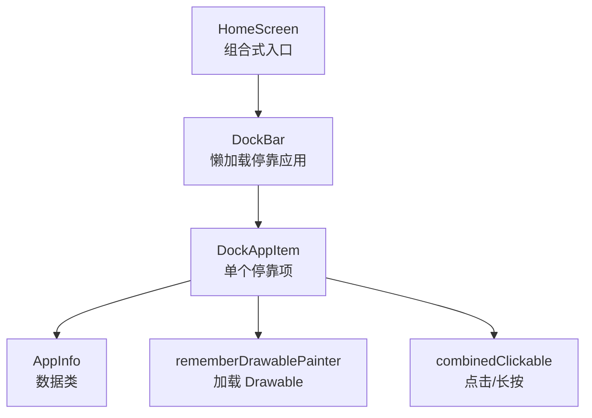
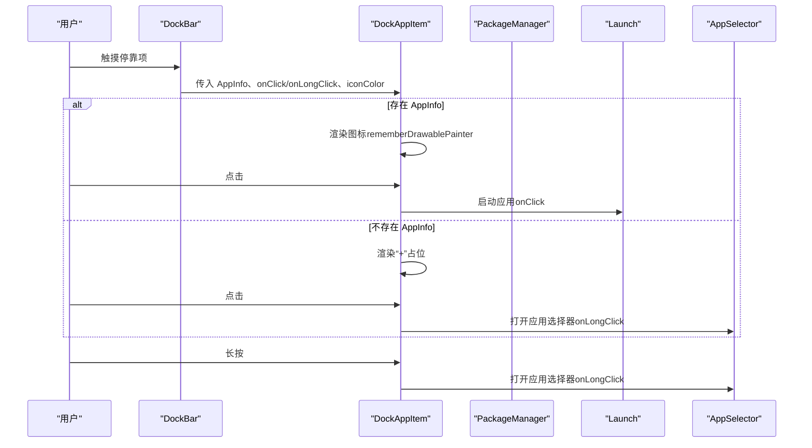
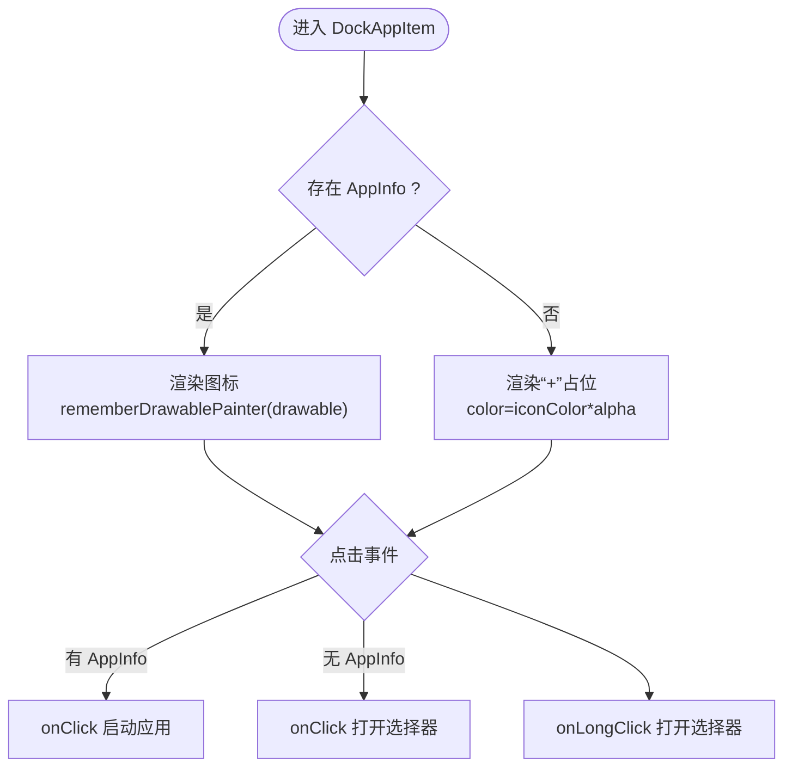
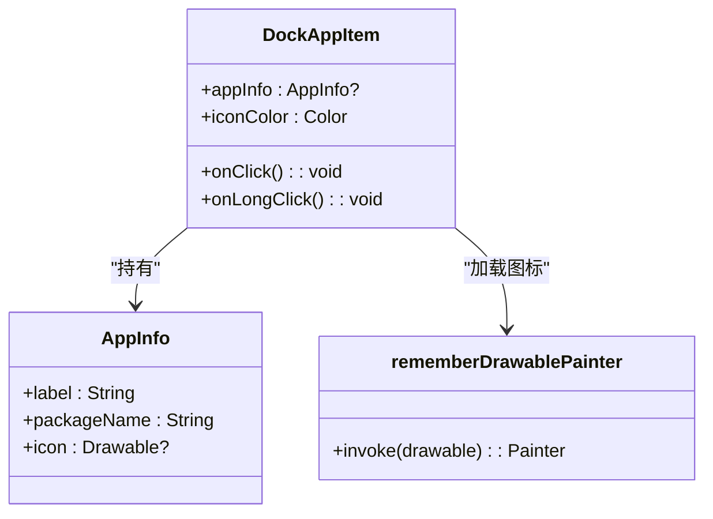
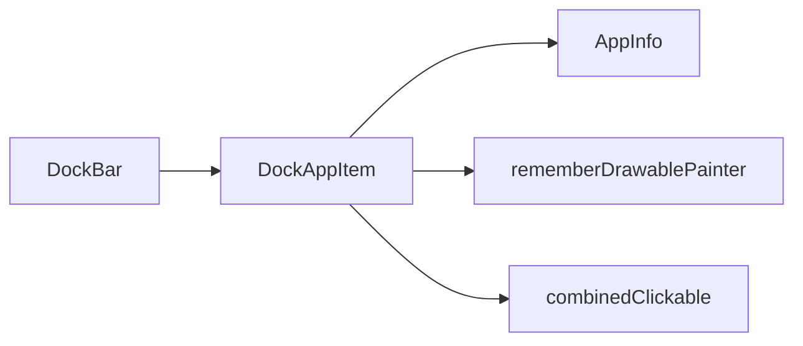

# 应用项

<cite>
**本文引用的文件**
- [MainActivity.kt](file://app/src/main/java/com/sephp/mycarlauncher/MainActivity.kt)
- [build.gradle.kts](file://app/build.gradle.kts)
</cite>

## 目录
1. [简介](#简介)
2. [项目结构](#项目结构)
3. [核心组件](#核心组件)
4. [架构总览](#架构总览)
5. [详细组件分析](#详细组件分析)
6. [依赖关系分析](#依赖关系分析)
7. [性能考量](#性能考量)
8. [故障排查指南](#故障排查指南)
9. [结论](#结论)

## 简介
本文件围绕 DockAppItem 组件进行深入解析，重点说明：
- 如何基于 AppInfo 数据类渲染应用图标或空位“+”号；
- combinedClickable 修饰符如何同时处理点击与长按事件：点击用于启动应用，长按用于打开应用选择器；
- 图标着色逻辑，包括在亮色与暗色主题下的颜色适配；
- rememberDrawablePainter 在 Jetpack Compose 中加载 Drawable 资源的机制；
- 提供 null 安全处理、图标加载失败的容错机制以及 UI 状态的响应式更新示例路径。

## 项目结构
DockAppItem 所在的 Compose 屏幕由 HomeScreen 驱动，DockBar 负责加载并展示 5 个停靠位，DockAppItem 则负责每个停靠位的渲染与交互。

图表来源
- [MainActivity.kt](file://app/src/main/java/com/sephp/mycarlauncher/MainActivity.kt#L76-L226)

章节来源
- [MainActivity.kt](file://app/src/main/java/com/sephp/mycarlauncher/MainActivity.kt#L76-L226)

## 核心组件
- DockAppItem：单个停靠项，支持点击启动应用、长按打开应用选择器；当无应用时显示“+”占位。
- AppInfo：封装应用标签、包名与可选图标（Drawable）。
- rememberDrawablePainter：将 Android Drawable 包装为 Compose 可绘制对象。
- combinedClickable：统一处理点击与长按事件。

章节来源
- [MainActivity.kt](file://app/src/main/java/com/sephp/mycarlauncher/MainActivity.kt#L208-L226)
- [MainActivity.kt](file://app/src/main/java/com/sephp/mycarlauncher/MainActivity.kt#L441-L441)

## 架构总览
DockAppItem 的调用链路如下：HomeScreen 创建 DockBar，DockBar 异步加载停靠应用并传入 DockAppItem；DockAppItem 内部根据是否存在 AppInfo 决定渲染图标还是“+”占位，并通过 combinedClickable 分发点击与长按事件。

图表来源
- [MainActivity.kt](file://app/src/main/java/com/sephp/mycarlauncher/MainActivity.kt#L136-L206)
- [MainActivity.kt](file://app/src/main/java/com/sephp/mycarlauncher/MainActivity.kt#L208-L226)

## 详细组件分析

### DockAppItem 组件
- 渲染策略
  - 若存在 AppInfo，则使用 rememberDrawablePainter 加载并显示图标；
  - 若不存在 AppInfo，则显示“+”占位文本，颜色由 iconColor 控制。
- 事件处理
  - combinedClickable 将点击与长按绑定到同一容器：
    - 点击：若存在 AppInfo 则执行 onClick（启动应用），否则执行 onLongClick（打开选择器）；
    - 长按：始终执行 onLongClick（打开选择器）。
- 主题适配
  - DockBar 根据系统深浅主题计算 iconColor（亮色主题用白，暗色主题用黑），确保“+”占位与背景对比度合理。

图表来源
- [MainActivity.kt](file://app/src/main/java/com/sephp/mycarlauncher/MainActivity.kt#L208-L226)
- [MainActivity.kt](file://app/src/main/java/com/sephp/mycarlauncher/MainActivity.kt#L136-L206)

章节来源
- [MainActivity.kt](file://app/src/main/java/com/sephp/mycarlauncher/MainActivity.kt#L208-L226)
- [MainActivity.kt](file://app/src/main/java/com/sephp/mycarlauncher/MainActivity.kt#L136-L206)

### combinedClickable 修饰符行为
- 点击：当 appInfo 非空时触发 onClick（启动应用）；当 appInfo 为空时触发 onLongClick（打开选择器）。
- 长按：无论是否有 appInfo，均触发 onLongClick（打开选择器）。
- 这种设计使“+”占位也能通过长按进入选择流程，提升可用性。

章节来源
- [MainActivity.kt](file://app/src/main/java/com/sephp/mycarlauncher/MainActivity.kt#L208-L226)

### 图标着色与主题适配
- DockBar 计算 iconColor：
  - 若系统处于浅色主题，则 iconColor 为白色；
  - 若系统处于深色主题，则 iconColor 为黑色。
- “+”占位文本采用 iconColor 并降低透明度，保证在不同背景下具备良好可读性。
- 其他图标（如“全部应用”按钮）也使用 ColorFilter.tint(iconColor) 进行统一着色。

章节来源
- [MainActivity.kt](file://app/src/main/java/com/sephp/mycarlauncher/MainActivity.kt#L168-L206)

### rememberDrawablePainter 机制
- 作用：将 Android Drawable 包装为 Compose 可绘制对象，以便在 Image 中直接使用。
- 使用位置：
  - DockAppItem：当存在 AppInfo 且图标非空时，将 AppInfo.icon 传入 rememberDrawablePainter；
  - AppItem：在应用列表中同样使用该函数加载图标。
- 依赖来源：项目通过 Gradle 引入 Accompanist 的 drawablepainter 实现。

图表来源
- [MainActivity.kt](file://app/src/main/java/com/sephp/mycarlauncher/MainActivity.kt#L208-L226)
- [MainActivity.kt](file://app/src/main/java/com/sephp/mycarlauncher/MainActivity.kt#L441-L441)

章节来源
- [MainActivity.kt](file://app/src/main/java/com/sephp/mycarlauncher/MainActivity.kt#L208-L226)
- [MainActivity.kt](file://app/src/main/java/com/sephp/mycarlauncher/MainActivity.kt#L428-L439)
- [build.gradle.kts](file://app/build.gradle.kts#L54-L56)

### null 安全与容错机制
- AppInfo 与图标字段均为可空，渲染前进行判空：
  - DockAppItem 对 appInfo.icon 做了可空检查，仅在非空时加载；
  - DockBar 在加载过程中对异常进行捕获，避免崩溃并返回 null 占位。
- 启动应用时对异常进行捕获与提示，避免 UI 崩溃并反馈给用户。

章节来源
- [MainActivity.kt](file://app/src/main/java/com/sephp/mycarlauncher/MainActivity.kt#L208-L226)
- [MainActivity.kt](file://app/src/main/java/com/sephp/mycarlauncher/MainActivity.kt#L146-L166)
- [MainActivity.kt](file://app/src/main/java/com/sephp/mycarlauncher/MainActivity.kt#L454-L462)

### UI 状态的响应式更新
- DockBar 使用 remember(updateTrigger) 与 LaunchedEffect(updateTrigger) 触发异步加载，加载完成后更新 dockApps 列表，从而驱动 DockAppItem 重新渲染。
- HomeScreen 通过 mutableStateOf 管理 showAppList、showAppSelector、selectedDockIndex 等状态，配合 updateTrigger 实现停靠项刷新。

章节来源
- [MainActivity.kt](file://app/src/main/java/com/sephp/mycarlauncher/MainActivity.kt#L76-L118)
- [MainActivity.kt](file://app/src/main/java/com/sephp/mycarlauncher/MainActivity.kt#L136-L166)

## 依赖关系分析
- 外部库依赖：项目通过 Gradle 引入 Accompanist 的 drawablepainter，用于将 Drawable 转换为 Compose 可绘制对象。
- 组件间耦合：
  - DockAppItem 依赖 AppInfo 数据类；
  - DockAppItem 依赖 rememberDrawablePainter；
  - DockAppItem 依赖 combinedClickable；
  - DockBar 负责数据准备与事件分发，与 DockAppItem 为组合关系。

图表来源
- [MainActivity.kt](file://app/src/main/java/com/sephp/mycarlauncher/MainActivity.kt#L136-L226)
- [build.gradle.kts](file://app/build.gradle.kts#L54-L56)

章节来源
- [build.gradle.kts](file://app/build.gradle.kts#L54-L56)
- [MainActivity.kt](file://app/src/main/java/com/sephp/mycarlauncher/MainActivity.kt#L136-L226)

## 性能考量
- 异步加载：DockBar 使用 Dispatchers.IO 异步加载应用信息，避免阻塞主线程。
- 懒加载：DockAppItem 仅在需要时渲染图标，减少不必要的绘制。
- 状态最小化：通过 updateTrigger 与 remember(updateTrigger) 控制重渲染范围，避免全局刷新。

章节来源
- [MainActivity.kt](file://app/src/main/java/com/sephp/mycarlauncher/MainActivity.kt#L146-L166)

## 故障排查指南
- 图标不显示
  - 检查 AppInfo.icon 是否为 null；若为 null，确认 DockBar 的加载是否抛出异常并返回 null。
  - 确认 rememberDrawablePainter 的参数 drawable 非空。
- 点击无效
  - 确认 DockAppItem 的 combinedClickable 事件绑定正确：有 AppInfo 时点击应走 onClick，无 AppInfo 时点击应走 onLongClick。
- 启动应用失败
  - 检查 launchApp 的异常捕获与 Toast 提示，确认包名有效且存在启动意图。
- 主题颜色不明显
  - 检查 DockBar 的 iconColor 计算逻辑，确保在浅/深色主题下颜色对比度合理。

章节来源
- [MainActivity.kt](file://app/src/main/java/com/sephp/mycarlauncher/MainActivity.kt#L136-L206)
- [MainActivity.kt](file://app/src/main/java/com/sephp/mycarlauncher/MainActivity.kt#L208-L226)
- [MainActivity.kt](file://app/src/main/java/com/sephp/mycarlauncher/MainActivity.kt#L454-L462)

## 结论
DockAppItem 通过 AppInfo 数据类与 rememberDrawablePainter 实现图标渲染，借助 combinedClickable 统一处理点击与长按事件，结合 DockBar 的主题适配与异步加载机制，提供了稳定、可维护且具有良好用户体验的停靠项组件。其 null 安全与异常容错设计确保了在复杂场景下的健壮性，响应式状态管理则保障了 UI 的实时更新。