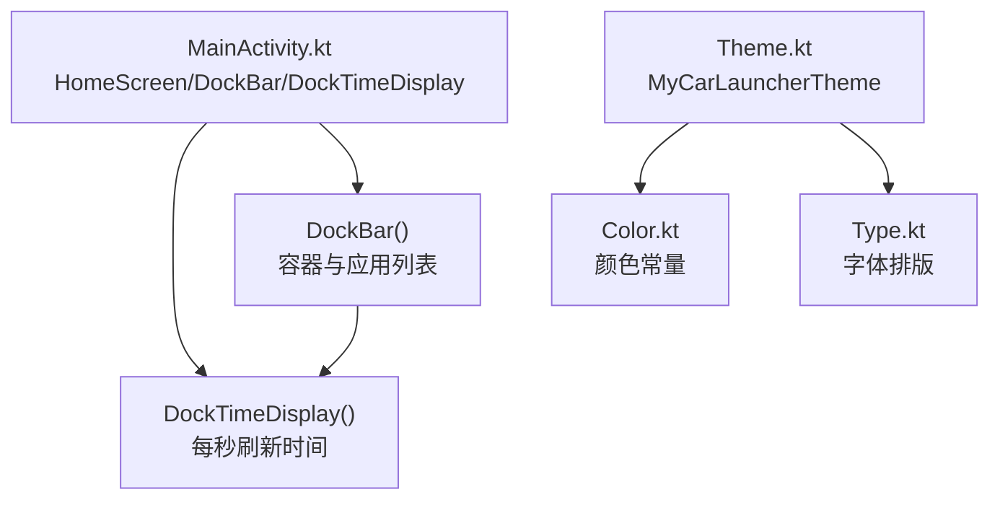
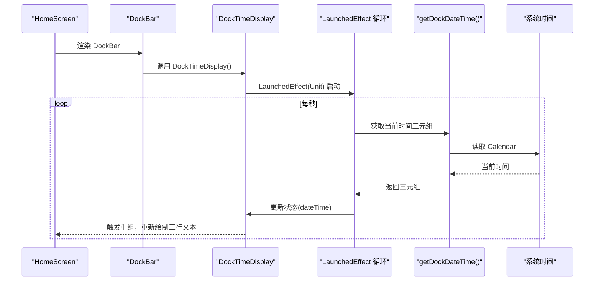
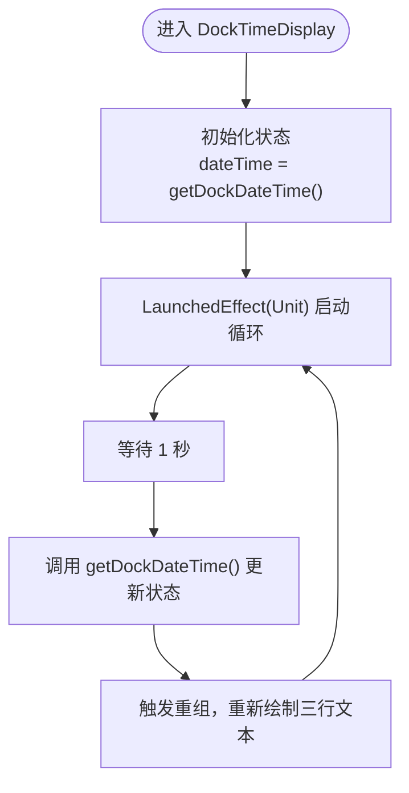
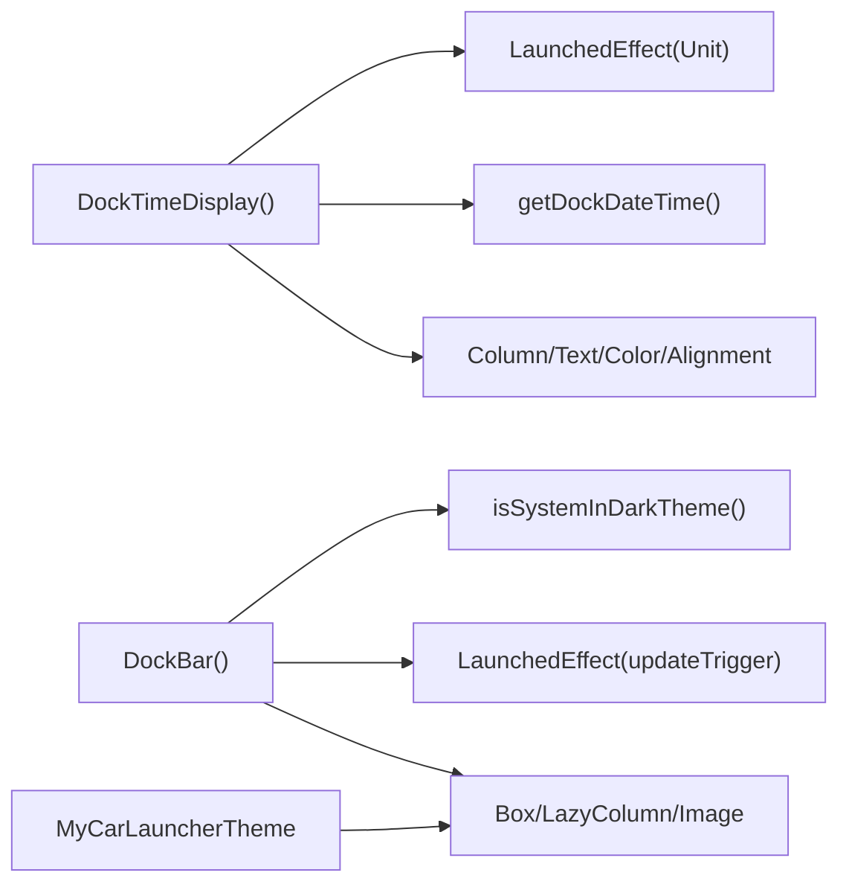

# 时间显示

<cite>
**本文引用的文件**
- [MainActivity.kt](file://app/src/main/java/com/sephp/mycarlauncher/MainActivity.kt)
- [Theme.kt](file://app/src/main/java/com/sephp/mycarlauncher/ui/theme/Theme.kt)
- [Color.kt](file://app/src/main/java/com/sephp/mycarlauncher/ui/theme/Color.kt)
- [Type.kt](file://app/src/main/java/com/sephp/mycarlauncher/ui/theme/Type.kt)
</cite>

## 目录
1. [简介](#简介)
2. [项目结构](#项目结构)
3. [核心组件](#核心组件)
4. [架构总览](#架构总览)
5. [组件详解](#组件详解)
6. [依赖关系分析](#依赖关系分析)
7. [性能考量](#性能考量)
8. [故障排查指南](#故障排查指南)
9. [结论](#结论)

## 简介
本文件聚焦于车机桌面 Dock 栏中的时间显示组件 DockTimeDisplay 的实现机制，围绕以下目标展开：
- 解释如何通过 LaunchedEffect 每秒触发一次时间更新
- 说明 getDockDateTime 函数如何返回“小时:分钟”、“星期”、“年-月-日”的三元组
- 描述该组件在 UI 中的布局结构（三行文本：小时分钟、星期、日期）
- 讨论与系统主题的适配逻辑（文字颜色与透明度）
- 提供 LaunchedEffect 无限循环延迟机制与 Compose 生命周期管理的示例路径

## 项目结构
DockTimeDisplay 位于主活动的 Compose 层，作为 DockBar 的子组件被渲染。整体 UI 采用 Material3 主题，并通过 isSystemInDarkTheme 判断系统深浅色模式以决定图标颜色等视觉元素。

图表来源
- [MainActivity.kt](file://app/src/main/java/com/sephp/mycarlauncher/MainActivity.kt#L120-L134)
- [MainActivity.kt](file://app/src/main/java/com/sephp/mycarlauncher/MainActivity.kt#L136-L206)
- [Theme.kt](file://app/src/main/java/com/sephp/mycarlauncher/ui/theme/Theme.kt#L36-L58)
- [Color.kt](file://app/src/main/java/com/sephp/mycarlauncher/ui/theme/Color.kt#L1-L11)
- [Type.kt](file://app/src/main/java/com/sephp/mycarlauncher/ui/theme/Type.kt#L1-L34)

章节来源
- [MainActivity.kt](file://app/src/main/java/com/sephp/mycarlauncher/MainActivity.kt#L120-L134)
- [MainActivity.kt](file://app/src/main/java/com/sephp/mycarlauncher/MainActivity.kt#L136-L206)
- [Theme.kt](file://app/src/main/java/com/sephp/mycarlauncher/ui/theme/Theme.kt#L36-L58)

## 核心组件
- DockTimeDisplay：在 Dock 栏顶部居中显示三行文本，分别表示“时间（时:分）”、“星期”、“日期（年-月-日）”。组件内部使用 remember 维护状态，LaunchedEffect 启动一个无限循环，每秒调用一次 getDockDateTime 更新状态，从而驱动 UI 重绘。
- getDockDateTime：封装 Calendar 与 SimpleDateFormat，返回包含三段字符串的三元组，分别对应时间、星期、日期。
- DockBar：承载 DockTimeDisplay 的容器，同时负责应用列表的懒加载与图标颜色适配（基于系统深浅色模式）。

章节来源
- [MainActivity.kt](file://app/src/main/java/com/sephp/mycarlauncher/MainActivity.kt#L120-L134)
- [MainActivity.kt](file://app/src/main/java/com/sephp/mycarlauncher/MainActivity.kt#L136-L206)
- [MainActivity.kt](file://app/src/main/java/com/sephp/mycarlauncher/MainActivity.kt#L509-L514)

## 架构总览
DockTimeDisplay 所在的 UI 层由 HomeScreen 驱动，DockBar 作为左侧 Dock 区域容器，其中包含 DockTimeDisplay 与应用列表。DockTimeDisplay 通过 LaunchedEffect 实现时间轮询更新；DockBar 使用 isSystemInDarkTheme 判断系统主题并据此设置图标颜色与背景透明度。

图表来源
- [MainActivity.kt](file://app/src/main/java/com/sephp/mycarlauncher/MainActivity.kt#L120-L134)
- [MainActivity.kt](file://app/src/main/java/com/sephp/mycarlauncher/MainActivity.kt#L509-L514)

## 组件详解

### DockTimeDisplay 组件
- 功能定位：在 Dock 栏顶部居中显示三行文本，用于直观呈现当前时间、星期与日期。
- 状态管理：使用 remember 初始化状态为 getDockDateTime 的首次结果；随后通过 LaunchedEffect 在每次重组后启动无限循环，每秒更新一次状态。
- 布局结构：垂直 Column 容器内包含三行 Text：
  - 第一行：时间（格式为“时:分”，字号较大且加粗）
  - 第二行：星期（字号中等）
  - 第三行：日期（格式为“年-月-日”，字号中等且带一定透明度）
- 文字颜色与透明度：
  - 默认统一使用白色文字
  - 日期行使用较低透明度，以弱化信息层级
- 与系统主题的关系：
  - DockBar 内部根据 isSystemInDarkTheme 切换图标颜色（深色模式下为黑色，浅色模式下为白色），但 DockTimeDisplay 本身固定使用白色文字，不直接依赖该判断
  - 若需与系统主题联动，可在 DockTimeDisplay 内部引入 isSystemInDarkTheme 并按需调整文字颜色或透明度

图表来源
- [MainActivity.kt](file://app/src/main/java/com/sephp/mycarlauncher/MainActivity.kt#L120-L134)
- [MainActivity.kt](file://app/src/main/java/com/sephp/mycarlauncher/MainActivity.kt#L509-L514)

章节来源
- [MainActivity.kt](file://app/src/main/java/com/sephp/mycarlauncher/MainActivity.kt#L120-L134)

### getDockDateTime 函数
- 输入：无显式参数，内部使用系统默认 Locale 与 Calendar
- 输出：Triple<String, String, String>
  - 第一项：“时:分”
  - 第二项：星期（英文）
  - 第三项：日期（年-月-日）
- 复杂度：O(1)，仅进行一次 Calendar 访问与两次格式化操作
- 注意事项：
  - 语言环境依赖 Locale.getDefault()，若需国际化支持，可传入 Locale 参数
  - 使用 SimpleDateFormat 为线程安全问题，建议在高并发场景改用更现代的 API 或加锁

章节来源
- [MainActivity.kt](file://app/src/main/java/com/sephp/mycarlauncher/MainActivity.kt#L509-L514)

### DockBar 与主题适配
- DockBar 通过 isSystemInDarkTheme 判断系统深浅色模式，并据此设置图标颜色与背景透明度，保证在不同主题下具备良好对比度
- DockTimeDisplay 本身未直接使用该判断，若希望时间显示也随系统主题变化，可在组件内引入 isSystemInDarkTheme 并按需调整文字颜色或透明度

章节来源
- [MainActivity.kt](file://app/src/main/java/com/sephp/mycarlauncher/MainActivity.kt#L136-L206)
- [Theme.kt](file://app/src/main/java/com/sephp/mycarlauncher/ui/theme/Theme.kt#L36-L58)

## 依赖关系分析
- DockTimeDisplay 依赖：
  - LaunchedEffect：用于启动无限循环，每秒更新一次状态
  - getDockDateTime：提供当前时间三元组
  - Compose UI 组件：Column、Text、Color、Alignment、FontWeight、FontSize 等
- DockBar 依赖：
  - isSystemInDarkTheme：用于适配系统主题
  - LaunchedEffect：用于异步加载 Dock 应用列表
  - Material3 主题：通过 MyCarLauncherTheme 注入颜色与排版

图表来源
- [MainActivity.kt](file://app/src/main/java/com/sephp/mycarlauncher/MainActivity.kt#L120-L134)
- [MainActivity.kt](file://app/src/main/java/com/sephp/mycarlauncher/MainActivity.kt#L136-L206)
- [MainActivity.kt](file://app/src/main/java/com/sephp/mycarlauncher/MainActivity.kt#L509-L514)
- [Theme.kt](file://app/src/main/java/com/sephp/mycarlauncher/ui/theme/Theme.kt#L36-L58)

章节来源
- [MainActivity.kt](file://app/src/main/java/com/sephp/mycarlauncher/MainActivity.kt#L120-L134)
- [MainActivity.kt](file://app/src/main/java/com/sephp/mycarlauncher/MainActivity.kt#L136-L206)
- [MainActivity.kt](file://app/src/main/java/com/sephp/mycarlauncher/MainActivity.kt#L509-L514)
- [Theme.kt](file://app/src/main/java/com/sephp/mycarlauncher/ui/theme/Theme.kt#L36-L58)

## 性能考量
- 时间更新频率：每秒一次，开销极低，适合在 UI 线程中直接更新状态
- 格式化成本：SimpleDateFormat 为 O(1) 操作，整体性能可忽略
- 建议优化：
  - 若存在多处类似定时刷新需求，可考虑合并到单一协程或使用 WorkManager 进行后台调度
  - 对于高刷新频率的场景，可评估使用更轻量的计时器或系统回调替代 delay
  - 如需国际化，避免频繁创建 SimpleDateFormat，可复用或使用 ThreadLocal

## 故障排查指南
- 时间不更新
  - 检查 LaunchedEffect 是否正确启动（Unit 作为键）
  - 确认循环体内是否调用了 delay(1000)
  - 排查状态更新是否被外部重组覆盖
- 文本颜色不符合预期
  - DockTimeDisplay 默认使用白色文字；如需随系统主题变化，请在组件内引入 isSystemInDarkTheme 并按需切换颜色
- 日期/时间格式异常
  - 确认 Locale 设置是否符合预期
  - 如需自定义格式，建议将 SimpleDateFormat 替换为更现代的时间 API 并注意线程安全

## 结论
DockTimeDisplay 通过简洁的 LaunchedEffect 无限循环与 getDockDateTime 三元组输出，实现了 Dock 栏顶部的三行时间信息展示。其布局采用垂直居中排列，文字颜色与透明度设计突出时间主体信息。结合 DockBar 的系统主题适配，整体在不同深浅色模式下均保持良好的可读性。若需进一步增强主题一致性，可在 DockTimeDisplay 内部引入 isSystemInDarkTheme 并动态调整文字颜色与透明度。