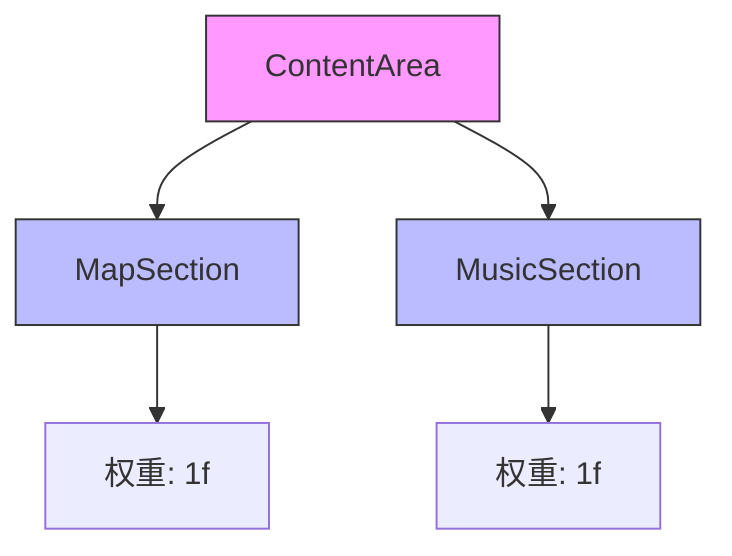

# 地图区域

<cite>
**Referenced Files in This Document**   
- [MainActivity.kt](file://app/src/main/java/com/sephp/mycarlauncher/MainActivity.kt)
</cite>

## 目录
1. [地图区域](#地图区域)
2. [UI实现与样式](#ui实现与样式)
3. [布局权重分配](#布局权重分配)
4. [文本显示内容与样式](#文本显示内容与样式)
5. [未来扩展点与架构考虑](#未来扩展点与架构考虑)

## UI实现与样式

MapSection组件通过Box容器创建了一个具有蓝色边框和圆角背景的占位区域。该组件使用了Jetpack Compose的UI框架，通过Modifier.border()方法设置了2.dp宽度的蓝色边框（Color.Blue.copy(alpha = 0.3f)），并通过RoundedCornerShape(12.dp)实现了圆角效果。同时，组件使用Modifier.background()方法设置了半透明的黑色背景（Color.Black.copy(alpha = 0.3f)），以增强视觉层次感。整个区域还设置了16.dp的内边距，使内容与边框保持适当距离。

**Section sources**
- [MainActivity.kt](file://app/src/main/java/com/sephp/mycarlauncher/MainActivity.kt#L237-L240)

## 布局权重分配

MapSection组件在ContentArea中通过Modifier.weight(1f)获得了垂直空间的权重分配。ContentArea是一个垂直排列的Column布局，包含MapSection和MusicSection两个子组件。这两个组件都设置了相同的权重值1f，这意味着它们将平分ContentArea的可用垂直空间。这种布局设计确保了地图区域和音乐控制区域在界面上保持均衡的视觉比例，无论屏幕尺寸如何变化都能保持良好的布局效果。

**Diagram sources **
- [MainActivity.kt](file://app/src/main/java/com/sephp/mycarlauncher/MainActivity.kt#L231-L232)

## 文本显示内容与样式

MapSection组件中的文本内容为"地图区域"，使用Text组件进行显示。文本样式设置了多种属性：颜色为纯蓝色（Color.Blue），字体大小为20.sp，字体粗细为加粗（FontWeight.Bold）。这些样式设置使得文本在界面上清晰可见，具有足够的视觉权重。文本位于Box容器的中心位置，通过contentAlignment = Alignment.Center实现居中对齐，确保在不同屏幕尺寸下都能保持良好的可读性和美观性。

**Section sources**
- [MainActivity.kt](file://app/src/main/java/com/sephp/mycarlauncher/MainActivity.kt#L242)

## 未来扩展点与架构考虑

当前的MapSection组件仅为静态占位符，未来集成真实地图服务时需要考虑多个扩展点和架构问题。首先，需要引入地图SDK（如Google Maps或高德地图），并处理相应的API密钥和权限配置。其次，组件需要从静态文本显示转变为动态地图渲染，可能需要使用AndroidView或Compose的互操作性来嵌入原生地图视图。此外，还需要考虑地图的交互功能，如缩放、平移和标记点显示。在架构上，建议将地图功能封装为独立的ViewModel，通过状态管理来控制地图的显示状态和用户交互，同时确保与现有音乐控制等组件的协调工作。性能方面需要特别关注地图渲染的资源消耗，可能需要实现懒加载和缓存机制。

**Section sources**
- [MainActivity.kt](file://app/src/main/java/com/sephp/mycarlauncher/MainActivity.kt#L237-L243)