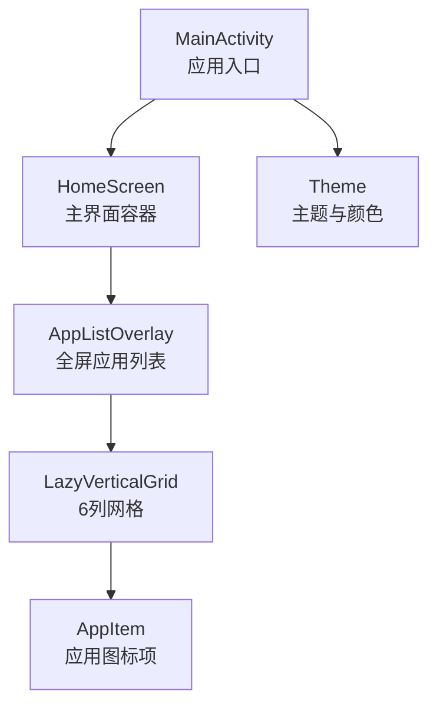
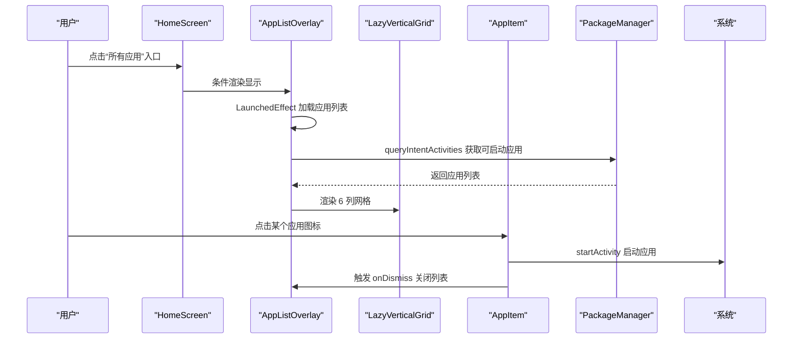
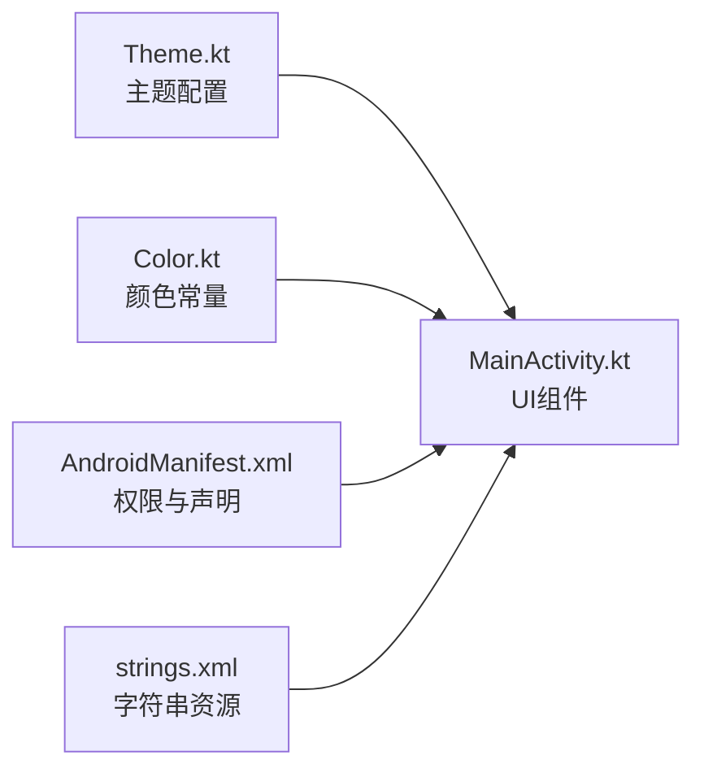

# 全屏应用列表

<cite>
**本文引用的文件**
- [MainActivity.kt](file://app/src/main/java/com/sephp/mycarlauncher/MainActivity.kt)
- [Theme.kt](file://app/src/main/java/com/sephp/mycarlauncher/ui/theme/Theme.kt)
- [Color.kt](file://app/src/main/java/com/sephp/mycarlauncher/ui/theme/Color.kt)
- [AndroidManifest.xml](file://app/src/main/AndroidManifest.xml)
- [strings.xml](file://app/src/main/res/values/strings.xml)
</cite>

## 目录
1. [简介](#简介)
2. [项目结构](#项目结构)
3. [核心组件](#核心组件)
4. [架构总览](#架构总览)
5. [详细组件分析](#详细组件分析)
6. [依赖关系分析](#依赖关系分析)
7. [性能考量](#性能考量)
8. [故障排查指南](#故障排查指南)
9. [结论](#结论)

## 简介
本文件围绕全屏应用列表组件 AppListOverlay 的实现机制进行深入解析，重点说明以下内容：
- 如何通过 getInstalledApps 查询系统中所有可启动的应用，并按名称进行排序；
- LazyVerticalGrid 如何实现 6 列网格布局；
- AppItem 组件的 UI 设计与点击事件处理；
- 列表遮罩层与内部容器的样式设置（背景色、圆角、边框）；
- 点击空白区域或关闭按钮时列表关闭的交互逻辑；
- 启动应用后自动关闭的行为。

该实现采用 Jetpack Compose 构建，使用异步加载避免阻塞主线程，并提供良好的视觉反馈与交互体验。

## 项目结构
本项目为一个 Android 车载启动器应用，主要入口为 MainActivity，界面由 Compose 编写。AppListOverlay 作为全屏弹出式应用列表，位于 HomeScreen 的顶层叠加层中。

图表来源
- [MainActivity.kt](file://app/src/main/java/com/sephp/mycarlauncher/MainActivity.kt#L76-L118)
- [MainActivity.kt](file://app/src/main/java/com/sephp/mycarlauncher/MainActivity.kt#L388-L426)
- [MainActivity.kt](file://app/src/main/java/com/sephp/mycarlauncher/MainActivity.kt#L418-L421)
- [MainActivity.kt](file://app/src/main/java/com/sephp/mycarlauncher/MainActivity.kt#L428-L439)
- [Theme.kt](file://app/src/main/java/com/sephp/mycarlauncher/ui/theme/Theme.kt#L36-L58)

章节来源
- [MainActivity.kt](file://app/src/main/java/com/sephp/mycarlauncher/MainActivity.kt#L76-L118)
- [AndroidManifest.xml](file://app/src/main/AndroidManifest.xml#L35-L47)

## 核心组件
- AppListOverlay：全屏遮罩层中的应用列表弹窗，负责加载、展示与交互。
- LazyVerticalGrid：用于渲染应用图标网格，固定 6 列。
- AppItem：单个应用图标的 UI 组件，包含图标、标题与点击行为。
- getInstalledApps：查询系统可启动应用并按名称排序。
- launchApp：根据包名启动目标应用。

章节来源
- [MainActivity.kt](file://app/src/main/java/com/sephp/mycarlauncher/MainActivity.kt#L388-L426)
- [MainActivity.kt](file://app/src/main/java/com/sephp/mycarlauncher/MainActivity.kt#L418-L421)
- [MainActivity.kt](file://app/src/main/java/com/sephp/mycarlauncher/MainActivity.kt#L428-L439)
- [MainActivity.kt](file://app/src/main/java/com/sephp/mycarlauncher/MainActivity.kt#L443-L452)
- [MainActivity.kt](file://app/src/main/java/com/sephp/mycarlauncher/MainActivity.kt#L454-L462)

## 架构总览
AppListOverlay 作为 HomeScreen 的条件渲染组件出现，通过 onDismiss 回调控制其显隐；内部使用 LazyVerticalGrid 实现 6 列网格布局，每个格子由 AppItem 渲染；点击应用图标会触发启动并自动关闭列表。

图表来源
- [MainActivity.kt](file://app/src/main/java/com/sephp/mycarlauncher/MainActivity.kt#L76-L118)
- [MainActivity.kt](file://app/src/main/java/com/sephp/mycarlauncher/MainActivity.kt#L388-L426)
- [MainActivity.kt](file://app/src/main/java/com/sephp/mycarlauncher/MainActivity.kt#L443-L452)
- [MainActivity.kt](file://app/src/main/java/com/sephp/mycarlauncher/MainActivity.kt#L454-L462)

## 详细组件分析

### AppListOverlay 实现机制
- 显示与隐藏
  - HomeScreen 中通过状态变量控制是否显示 AppListOverlay；
  - 点击“所有应用”入口触发显示；onDismiss 回调用于关闭。
- 数据加载
  - 使用 LaunchedEffect 在首次进入时异步加载应用列表；
  - getInstalledApps 在 IO 线程执行，避免阻塞 UI；
  - 加载完成后更新状态，结束加载态。
- 遮罩层与内部容器样式
  - 外层遮罩：全屏背景色与半透明黑色，支持点击空白区域关闭；
  - 内层容器：固定宽高比例，背景色为深灰，圆角 24dp，带轻微边框，内边距统一。
- 标题与关闭按钮
  - 左侧标题“所有应用”，右侧“关闭”文本按钮，点击同样触发 onDismiss。

章节来源
- [MainActivity.kt](file://app/src/main/java/com/sephp/mycarlauncher/MainActivity.kt#L76-L118)
- [MainActivity.kt](file://app/src/main/java/com/sephp/mycarlauncher/MainActivity.kt#L388-L426)

### LazyVerticalGrid 6 列网格布局
- 列数与间距
  - 使用 GridCells.Fixed(6) 固定 6 列；
  - 水平间距 20dp，垂直间距 24dp，保证网格整齐与呼吸感。
- 数据绑定
  - items(installedApps) 将应用列表映射到 AppItem；
  - 每个 AppItem 接收 AppInfo 并绑定点击事件。
- 性能特性
  - LazyVerticalGrid 按需渲染可见区域，滚动流畅，适合大量应用图标场景。

章节来源
- [MainActivity.kt](file://app/src/main/java/com/sephp/mycarlauncher/MainActivity.kt#L418-L421)

### AppItem UI 设计与点击事件
- UI 结构
  - 图标容器：64dp 正方形，圆角 16dp，浅灰背景，居中放置应用图标；
  - 文本标签：应用名称，白色，字号 13sp，单行省略，居中对齐；
  - 整体采用点击交互，内边距统一。
- 点击行为
  - 点击后先启动应用，再触发 onDismiss 关闭列表；
  - 启动失败时通过 Toast 提示错误信息。

章节来源
- [MainActivity.kt](file://app/src/main/java/com/sephp/mycarlauncher/MainActivity.kt#L428-L439)
- [MainActivity.kt](file://app/src/main/java/com/sephp/mycarlauncher/MainActivity.kt#L454-L462)

### getInstalledApps 查询与排序
- 查询方式
  - 通过 Intent.ACTION_MAIN + CATEGORY_LAUNCHER 过滤可启动 Activity；
  - 使用 PackageManager.queryIntentActivities 获取匹配项集合。
- 数据提取
  - 从 ResolveInfo 中获取 applicationInfo，读取应用标签、包名与图标；
  - 使用 mapNotNull 容错处理异常应用信息。
- 排序规则
  - 按应用标签的小写形式进行排序，确保字母顺序一致且不区分大小写。

章节来源
- [MainActivity.kt](file://app/src/main/java/com/sephp/mycarlauncher/MainActivity.kt#L443-L452)

### 遮罩层与内部容器样式设置
- 背景色与透明度
  - 遮罩背景使用黑色半透明，提升对比度与聚焦效果；
  - 内部容器背景为深灰，营造沉浸式卡片风格。
- 圆角与边框
  - 容器圆角 24dp，边框宽度 1dp，边框色为白色低透明度，增强层次感。
- 布局尺寸
  - 容器占满屏幕的 85% 宽高，避免边缘留白过大影响视觉平衡。

章节来源
- [MainActivity.kt](file://app/src/main/java/com/sephp/mycarlauncher/MainActivity.kt#L407-L425)

### 交互逻辑：空白区域与关闭按钮
- 点击空白区域关闭
  - 外层遮罩使用 clickable 包裹 onDismiss，点击即关闭；
  - 内层容器禁用点击事件（clickable(enabled=false)），避免误触。
- 点击关闭按钮
  - 右上角“关闭”文本按钮同样绑定 onDismiss，便于快速退出。
- 自动关闭
  - AppItem 点击启动应用后立即触发 onDismiss，确保用户体验连贯。

章节来源
- [MainActivity.kt](file://app/src/main/java/com/sephp/mycarlauncher/MainActivity.kt#L407-L413)
- [MainActivity.kt](file://app/src/main/java/com/sephp/mycarlauncher/MainActivity.kt#L418-L421)
- [MainActivity.kt](file://app/src/main/java/com/sephp/mycarlauncher/MainActivity.kt#L428-L439)

## 依赖关系分析
- 主题与颜色
  - Theme.kt 提供 Material3 主题配置，支持动态颜色与深浅模式；
  - Color.kt 定义品牌色常量，供 UI 组件使用。
- 权限与声明
  - AndroidManifest.xml 声明查询权限与应用角色（HOME/DEFAULT），确保作为系统启动器可用。
- 字符串资源
  - strings.xml 提供应用名称等基础字符串资源。

图表来源
- [Theme.kt](file://app/src/main/java/com/sephp/mycarlauncher/ui/theme/Theme.kt#L36-L58)
- [Color.kt](file://app/src/main/java/com/sephp/mycarlauncher/ui/theme/Color.kt#L1-L11)
- [AndroidManifest.xml](file://app/src/main/AndroidManifest.xml#L1-L14)
- [strings.xml](file://app/src/main/res/values/strings.xml#L1-L3)
- [MainActivity.kt](file://app/src/main/java/com/sephp/mycarlauncher/MainActivity.kt#L76-L118)

章节来源
- [Theme.kt](file://app/src/main/java/com/sephp/mycarlauncher/ui/theme/Theme.kt#L36-L58)
- [Color.kt](file://app/src/main/java/com/sephp/mycarlauncher/ui/theme/Color.kt#L1-L11)
- [AndroidManifest.xml](file://app/src/main/AndroidManifest.xml#L1-L14)
- [strings.xml](file://app/src/main/res/values/strings.xml#L1-L3)

## 性能考量
- 异步加载
  - 使用 LaunchedEffect + Dispatchers.IO 在后台线程加载应用列表，避免主线程阻塞；
  - 加载完成后再更新 UI，保证首屏渲染速度。
- 懒加载网格
  - LazyVerticalGrid 按需渲染，滚动时仅绘制可见区域，降低内存占用与重绘成本。
- 图标缓存
  - 使用 rememberDrawablePainter 对图标进行缓存，减少重复绘制开销。
- 错误处理
  - getInstalledApps 使用 mapNotNull 容错，避免异常应用导致崩溃；
  - 启动失败时通过 Toast 提示，避免无响应。

章节来源
- [MainActivity.kt](file://app/src/main/java/com/sephp/mycarlauncher/MainActivity.kt#L388-L405)
- [MainActivity.kt](file://app/src/main/java/com/sephp/mycarlauncher/MainActivity.kt#L443-L452)
- [MainActivity.kt](file://app/src/main/java/com/sephp/mycarlauncher/MainActivity.kt#L454-L462)

## 故障排查指南
- 应用列表为空或加载缓慢
  - 检查权限与声明：确认已声明 QUERY_ALL_PACKAGES 权限并在清单中声明查询意图；
  - 确认 getInstalledApps 的过滤条件正确（ACTION_MAIN + CATEGORY_LAUNCHER）。
- 启动应用失败
  - 检查包名是否存在与可启动；
  - 查看 Toast 错误提示，定位具体异常原因。
- 点击无效或无法关闭
  - 确认外层遮罩的 clickable 与内层容器的 enabled=false 设置；
  - 确保 AppItem 的 onClick 中包含 onDismiss 调用。

章节来源
- [AndroidManifest.xml](file://app/src/main/AndroidManifest.xml#L1-L14)
- [MainActivity.kt](file://app/src/main/java/com/sephp/mycarlauncher/MainActivity.kt#L443-L452)
- [MainActivity.kt](file://app/src/main/java/com/sephp/mycarlauncher/MainActivity.kt#L454-L462)
- [MainActivity.kt](file://app/src/main/java/com/sephp/mycarlauncher/MainActivity.kt#L407-L413)
- [MainActivity.kt](file://app/src/main/java/com/sephp/mycarlauncher/MainActivity.kt#L418-L421)

## 结论
AppListOverlay 通过清晰的分层设计与 Compose 的响应式能力，实现了高性能、易用的全屏应用列表。其关键优势包括：
- 异步加载与懒渲染，保障流畅体验；
- 固定 6 列网格布局，兼顾信息密度与可读性；
- 统一的遮罩与容器样式，提供沉浸式交互；
- 明确的关闭与启动流程，提升操作效率与一致性。