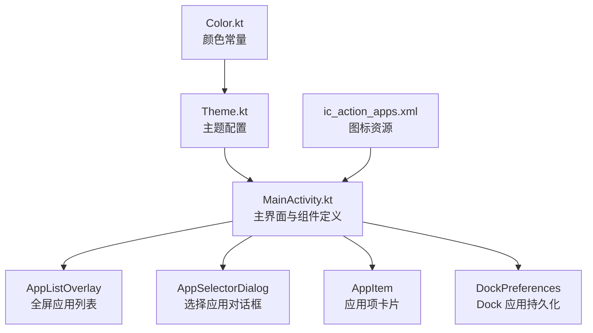
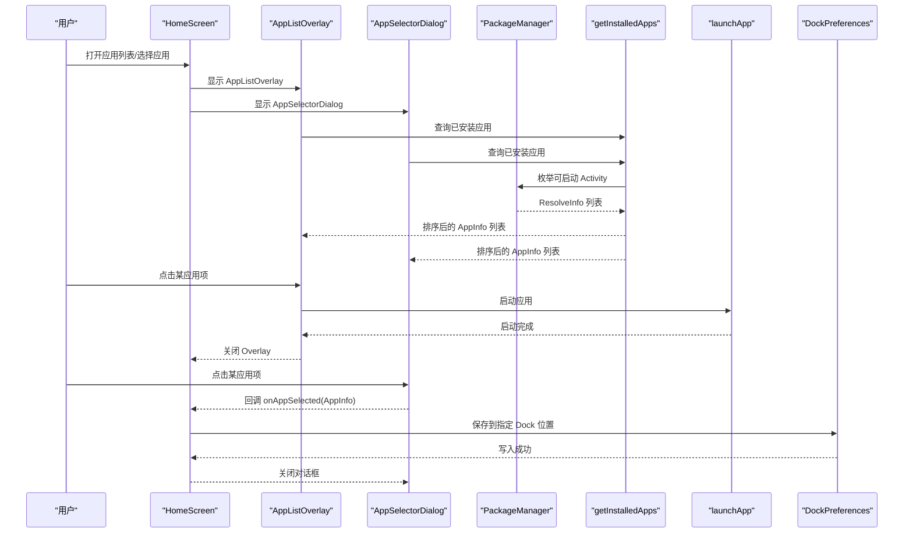
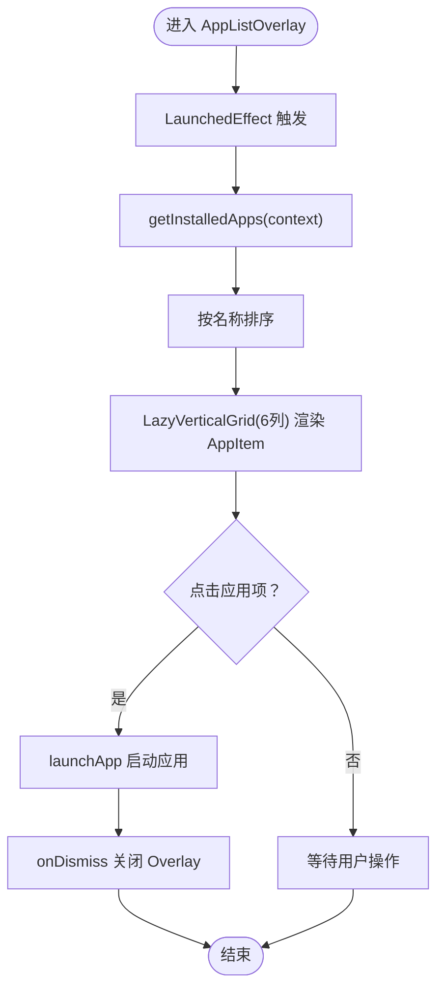
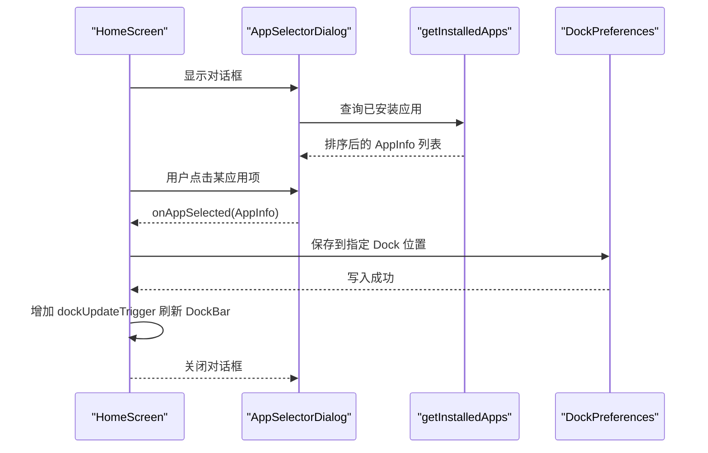
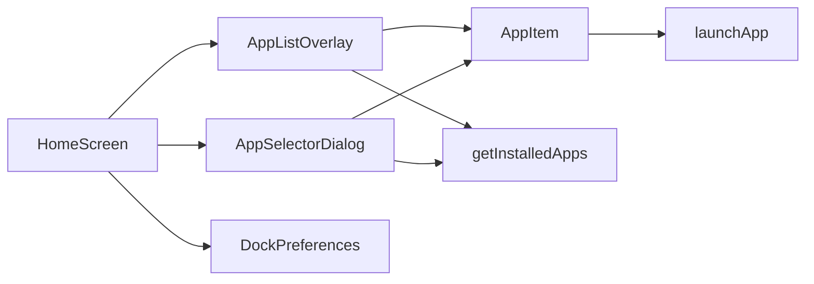

# 应用列表

<cite>
**本文引用的文件**
- [MainActivity.kt](file://app/src/main/java/com/sephp/mycarlauncher/MainActivity.kt)
- [Theme.kt](file://app/src/main/java/com/sephp/mycarlauncher/ui/theme/Theme.kt)
- [Color.kt](file://app/src/main/java/com/sephp/mycarlauncher/ui/theme/Color.kt)
- [ic_action_apps.xml](file://app/src/main/res/drawable-anydpi/ic_action_apps.xml)
</cite>

## 目录
1. [简介](#简介)
2. [项目结构](#项目结构)
3. [核心组件](#核心组件)
4. [架构总览](#架构总览)
5. [组件详解](#组件详解)
6. [依赖关系分析](#依赖关系分析)
7. [性能考量](#性能考量)
8. [故障排查指南](#故障排查指南)
9. [结论](#结论)

## 简介
本文件聚焦于全屏应用列表组件 AppListOverlay 的实现机制，说明如何通过 getInstalledApps 查询系统中所有可启动的应用并按名称排序；解释 LazyVerticalGrid 如何实现 6 列网格布局；描述 AppItem 组件的 UI 设计与点击事件处理；说明列表的遮罩层与内部容器的样式设置（背景色、圆角、边框）；并对比 AppSelectorDialog 的实现，指出两者在布局、交互与回调上的相似与差异，尤其是选择应用后回调更新 Dock 配置的流程。

## 项目结构
- 主题与颜色：位于 ui/theme 下，提供深浅色主题与颜色常量，用于全局 UI 呈现一致性。
- 主界面与组件：MainActivity.kt 中定义了 HomeScreen、DockBar、AppListOverlay、AppSelectorDialog、AppItem 等 Compose 组件，并包含应用安装信息查询、启动逻辑与 Dock 配置持久化。

图表来源
- [MainActivity.kt](file://app/src/main/java/com/sephp/mycarlauncher/MainActivity.kt#L76-L508)
- [Theme.kt](file://app/src/main/java/com/sephp/mycarlauncher/ui/theme/Theme.kt#L1-L58)
- [Color.kt](file://app/src/main/java/com/sephp/mycarlauncher/ui/theme/Color.kt#L1-L11)
- [ic_action_apps.xml](file://app/src/main/res/drawable-anydpi/ic_action_apps.xml#L1-L16)

章节来源
- [MainActivity.kt](file://app/src/main/java/com/sephp/mycarlauncher/MainActivity.kt#L76-L508)
- [Theme.kt](file://app/src/main/java/com/sephp/mycarlauncher/ui/theme/Theme.kt#L1-L58)
- [Color.kt](file://app/src/main/java/com/sephp/mycarlauncher/ui/theme/Color.kt#L1-L11)
- [ic_action_apps.xml](file://app/src/main/res/drawable-anydpi/ic_action_apps.xml#L1-L16)

## 核心组件
- AppListOverlay：全屏弹出式应用列表，支持点击遮罩层关闭、内部容器带圆角与边框、6 列网格布局、应用名称排序展示、点击启动并自动关闭。
- AppSelectorDialog：选择应用对话框，用于将选中的应用写入 Dock 指定位置，支持 5 列网格布局、回调保存到偏好设置并触发 Dock 刷新。
- AppItem：应用项卡片，包含图标容器、圆角背景、图标与标题文本，点击时触发启动或回调。
- getInstalledApps：查询系统中所有可启动应用，构建 AppInfo 列表并按名称排序。
- launchApp：根据包名获取启动意图并启动应用。
- DockPreferences：持久化 Dock 应用配置，支持读取与保存。

章节来源
- [MainActivity.kt](file://app/src/main/java/com/sephp/mycarlauncher/MainActivity.kt#L388-L508)
- [MainActivity.kt](file://app/src/main/java/com/sephp/mycarlauncher/MainActivity.kt#L443-L462)
- [MainActivity.kt](file://app/src/main/java/com/sephp/mycarlauncher/MainActivity.kt#L464-L470)

## 架构总览
AppListOverlay 与 AppSelectorDialog 共享相同的数据源与 UI 结构模式：
- 数据加载：均在 LaunchedEffect 中使用 Dispatchers.IO 异步调用 getInstalledApps 获取应用列表，避免阻塞主线程。
- UI 展示：均使用 LazyVerticalGrid 实现网格布局，AppListOverlay 使用 6 列，AppSelectorDialog 使用 5 列。
- 交互行为：AppListOverlay 在点击应用项后启动应用并关闭 Overlay；AppSelectorDialog 在点击应用项后回调 onAppSelected 并由上层保存到 Dock 配置。
- 容器样式：均使用半透明黑色遮罩层、内部容器背景色为深灰、圆角与细边框，提供一致的视觉风格。

图表来源
- [MainActivity.kt](file://app/src/main/java/com/sephp/mycarlauncher/MainActivity.kt#L76-L118)
- [MainActivity.kt](file://app/src/main/java/com/sephp/mycarlauncher/MainActivity.kt#L388-L508)
- [MainActivity.kt](file://app/src/main/java/com/sephp/mycarlauncher/MainActivity.kt#L443-L462)
- [MainActivity.kt](file://app/src/main/java/com/sephp/mycarlauncher/MainActivity.kt#L464-L470)

## 组件详解

### AppListOverlay 实现机制
- 数据加载与排序
  - 在 LaunchedEffect 中异步执行 getInstalledApps，使用 Dispatchers.IO 避免阻塞 UI。
  - 通过 PackageManager 查询带有 LAUNCHER 类别的 Activity，构建 AppInfo 列表并按名称排序。
- 网格布局与交互
  - 使用 LazyVerticalGrid(columns = GridCells.Fixed(6)) 实现 6 列网格布局，水平与垂直间距分别为 20dp 与 24dp。
  - items(installedApps) 渲染每个应用项，AppItem 负责图标与标题展示。
  - 点击应用项会调用 launchApp 并随后 onDismiss 关闭 Overlay。
- 遮罩层与容器样式
  - 外层 Box 使用半透明黑色背景作为遮罩层，点击可关闭。
  - 内部容器使用深灰背景、圆角 24dp、细边框（白色 0.1 透明度）、内边距 32dp，形成统一的卡片式容器。
  - 顶部标题与“关闭”文字采用白色高亮，提升可读性。
- 错误处理
  - 加载异常时通过 Toast 提示错误信息，finally 将 isLoading 置为 false，确保 UI 正常退出加载态。

图表来源
- [MainActivity.kt](file://app/src/main/java/com/sephp/mycarlauncher/MainActivity.kt#L388-L426)
- [MainActivity.kt](file://app/src/main/java/com/sephp/mycarlauncher/MainActivity.kt#L443-L452)
- [MainActivity.kt](file://app/src/main/java/com/sephp/mycarlauncher/MainActivity.kt#L454-L462)

章节来源
- [MainActivity.kt](file://app/src/main/java/com/sephp/mycarlauncher/MainActivity.kt#L388-L426)
- [MainActivity.kt](file://app/src/main/java/com/sephp/mycarlauncher/MainActivity.kt#L443-L452)
- [MainActivity.kt](file://app/src/main/java/com/sephp/mycarlauncher/MainActivity.kt#L454-L462)

### LazyVerticalGrid 6 列网格布局
- 列数与间距
  - columns = GridCells.Fixed(6)：固定 6 列。
  - horizontalArrangement = Arrangement.spacedBy(20.dp)：横向间距 20dp。
  - verticalArrangement = Arrangement.spacedBy(24.dp)：纵向间距 24dp。
- 适配与滚动
  - LazyVerticalGrid 支持垂直方向滚动，配合 items(installedApps) 动态渲染应用项。
- 与 AppSelectorDialog 的差异
  - AppSelectorDialog 使用 GridCells.Fixed(5)，横向/纵向间距更小，适合更紧凑的选择场景。

章节来源
- [MainActivity.kt](file://app/src/main/java/com/sephp/mycarlauncher/MainActivity.kt#L419-L421)
- [MainActivity.kt](file://app/src/main/java/com/sephp/mycarlauncher/MainActivity.kt#L501-L503)

### AppItem 组件的 UI 设计与点击事件
- UI 设计
  - 图标容器：64dp 圆角矩形背景，内部居中放置应用图标，图标尺寸 52dp。
  - 文本：应用名称，白色 13sp，单行省略，居中对齐。
  - 外层 Column 设置 4dp 内边距，整体点击反馈良好。
- 点击事件
  - AppListOverlay 中，AppItem.onClick 会启动应用并关闭 Overlay。
  - AppSelectorDialog 中，AppItem.onClick 仅触发 onAppSelected 回调，不自动关闭，由上层决定关闭时机。

章节来源
- [MainActivity.kt](file://app/src/main/java/com/sephp/mycarlauncher/MainActivity.kt#L429-L439)
- [MainActivity.kt](file://app/src/main/java/com/sephp/mycarlauncher/MainActivity.kt#L420-L421)
- [MainActivity.kt](file://app/src/main/java/com/sephp/mycarlauncher/MainActivity.kt#L502-L503)

### 列表的遮罩层与内部容器样式
- 遮罩层
  - 外层 Box 使用半透明黑色背景，覆盖整个屏幕，点击可关闭。
- 内部容器
  - 宽高为父容器的 85%，深灰背景，圆角 24dp，细边框（白色 0.1 透明度），内边距 32dp。
  - 顶部标题与“关闭”按钮采用白色高亮，提升可读性与交互提示。
- 对比 AppSelectorDialog
  - 容器尺寸略有不同（80% vs 85%），圆角与边框一致，内部内边距也略有差异（24dp vs 32dp）。

章节来源
- [MainActivity.kt](file://app/src/main/java/com/sephp/mycarlauncher/MainActivity.kt#L407-L425)
- [MainActivity.kt](file://app/src/main/java/com/sephp/mycarlauncher/MainActivity.kt#L489-L507)

### AppSelectorDialog 的实现与差异
- 数据加载与排序
  - 同样在 LaunchedEffect 中异步加载应用列表，异常时提示并退出加载态。
- 网格布局
  - 使用 5 列网格，横向/纵向间距更小，适合更紧凑的选择界面。
- 回调与 Dock 更新
  - 点击应用项后，回调 onAppSelected(AppInfo)，由上层保存到 DockPreferences 指定索引位置，并增加 dockUpdateTrigger 以刷新 DockBar。
  - 对比 AppListOverlay，AppSelectorDialog 不自动关闭，需由上层控制关闭时机。
- 样式
  - 容器尺寸与内边距与 AppListOverlay 略有差异，但整体风格保持一致。

图表来源
- [MainActivity.kt](file://app/src/main/java/com/sephp/mycarlauncher/MainActivity.kt#L76-L118)
- [MainActivity.kt](file://app/src/main/java/com/sephp/mycarlauncher/MainActivity.kt#L471-L508)
- [MainActivity.kt](file://app/src/main/java/com/sephp/mycarlauncher/MainActivity.kt#L464-L470)

章节来源
- [MainActivity.kt](file://app/src/main/java/com/sephp/mycarlauncher/MainActivity.kt#L471-L508)
- [MainActivity.kt](file://app/src/main/java/com/sephp/mycarlauncher/MainActivity.kt#L464-L470)

## 依赖关系分析
- 组件耦合
  - AppListOverlay 与 AppSelectorDialog 共同依赖 getInstalledApps、AppItem、launchApp、DockPreferences。
  - HomeScreen 作为协调者，负责状态管理与回调分发。
- 外部依赖
  - PackageManager 用于查询可启动应用。
  - SharedPreferences 用于持久化 Dock 应用配置。
- 可能的循环依赖
  - 当前结构为单向依赖：HomeScreen -> Dialog/Overlay -> 数据与工具函数，无循环依赖风险。

图表来源
- [MainActivity.kt](file://app/src/main/java/com/sephp/mycarlauncher/MainActivity.kt#L76-L118)
- [MainActivity.kt](file://app/src/main/java/com/sephp/mycarlauncher/MainActivity.kt#L388-L508)
- [MainActivity.kt](file://app/src/main/java/com/sephp/mycarlauncher/MainActivity.kt#L443-L462)
- [MainActivity.kt](file://app/src/main/java/com/sephp/mycarlauncher/MainActivity.kt#L464-L470)

章节来源
- [MainActivity.kt](file://app/src/main/java/com/sephp/mycarlauncher/MainActivity.kt#L76-L118)
- [MainActivity.kt](file://app/src/main/java/com/sephp/mycarlauncher/MainActivity.kt#L388-L508)

## 性能考量
- 异步加载：使用 Dispatchers.IO 在后台线程查询应用列表，避免阻塞 UI。
- 懒加载：LazyVerticalGrid 按需渲染，减少一次性绘制压力。
- 排序成本：按名称排序在 IO 线程完成，避免主线程卡顿。
- 建议优化
  - 若应用数量较多，可考虑分页或虚拟化策略进一步降低内存占用。
  - 对图标加载进行缓存，减少重复绘制成本。

## 故障排查指南
- 应用列表加载失败
  - 现象：显示“加载失败”提示。
  - 排查：检查 PackageManager 权限与异常日志；确认 getInstalledApps 是否抛出异常。
- 启动应用失败
  - 现象：启动应用时报错或无响应。
  - 排查：确认包名有效、存在启动 Intent；检查 launchApp 的异常捕获与提示。
- Dock 更新无效
  - 现象：选择应用后 Dock 未刷新。
  - 排查：确认 onAppSelected 回调是否触发；检查 DockPreferences.saveDockApp 是否写入成功；确认 HomeScreen 中 dockUpdateTrigger 是否递增。

章节来源
- [MainActivity.kt](file://app/src/main/java/com/sephp/mycarlauncher/MainActivity.kt#L394-L405)
- [MainActivity.kt](file://app/src/main/java/com/sephp/mycarlauncher/MainActivity.kt#L454-L462)
- [MainActivity.kt](file://app/src/main/java/com/sephp/mycarlauncher/MainActivity.kt#L106-L116)
- [MainActivity.kt](file://app/src/main/java/com/sephp/mycarlauncher/MainActivity.kt#L464-L470)

## 结论
AppListOverlay 与 AppSelectorDialog 均基于相同的查询与渲染模式，通过 LazyVerticalGrid 实现网格布局，AppListOverlay 侧重全屏浏览与一键启动，AppSelectorDialog 侧重 Dock 应用选择与持久化更新。两者在遮罩层、容器样式与圆角边框方面保持一致的视觉风格，差异主要体现在列数、间距、交互关闭策略与回调目标上。整体实现简洁清晰，具备良好的扩展性与可维护性。