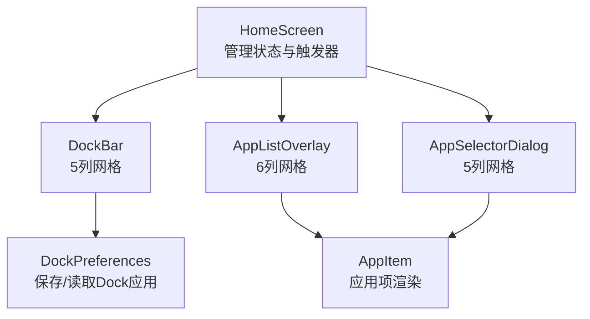
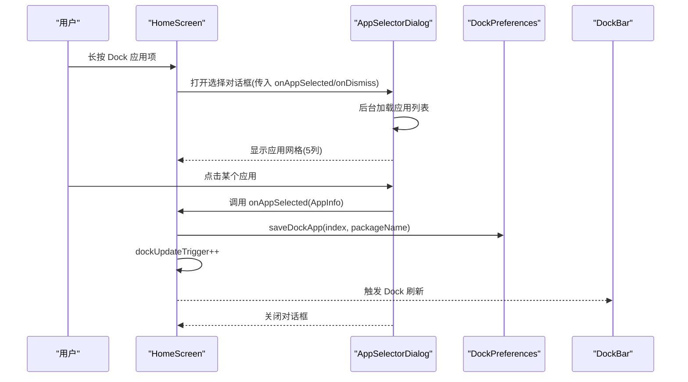
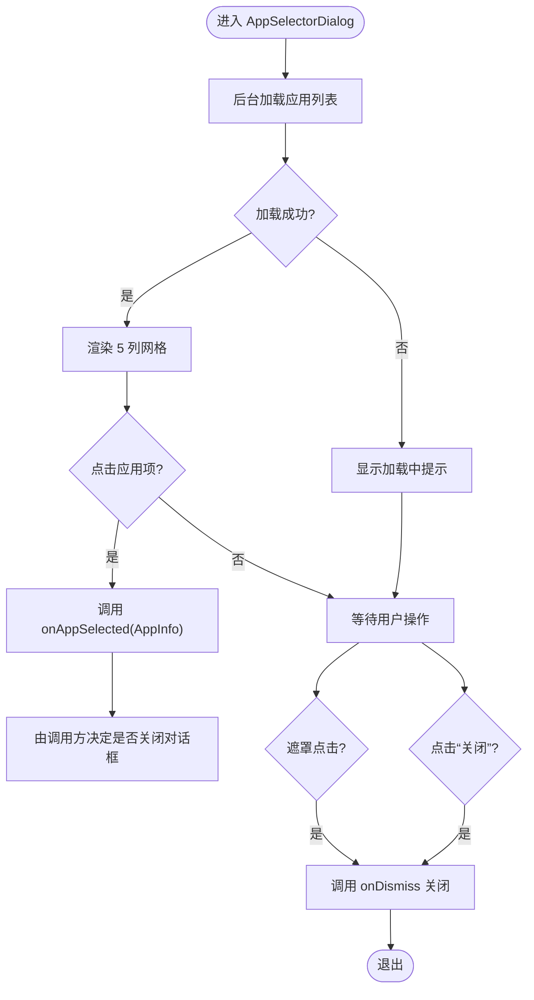
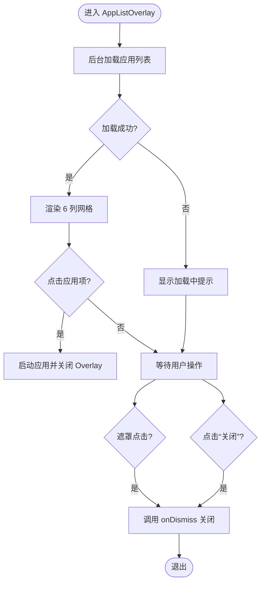
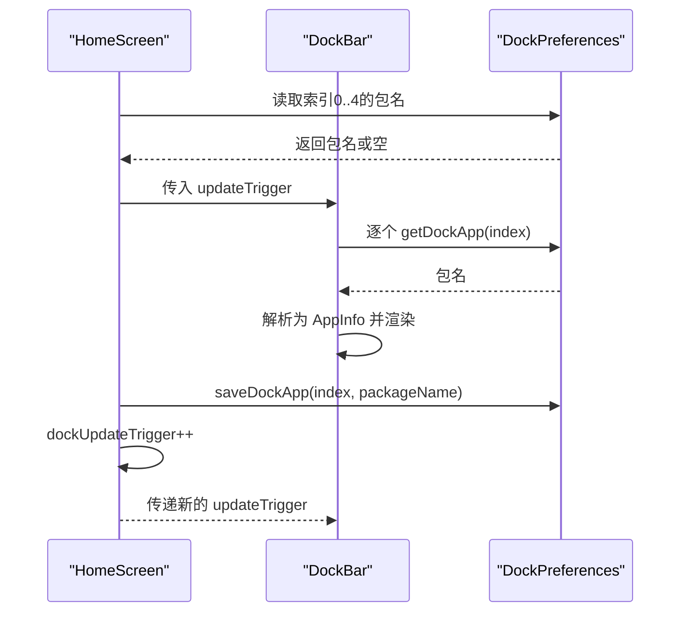
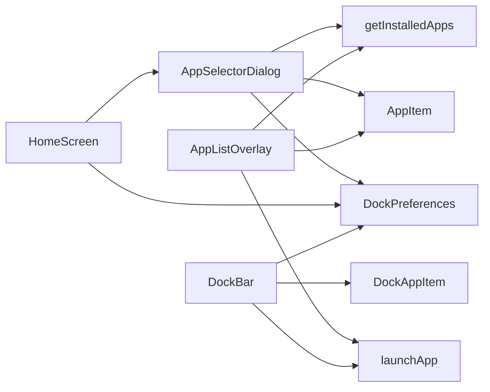

# 应用选择对话框

<cite>
**本文引用的文件**
- [MainActivity.kt](file://app/src/main/java/com/sephp/mycarlauncher/MainActivity.kt)
</cite>

## 目录
1. [简介](#简介)
2. [项目结构](#项目结构)
3. [核心组件](#核心组件)
4. [架构总览](#架构总览)
5. [详细组件分析](#详细组件分析)
6. [依赖关系分析](#依赖关系分析)
7. [性能考量](#性能考量)
8. [故障排查指南](#故障排查指南)
9. [结论](#结论)

## 简介
本文件聚焦于 AppSelectorDialog 的实现原理，并将其与 AppListOverlay 在 UI 布局与交互逻辑上进行对比分析。重点说明：
- 网格列数差异：AppListOverlay 使用 6 列，AppSelectorDialog 使用 5 列
- 尺寸比例与容器样式差异：两者的宽度/高度比例、圆角、边框、内边距不同
- 核心功能：选择应用后通过 onAppSelected 回调更新 Dock 配置的完整流程，包括调用 DockPreferences.saveDockApp 保存包名、触发 dockUpdateTrigger 状态更新以刷新 Dock 栏显示
- 对话框遮罩层点击关闭机制与取消按钮行为

## 项目结构
本项目采用 Jetpack Compose 构建界面，核心逻辑集中在 MainActivity.kt 中，包含以下关键 Composable 组件：
- HomeScreen：顶层容器，管理对话框状态与 Dock 更新触发器
- DockBar：左侧 Dock 栏，展示 5 个可配置的应用入口
- AppListOverlay：全屏覆盖式“所有应用”列表，用于直接启动应用
- AppSelectorDialog：选择应用对话框，用于为 Dock 指定位置设置应用
- DockPreferences：持久化存储 Dock 应用包名
- AppItem：应用项通用渲染组件

图表来源
- [MainActivity.kt](file://app/src/main/java/com/sephp/mycarlauncher/MainActivity.kt#L76-L118)
- [MainActivity.kt](file://app/src/main/java/com/sephp/mycarlauncher/MainActivity.kt#L136-L205)
- [MainActivity.kt](file://app/src/main/java/com/sephp/mycarlauncher/MainActivity.kt#L388-L425)
- [MainActivity.kt](file://app/src/main/java/com/sephp/mycarlauncher/MainActivity.kt#L471-L507)
- [MainActivity.kt](file://app/src/main/java/com/sephp/mycarlauncher/MainActivity.kt#L441-L462)
- [MainActivity.kt](file://app/src/main/java/com/sephp/mycarlauncher/MainActivity.kt#L464-L469)

章节来源
- [MainActivity.kt](file://app/src/main/java/com/sephp/mycarlauncher/MainActivity.kt#L76-L118)

## 核心组件
- AppSelectorDialog：用于从系统已安装应用中选择一个应用，作为指定 Dock 位置的入口。其 onAppSelected 回调负责写入持久化并触发 Dock 刷新。
- AppListOverlay：用于浏览系统全部应用并直接启动，适合快速打开应用。
- DockPreferences：提供保存/读取 Dock 应用包名的接口。
- DockBar：展示当前已配置的 Dock 应用，支持长按进入选择流程。

章节来源
- [MainActivity.kt](file://app/src/main/java/com/sephp/mycarlauncher/MainActivity.kt#L471-L507)
- [MainActivity.kt](file://app/src/main/java/com/sephp/mycarlauncher/MainActivity.kt#L388-L425)
- [MainActivity.kt](file://app/src/main/java/com/sephp/mycarlauncher/MainActivity.kt#L464-L469)
- [MainActivity.kt](file://app/src/main/java/com/sephp/mycarlauncher/MainActivity.kt#L136-L205)

## 架构总览
AppSelectorDialog 与 AppListOverlay 共享相似的加载与渲染模式：均在后台线程异步加载应用列表，使用 LazyVerticalGrid 渲染，支持加载状态提示；但交互目标不同：前者用于配置 Dock，后者用于直接启动应用。

图表来源
- [MainActivity.kt](file://app/src/main/java/com/sephp/mycarlauncher/MainActivity.kt#L76-L118)
- [MainActivity.kt](file://app/src/main/java/com/sephp/mycarlauncher/MainActivity.kt#L471-L507)
- [MainActivity.kt](file://app/src/main/java/com/sephp/mycarlauncher/MainActivity.kt#L464-L469)
- [MainActivity.kt](file://app/src/main/java/com/sephp/mycarlauncher/MainActivity.kt#L136-L205)

## 详细组件分析

### AppSelectorDialog 实现要点
- 状态管理
  - 使用 remember 管理 installedApps 与 isLoading，LaunchedEffect 在首次进入时异步加载应用列表
- 布局与样式
  - 外层遮罩背景透明度 0.8，居中对齐
  - 内层容器宽高各占 0.8，圆角 24dp，内边距 24dp
  - 标题行包含“选择应用”标题与“关闭”文本按钮
- 网格与交互
  - LazyVerticalGrid 使用固定 5 列，间距较小，适合紧凑选择
  - 每个 AppItem 点击触发 onAppSelected 回调，不自动关闭对话框（由调用方决定）
- 关闭机制
  - 遮罩层点击 onDismiss 关闭
  - 标题右侧“关闭”文本按钮也调用 onDismiss

图表来源
- [MainActivity.kt](file://app/src/main/java/com/sephp/mycarlauncher/MainActivity.kt#L471-L507)

章节来源
- [MainActivity.kt](file://app/src/main/java/com/sephp/mycarlauncher/MainActivity.kt#L471-L507)

### AppListOverlay 实现要点
- 状态管理
  - 同样使用 remember 管理 installedApps 与 isLoading，LaunchedEffect 异步加载
- 布局与样式
  - 容器宽高各占 0.85，圆角 24dp，带细边框与更大内边距 32dp
  - 标题为“所有应用”，右侧“关闭”按钮
- 网格与交互
  - LazyVerticalGrid 使用固定 6 列，间距较大，适合浏览与快速启动
  - 每个 AppItem 点击后直接启动应用并关闭 Overlay

图表来源
- [MainActivity.kt](file://app/src/main/java/com/sephp/mycarlauncher/MainActivity.kt#L388-L425)

章节来源
- [MainActivity.kt](file://app/src/main/java/com/sephp/mycarlauncher/MainActivity.kt#L388-L425)

### DockBar 与 DockPreferences 的协作
- DockBar 在 updateTrigger 改变时重新加载 5 个 Dock 应用项，异步从 DockPreferences 读取每个索引对应的包名并解析 AppInfo
- AppSelectorDialog 的 onAppSelected 回调会调用 DockPreferences.saveDockApp 写入指定索引的包名，随后 HomeScreen 增大 dockUpdateTrigger，从而触发 DockBar 重新加载

图表来源
- [MainActivity.kt](file://app/src/main/java/com/sephp/mycarlauncher/MainActivity.kt#L136-L205)
- [MainActivity.kt](file://app/src/main/java/com/sephp/mycarlauncher/MainActivity.kt#L464-L469)
- [MainActivity.kt](file://app/src/main/java/com/sephp/mycarlauncher/MainActivity.kt#L76-L118)

章节来源
- [MainActivity.kt](file://app/src/main/java/com/sephp/mycarlauncher/MainActivity.kt#L136-L205)
- [MainActivity.kt](file://app/src/main/java/com/sephp/mycarlauncher/MainActivity.kt#L464-L469)
- [MainActivity.kt](file://app/src/main/java/com/sephp/mycarlauncher/MainActivity.kt#L76-L118)

## 依赖关系分析
- AppSelectorDialog 依赖：
  - getInstalledApps：从系统查询应用并排序
  - AppItem：通用应用项渲染
  - DockPreferences：保存 Dock 应用包名
  - HomeScreen：通过 onAppSelected 回调完成配置与刷新
- AppListOverlay 依赖：
  - getInstalledApps：查询应用列表
  - AppItem：通用应用项渲染
  - launchApp：直接启动应用
- DockBar 依赖：
  - DockPreferences：读取已配置应用
  - DockAppItem：渲染单个 Dock 应用项
  - launchApp：启动已配置应用

图表来源
- [MainActivity.kt](file://app/src/main/java/com/sephp/mycarlauncher/MainActivity.kt#L443-L462)
- [MainActivity.kt](file://app/src/main/java/com/sephp/mycarlauncher/MainActivity.kt#L471-L507)
- [MainActivity.kt](file://app/src/main/java/com/sephp/mycarlauncher/MainActivity.kt#L388-L425)
- [MainActivity.kt](file://app/src/main/java/com/sephp/mycarlauncher/MainActivity.kt#L136-L205)

章节来源
- [MainActivity.kt](file://app/src/main/java/com/sephp/mycarlauncher/MainActivity.kt#L443-L462)
- [MainActivity.kt](file://app/src/main/java/com/sephp/mycarlauncher/MainActivity.kt#L471-L507)
- [MainActivity.kt](file://app/src/main/java/com/sephp/mycarlauncher/MainActivity.kt#L388-L425)
- [MainActivity.kt](file://app/src/main/java/com/sephp/mycarlauncher/MainActivity.kt#L136-L205)

## 性能考量
- 异步加载：两个对话框均在后台线程加载应用列表，避免阻塞 UI
- 列表渲染：LazyVerticalGrid 按需渲染，减少不必要的绘制
- 状态最小化：仅在需要时更新 dockUpdateTrigger，避免无谓重绘
- 图标与文本：AppItem 使用预渲染的 Drawable 或占位，降低计算成本

[本节为通用建议，无需特定文件引用]

## 故障排查指南
- 加载应用失败
  - 现象：显示“加载应用列表失败”
  - 可能原因：系统权限限制、包管理器异常
  - 排查步骤：检查异常消息提示，确认设备权限配置
- 无法启动应用
  - 现象：点击应用无响应
  - 可能原因：目标应用未正确安装或存在异常
  - 排查步骤：尝试手动启动该应用，确认包名有效
- Dock 不更新
  - 现象：更换 Dock 应用后未生效
  - 可能原因：未触发 dockUpdateTrigger 或保存失败
  - 排查步骤：确认 onAppSelected 已被调用，检查 DockPreferences 是否写入成功，确保 HomeScreen 增大了 updateTrigger

章节来源
- [MainActivity.kt](file://app/src/main/java/com/sephp/mycarlauncher/MainActivity.kt#L471-L507)
- [MainActivity.kt](file://app/src/main/java/com/sephp/mycarlauncher/MainActivity.kt#L388-L425)
- [MainActivity.kt](file://app/src/main/java/com/sephp/mycarlauncher/MainActivity.kt#L464-L469)

## 结论
- AppSelectorDialog 与 AppListOverlay 在 UI 结构上高度一致，均采用遮罩层 + 圆角容器 + LazyVerticalGrid 的组合，但在网格列数、尺寸比例与容器样式上存在差异，分别服务于“配置 Dock 应用”和“浏览并启动应用”的不同场景
- AppSelectorDialog 的核心流程是：异步加载应用 -> 用户选择 -> 通过 onAppSelected 回调写入 DockPreferences -> 增量更新 dockUpdateTrigger -> DockBar 重新加载
- 遮罩层点击与标题“关闭”按钮均能关闭对话框，取消按钮行为一致，便于用户快速退出