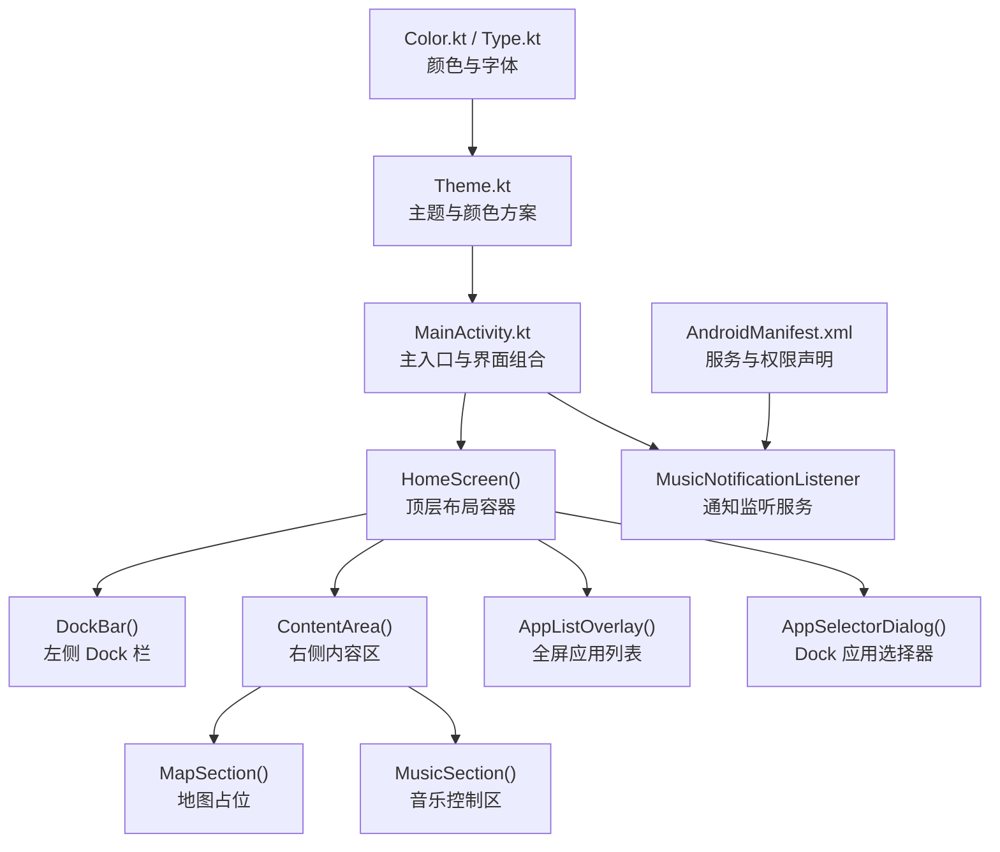
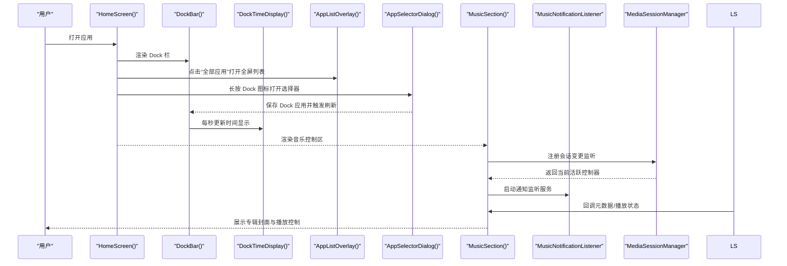
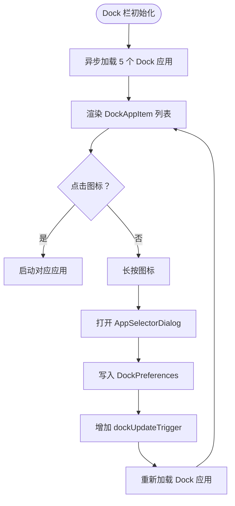
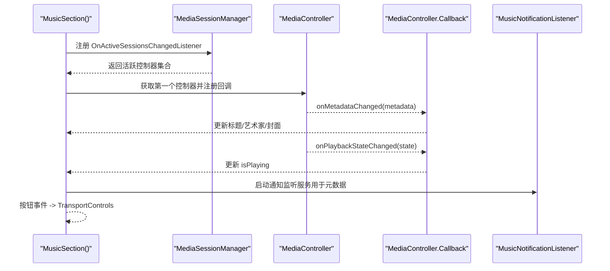
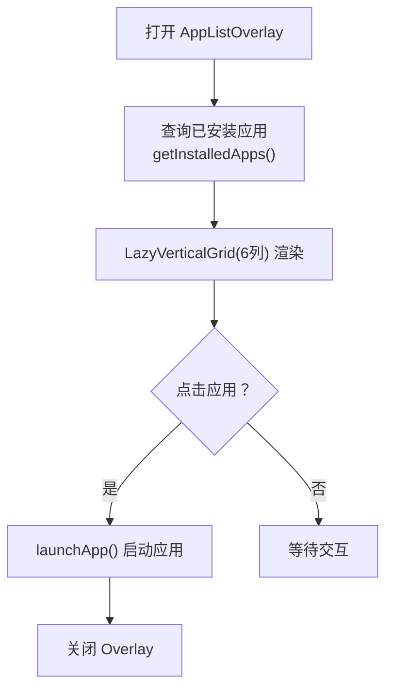
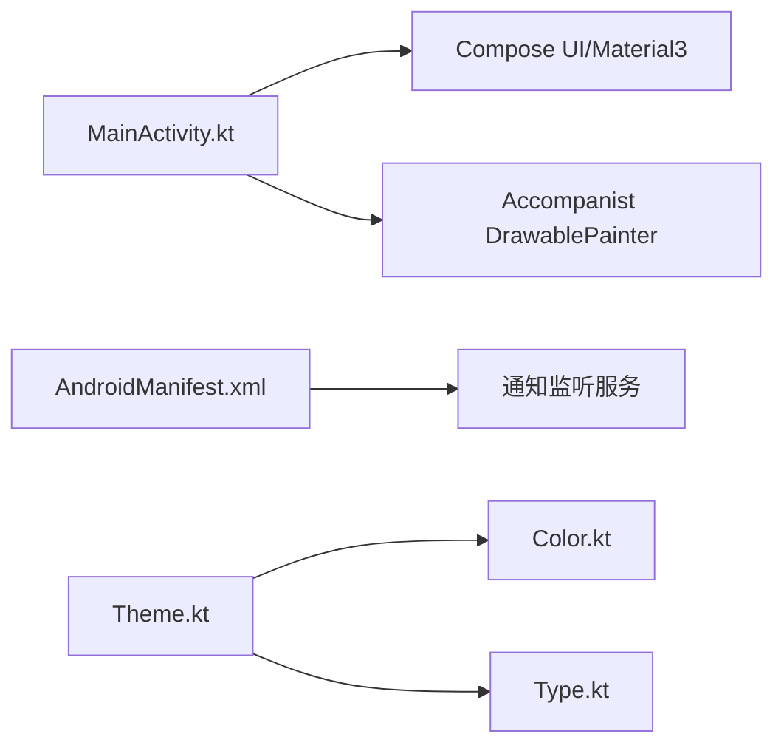

# 核心功能

<cite>
**本文引用的文件**
- [MainActivity.kt](file://app/src/main/java/com/sephp/mycarlauncher/MainActivity.kt)
- [AndroidManifest.xml](file://app/src/main/AndroidManifest.xml)
- [Theme.kt](file://app/src/main/java/com/sephp/mycarlauncher/ui/theme/Theme.kt)
- [Color.kt](file://app/src/main/java/com/sephp/mycarlauncher/ui/theme/Color.kt)
- [Type.kt](file://app/src/main/java/com/sephp/mycarlauncher/ui/theme/Type.kt)
- [strings.xml](file://app/src/main/res/values/strings.xml)
- [build.gradle.kts](file://app/build.gradle.kts)
</cite>

## 目录
1. [简介](#简介)
2. [项目结构](#项目结构)
3. [核心组件](#核心组件)
4. [架构总览](#架构总览)
5. [详细组件分析](#详细组件分析)
6. [依赖分析](#依赖分析)
7. [性能考虑](#性能考虑)
8. [故障排查指南](#故障排查指南)
9. [结论](#结论)

## 简介
本文件系统性梳理 MyCarLauncher 的核心功能实现，重点覆盖：
- Dock 栏时间显示与应用管理（含长按编辑）
- 音乐控制模块（MediaSessionManager 监听、播放状态与专辑封面加载、播放控制按钮交互）
- 全屏应用列表（应用查询、网格布局、启动流程）

文档以可操作的“代码片段路径”形式标注关键实现位置，并辅以可视化图示帮助理解调用链与数据流。

## 项目结构
应用采用 Jetpack Compose 构建，主入口为 Activity，界面由多个 Composable 组合而成；主题与字体样式位于 ui/theme 包中；媒体通知监听服务在清单中声明并作为后台服务运行。

图表来源
- [MainActivity.kt](file://app/src/main/java/com/sephp/mycarlauncher/MainActivity.kt#L64-L118)
- [MainActivity.kt](file://app/src/main/java/com/sephp/mycarlauncher/MainActivity.kt#L136-L206)
- [MainActivity.kt](file://app/src/main/java/com/sephp/mycarlauncher/MainActivity.kt#L228-L351)
- [MainActivity.kt](file://app/src/main/java/com/sephp/mycarlauncher/MainActivity.kt#L388-L405)
- [MainActivity.kt](file://app/src/main/java/com/sephp/mycarlauncher/MainActivity.kt#L448-L463)
- [AndroidManifest.xml](file://app/src/main/AndroidManifest.xml#L25-L33)
- [Theme.kt](file://app/src/main/java/com/sephp/mycarlauncher/ui/theme/Theme.kt#L36-L58)
- [Color.kt](file://app/src/main/java/com/sephp/mycarlauncher/ui/theme/Color.kt#L1-L11)
- [Type.kt](file://app/src/main/java/com/sephp/mycarlauncher/ui/theme/Type.kt#L1-L34)

章节来源
- [MainActivity.kt](file://app/src/main/java/com/sephp/mycarlauncher/MainActivity.kt#L64-L118)
- [AndroidManifest.xml](file://app/src/main/AndroidManifest.xml#L25-L33)
- [Theme.kt](file://app/src/main/java/com/sephp/mycarlauncher/ui/theme/Theme.kt#L36-L58)
- [Color.kt](file://app/src/main/java/com/sephp/mycarlauncher/ui/theme/Color.kt#L1-L11)
- [Type.kt](file://app/src/main/java/com/sephp/mycarlauncher/ui/theme/Type.kt#L1-L34)

## 核心组件
- 主界面容器：HomeScreen 负责组织 Dock 栏、内容区、以及弹出层（应用列表、应用选择器）。
- Dock 栏：包含时间显示、垂直排列的应用图标、以及“全部应用”入口。
- 内容区：上半部分地图占位区，下半部分音乐控制区。
- 音乐控制区：使用 MediaSessionManager 监听当前活跃会话，异步加载专辑封面，展示标题/艺术家，提供上一首/播放/暂停/下一首控制。
- 应用列表与选择器：全屏网格展示已安装应用，支持点击启动；Dock 栏长按弹出选择器，保存到指定索引并刷新显示。
- 主题系统：Material3 主题，支持动态色与深浅模式切换。

章节来源
- [MainActivity.kt](file://app/src/main/java/com/sephp/mycarlauncher/MainActivity.kt#L76-L118)
- [MainActivity.kt](file://app/src/main/java/com/sephp/mycarlauncher/MainActivity.kt#L136-L206)
- [MainActivity.kt](file://app/src/main/java/com/sephp/mycarlauncher/MainActivity.kt#L228-L351)
- [MainActivity.kt](file://app/src/main/java/com/sephp/mycarlauncher/MainActivity.kt#L388-L405)
- [MainActivity.kt](file://app/src/main/java/com/sephp/mycarlauncher/MainActivity.kt#L448-L463)
- [Theme.kt](file://app/src/main/java/com/sephp/mycarlauncher/ui/theme/Theme.kt#L36-L58)

## 架构总览
下图展示从用户交互到数据更新与 UI 刷新的关键调用链路，涵盖 Dock 时间更新、应用选择、音乐会话监听与封面加载等。

图表来源
- [MainActivity.kt](file://app/src/main/java/com/sephp/mycarlauncher/MainActivity.kt#L76-L118)
- [MainActivity.kt](file://app/src/main/java/com/sephp/mycarlauncher/MainActivity.kt#L136-L206)
- [MainActivity.kt](file://app/src/main/java/com/sephp/mycarlauncher/MainActivity.kt#L120-L134)
- [MainActivity.kt](file://app/src/main/java/com/sephp/mycarlauncher/MainActivity.kt#L388-L405)
- [MainActivity.kt](file://app/src/main/java/com/sephp/mycarlauncher/MainActivity.kt#L448-L463)
- [MainActivity.kt](file://app/src/main/java/com/sephp/mycarlauncher/MainActivity.kt#L254-L351)
- [AndroidManifest.xml](file://app/src/main/AndroidManifest.xml#L25-L33)

## 详细组件分析

### Dock 栏：时间显示、应用管理与长按编辑
- 时间显示：DockTimeDisplay 使用协程每秒更新一次时间三元组（时分、星期、年月日），并在 Compose 生命周期内持续运行。
- 应用管理：
  - DockBar 异步加载 5 个 Dock 应用图标，避免阻塞主线程。
  - DockAppItem 支持点击启动或长按进入编辑流程。
  - DockPreferences 通过共享偏好保存每个索引对应的包名。
- 长按编辑：
  - HomeScreen 中维护 selectedDockIndex 与 showAppSelector 状态，长按后弹出 AppSelectorDialog。
  - AppSelectorDialog 展示全量应用网格，选择后通过 DockPreferences.saveDockApp 写入并增加 dockUpdateTrigger 触发重新加载。

图表来源
- [MainActivity.kt](file://app/src/main/java/com/sephp/mycarlauncher/MainActivity.kt#L136-L206)
- [MainActivity.kt](file://app/src/main/java/com/sephp/mycarlauncher/MainActivity.kt#L440-L445)
- [MainActivity.kt](file://app/src/main/java/com/sephp/mycarlauncher/MainActivity.kt#L102-L117)

章节来源
- [MainActivity.kt](file://app/src/main/java/com/sephp/mycarlauncher/MainActivity.kt#L120-L134)
- [MainActivity.kt](file://app/src/main/java/com/sephp/mycarlauncher/MainActivity.kt#L136-L206)
- [MainActivity.kt](file://app/src/main/java/com/sephp/mycarlauncher/MainActivity.kt#L440-L445)
- [MainActivity.kt](file://app/src/main/java/com/sephp/mycarlauncher/MainActivity.kt#L102-L117)

### 音乐控制模块：MediaSessionManager 监听与播放控制
- 会话监听与回调：
  - MusicSection 在 DisposableEffect 中注册 MediaSessionManager.OnActiveSessionsChangedListener，当活跃控制器变化时，注销旧回调并注册新回调。
  - 通过 MediaController.Callback 监听 onMetadataChanged 与 onPlaybackStateChanged，实时更新标题、艺术家与播放状态。
- 专辑封面加载：
  - LaunchedEffect 基于当前 MediaMetadata 异步尝试读取 METADATA_KEY_ALBUM_ART 或 METADATA_KEY_ART，失败则回退为空。
- 控制按钮交互：
  - 上一首/播放/暂停/下一首分别映射到 TransportControls 的 skipToPrevious/skipToNext/pause/play。
  - 主按钮根据 isPlaying 切换图标与行为。
- 通知权限提示：
  - 若未开启通知监听权限，提示用户前往设置并跳转到通知监听设置页。

图表来源
- [MainActivity.kt](file://app/src/main/java/com/sephp/mycarlauncher/MainActivity.kt#L254-L351)
- [MainActivity.kt](file://app/src/main/java/com/sephp/mycarlauncher/MainActivity.kt#L353-L365)
- [MainActivity.kt](file://app/src/main/java/com/sephp/mycarlauncher/MainActivity.kt#L367-L375)
- [AndroidManifest.xml](file://app/src/main/AndroidManifest.xml#L25-L33)

章节来源
- [MainActivity.kt](file://app/src/main/java/com/sephp/mycarlauncher/MainActivity.kt#L254-L351)
- [MainActivity.kt](file://app/src/main/java/com/sephp/mycarlauncher/MainActivity.kt#L353-L365)
- [MainActivity.kt](file://app/src/main/java/com/sephp/mycarlauncher/MainActivity.kt#L367-L375)
- [AndroidManifest.xml](file://app/src/main/AndroidManifest.xml#L25-L33)

### 全屏应用列表：查询、网格布局与启动
- 应用查询：
  - getInstalledApps 通过 PackageManager 查询带有 LAUNCHER 类别的应用，构建 AppInfo 列表并按名称排序。
- 网格布局：
  - AppListOverlay 使用 LazyVerticalGrid（6 列）展示应用图标与名称，点击项后启动应用并关闭 Overlay。
- 启动流程：
  - launchApp 通过包名获取启动 Intent 并启动目标应用；异常捕获保证健壮性。

图表来源
- [MainActivity.kt](file://app/src/main/java/com/sephp/mycarlauncher/MainActivity.kt#L388-L405)
- [MainActivity.kt](file://app/src/main/java/com/sephp/mycarlauncher/MainActivity.kt#L422-L431)
- [MainActivity.kt](file://app/src/main/java/com/sephp/mycarlauncher/MainActivity.kt#L433-L438)

章节来源
- [MainActivity.kt](file://app/src/main/java/com/sephp/mycarlauncher/MainActivity.kt#L388-L405)
- [MainActivity.kt](file://app/src/main/java/com/sephp/mycarlauncher/MainActivity.kt#L422-L431)
- [MainActivity.kt](file://app/src/main/java/com/sephp/mycarlauncher/MainActivity.kt#L433-L438)

## 依赖分析
- 运行时依赖：Compose UI、Material3、Accompanist DrawablePainter。
- 权限与查询：声明 QUERY_ALL_PACKAGES；清单中声明通知监听服务。
- 主题依赖：Theme.kt 依赖 Color.kt 与 Type.kt 提供的颜色与排版。

图表来源
- [build.gradle.kts](file://app/build.gradle.kts#L44-L65)
- [AndroidManifest.xml](file://app/src/main/AndroidManifest.xml#L25-L33)
- [Theme.kt](file://app/src/main/java/com/sephp/mycarlauncher/ui/theme/Theme.kt#L36-L58)
- [Color.kt](file://app/src/main/java/com/sephp/mycarlauncher/ui/theme/Color.kt#L1-L11)
- [Type.kt](file://app/src/main/java/com/sephp/mycarlauncher/ui/theme/Type.kt#L1-L34)

章节来源
- [build.gradle.kts](file://app/build.gradle.kts#L44-L65)
- [AndroidManifest.xml](file://app/src/main/AndroidManifest.xml#L25-L33)
- [Theme.kt](file://app/src/main/java/com/sephp/mycarlauncher/ui/theme/Theme.kt#L36-L58)
- [Color.kt](file://app/src/main/java/com/sephp/mycarlauncher/ui/theme/Color.kt#L1-L11)
- [Type.kt](file://app/src/main/java/com/sephp/mycarlauncher/ui/theme/Type.kt#L1-L34)

## 性能考虑
- 异步加载：Dock 应用与音乐封面均在 IO 线程执行，避免阻塞主线程。
- 状态驱动：使用 remember 与 LaunchedEffect 管理状态更新，减少不必要的重组。
- 网格渲染：LazyVerticalGrid 仅渲染可见项，提升大列表滚动性能。
- 主题切换：Material3 动态色在 Android 12+ 自动启用，降低主题切换成本。

## 故障排查指南
- 无法显示音乐信息：
  - 现象：音乐区显示默认文案且无封面。
  - 排查：确认已授予通知监听权限；若未开启，将弹出提示并跳转设置页面。
  - 参考路径：[通知权限检查与跳转](file://app/src/main/java/com/sephp/mycarlauncher/MainActivity.kt#L285-L290)
- 专辑封面不显示：
  - 现象：封面区域显示默认图标。
  - 排查：确认媒体源提供 METADATA_KEY_ALBUM_ART 或 METADATA_KEY_ART；异常时会回退为空。
  - 参考路径：[封面加载逻辑](file://app/src/main/java/com/sephp/mycarlauncher/MainActivity.kt#L261-L269)
- Dock 应用未更新：
  - 现象：长按后选择应用但 Dock 仍显示空图标。
  - 排查：确保保存成功并增加 dockUpdateTrigger；确认 DockPreferences 键值正确。
  - 参考路径：[保存与刷新](file://app/src/main/java/com/sephp/mycarlauncher/MainActivity.kt#L102-L117), [DockPreferences](file://app/src/main/java/com/sephp/mycarlauncher/MainActivity.kt#L440-L445)
- 应用启动失败：
  - 现象：点击应用无反应。
  - 排查：确认包名有效且存在启动 Intent；捕获异常避免崩溃。
  - 参考路径：[启动应用](file://app/src/main/java/com/sephp/mycarlauncher/MainActivity.kt#L433-L438)

章节来源
- [MainActivity.kt](file://app/src/main/java/com/sephp/mycarlauncher/MainActivity.kt#L285-L290)
- [MainActivity.kt](file://app/src/main/java/com/sephp/mycarlauncher/MainActivity.kt#L261-L269)
- [MainActivity.kt](file://app/src/main/java/com/sephp/mycarlauncher/MainActivity.kt#L102-L117)
- [MainActivity.kt](file://app/src/main/java/com/sephp/mycarlauncher/MainActivity.kt#L440-L445)
- [MainActivity.kt](file://app/src/main/java/com/sephp/mycarlauncher/MainActivity.kt#L433-L438)

## 结论
MyCarLauncher 以 Jetpack Compose 实现了简洁高效的车载桌面体验：
- Dock 栏提供快速应用入口与时间显示，支持长按编辑 Dock 应用。
- 音乐控制区通过 MediaSessionManager 与通知监听服务实现稳定的播放状态与封面加载。
- 全屏应用列表采用网格布局，提供流畅的应用浏览与启动体验。
整体架构清晰、职责分离明确，具备良好的扩展性与可维护性。