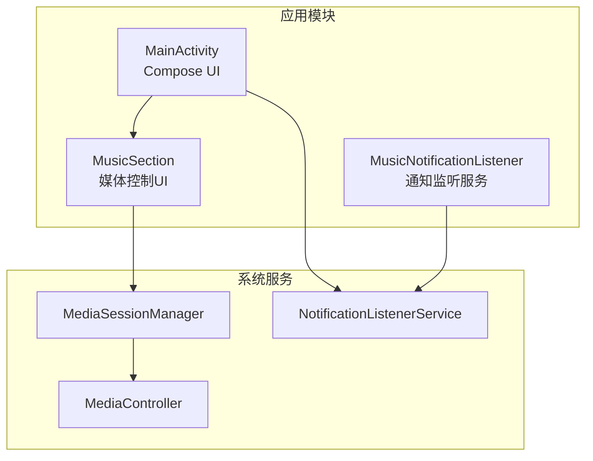
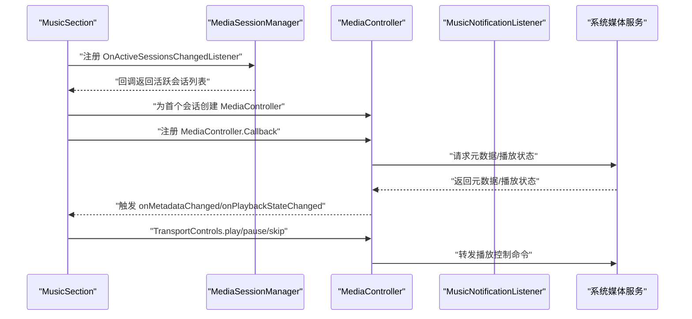
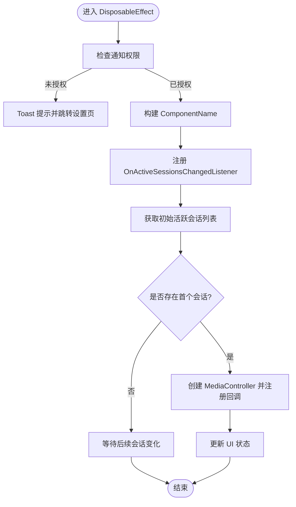
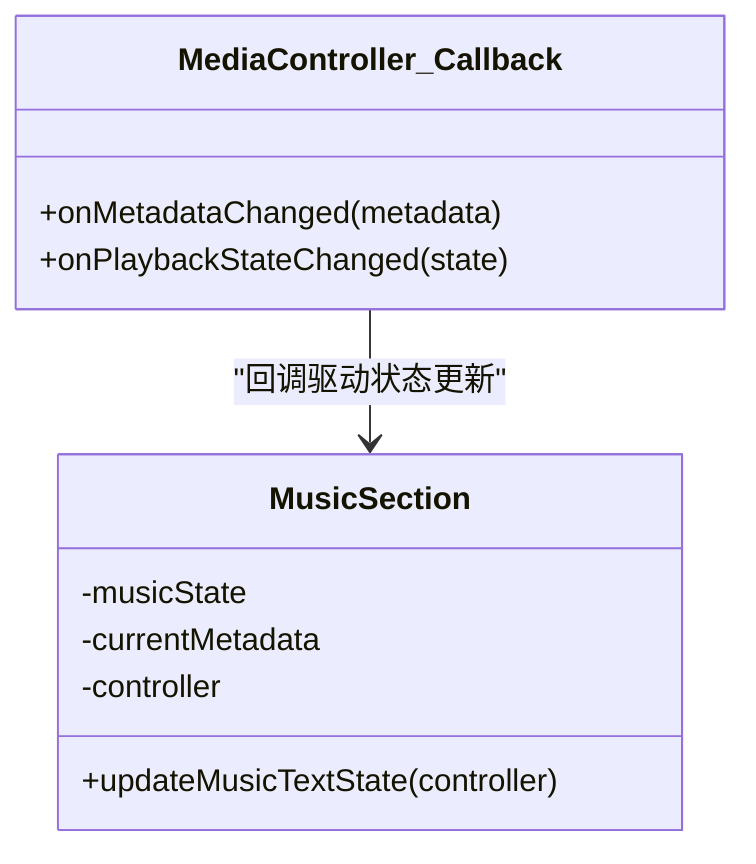
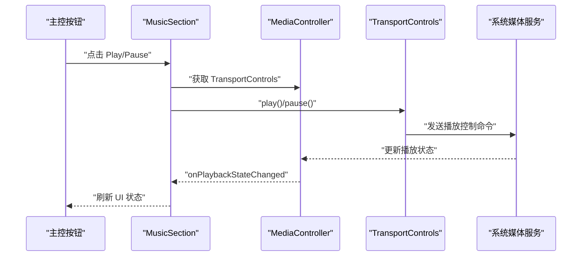
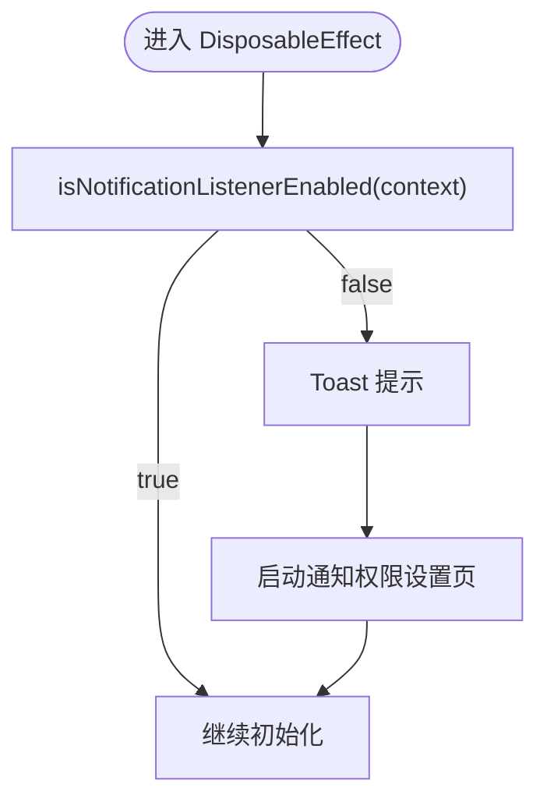
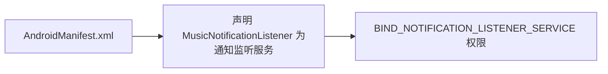
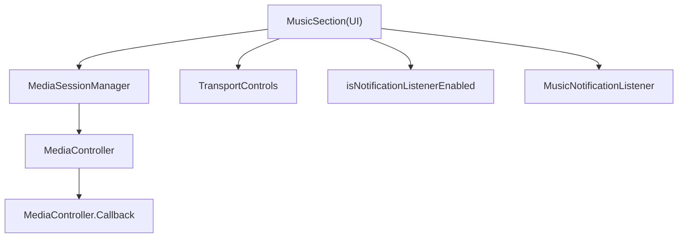

# 媒体会话集成

<cite>
**本文引用的文件**
- [MainActivity.kt](file://app/src/main/java/com/sephp/mycarlauncher/MainActivity.kt)
- [AndroidManifest.xml](file://app/src/main/AndroidManifest.xml)
</cite>

## 目录
1. [引言](#引言)
2. [项目结构](#项目结构)
3. [核心组件](#核心组件)
4. [架构总览](#架构总览)
5. [详细组件分析](#详细组件分析)
6. [依赖关系分析](#依赖关系分析)
7. [性能考虑](#性能考虑)
8. [故障排查指南](#故障排查指南)
9. [结论](#结论)

## 引言
本文件围绕应用如何通过 MediaSessionManager 与系统媒体服务进行集成展开，重点说明以下内容：
- OnActiveSessionsChangedListener 的注册流程，包括 ComponentName 的构建与 MusicNotificationListener 服务的关联。
- 如何通过 OnActiveSessionsChangedListener 获取活跃媒体会话列表，并建立 MediaController 连接。
- MediaController.Callback 的 onMetadataChanged 和 onPlaybackStateChanged 事件监听机制。
- transportControls 如何发送播放控制命令（play/pause/skip）。
- 权限处理逻辑：isNotificationListenerEnabled 检查、权限缺失时的 Toast 提示与自动跳转至通知权限设置页面的实现。

## 项目结构
本项目采用 Compose UI 构建主界面，媒体会话相关逻辑集中在 MainActivity 中的 Composable 函数内，使用 MediaSessionManager 与系统媒体服务交互；同时在 AndroidManifest 中声明了 MusicNotificationListener 作为通知监听服务。

图表来源
- [MainActivity.kt](file://app/src/main/java/com/sephp/mycarlauncher/MainActivity.kt#L254-L351)
- [AndroidManifest.xml](file://app/src/main/AndroidManifest.xml#L25-L33)

章节来源
- [MainActivity.kt](file://app/src/main/java/com/sephp/mycarlauncher/MainActivity.kt#L254-L351)
- [AndroidManifest.xml](file://app/src/main/AndroidManifest.xml#L25-L33)

## 核心组件
- MediaSessionManager：用于查询和监听系统中的活跃媒体会话。
- MediaController.Callback：用于接收媒体元数据变更与播放状态变更事件。
- MediaController.TransportControls：用于向当前会话发送播放控制命令。
- MusicNotificationListener：通知监听服务，作为系统识别的应用组件之一参与会话发现。
- isNotificationListenerEnabled：检查是否已授予通知访问权限，用于引导用户开启权限。

章节来源
- [MainActivity.kt](file://app/src/main/java/com/sephp/mycarlauncher/MainActivity.kt#L271-L322)
- [MainActivity.kt](file://app/src/main/java/com/sephp/mycarlauncher/MainActivity.kt#L377-L386)

## 架构总览
应用通过 MediaSessionManager 注册 OnActiveSessionsChangedListener，监听系统中活跃媒体会话的变化；当有可用会话时，创建 MediaController 并注册回调，从而实时更新 UI 显示的音乐标题、艺人、播放状态等；同时通过 TransportControls 发送播放控制命令。

图表来源
- [MainActivity.kt](file://app/src/main/java/com/sephp/mycarlauncher/MainActivity.kt#L291-L322)

## 详细组件分析

### 组件一：addOnActiveSessionsChangedListener 注册与会话获取
- ComponentName 构建：使用当前 Context 与 MusicNotificationListener 类型构造 ComponentName，作为查询活跃会话的过滤条件。
- 注册监听器：调用 addOnActiveSessionsChangedListener，传入监听器与 ComponentName，系统会在活跃会话变化时回调。
- 初始会话获取：通过 getActiveSessions(componentName) 获取初始活跃会话列表，取第一个有效会话建立 MediaController。
- 回调处理：在监听器回调中，先注销旧控制器的回调，再将新控制器赋值给全局变量，并为其注册 MediaController.Callback。

图表来源
- [MainActivity.kt](file://app/src/main/java/com/sephp/mycarlauncher/MainActivity.kt#L285-L322)

章节来源
- [MainActivity.kt](file://app/src/main/java/com/sephp/mycarlauncher/MainActivity.kt#L285-L322)

### 组件二：MediaController.Callback 事件监听机制
- onMetadataChanged：当媒体元数据（如标题、艺人）发生变化时触发，更新当前元数据并刷新 UI。
- onPlaybackStateChanged：当播放状态（如 PLAYING/PAUSED）发生变化时触发，更新播放状态标志位并刷新 UI。

图表来源
- [MainActivity.kt](file://app/src/main/java/com/sephp/mycarlauncher/MainActivity.kt#L271-L283)
- [MainActivity.kt](file://app/src/main/java/com/sephp/mycarlauncher/MainActivity.kt#L353-L365)

章节来源
- [MainActivity.kt](file://app/src/main/java/com/sephp/mycarlauncher/MainActivity.kt#L271-L283)
- [MainActivity.kt](file://app/src/main/java/com/sephp/mycarlauncher/MainActivity.kt#L353-L365)

### 组件三：TransportControls 控制命令发送
- 上一首/下一首：通过 skipToPrevious/skipToNext 发送跳转命令。
- 播放/暂停：根据当前播放状态决定发送 play 或 pause。
- UI 触发：主控按钮点击时调用对应 TransportControls 方法。

图表来源
- [MainActivity.kt](file://app/src/main/java/com/sephp/mycarlauncher/MainActivity.kt#L338-L347)

章节来源
- [MainActivity.kt](file://app/src/main/java/com/sephp/mycarlauncher/MainActivity.kt#L338-L347)

### 组件四：权限处理逻辑（通知访问）
- isNotificationListenerEnabled：读取系统安全设置中已启用的通知监听服务列表，判断当前包名是否包含在其中。
- 未授权处理：若未授权，弹出 Toast 提示并启动通知权限设置页面，引导用户开启权限。

图表来源
- [MainActivity.kt](file://app/src/main/java/com/sephp/mycarlauncher/MainActivity.kt#L286-L289)
- [MainActivity.kt](file://app/src/main/java/com/sephp/mycarlauncher/MainActivity.kt#L377-L381)

章节来源
- [MainActivity.kt](file://app/src/main/java/com/sephp/mycarlauncher/MainActivity.kt#L286-L289)
- [MainActivity.kt](file://app/src/main/java/com/sephp/mycarlauncher/MainActivity.kt#L377-L381)

### 组件五：MusicNotificationListener 服务关联
- 在 AndroidManifest 中声明 MusicNotificationListener 为通知监听服务，并设置绑定权限。
- 该服务作为系统识别的应用组件之一，参与 MediaSessionManager 的会话发现过程。

图表来源
- [AndroidManifest.xml](file://app/src/main/AndroidManifest.xml#L25-L33)

章节来源
- [AndroidManifest.xml](file://app/src/main/AndroidManifest.xml#L25-L33)

## 依赖关系分析
- 组件耦合
  - MusicSection 依赖 MediaSessionManager 与 MediaController，通过回调驱动 UI 更新。
  - UI 依赖 TransportControls 发送播放控制命令。
  - 权限检查函数 isNotificationListenerEnabled 依赖系统安全设置项。
- 外部依赖
  - Android 系统服务：MediaSessionManager、NotificationListenerService。
  - AndroidX Compose：用于 UI 渲染与状态管理。

图表来源
- [MainActivity.kt](file://app/src/main/java/com/sephp/mycarlauncher/MainActivity.kt#L254-L351)
- [MainActivity.kt](file://app/src/main/java/com/sephp/mycarlauncher/MainActivity.kt#L377-L386)

章节来源
- [MainActivity.kt](file://app/src/main/java/com/sephp/mycarlauncher/MainActivity.kt#L254-L351)
- [MainActivity.kt](file://app/src/main/java/com/sephp/mycarlauncher/MainActivity.kt#L377-L386)

## 性能考虑
- 回调去重：在监听器回调中先注销旧控制器回调，避免重复注册导致的重复回调。
- 异步加载：专辑封面通过协程异步加载，避免阻塞主线程。
- 初次渲染优化：在首次获取到控制器后立即注册回调并更新状态，减少 UI 空白时间。
- 权限检查：仅在组件初始化阶段执行一次权限检查，避免频繁 IO。

章节来源
- [MainActivity.kt](file://app/src/main/java/com/sephp/mycarlauncher/MainActivity.kt#L294-L304)
- [MainActivity.kt](file://app/src/main/java/com/sephp/mycarlauncher/MainActivity.kt#L260-L269)

## 故障排查指南
- 无媒体会话或播放状态不更新
  - 检查是否已授予通知访问权限，必要时重新授权。
  - 确认系统中存在支持媒体会话的应用正在运行。
- 控制命令无效
  - 确保已成功获取到 MediaController 并注册回调。
  - 检查 TransportControls 是否为空（控制器为空时不可发送命令）。
- 权限问题
  - 若 isNotificationListenerEnabled 返回 false，应引导用户前往通知权限设置页开启权限。

章节来源
- [MainActivity.kt](file://app/src/main/java/com/sephp/mycarlauncher/MainActivity.kt#L286-L289)
- [MainActivity.kt](file://app/src/main/java/com/sephp/mycarlauncher/MainActivity.kt#L338-L347)

## 结论
本应用通过 MediaSessionManager 与系统媒体服务紧密集成：以 MusicNotificationListener 作为服务组件参与会话发现，借助 OnActiveSessionsChangedListener 实时感知活跃会话变化，进而建立 MediaController 并注册回调，完成对元数据与播放状态的监听；同时通过 TransportControls 将播放控制命令下发至系统媒体服务。配合通知权限检查与自动跳转设置页，确保在权限缺失时能及时引导用户完成授权，提升用户体验与功能可用性。