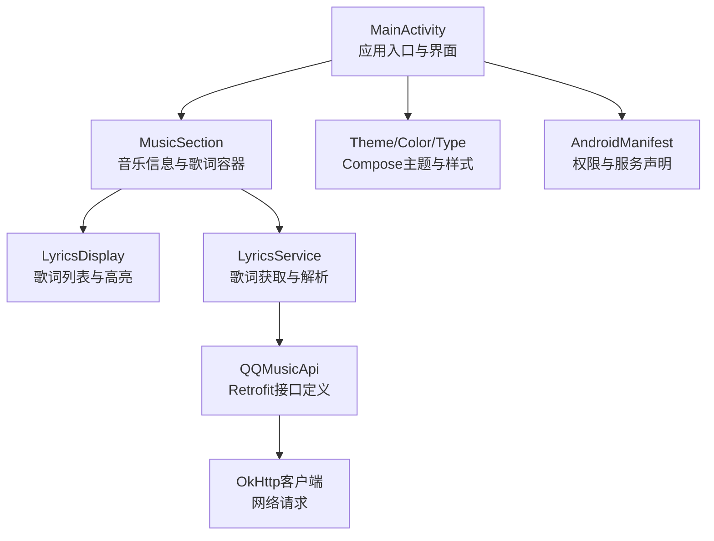
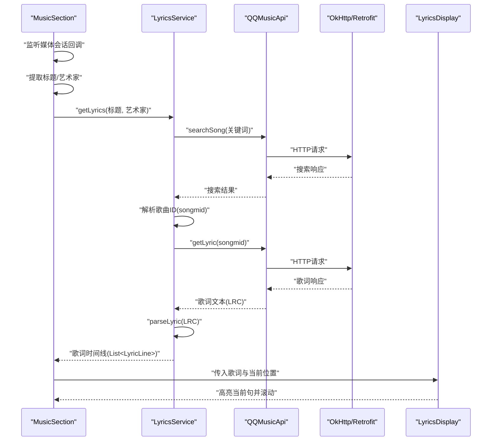
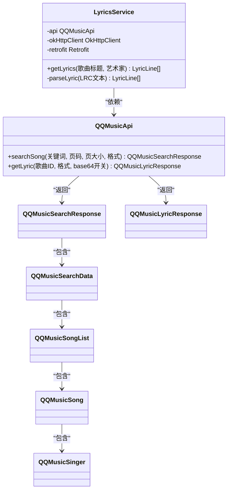
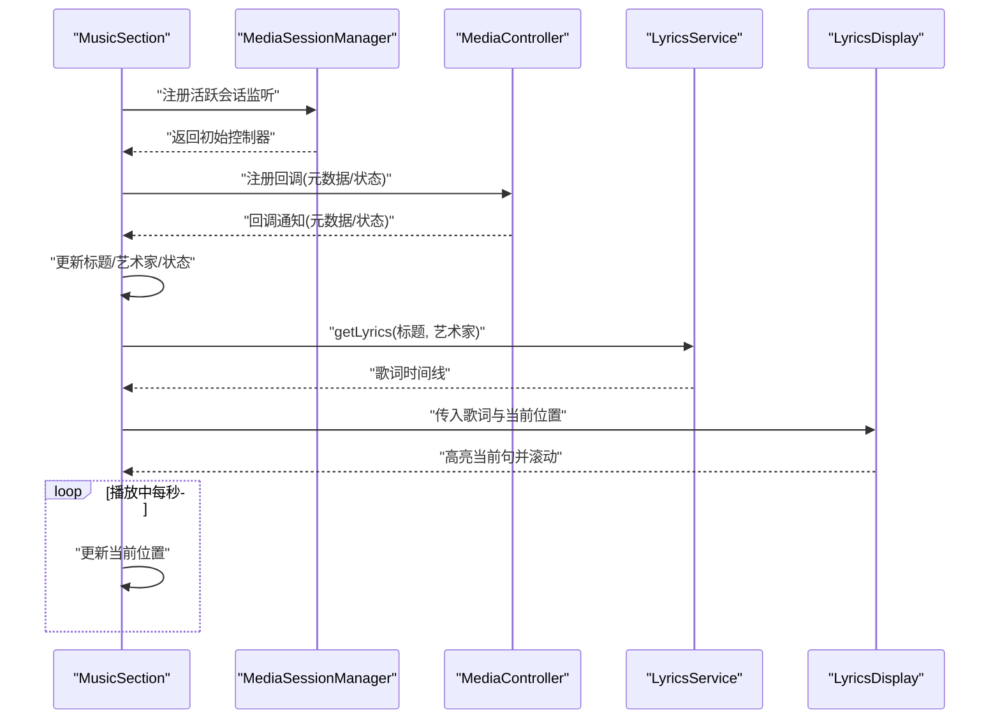
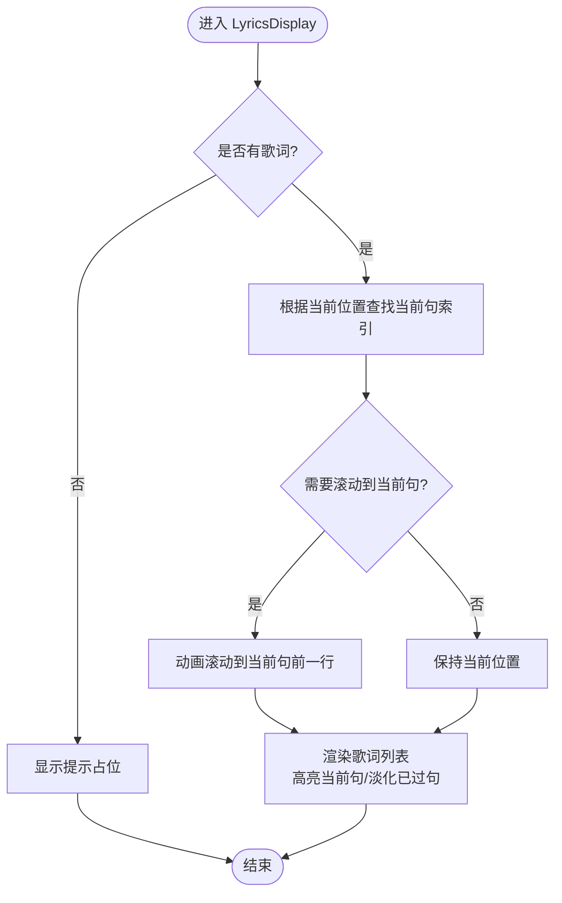
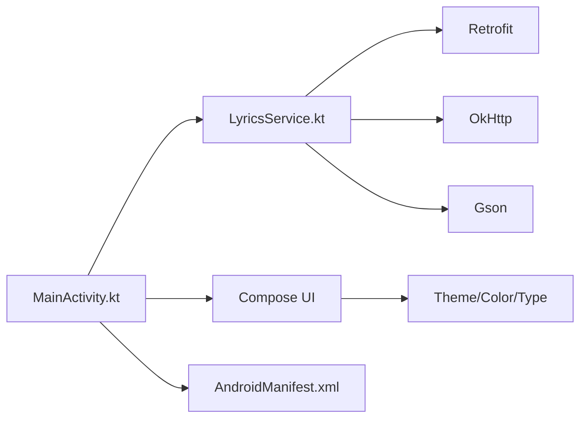

# 歌词显示

<cite>
**本文引用的文件**
- [LyricsService.kt](file://app/src/main/java/com/sephp/mycarlauncher/LyricsService.kt)
- [MainActivity.kt](file://app/src/main/java/com/sephp/mycarlauncher/MainActivity.kt)
- [AndroidManifest.xml](file://app/src/main/AndroidManifest.xml)
- [build.gradle.kts](file://app/build.gradle.kts)
- [Color.kt](file://app/src/main/java/com/sephp/mycarlauncher/ui/theme/Color.kt)
- [Theme.kt](file://app/src/main/java/com/sephp/mycarlauncher/ui/theme/Theme.kt)
- [Type.kt](file://app/src/main/java/com/sephp/mycarlauncher/ui/theme/Type.kt)
- [strings.xml](file://app/src/main/res/values/strings.xml)
</cite>

## 目录
1. [简介](#简介)
2. [项目结构](#项目结构)
3. [核心组件](#核心组件)
4. [架构总览](#架构总览)
5. [详细组件分析](#详细组件分析)
6. [依赖关系分析](#依赖关系分析)
7. [性能考虑](#性能考虑)
8. [故障排查指南](#故障排查指南)
9. [结论](#结论)
10. [附录](#附录)

## 简介
本项目提供一个车载风格的桌面启动器界面，其中包含“音乐与歌词”展示区域。歌词显示功能通过系统媒体会话获取当前播放曲目的标题与艺术家，再调用歌词服务从网络接口拉取LRC格式歌词，并在UI中按播放进度动态高亮与滚动到当前句。该功能采用Compose声明式UI构建，歌词解析与网络请求均在后台协程中执行，确保主线程流畅。

## 项目结构
- 应用入口为活动页面，使用Compose主题包裹整体界面。
- 音乐区域由左侧音乐信息与控制、中间歌词显示、右侧专辑封面三部分组成。
- 歌词服务负责与第三方音乐平台API交互，解析LRC歌词为可渲染的时间线。
- 权限与服务配置位于清单文件，网络库在构建脚本中声明。

图表来源
- [MainActivity.kt](file://app/src/main/java/com/sephp/mycarlauncher/MainActivity.kt#L270-L581)
- [LyricsService.kt](file://app/src/main/java/com/sephp/mycarlauncher/LyricsService.kt#L47-L175)
- [Theme.kt](file://app/src/main/java/com/sephp/mycarlauncher/ui/theme/Theme.kt#L1-L57)
- [AndroidManifest.xml](file://app/src/main/AndroidManifest.xml#L1-L53)

章节来源
- [MainActivity.kt](file://app/src/main/java/com/sephp/mycarlauncher/MainActivity.kt#L70-L126)
- [AndroidManifest.xml](file://app/src/main/AndroidManifest.xml#L1-L53)

## 核心组件
- 歌词服务（LyricsService）：封装网络请求与LRC歌词解析逻辑，提供按歌曲名与艺术家获取歌词的接口。
- 音乐区（MusicSection）：订阅系统媒体会话，异步加载封面与歌词，维护播放状态与进度。
- 歌词显示（LyricsDisplay）：根据当前播放时间定位并高亮当前句，自动滚动到合适位置。
- 主题与样式（Theme/Color/Type）：统一颜色与字体风格，适配深浅主题。
- 清单与权限（AndroidManifest）：声明通知监听服务与网络权限。

章节来源
- [LyricsService.kt](file://app/src/main/java/com/sephp/mycarlauncher/LyricsService.kt#L47-L175)
- [MainActivity.kt](file://app/src/main/java/com/sephp/mycarlauncher/MainActivity.kt#L270-L581)
- [Theme.kt](file://app/src/main/java/com/sephp/mycarlauncher/ui/theme/Theme.kt#L1-L57)
- [Color.kt](file://app/src/main/java/com/sephp/mycarlauncher/ui/theme/Color.kt#L1-L11)
- [Type.kt](file://app/src/main/java/com/sephp/mycarlauncher/ui/theme/Type.kt#L1-L34)
- [AndroidManifest.xml](file://app/src/main/AndroidManifest.xml#L1-L53)

## 架构总览
歌词显示的端到端流程如下：
- 音乐区订阅系统媒体会话，获取标题、艺术家、封面与播放状态。
- 当元数据或播放状态变化时，触发歌词获取流程。
- 歌词服务通过Retrofit调用第三方API，解析LRC歌词为时间线。
- UI根据当前播放时间计算当前句并高亮，同时滚动到合适位置。

图表来源
- [MainActivity.kt](file://app/src/main/java/com/sephp/mycarlauncher/MainActivity.kt#L270-L581)
- [LyricsService.kt](file://app/src/main/java/com/sephp/mycarlauncher/LyricsService.kt#L47-L175)

## 详细组件分析

### 歌词服务（LyricsService）
- 职责
  - 定义QQ音乐搜索与歌词查询的API接口。
  - 使用OkHttp添加必要的请求头与超时设置。
  - 使用Retrofit创建网络客户端，基于Gson解析JSON。
  - 提供按标题与艺术家获取歌词的方法，内部完成搜索、歌词拉取与LRC解析。
- 数据模型
  - 搜索响应、歌曲列表、歌词响应等数据类用于映射第三方API返回。
- 解析算法
  - LRC解析采用正则匹配时间戳，转换为毫秒后排序，形成有序歌词时间线。
- 错误处理
  - 对网络异常、解析异常进行捕获并返回空歌词列表，避免UI崩溃。
- 性能特性
  - 所有网络与解析在IO调度器执行，避免阻塞主线程。

图表来源
- [LyricsService.kt](file://app/src/main/java/com/sephp/mycarlauncher/LyricsService.kt#L16-L175)

章节来源
- [LyricsService.kt](file://app/src/main/java/com/sephp/mycarlauncher/LyricsService.kt#L47-L175)

### 音乐区（MusicSection）
- 职责
  - 订阅系统媒体会话，监听元数据与播放状态变化。
  - 异步加载专辑封面与歌词，维护播放进度。
  - 在播放状态变化时，定时刷新当前位置。
- 关键点
  - 使用通知监听服务辅助获取媒体会话（服务已在清单中声明）。
  - 当歌词加载失败时，回退到演示歌词生成器。
- UI布局
  - 左侧：标题、艺术家、播放控制按钮、背景进度条。
  - 中间：歌词显示区域。
  - 右侧：专辑封面。

图表来源
- [MainActivity.kt](file://app/src/main/java/com/sephp/mycarlauncher/MainActivity.kt#L270-L581)
- [AndroidManifest.xml](file://app/src/main/AndroidManifest.xml#L27-L35)

章节来源
- [MainActivity.kt](file://app/src/main/java/com/sephp/mycarlauncher/MainActivity.kt#L270-L581)
- [AndroidManifest.xml](file://app/src/main/AndroidManifest.xml#L27-L35)

### 歌词显示（LyricsDisplay）
- 职责
  - 在无歌词时显示提示；有歌词时展示列表。
  - 根据当前位置查找当前句索引，高亮当前句并降低已过句透明度。
  - 自动滚动到当前句附近，保证当前句可见。
- 算法要点
  - 使用二分思想的“最后一个小于等于”的索引查找，定位当前句。
  - 使用LazyColumn的状态与动画滚动，平滑定位当前句。
- 错误处理
  - 滚动异常被捕获并记录日志，不影响整体UI。

图表来源
- [MainActivity.kt](file://app/src/main/java/com/sephp/mycarlauncher/MainActivity.kt#L508-L581)

章节来源
- [MainActivity.kt](file://app/src/main/java/com/sephp/mycarlauncher/MainActivity.kt#L508-L581)

### 主题与样式（Theme/Color/Type）
- 主题
  - 支持深浅主题与动态色彩（Android 12+），统一主色与表面色。
- 颜色
  - 定义了预设颜色常量，歌词高亮使用青色，已过句使用灰色半透明。
- 字体
  - 基于Material3 Typography，当前歌词加粗、字号更大，提升可读性。

章节来源
- [Theme.kt](file://app/src/main/java/com/sephp/mycarlauncher/ui/theme/Theme.kt#L1-L57)
- [Color.kt](file://app/src/main/java/com/sephp/mycarlauncher/ui/theme/Color.kt#L1-L11)
- [Type.kt](file://app/src/main/java/com/sephp/mycarlauncher/ui/theme/Type.kt#L1-L34)

## 依赖关系分析
- 网络与解析
  - Retrofit + Gson：用于调用第三方API并解析JSON。
  - OkHttp + Logging Interceptor：设置请求头、超时与日志。
- UI框架
  - Jetpack Compose：声明式UI，LazyColumn用于歌词列表渲染。
- 权限与服务
  - 通知监听服务：用于发现系统媒体会话。
  - 网络权限：INTERNET与ACCESS_NETWORK_STATE。

图表来源
- [build.gradle.kts](file://app/build.gradle.kts#L44-L76)
- [MainActivity.kt](file://app/src/main/java/com/sephp/mycarlauncher/MainActivity.kt#L270-L581)
- [LyricsService.kt](file://app/src/main/java/com/sephp/mycarlauncher/LyricsService.kt#L47-L175)
- [AndroidManifest.xml](file://app/src/main/AndroidManifest.xml#L1-L53)

章节来源
- [build.gradle.kts](file://app/build.gradle.kts#L44-L76)
- [AndroidManifest.xml](file://app/src/main/AndroidManifest.xml#L1-L53)

## 性能考虑
- 协程与调度
  - 歌词获取与封面加载在IO调度器执行，避免阻塞主线程。
- UI渲染
  - 使用LazyColumn按需渲染，仅渲染可视范围内的歌词项。
  - 动画滚动参数优化，减少卡顿。
- 网络请求
  - OkHttp设置连接与读取超时，降低慢网环境下的等待时间。
- 回退策略
  - 歌词加载失败时使用演示歌词，保证界面可用性。

## 故障排查指南
- 无法显示歌词
  - 检查是否授予通知访问权限，否则会弹出设置页面引导授权。
  - 确认网络权限已声明且设备可联网。
  - 查看日志中歌词服务的错误输出，确认第三方API返回码与歌词文本。
- 歌词不滚动或高亮异常
  - 检查当前位置是否随播放状态更新。
  - 确认LRC时间戳格式正确，解析后的时间线按毫秒升序排列。
- 专辑封面为空
  - 某些播放器可能不提供封面，UI会显示占位图标。
- 第三方API不可用
  - 当前实现依赖第三方接口，若接口变更或不可用，可替换为其他歌词源或本地LRC文件加载。

章节来源
- [MainActivity.kt](file://app/src/main/java/com/sephp/mycarlauncher/MainActivity.kt#L347-L381)
- [AndroidManifest.xml](file://app/src/main/AndroidManifest.xml#L1-L53)
- [LyricsService.kt](file://app/src/main/java/com/sephp/mycarlauncher/LyricsService.kt#L102-L140)

## 结论
本项目通过系统媒体会话与歌词服务实现了车载场景下的歌词显示功能。歌词服务负责网络请求与LRC解析，UI层基于Compose实现高亮与滚动效果。整体架构清晰、职责分离明确，具备良好的扩展性与容错能力。后续可考虑接入更多歌词源、支持本地LRC文件与翻译歌词等功能。

## 附录
- 应用名称
  - [strings.xml](file://app/src/main/res/values/strings.xml#L1-L3)