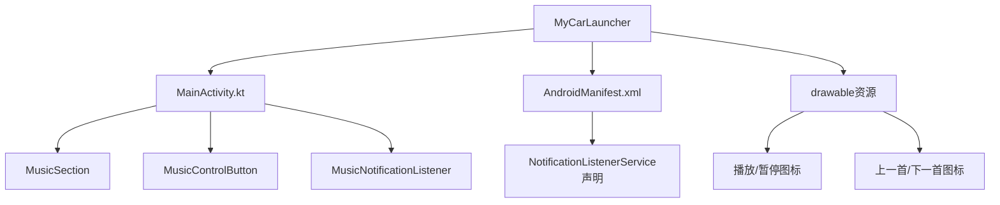
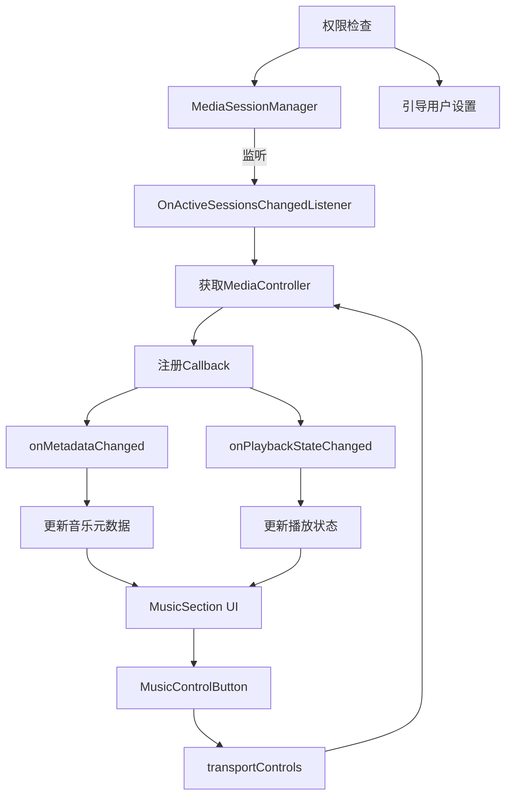
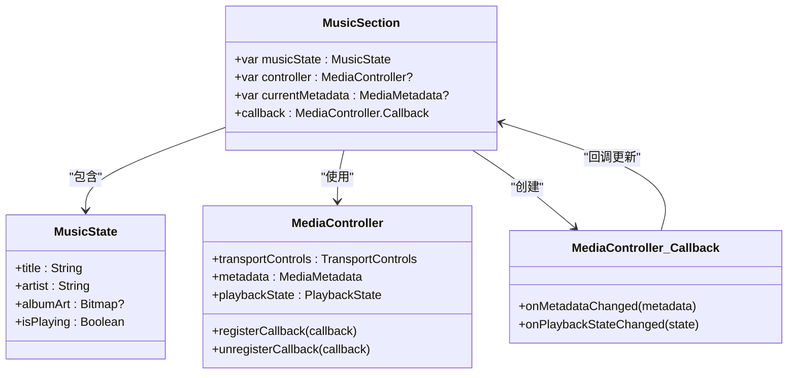
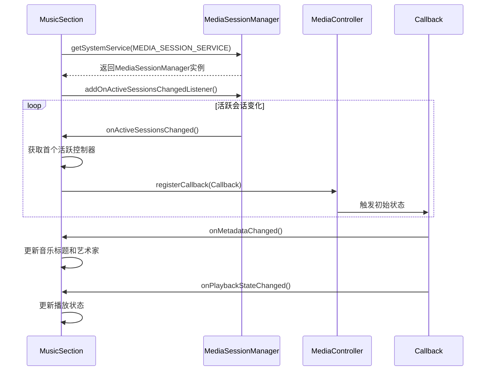
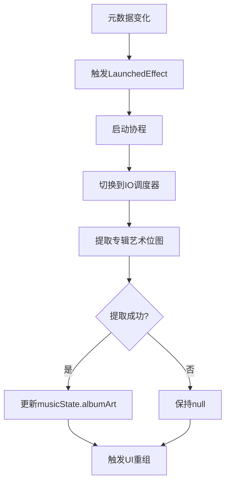
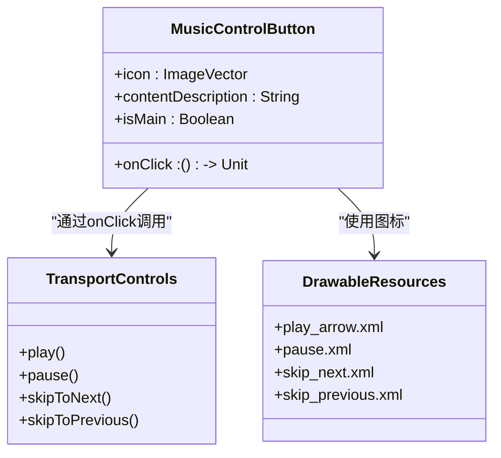
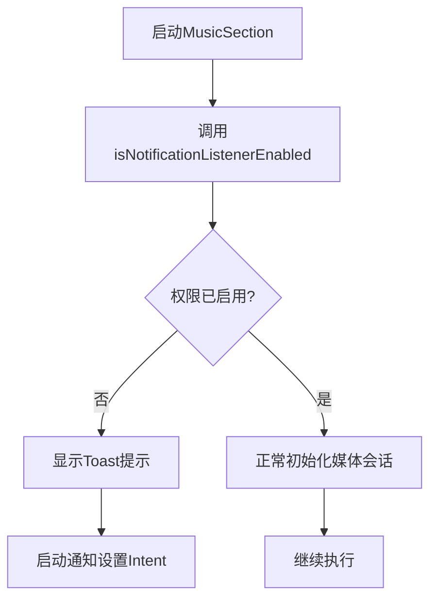
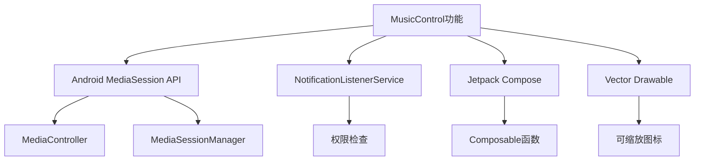

# 音乐控制

<cite>
**本文档引用的文件**   
- [MainActivity.kt](file://app/src/main/java/com/sephp/mycarlauncher/MainActivity.kt)
- [AndroidManifest.xml](file://app/src/main/AndroidManifest.xml)
- [MusicNotificationListener.kt](file://app/src/main/java/com/sephp/mycarlauncher/MainActivity.kt#L383-L386)
- [MusicControlButton.kt](file://app/src/main/java/com/sephp/mycarlauncher/MainActivity.kt#L367-L375)
- [play_arrow.xml](file://app/src/main/res/drawable/play_arrow.xml)
- [pause.xml](file://app/src/main/res/drawable/pause.xml)
- [skip_next.xml](file://app/src/main/res/drawable/skip_next.xml)
- [skip_previous.xml](file://app/src/main/res/drawable/skip_previous.xml)
</cite>

## 目录
1. [简介](#简介)
2. [项目结构](#项目结构)
3. [核心组件](#核心组件)
4. [架构概述](#架构概述)
5. [详细组件分析](#详细组件分析)
6. [依赖分析](#依赖分析)
7. [性能考虑](#性能考虑)
8. [故障排除指南](#故障排除指南)
9. [结论](#结论)

## 简介
本文档全面记录了MyCarLauncher应用中音乐控制功能的实现。重点说明了MusicSection组件如何通过MediaSessionManager监听活跃媒体会话，并注册OnActiveSessionsChangedListener获取MediaController实例。文档详细解释了MediaController.Callback如何监听元数据变化和播放状态变更，以及LaunchedEffect如何异步加载专辑封面。同时描述了MusicControlButton的UI实现和点击事件如何通过transportControls控制播放、暂停、上一首和下一首操作。此外，还提供了权限处理逻辑，包括isNotificationListenerEnabled检查和引导用户开启通知权限的实现。

## 项目结构
本项目采用典型的Android应用结构，音乐控制功能主要集中在MainActivity.kt文件中实现。UI组件使用Jetpack Compose构建，音乐控制相关的逻辑和UI元素都集成在单一的MainActivity中。应用的权限配置在AndroidManifest.xml中定义，特别是通知监听服务的声明。

**图表来源**
- [MainActivity.kt](file://app/src/main/java/com/sephp/mycarlauncher/MainActivity.kt)
- [AndroidManifest.xml](file://app/src/main/AndroidManifest.xml)
- [drawable资源](file://app/src/main/res/drawable/)

**章节来源**
- [MainActivity.kt](file://app/src/main/java/com/sephp/mycarlauncher/MainActivity.kt)
- [AndroidManifest.xml](file://app/src/main/AndroidManifest.xml)

## 核心组件
音乐控制功能的核心组件包括MusicSection、MediaController集成、MusicControlButton和权限检查机制。MusicSection作为音乐控制的主容器，负责协调媒体会话的监听、元数据更新和UI状态管理。MediaController通过MediaSessionManager获取活跃的媒体会话，实现对播放状态的实时监控。MusicControlButton提供直观的播放控制UI，通过transportControls与媒体会话交互。权限检查机制确保应用具有必要的通知访问权限，以获取媒体信息。

**章节来源**
- [MainActivity.kt](file://app/src/main/java/com/sephp/mycarlauncher/MainActivity.kt#L254-L351)
- [MainActivity.kt](file://app/src/main/java/com/sephp/mycarlauncher/MainActivity.kt#L367-L375)

## 架构概述
音乐控制功能的架构基于Android的MediaSession框架，采用观察者模式实现媒体状态的实时更新。系统通过MediaSessionManager监听活跃的媒体会话，当会话状态变化时，触发相应的回调函数更新UI。整个架构分为数据层、逻辑层和表现层三个部分。

**图表来源**
- [MainActivity.kt](file://app/src/main/java/com/sephp/mycarlauncher/MainActivity.kt#L291-L321)
- [MainActivity.kt](file://app/src/main/java/com/sephp/mycarlauncher/MainActivity.kt#L271-L283)

## 详细组件分析

### MusicSection分析
MusicSection是音乐控制功能的主要UI组件，负责显示当前播放的音乐信息和控制按钮。它通过DisposableEffect在组件生命周期内建立和销毁媒体会话监听器。组件使用mutableStateOf管理音乐状态，包括标题、艺术家、专辑封面和播放状态。

**图表来源**
- [MainActivity.kt](file://app/src/main/java/com/sephp/mycarlauncher/MainActivity.kt#L254-L351)
- [MainActivity.kt](file://app/src/main/java/com/sephp/mycarlauncher/MainActivity.kt#L246-L251)

**章节来源**
- [MainActivity.kt](file://app/src/main/java/com/sephp/mycarlauncher/MainActivity.kt#L254-L351)

### 媒体会话监听机制
MusicSection通过MediaSessionManager实现对活跃媒体会话的监听。系统首先检查通知访问权限，然后获取MediaSessionManager实例，创建OnActiveSessionsChangedListener监听器。当活跃会话发生变化时，系统获取最新的MediaController并注册回调函数。

**图表来源**
- [MainActivity.kt](file://app/src/main/java/com/sephp/mycarlauncher/MainActivity.kt#L285-L321)
- [MainActivity.kt](file://app/src/main/java/com/sephp/mycarlauncher/MainActivity.kt#L271-L283)

**章节来源**
- [MainActivity.kt](file://app/src/main/java/com/sephp/mycarlauncher/MainActivity.kt#L285-L321)

### 专辑封面异步加载
专辑封面的加载采用异步方式实现，避免阻塞UI线程。当元数据发生变化时，LaunchedEffect协程启动，在IO调度器中提取专辑艺术位图，然后更新UI状态。

**图表来源**
- [MainActivity.kt](file://app/src/main/java/com/sephp/mycarlauncher/MainActivity.kt#L261-L269)

**章节来源**
- [MainActivity.kt](file://app/src/main/java/com/sephp/mycarlauncher/MainActivity.kt#L261-L269)

### MusicControlButton分析
MusicControlButton组件实现播放控制按钮的UI和交互逻辑。按钮根据isMain参数调整大小和样式，点击事件通过MediaController的transportControls执行相应的播放控制命令。

**图表来源**
- [MainActivity.kt](file://app/src/main/java/com/sephp/mycarlauncher/MainActivity.kt#L367-L375)
- [drawable资源](file://app/src/main/res/drawable/)

**章节来源**
- [MainActivity.kt](file://app/src/main/java/com/sephp/mycarlauncher/MainActivity.kt#L367-L375)

### 权限处理逻辑
应用在启动时检查通知访问权限，如果权限未授予，则显示Toast提示并引导用户前往设置页面开启权限。

**图表来源**
- [MainActivity.kt](file://app/src/main/java/com/sephp/mycarlauncher/MainActivity.kt#L286-L289)
- [MainActivity.kt](file://app/src/main/java/com/sephp/mycarlauncher/MainActivity.kt#L377-L381)

**章节来源**
- [MainActivity.kt](file://app/src/main/java/com/sephp/mycarlauncher/MainActivity.kt#L286-L289)

## 依赖分析
音乐控制功能依赖于Android系统的MediaSession框架和通知访问权限。应用通过AndroidManifest.xml声明NotificationListenerService，获取必要的权限。UI实现依赖Jetpack Compose框架，图标资源使用Vector Drawable格式。

**图表来源**
- [AndroidManifest.xml](file://app/src/main/AndroidManifest.xml)
- [build.gradle.kts](file://app/build.gradle.kts)
- [MainActivity.kt](file://app/src/main/java/com/sephp/mycarlauncher/MainActivity.kt)

**章节来源**
- [AndroidManifest.xml](file://app/src/main/AndroidManifest.xml)
- [build.gradle.kts](file://app/build.gradle.kts)

## 性能考虑
音乐控制功能在性能方面做了多项优化。专辑封面的加载在IO调度器中异步执行，避免阻塞UI线程。媒体会话的监听在DisposableEffect中管理，确保资源的正确释放。状态更新采用Jetpack Compose的重组机制，只更新必要的UI部分。

## 故障排除指南
当音乐控制功能无法正常工作时，应首先检查通知访问权限是否已授予。如果权限已开启但仍然无法显示音乐信息，可能是媒体会话未正确注册。检查设备上是否有正在播放音乐的应用，以及该应用是否支持MediaSession框架。

**章节来源**
- [MainActivity.kt](file://app/src/main/java/com/sephp/mycarlauncher/MainActivity.kt#L286-L289)
- [MainActivity.kt](file://app/src/main/java/com/sephp/mycarlauncher/MainActivity.kt#L291-L321)

## 结论
MyCarLauncher的音乐控制功能通过集成Android的MediaSession框架，实现了对活跃媒体会话的监听和控制。系统采用现代化的Jetpack Compose UI框架，结合协程实现异步操作，提供了流畅的用户体验。权限处理机制确保了功能的可靠性和用户友好性。整体设计遵循Android最佳实践，具有良好的可维护性和扩展性。