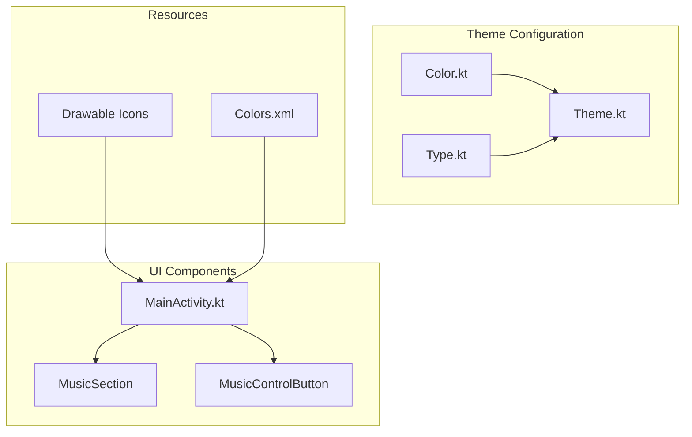
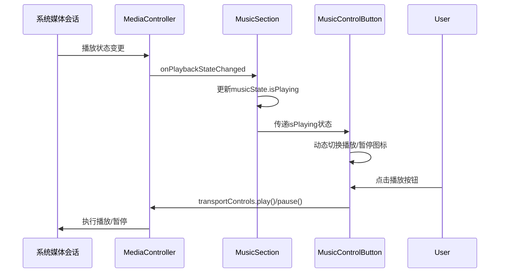
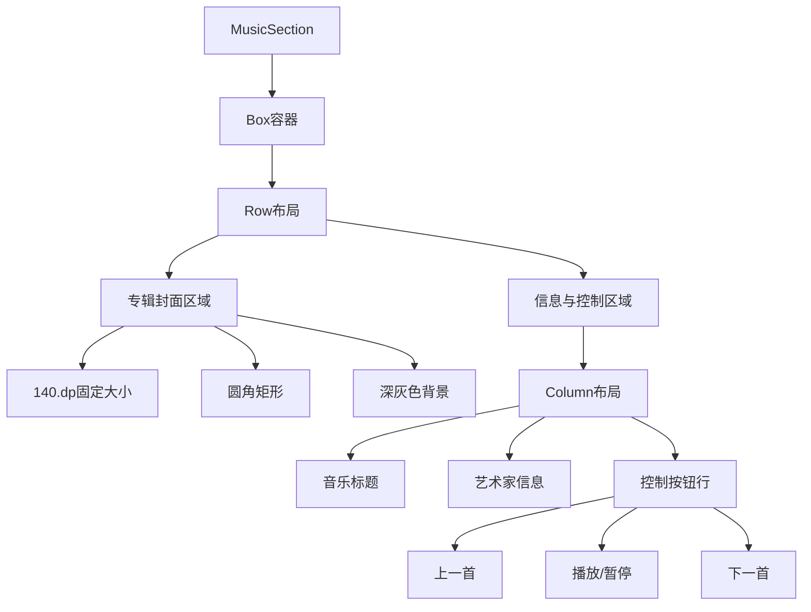
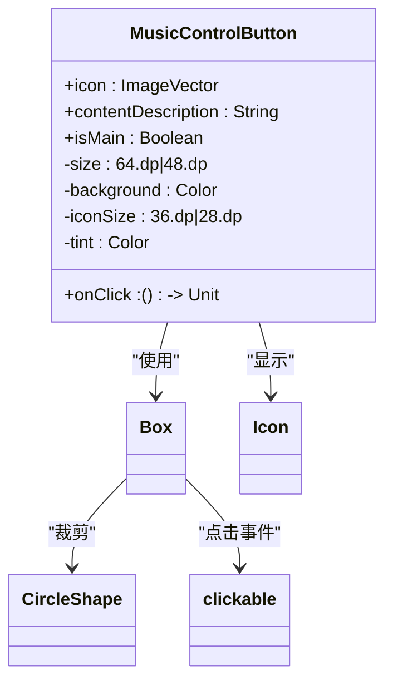
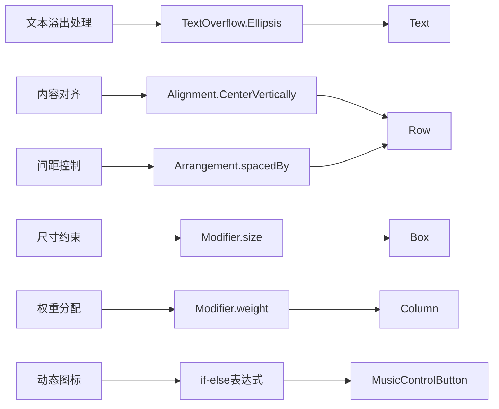
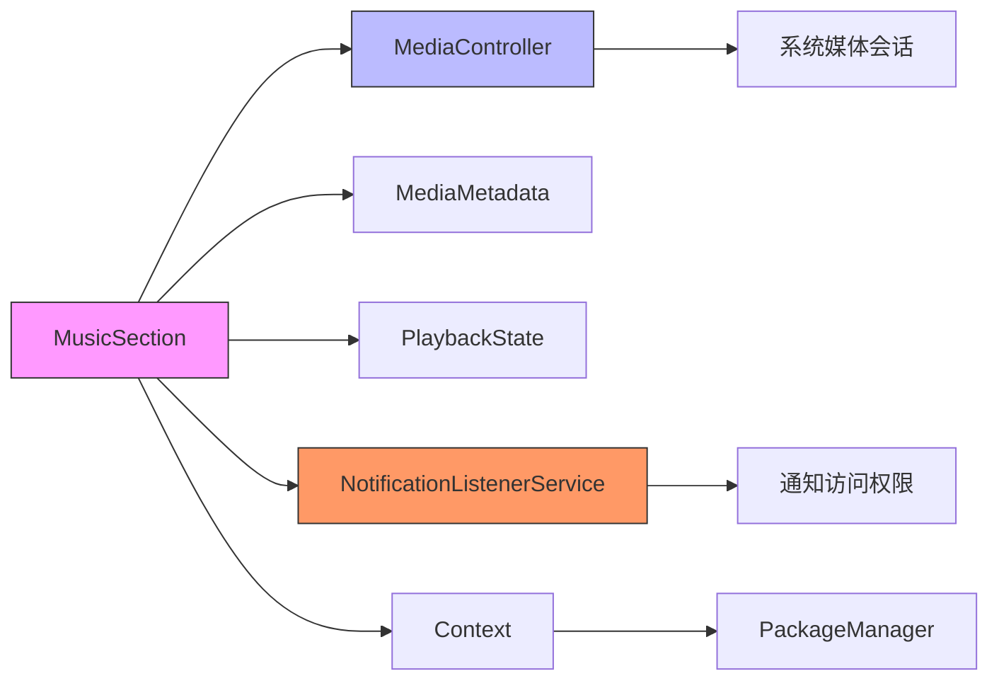
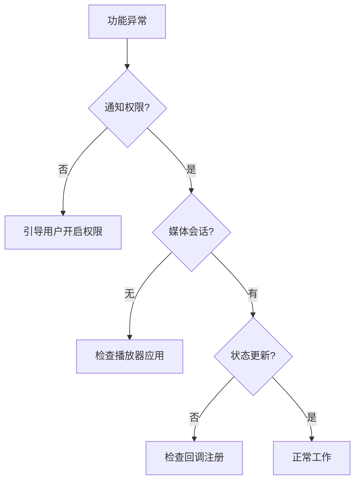

# 音乐控制UI组件

<cite>
**本文档引用的文件**  
- [MainActivity.kt](file://app/src/main/java/com/sephp/mycarlauncher/MainActivity.kt)
- [Color.kt](file://app/src/main/java/com/sephp/mycarlauncher/ui/theme/Color.kt)
- [Type.kt](file://app/src/main/java/com/sephp/mycarlauncher/ui/theme/Type.kt)
- [Theme.kt](file://app/src/main/java/com/sephp/mycarlauncher/ui/theme/Theme.kt)
- [play_arrow.xml](file://app/src/main/res/drawable/play_arrow.xml)
- [pause.xml](file://app/src/main/res/drawable/pause.xml)
- [skip_next.xml](file://app/src/main/res/drawable/skip_next.xml)
- [skip_previous.xml](file://app/src/main/res/drawable/skip_previous.xml)
</cite>

## 目录
1. [简介](#简介)
2. [项目结构](#项目结构)
3. [核心组件](#核心组件)
4. [架构概述](#架构概述)
5. [详细组件分析](#详细组件分析)
6. [依赖分析](#依赖分析)
7. [性能考虑](#性能考虑)
8. [故障排除指南](#故障排除指南)
9. [结论](#结论)

## 简介
本文档深入解析MyCarLauncher应用中音乐控制UI组件的实现细节。重点分析MusicSection的UI布局结构，包括外层Box容器、专辑封面显示区域和控制按钮行的Compose实现。详细说明MusicControlButton组件的设计原理，涵盖图标资源绑定、点击事件处理和主播放按钮的状态切换逻辑。同时探讨Row与Column的嵌套布局策略、尺寸约束、视觉反馈等UI设计要素，并结合Material Design 3规范解释颜色、字体和图标的选择依据。

## 项目结构
本项目采用典型的Android Jetpack Compose架构，主要包含UI组件、主题配置和资源文件。UI逻辑集中在MainActivity.kt中，主题配置分离在ui/theme包下，资源文件按类型组织在res目录中。

**图示来源**
- [MainActivity.kt](file://app/src/main/java/com/sephp/mycarlauncher/MainActivity.kt)
- [Color.kt](file://app/src/main/java/com/sephp/mycarlauncher/ui/theme/Color.kt)
- [Type.kt](file://app/src/main/java/com/sephp/mycarlauncher/ui/theme/Type.kt)
- [Theme.kt](file://app/src/main/java/com/sephp/mycarlauncher/ui/theme/Theme.kt)

**章节来源**
- [MainActivity.kt](file://app/src/main/java/com/sephp/mycarlauncher/MainActivity.kt)
- [Theme.kt](file://app/src/main/java/com/sephp/mycarlauncher/ui/theme/Theme.kt)

## 核心组件
音乐控制UI的核心组件包括MusicSection和MusicControlButton。MusicSection负责整体布局和状态管理，整合专辑封面、音乐信息和控制按钮。MusicControlButton是可复用的UI元素，用于实现播放、暂停、上一首、下一首等控制功能。

**章节来源**
- [MainActivity.kt](file://app/src/main/java/com/sephp/mycarlauncher/MainActivity.kt)

## 架构概述
音乐控制组件采用声明式UI架构，通过Jetpack Compose实现。组件从系统媒体会话中获取播放状态和元数据，使用MutableState管理UI状态，通过LaunchedEffect监听数据变化并自动更新界面。

**图示来源**
- [MainActivity.kt](file://app/src/main/java/com/sephp/mycarlauncher/MainActivity.kt)

## 详细组件分析

### MusicSection布局分析
MusicSection采用Box作为外层容器，提供边框、背景色和内边距。内部使用Row进行水平布局，左侧为专辑封面区域，右侧为音乐信息和控制按钮区域。

**图示来源**
- [MainActivity.kt](file://app/src/main/java/com/sephp/mycarlauncher/MainActivity.kt)

**章节来源**
- [MainActivity.kt](file://app/src/main/java/com/sephp/mycarlauncher/MainActivity.kt#L254-L351)

### MusicControlButton组件设计
MusicControlButton组件采用Box包装，实现圆形按钮的视觉效果。组件支持主按钮和普通按钮两种模式，通过isMain参数区分。

**图示来源**
- [MainActivity.kt](file://app/src/main/java/com/sephp/mycarlauncher/MainActivity.kt#L368-L375)
- [play_arrow.xml](file://app/src/main/res/drawable/play_arrow.xml)
- [pause.xml](file://app/src/main/res/drawable/pause.xml)

**章节来源**
- [MainActivity.kt](file://app/src/main/java/com/sephp/mycarlauncher/MainActivity.kt#L368-L375)

### UI响应式设计实现
组件采用多种技术实现响应式设计，确保在不同内容长度和设备尺寸下都能良好显示。

**图示来源**
- [MainActivity.kt](file://app/src/main/java/com/sephp/mycarlauncher/MainActivity.kt)

**章节来源**
- [MainActivity.kt](file://app/src/main/java/com/sephp/mycarlauncher/MainActivity.kt)

## 依赖分析
音乐控制组件依赖于Android系统的媒体会话API和通知访问权限，通过MediaController与播放器应用交互。

**图示来源**
- [MainActivity.kt](file://app/src/main/java/com/sephp/mycarlauncher/MainActivity.kt)
- [MusicNotificationListener](file://app/src/main/java/com/sephp/mycarlauncher/MainActivity.kt#L383-L386)

**章节来源**
- [MainActivity.kt](file://app/src/main/java/com/sephp/mycarlauncher/MainActivity.kt)

## 性能考虑
组件通过多种方式优化性能，避免主线程阻塞和不必要的重组。

1. **异步加载**：专辑封面在IO调度器中异步加载
2. **状态记忆**：使用remember和mutableStateOf记忆UI状态
3. **副作用管理**：使用LaunchedEffect和DisposableEffect管理生命周期
4. **资源复用**：图标资源通过ImageVector.vectorResource复用

**章节来源**
- [MainActivity.kt](file://app/src/main/java/com/sephp/mycarlauncher/MainActivity.kt)

## 故障排除指南
当音乐控制功能无法正常工作时，可参考以下排查步骤：

1. **检查通知权限**：确保应用已获得通知访问权限
2. **验证媒体会话**：确认有活跃的媒体播放会话
3. **调试状态更新**：检查MusicState是否正确更新
4. **查看日志输出**：检查SecurityException等异常

**章节来源**
- [MainActivity.kt](file://app/src/main/java/com/sephp/mycarlauncher/MainActivity.kt#L286-L288)
- [isNotificationListenerEnabled](file://app/src/main/java/com/sephp/mycarlauncher/MainActivity.kt#L377-L381)

## 结论
MusicSection组件通过Jetpack Compose实现了现代化的音乐控制UI，具有良好的可维护性和扩展性。组件设计遵循Material Design 3规范，采用响应式布局和状态管理，能够适应不同内容和设备。通过合理的架构设计和性能优化，确保了流畅的用户体验。