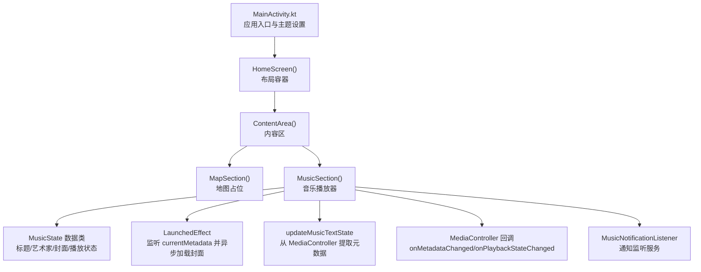
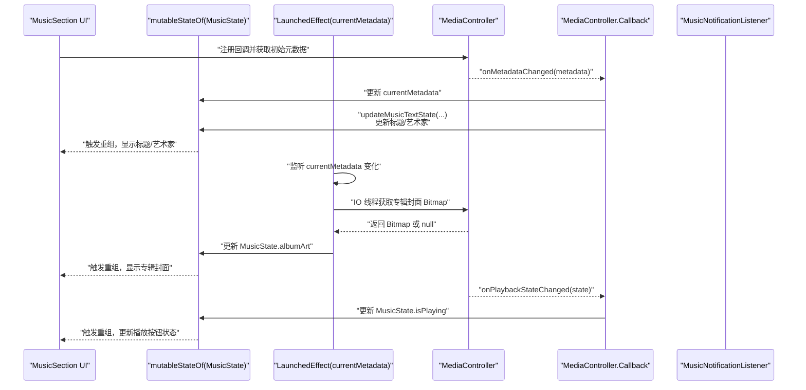
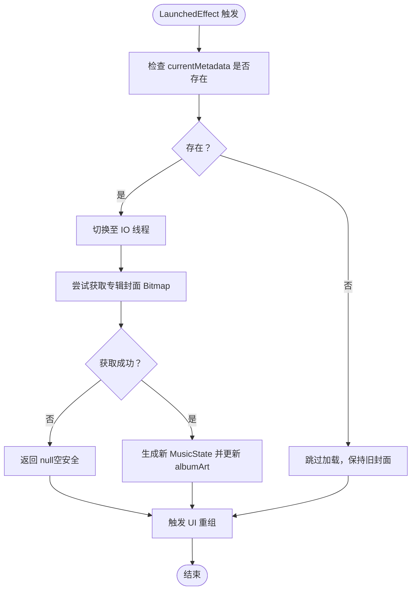
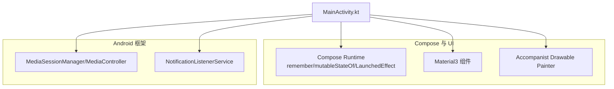

# 音乐状态管理

<cite>
**本文引用的文件**
- [MainActivity.kt](file://app/src/main/java/com/sephp/mycarlauncher/MainActivity.kt)
- [AndroidManifest.xml](file://app/src/main/AndroidManifest.xml)
- [Theme.kt](file://app/src/main/java/com/sephp/mycarlauncher/ui/theme/Theme.kt)
- [Color.kt](file://app/src/main/java/com/sephp/mycarlauncher/ui/theme/Color.kt)
- [Type.kt](file://app/src/main/java/com/sephp/mycarlauncher/ui/theme/Type.kt)
- [build.gradle.kts](file://app/build.gradle.kts)
- [libs.versions.toml](file://gradle/libs.versions.toml)
</cite>

## 目录
1. [简介](#简介)
2. [项目结构](#项目结构)
3. [核心组件](#核心组件)
4. [架构总览](#架构总览)
5. [详细组件分析](#详细组件分析)
6. [依赖关系分析](#依赖关系分析)
7. [性能考量](#性能考量)
8. [故障排查指南](#故障排查指南)
9. [结论](#结论)
10. [附录](#附录)

## 简介
本文件围绕 MusicSection 的音乐状态管理进行深入解析，重点说明以下内容：
- 如何使用 mutableStateOf 管理 MusicState（标题、艺术家、播放状态、专辑封面）
- LaunchedEffect 如何监听 currentMetadata 变化并异步加载专辑封面，确保 UI 线程不被阻塞
- updateMusicTextState 函数如何从 MediaController 提取元数据并更新文本状态
- 状态变更如何自动触发 Compose UI 重组
- Kotlin 协程与 Compose 状态系统的集成方式
- 异常处理策略（如 Bitmap 获取失败时的空安全处理）

## 项目结构
MusicSection 所在的主界面由 MainActivity.kt 提供，其中包含 HomeScreen、DockBar、ContentArea、MapSection 和 MusicSection 等多个区域。音乐模块位于 ContentArea 的下方区域，采用 Compose 构建，使用可组合函数与状态管理 API 实现响应式 UI。

图表来源
- [MainActivity.kt](file://app/src/main/java/com/sephp/mycarlauncher/MainActivity.kt#L64-L118)
- [MainActivity.kt](file://app/src/main/java/com/sephp/mycarlauncher/MainActivity.kt#L236-L351)
- [AndroidManifest.xml](file://app/src/main/AndroidManifest.xml#L25-L33)

章节来源
- [MainActivity.kt](file://app/src/main/java/com/sephp/mycarlauncher/MainActivity.kt#L64-L118)
- [MainActivity.kt](file://app/src/main/java/com/sephp/mycarlauncher/MainActivity.kt#L236-L351)
- [AndroidManifest.xml](file://app/src/main/AndroidManifest.xml#L25-L33)

## 核心组件
- MusicState：封装当前音乐播放的标题、艺术家、专辑封面与播放状态，作为 Compose 的响应式状态载体。
- MusicSection：负责渲染音乐播放器 UI，并通过 mutableStateOf 维护 MusicState；通过 LaunchedEffect 监听 currentMetadata 变化并异步加载专辑封面；通过 MediaController 回调更新文本状态；通过 TransportControls 控制播放。
- updateMusicTextState：从 MediaController 中提取标题、艺术家与播放状态，生成新的 MusicState 并回调更新。
- LaunchedEffect：在 currentMetadata 改变时，切换到 IO 线程异步获取 Bitmap，避免阻塞 UI 主线程。
- MediaController.Callback：监听媒体会话元数据与播放状态变化，驱动 UI 更新。
- MusicNotificationListener：声明为通知监听服务，配合 MediaSessionManager 获取活动会话控制器。

章节来源
- [MainActivity.kt](file://app/src/main/java/com/sephp/mycarlauncher/MainActivity.kt#L246-L251)
- [MainActivity.kt](file://app/src/main/java/com/sephp/mycarlauncher/MainActivity.kt#L253-L351)
- [MainActivity.kt](file://app/src/main/java/com/sephp/mycarlauncher/MainActivity.kt#L353-L365)
- [AndroidManifest.xml](file://app/src/main/AndroidManifest.xml#L25-L33)

## 架构总览
MusicSection 的状态流如下：
- 初始化阶段：通过 DisposableEffect 注册 MediaSessionManager 的会话监听，获取 MediaController 并注册回调；同时初始化 MusicState。
- 元数据变化：当 onMetadataChanged 触发时，将新元数据赋给 currentMetadata，并同步更新标题与艺术家；随后 LaunchedEffect 基于 currentMetadata 在 IO 线程异步加载专辑封面，成功后更新 MusicState.albumArt。
- 播放状态变化：onPlaybackStateChanged 触发时，直接更新 MusicState.isPlaying。
- UI 渲染：MusicSection 使用 MusicState 的字段进行绘制，任何状态变更都会触发重组，从而刷新 UI。

图表来源
- [MainActivity.kt](file://app/src/main/java/com/sephp/mycarlauncher/MainActivity.kt#L253-L351)
- [AndroidManifest.xml](file://app/src/main/AndroidManifest.xml#L25-L33)

## 详细组件分析

### MusicState 数据模型与响应式更新
- MusicState 是一个不可变的数据类，包含标题、艺术家、专辑封面 Bitmap 与播放状态布尔值。在 MusicSection 中，使用 remember + mutableStateOf 创建可变状态，每次更新都通过 copy 生成新实例，从而触发 Compose 的重组。
- 标题与艺术家来自 MediaMetadata 的键值，若为空则回退到默认文案；专辑封面通过 MediaMetadata 的图片键异步加载；播放状态根据 PlaybackState 的状态码判断。

章节来源
- [MainActivity.kt](file://app/src/main/java/com/sephp/mycarlauncher/MainActivity.kt#L246-L251)
- [MainActivity.kt](file://app/src/main/java/com/sephp/mycarlauncher/MainActivity.kt#L353-L365)

### LaunchedEffect 监听 currentMetadata 并异步加载专辑封面
- LaunchedEffect(currentMetadata) 在 currentMetadata 发生变化时执行一次作用域内的逻辑。
- 作用域内使用 withContext(Dispatchers.IO) 切换到后台线程，尝试从 MediaMetadata 获取专辑封面 Bitmap；若失败则返回 null，保证空安全。
- 成功获取后，使用 musicState.copy(albumArt = ...) 生成新状态并赋值，触发 UI 重组。

图表来源
- [MainActivity.kt](file://app/src/main/java/com/sephp/mycarlauncher/MainActivity.kt#L253-L351)

章节来源
- [MainActivity.kt](file://app/src/main/java/com/sephp/mycarlauncher/MainActivity.kt#L253-L351)

### updateMusicTextState 从 MediaController 提取元数据并更新状态
- 当 MediaController 回调触发时，updateMusicTextState 会读取当前 metadata 与 playbackState，构造新的 MusicState（标题、艺术家、播放状态），并通过传入的回调更新 UI 状态。
- 若控制器为空，则回退到默认 MusicState，确保 UI 不出现空指针。

章节来源
- [MainActivity.kt](file://app/src/main/java/com/sephp/mycarlauncher/MainActivity.kt#L353-L365)

### 状态变更如何自动触发 UI 重组
- MusicSection 内部使用 remember + mutableStateOf 维护 MusicState；任何对 musicState 的赋值（包括 copy）都会导致 Compose 认为状态已改变，进而触发重组。
- UI 层直接消费 MusicState 字段进行绘制，例如标题、艺术家、播放按钮图标与专辑封面的显示。

章节来源
- [MainActivity.kt](file://app/src/main/java/com/sephp/mycarlauncher/MainActivity.kt#L253-L351)

### Kotlin 协程与 Compose 状态系统的集成
- 使用 LaunchedEffect 作为协程入口，监听 currentMetadata 的变化，避免在 UI 线程执行耗时操作。
- 使用 withContext(Dispatchers.IO) 将 Bitmap 加载切换到后台线程，完成后回到 Compose 状态更新流程。
- 通过 remember 保持状态对象的生命周期与稳定性，确保重组时不会丢失状态。

章节来源
- [MainActivity.kt](file://app/src/main/java/com/sephp/mycarlauncher/MainActivity.kt#L253-L351)

### 异常处理策略（Bitmap 获取失败时的空安全）
- 在异步加载专辑封面时，try/catch 包裹可能抛出的异常，捕获后返回 null，避免 UI 线程崩溃。
- UI 层在 albumArt 为 null 时显示默认图标，保证界面始终可用且视觉一致。

章节来源
- [MainActivity.kt](file://app/src/main/java/com/sephp/mycarlauncher/MainActivity.kt#L253-L351)

## 依赖关系分析
- AndroidX Compose：提供可组合函数、状态管理 API（remember、mutableStateOf、LaunchedEffect、DisposableEffect）与 UI 渲染能力。
- Accompanist Drawable Painter：用于在 Compose 中渲染 Drawable 资源。
- Material3：提供基础 UI 组件与主题系统。
- Android 媒体会话与通知监听：通过 MediaSessionManager 与 NotificationListenerService 获取媒体会话控制器，实现跨应用音乐信息的读取与控制。

图表来源
- [MainActivity.kt](file://app/src/main/java/com/sephp/mycarlauncher/MainActivity.kt#L64-L118)
- [MainActivity.kt](file://app/src/main/java/com/sephp/mycarlauncher/MainActivity.kt#L236-L351)
- [AndroidManifest.xml](file://app/src/main/AndroidManifest.xml#L25-L33)
- [build.gradle.kts](file://app/build.gradle.kts#L44-L65)
- [libs.versions.toml](file://gradle/libs.versions.toml#L13-L33)

章节来源
- [build.gradle.kts](file://app/build.gradle.kts#L44-L65)
- [libs.versions.toml](file://gradle/libs.versions.toml#L13-L33)
- [AndroidManifest.xml](file://app/src/main/AndroidManifest.xml#L25-L33)

## 性能考量
- 使用 Dispatchers.IO 进行耗时的 Bitmap 加载，避免阻塞 UI 线程，提升流畅度。
- 通过 LaunchedEffect 仅在 currentMetadata 变化时触发封面加载，减少不必要的 IO 操作。
- 使用 remember 保持状态与回调对象，降低重组成本。
- UI 绘制层尽量使用轻量级组件与固定尺寸，避免过度重绘。

## 故障排查指南
- 无音乐信息显示
  - 检查是否授予通知访问权限；若未开启，会弹出提示并引导用户前往设置页面授权。
  - 确认目标音乐应用支持媒体会话并与系统通知联动。
- 专辑封面不显示
  - 确认 MediaMetadata 中存在专辑封面键值；若不存在，UI 将显示默认图标。
  - 检查异步加载是否抛出异常并返回 null，确认异常处理逻辑生效。
- 播放状态不更新
  - 确认 MediaController 回调已正确注册；检查 onPlaybackStateChanged 是否被调用。
- 控制按钮无效
  - 确认 MediaController 已成功获取；检查 TransportControls 的可用性。

章节来源
- [MainActivity.kt](file://app/src/main/java/com/sephp/mycarlauncher/MainActivity.kt#L285-L322)
- [MainActivity.kt](file://app/src/main/java/com/sephp/mycarlauncher/MainActivity.kt#L353-L365)
- [AndroidManifest.xml](file://app/src/main/AndroidManifest.xml#L25-L33)

## 结论
MusicSection 通过 mutableStateOf 管理 MusicState，结合 LaunchedEffect 与协程在后台线程异步加载专辑封面，实现了 UI 线程的非阻塞体验。MediaController 的回调驱动标题、艺术家与播放状态的实时更新，updateMusicTextState 统一从控制器提取元数据，确保状态一致性。异常处理策略保障了 Bitmap 获取失败时的空安全与 UI 稳定性。整体架构清晰、职责分离明确，易于扩展与维护。

## 附录
- 主题与样式
  - 主题基于 Material3，支持动态颜色与深浅模式切换。
  - 颜色与字体定义位于 ui/theme 目录下，便于统一风格。

章节来源
- [Theme.kt](file://app/src/main/java/com/sephp/mycarlauncher/ui/theme/Theme.kt#L1-L58)
- [Color.kt](file://app/src/main/java/com/sephp/mycarlauncher/ui/theme/Color.kt#L1-L11)
- [Type.kt](file://app/src/main/java/com/sephp/mycarlauncher/ui/theme/Type.kt#L1-L34)