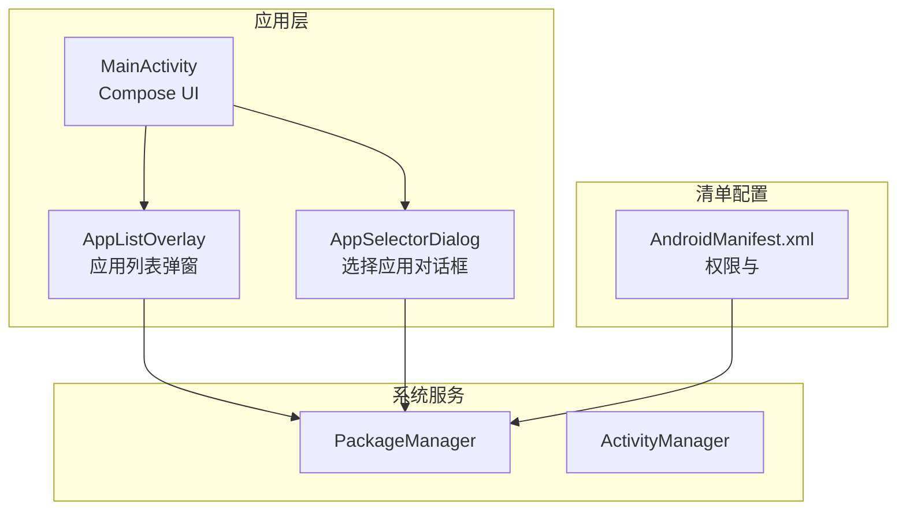
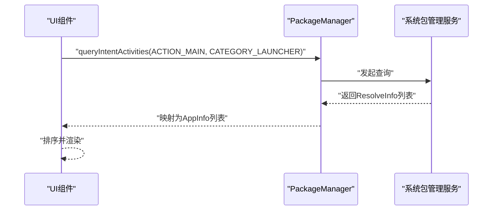
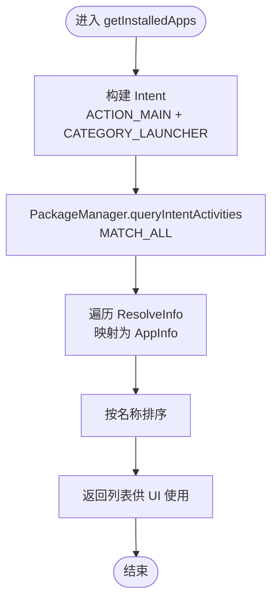
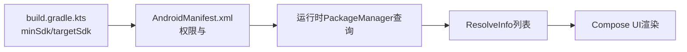

# 包管理集成

<cite>
**本文引用的文件**
- [AndroidManifest.xml](file://app/src/main/AndroidManifest.xml)
- [MainActivity.kt](file://app/src/main/java/com/sephp/mycarlauncher/MainActivity.kt)
- [build.gradle.kts](file://app/build.gradle.kts)
- [manifest-merger-blame-debug-report.txt](file://app/build/intermediates/manifest_merge_blame_file/debug/processDebugMainManifest/manifest-merger-blame-debug-report.txt)
- [AndroidManifest.xml（打包后）](file://app/build/intermediates/packaged_manifests/debug/processDebugManifestForPackage/AndroidManifest.xml)
- [strings.xml](file://app/src/main/res/values/strings.xml)
</cite>

## 目录
1. [简介](#简介)
2. [项目结构](#项目结构)
3. [核心组件](#核心组件)
4. [架构总览](#架构总览)
5. [组件详解](#组件详解)
6. [依赖关系分析](#依赖关系分析)
7. [性能考量](#性能考量)
8. [故障排查指南](#故障排查指南)
9. [结论](#结论)
10. [附录](#附录)

## 简介
本文件面向“包管理集成”主题，系统性阐述 MyCarLauncher 如何通过 PackageManager 查询设备上所有已安装应用，并围绕 Android 11+ 的权限与合规要求进行说明。重点覆盖：
- 如何在清单中声明 QUERY_ALL_PACKAGES 权限
- 在 Android 11+ 系统中的使用限制与合规要求
- <queries> 标签中 intent 过滤器的配置目的，确保能正确检索 LAUNCHER 类别应用
- 安全使用包查询 API 的最佳实践：动态请求权限、用户隐私说明文案设计、权限被拒绝时的降级体验策略

## 项目结构
MyCarLauncher 使用 Android Gradle 插件与 Jetpack Compose 构建，核心功能集中在 MainActivity 中，通过 PackageManager 查询 LAUNCHER 类别应用并展示在界面中。应用清单中声明了 QUERY_ALL_PACKAGES 权限与 <queries> intent 过滤器，用于检索可启动的应用列表。

图表来源
- [AndroidManifest.xml](file://app/src/main/AndroidManifest.xml#L1-L20)
- [MainActivity.kt](file://app/src/main/java/com/sephp/mycarlauncher/MainActivity.kt#L388-L431)

章节来源
- [AndroidManifest.xml](file://app/src/main/AndroidManifest.xml#L1-L20)
- [build.gradle.kts](file://app/build.gradle.kts#L1-L42)

## 核心组件
- 清单权限与查询声明
  - 在清单中声明 QUERY_ALL_PACKAGES 权限，并通过 tools:ignore 忽略特定检查提示，表明开发者已知该权限的合规性要求。
  - 在 <queries> 标签下声明 intent 过滤器，限定 action 为 MAIN，category 为 LAUNCHER，确保仅检索具备启动能力的应用。
- 包管理查询逻辑
  - 在 Compose 组件中调用 PackageManager.queryIntentActivities，传入 ACTION_MAIN + CATEGORY_LAUNCHER 的 intent，返回可启动的 Activity 列表。
  - 将 ResolveInfo 转换为 AppInfo（包含应用名、包名、图标），并按名称排序展示。
- 启动应用
  - 通过 getLaunchIntentForPackage 获取目标应用的启动 Intent 并启动。

章节来源
- [AndroidManifest.xml](file://app/src/main/AndroidManifest.xml#L1-L20)
- [MainActivity.kt](file://app/src/main/java/com/sephp/mycarlauncher/MainActivity.kt#L422-L431)

## 架构总览
MyCarLauncher 的包管理查询流程由“清单声明 + 运行时查询 + UI 展示”三部分组成。清单负责权限与意图过滤，运行时通过 PackageManager 查询并映射为 UI 数据模型，最终在 Compose 中渲染。

图表来源
- [MainActivity.kt](file://app/src/main/java/com/sephp/mycarlauncher/MainActivity.kt#L422-L431)
- [AndroidManifest.xml](file://app/src/main/AndroidManifest.xml#L8-L13)

## 组件详解

### 清单权限与 <queries> 配置
- QUERY_ALL_PACKAGES 权限
  - 作用：允许应用查询设备上所有已安装的应用包信息，从而构建“所有应用”列表。
  - 声明位置：在清单根节点声明该权限；同时使用 tools:ignore 忽略特定检查提示，体现对合规性的关注。
- <queries> 标签与 intent 过滤器
  - 作用：声明应用希望查询的意图类型，系统据此决定是否向应用返回匹配的包信息。
  - 配置要点：action 指定 MAIN，category 指定 LAUNCHER，确保只检索具备启动能力的应用，避免返回非启动类 Activity 或其他无关项。

章节来源
- [AndroidManifest.xml](file://app/src/main/AndroidManifest.xml#L1-L20)
- [manifest-merger-blame-debug-report.txt](file://app/build/intermediates/manifest_merge_blame_file/debug/processDebugMainManifest/manifest-merger-blame-debug-report.txt#L11-L19)

### 包管理查询与 UI 展示
- 查询入口
  - 在 Compose 函数中创建 ACTION_MAIN + CATEGORY_LAUNCHER 的 Intent，调用 PackageManager.queryIntentActivities，使用 MATCH_ALL 以获取全部匹配结果。
- 数据映射
  - 遍历 ResolveInfo，提取 activityInfo.applicationInfo，读取应用名、包名与图标，封装为 AppInfo。
- 排序与渲染
  - 对 AppInfo 列表按名称进行排序，使用 LazyVerticalGrid 展示，支持点击启动应用。

图表来源
- [MainActivity.kt](file://app/src/main/java/com/sephp/mycarlauncher/MainActivity.kt#L422-L431)

章节来源
- [MainActivity.kt](file://app/src/main/java/com/sephp/mycarlauncher/MainActivity.kt#L388-L431)

### 启动应用与错误处理
- 启动流程
  - 通过 getLaunchIntentForPackage 获取目标应用的启动 Intent，若存在则启动。
- 错误处理
  - 对异常进行捕获与日志记录，避免 UI 崩溃；在 UI 层面可结合降级策略（如提示用户前往设置授权或跳过启动）。

章节来源
- [MainActivity.kt](file://app/src/main/java/com/sephp/mycarlauncher/MainActivity.kt#L433-L438)

### 动态权限请求与合规要求
- 动态请求
  - 当前仓库中未见针对 QUERY_ALL_PACKAGES 的动态请求逻辑。若需在运行时动态申请该权限，应遵循 Android 11+ 的合规要求并在 UI 中提供清晰的隐私说明。
- 合规要求
  - Android 11+ 对包可见性进行了限制，应用需要满足特定条件才能查询所有包信息。建议在应用内提供隐私说明，明确查询目的（如构建应用列表），并尊重用户选择。
- 用户隐私说明文案
  - 文案应简洁明了，说明查询包信息的目的、范围与数据使用方式，并提供用户撤回同意的途径。

章节来源
- [AndroidManifest.xml](file://app/src/main/AndroidManifest.xml#L1-L20)

### 权限被拒绝时的降级体验
- 降级策略
  - 若权限被拒绝或系统限制导致无法查询到完整应用列表，可采用以下策略：
    - 显示“受限模式”提示，引导用户前往设置页面开启必要权限。
    - 保留已知的固定 Dock 应用列表，允许用户手动选择常用应用。
    - 提供“仅显示已知应用”的开关选项，减少对不可见应用的依赖。
- UI 反馈
  - 在应用列表弹窗中增加状态提示，告知用户当前可用的应用数量与受限原因。

章节来源
- [MainActivity.kt](file://app/src/main/java/com/sephp/mycarlauncher/MainActivity.kt#L388-L431)

## 依赖关系分析
- 清单与运行时的关系
  - 清单中的 <queries> 与权限声明直接影响 PackageManager 的查询结果。若缺少必要的 intent 过滤或权限，查询可能返回空集或受限结果。
- 版本与兼容性
  - 构建配置中 minSdk 设置为 33，targetSdk 为 36，符合 Android 11+ 的包可见性限制要求。在更高版本系统中，需持续关注权限与查询行为的变化。

图表来源
- [AndroidManifest.xml](file://app/src/main/AndroidManifest.xml#L1-L20)
- [build.gradle.kts](file://app/build.gradle.kts#L13-L21)
- [MainActivity.kt](file://app/src/main/java/com/sephp/mycarlauncher/MainActivity.kt#L422-L431)

章节来源
- [AndroidManifest.xml](file://app/src/main/AndroidManifest.xml#L1-L20)
- [build.gradle.kts](file://app/build.gradle.kts#L13-L21)

## 性能考量
- 查询开销控制
  - 使用异步线程执行查询与图标加载，避免阻塞主线程，提升 UI 流畅度。
- 结果缓存
  - 对查询结果进行缓存，减少重复查询；当应用列表变化或缓存失效时再刷新。
- 图标加载优化
  - 使用 Compose 的 rememberDrawablePainter 缓存图标绘制对象，降低重复绘制成本。

章节来源
- [MainActivity.kt](file://app/src/main/java/com/sephp/mycarlauncher/MainActivity.kt#L148-L166)

## 故障排查指南
- 查询结果为空
  - 检查清单中是否正确声明 <queries> 与 QUERY_ALL_PACKAGES 权限。
  - 确认目标设备系统版本与权限策略是否允许查询所有包信息。
- 启动失败
  - 捕获异常并记录日志；检查目标应用是否存在启动 Intent，或是否被系统限制。
- 权限被拒绝
  - 引导用户前往设置页面开启权限；提供降级体验（如仅显示已知应用）。

章节来源
- [AndroidManifest.xml](file://app/src/main/AndroidManifest.xml#L1-L20)
- [MainActivity.kt](file://app/src/main/java/com/sephp/mycarlauncher/MainActivity.kt#L433-L438)

## 结论
MyCarLauncher 已在清单中正确声明 QUERY_ALL_PACKAGES 权限并通过 <queries> 限定 intent 过滤器，使应用能够查询具备 LAUNCHER 类别的应用并展示在 UI 中。为满足 Android 11+ 的合规要求，建议补充动态权限请求流程与清晰的隐私说明文案，并在权限被拒绝时提供合理的降级体验，以保障用户体验与合规性。

## 附录
- 应用名称资源
  - 应用名称字符串定义位于 values 资源中，便于统一管理与本地化扩展。

章节来源
- [strings.xml](file://app/src/main/res/values/strings.xml#L1-L3)