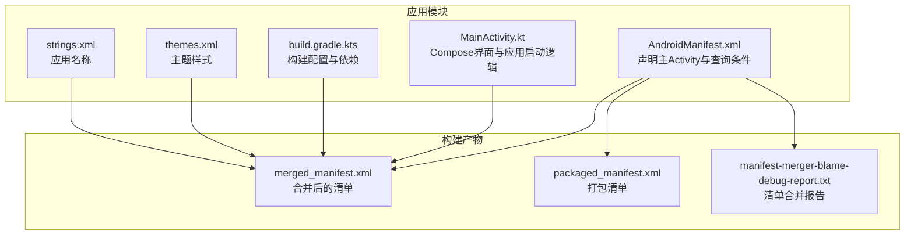
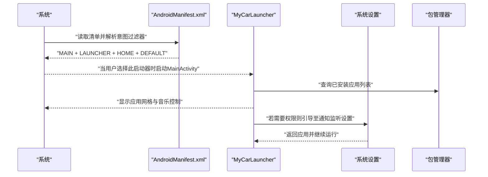
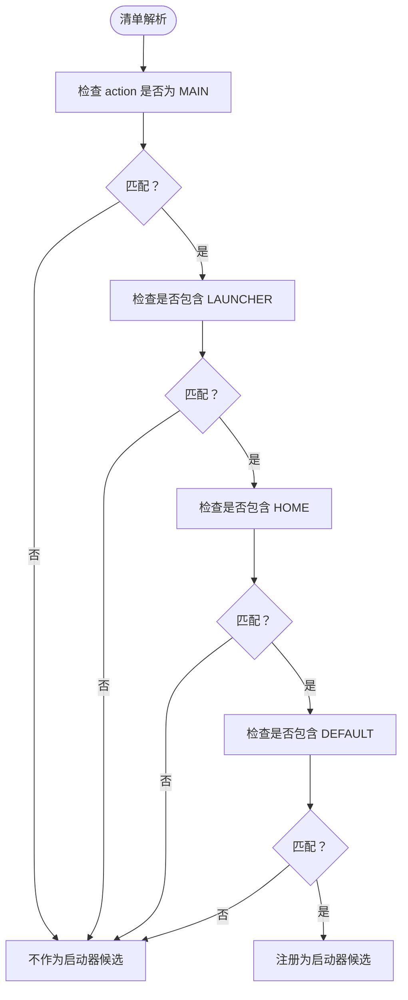
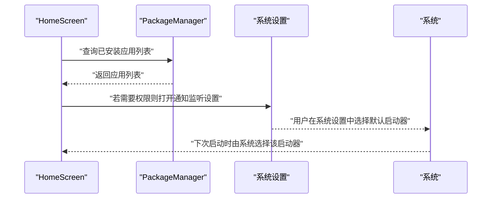
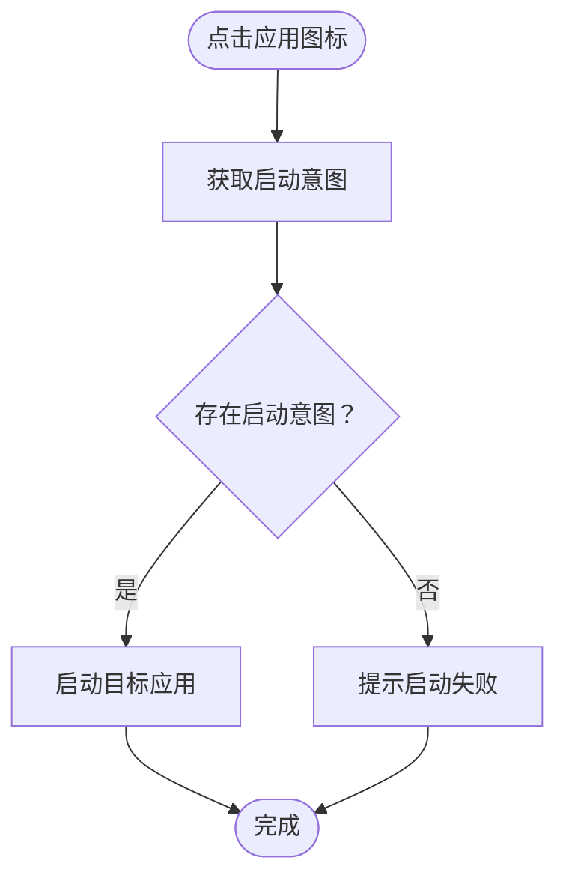
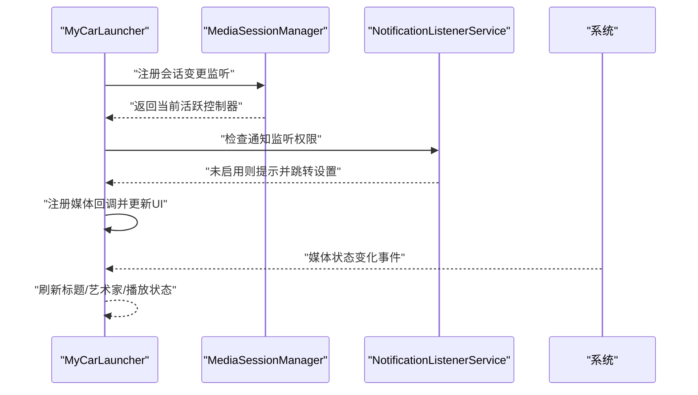
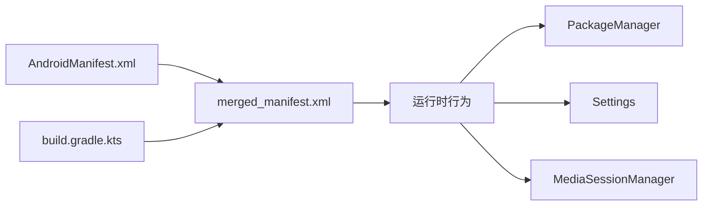

# 启动器集成

<cite>
**本文引用的文件**
- [AndroidManifest.xml](file://app/src/main/AndroidManifest.xml)
- [MainActivity.kt](file://app/src/main/java/com/sephp/mycarlauncher/MainActivity.kt)
- [build.gradle.kts](file://app/build.gradle.kts)
- [themes.xml](file://app/src/main/res/values/themes.xml)
- [strings.xml](file://app/src/main/res/values/strings.xml)
- [merged_manifest.xml](file://app/build/intermediates/merged_manifests/debug/processDebugManifest/AndroidManifest.xml)
- [packaged_manifest.xml](file://app/build/intermediates/packaged_manifests/debug/processDebugManifestForPackage/AndroidManifest.xml)
- [manifest-merger-blame-debug-report.txt](file://app/build/intermediates/manifest_merge_blame_file/debug/processDebugMainManifest/manifest-merger-blame-debug-report.txt)
</cite>

## 目录
1. [简介](#简介)
2. [项目结构](#项目结构)
3. [核心组件](#核心组件)
4. [架构总览](#架构总览)
5. [详细组件分析](#详细组件分析)
6. [依赖关系分析](#依赖关系分析)
7. [性能考量](#性能考量)
8. [故障排查指南](#故障排查指南)
9. [结论](#结论)
10. [附录](#附录)

## 简介
本文件面向车载或车机场景下的启动器集成，围绕 MyCarLauncher 的核心启动器能力进行系统化说明。重点涵盖：
- 如何在 AndroidManifest.xml 中配置主 Activity 以响应 HOME 意图，使其出现在系统启动器选择列表中
- android.intent.action.MAIN 与 android.intent.category.LAUNCHER 的组合使用方式
- 设置默认启动器的用户引导流程（检测当前默认启动器状态、跳转系统设置）
- 在不同 OEM 厂商设备上的兼容性问题与应对策略

## 项目结构
MyCarLauncher 采用标准 Android 应用结构，核心启动器逻辑集中在主 Activity 和清单文件中，并通过 Compose 构建界面与交互。

图表来源
- [AndroidManifest.xml](file://app/src/main/AndroidManifest.xml#L1-L50)
- [MainActivity.kt](file://app/src/main/java/com/sephp/mycarlauncher/MainActivity.kt#L64-L74)
- [build.gradle.kts](file://app/build.gradle.kts#L1-L42)
- [themes.xml](file://app/src/main/res/values/themes.xml#L1-L8)
- [strings.xml](file://app/src/main/res/values/strings.xml#L1-L3)
- [merged_manifest.xml](file://app/build/intermediates/merged_manifests/debug/processDebugManifest/AndroidManifest.xml#L36-L66)
- [packaged_manifest.xml](file://app/build/intermediates/packaged_manifests/debug/processDebugManifestForPackage/AndroidManifest.xml#L36-L66)
- [manifest-merger-blame-debug-report.txt](file://app/build/intermediates/manifest_merge_blame_file/debug/processDebugMainManifest/manifest-merger-blame-debug-report.txt#L62-L81)

章节来源
- [AndroidManifest.xml](file://app/src/main/AndroidManifest.xml#L1-L50)
- [MainActivity.kt](file://app/src/main/java/com/sephp/mycarlauncher/MainActivity.kt#L64-L74)
- [build.gradle.kts](file://app/build.gradle.kts#L1-L42)

## 核心组件
- 主 Activity 配置：在清单中为 MainActivity 添加了 HOME、LAUNCHER、DEFAULT 三类分类，使其可作为系统启动器候选。
- 查询声明：通过 <queries> 声明对 MAIN+LAUNCHER 的查询意图，确保系统能正确识别该应用为可启动器。
- Compose 界面：HomeScreen 提供停靠栏、应用列表、音乐控制等车载场景功能。
- 构建配置：compileSdk/targetSdk/minSdk 等版本参数满足现代 Android 要求。

章节来源
- [AndroidManifest.xml](file://app/src/main/AndroidManifest.xml#L1-L50)
- [MainActivity.kt](file://app/src/main/java/com/sephp/mycarlauncher/MainActivity.kt#L64-L74)
- [build.gradle.kts](file://app/build.gradle.kts#L13-L21)

## 架构总览
下图展示从系统到应用的关键交互路径，以及启动器注册与默认启动器设置的流程。

图表来源
- [AndroidManifest.xml](file://app/src/main/AndroidManifest.xml#L35-L47)
- [MainActivity.kt](file://app/src/main/java/com/sephp/mycarlauncher/MainActivity.kt#L285-L322)
- [merged_manifest.xml](file://app/build/intermediates/merged_manifests/debug/processDebugManifest/AndroidManifest.xml#L50-L63)

## 详细组件分析

### 组件A：主 Activity 与启动器意图过滤器
- 清单配置要点
  - exported=true：允许外部调用
  - 屏幕方向 landscape：适配车机横屏体验
  - launchMode=singleTask：避免重复实例
  - intent-filter 包含：
    - action: android.intent.action.MAIN
    - category: android.intent.category.LAUNCHER
    - category: android.intent.category.HOME
    - category: android.intent.category.DEFAULT
- 查询声明
  - <queries> 声明对 MAIN+LAUNCHER 的查询，帮助系统识别该应用具备启动器能力

图表来源
- [AndroidManifest.xml](file://app/src/main/AndroidManifest.xml#L35-L47)
- [merged_manifest.xml](file://app/build/intermediates/merged_manifests/debug/processDebugManifest/AndroidManifest.xml#L50-L63)

章节来源
- [AndroidManifest.xml](file://app/src/main/AndroidManifest.xml#L35-L47)
- [merged_manifest.xml](file://app/build/intermediates/merged_manifests/debug/processDebugManifest/AndroidManifest.xml#L50-L63)
- [manifest-merger-blame-debug-report.txt](file://app/build/intermediates/manifest_merge_blame_file/debug/processDebugMainManifest/manifest-merger-blame-debug-report.txt#L62-L81)

### 组件B：设置默认启动器的用户引导流程
- 当前默认启动器状态检测
  - 通过包管理器查询已安装应用列表，用于展示“所有应用”入口
  - 通过 Settings.Secure 获取已启用的通知监听器，用于判断是否需要引导用户开启权限
- 跳转系统设置
  - 若缺少必要权限，自动提示并跳转至通知监听设置页面
- 默认启动器设置
  - 本项目未直接实现“设置默认启动器”的代码；通常由系统在用户选择后自动更新默认值

图表来源
- [MainActivity.kt](file://app/src/main/java/com/sephp/mycarlauncher/MainActivity.kt#L285-L322)
- [MainActivity.kt](file://app/src/main/java/com/sephp/mycarlauncher/MainActivity.kt#L443-L453)

章节来源
- [MainActivity.kt](file://app/src/main/java/com/sephp/mycarlauncher/MainActivity.kt#L285-L322)
- [MainActivity.kt](file://app/src/main/java/com/sephp/mycarlauncher/MainActivity.kt#L443-L453)

### 组件C：应用列表与启动逻辑
- 应用列表加载
  - 使用 PackageManager.queryIntentActivities 并传入 MATCH_ALL，以获取所有可启动的应用
- 应用启动
  - 通过 getLaunchIntentForPackage 获取启动意图并启动目标应用
- 错误处理
  - 对异常进行捕获并提示用户

图表来源
- [MainActivity.kt](file://app/src/main/java/com/sephp/mycarlauncher/MainActivity.kt#L443-L453)
- [MainActivity.kt](file://app/src/main/java/com/sephp/mycarlauncher/MainActivity.kt#L454-L462)

章节来源
- [MainActivity.kt](file://app/src/main/java/com/sephp/mycarlauncher/MainActivity.kt#L443-L462)

### 组件D：通知监听与音乐控制
- 通知监听服务
  - 声明绑定 NotificationListenerService 权限并导出
- 音乐控制
  - 通过 MediaSessionManager 获取当前会话控制器，监听元数据与播放状态变化
  - 若未启用通知监听权限，自动提示并跳转设置页

图表来源
- [AndroidManifest.xml](file://app/src/main/AndroidManifest.xml#L25-L33)
- [MainActivity.kt](file://app/src/main/java/com/sephp/mycarlauncher/MainActivity.kt#L285-L322)
- [MainActivity.kt](file://app/src/main/java/com/sephp/mycarlauncher/MainActivity.kt#L377-L381)

章节来源
- [AndroidManifest.xml](file://app/src/main/AndroidManifest.xml#L25-L33)
- [MainActivity.kt](file://app/src/main/java/com/sephp/mycarlauncher/MainActivity.kt#L285-L322)
- [MainActivity.kt](file://app/src/main/java/com/sephp/mycarlauncher/MainActivity.kt#L377-L381)

## 依赖关系分析
- 清单与构建
  - AndroidManifest.xml 中的 <queries> 与 <activity>/<service> 声明在构建阶段被合并为最终清单
  - 构建脚本定义了 compileSdk/targetSdk/minSdk 等关键参数，影响启动器行为与兼容性
- 运行时依赖
  - PackageManager 用于查询应用列表
  - Settings 用于跳转系统设置
  - MediaSessionManager 用于音乐控制

图表来源
- [AndroidManifest.xml](file://app/src/main/AndroidManifest.xml#L1-L50)
- [merged_manifest.xml](file://app/build/intermediates/merged_manifests/debug/processDebugManifest/AndroidManifest.xml#L36-L66)
- [build.gradle.kts](file://app/build.gradle.kts#L13-L21)

章节来源
- [AndroidManifest.xml](file://app/src/main/AndroidManifest.xml#L1-L50)
- [merged_manifest.xml](file://app/build/intermediates/merged_manifests/debug/processDebugManifest/AndroidManifest.xml#L36-L66)
- [build.gradle.kts](file://app/build.gradle.kts#L13-L21)

## 性能考量
- 启动器界面
  - 使用 Compose 构建，建议避免在主线程执行耗时操作；当前已通过协程在 IO 线程加载应用列表与图片资源
- 应用列表加载
  - queryIntentActivities 使用 MATCH_ALL 可能带来一定开销，建议按需分页或缓存结果
- 音乐控制
  - 回调注册与注销在 DisposableEffect 中处理，避免泄漏
- 主题与窗口
  - 主题设置透明背景与壁纸显示，适合车机场景，但需注意渲染性能

章节来源
- [MainActivity.kt](file://app/src/main/java/com/sephp/mycarlauncher/MainActivity.kt#L148-L166)
- [MainActivity.kt](file://app/src/main/java/com/sephp/mycarlauncher/MainActivity.kt#L285-L322)
- [themes.xml](file://app/src/main/res/values/themes.xml#L1-L8)

## 故障排查指南
- 启动器未出现在系统启动器选择列表
  - 检查清单中的 intent-filter 是否包含 MAIN、LAUNCHER、HOME、DEFAULT
  - 确认 exported=true 且未被其他过滤器覆盖
- 无法设置默认启动器
  - 系统可能因安全策略限制或 OEM 定制而阻止第三方启动器成为默认
  - 建议引导用户在系统设置中手动选择
- 权限相关问题
  - 通知监听权限未开启会导致音乐信息不可用
  - 自动提示并跳转至通知监听设置页面
- OEM 设备差异
  - 不同厂商可能隐藏或禁用“设为默认启动器”选项
  - 建议在应用内提供清晰的引导说明与替代方案

章节来源
- [AndroidManifest.xml](file://app/src/main/AndroidManifest.xml#L35-L47)
- [MainActivity.kt](file://app/src/main/java/com/sephp/mycarlauncher/MainActivity.kt#L285-L322)
- [MainActivity.kt](file://app/src/main/java/com/sephp/mycarlauncher/MainActivity.kt#L377-L381)

## 结论
MyCarLauncher 已完整实现车载启动器的核心能力：通过清单声明 MAIN/LAUNCHER/HOME/DEFAULT 意图过滤器，使应用可作为系统启动器候选；通过 Compose 提供直观的车载界面；通过权限引导与媒体会话监听增强用户体验。针对 OEM 兼容性问题，建议在应用内提供明确的用户引导与说明，以提升默认启动器设置的成功率。

## 附录

### A. AndroidManifest.xml 关键配置说明
- <queries> 声明对 MAIN+LAUNCHER 的查询，帮助系统识别启动器候选
- <activity> 声明 MainActivity 的 intent-filter，包含 LAUNCHER、HOME、DEFAULT
- <service> 声明通知监听服务并导出

章节来源
- [AndroidManifest.xml](file://app/src/main/AndroidManifest.xml#L1-L50)
- [merged_manifest.xml](file://app/build/intermediates/merged_manifests/debug/processDebugManifest/AndroidManifest.xml#L40-L63)
- [manifest-merger-blame-debug-report.txt](file://app/build/intermediates/manifest_merge_blame_file/debug/processDebugMainManifest/manifest-merger-blame-debug-report.txt#L62-L81)

### B. 构建与运行环境
- compileSdk/targetSdk/minSdk 参数满足现代 Android 要求
- 开启 Compose 支持，便于构建高性能界面

章节来源
- [build.gradle.kts](file://app/build.gradle.kts#L13-L21)
- [build.gradle.kts](file://app/build.gradle.kts#L39-L42)