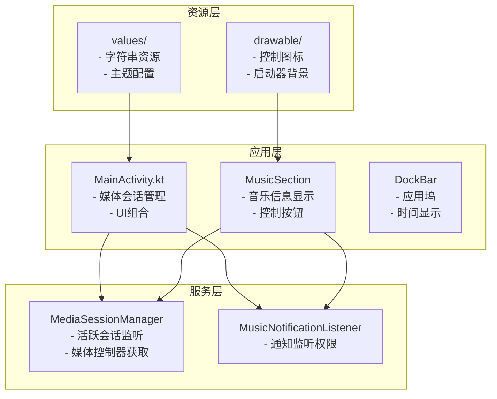
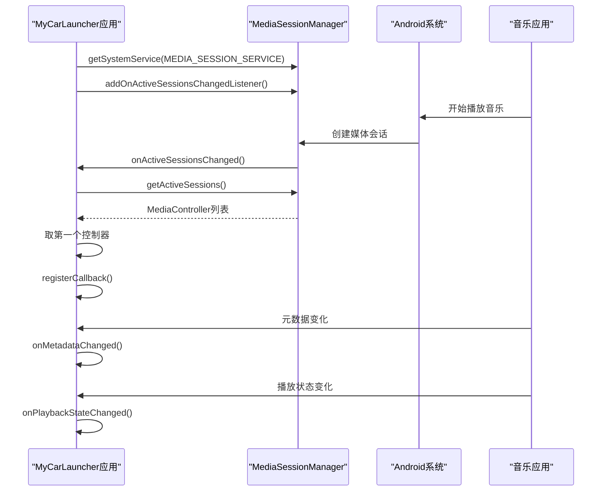
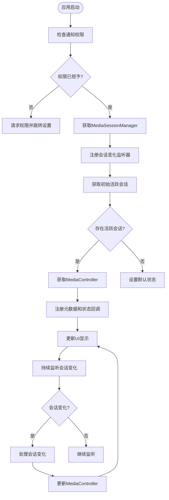
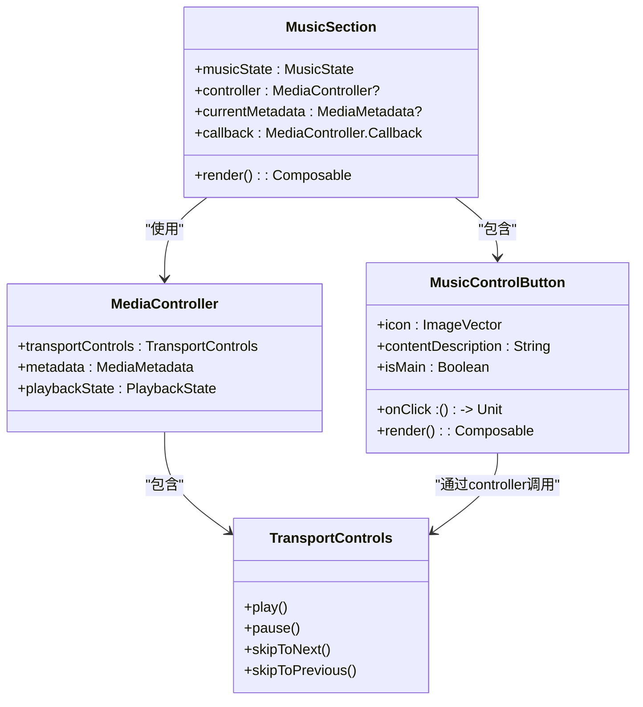
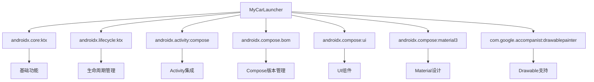

# 媒体会话集成

<cite>
**本文档引用的文件**  
- [MainActivity.kt](file://app/src/main/java/com/sephp/mycarlauncher/MainActivity.kt)
- [MusicNotificationListener.kt](file://app/src/main/java/com/sephp/mycarlauncher/MainActivity.kt#L383-L386)
- [AndroidManifest.xml](file://app/src/main/AndroidManifest.xml)
- [build.gradle.kts](file://app/build.gradle.kts)
</cite>

## 目录
1. [简介](#简介)
2. [项目结构](#项目结构)
3. [核心组件](#核心组件)
4. [架构概述](#架构概述)
5. [详细组件分析](#详细组件分析)
6. [依赖分析](#依赖分析)
7. [性能考虑](#性能考虑)
8. [故障排除指南](#故障排除指南)
9. [结论](#结论)

## 简介
本文档深入讲解了MyCarLauncher应用如何通过MediaSessionManager获取当前活跃的媒体播放状态。文档详细说明了从NotificationListenerService中提取音乐播放信息（如歌曲标题、艺术家、专辑封面）的技术实现路径，描述了媒体控制按钮（播放/暂停、上一首、下一首）与系统媒体会话的交互机制。同时提供了处理无活跃会话、多会话冲突等边界情况的代码示例，并包含避免频繁轮询和合理管理监听器生命周期的性能优化建议。

## 项目结构
MyCarLauncher项目是一个基于Jetpack Compose的Android车载启动器应用，其主要功能包括应用启动、地图显示和音乐控制。项目采用模块化结构，核心功能集中在MainActivity中，通过Compose UI实现现代化的用户界面。媒体会话集成主要通过MediaSessionManager和NotificationListenerService实现，允许应用获取系统中当前播放的音乐信息并进行控制。

**图源**
- [MainActivity.kt](file://app/src/main/java/com/sephp/mycarlauncher/MainActivity.kt)
- [AndroidManifest.xml](file://app/src/main/AndroidManifest.xml)

**本节来源**
- [MainActivity.kt](file://app/src/main/java/com/sephp/mycarlauncher/MainActivity.kt)
- [AndroidManifest.xml](file://app/src/main/AndroidManifest.xml)

## 核心组件
应用的核心媒体会话集成组件包括MediaController.Callback用于监听媒体元数据和播放状态变化，MediaSessionManager用于管理活跃的媒体会话，以及NotificationListenerService用于获取必要的权限。MusicState数据类封装了当前播放的音乐信息，包括标题、艺术家、专辑封面和播放状态。通过DisposableEffect管理媒体会话监听器的生命周期，确保在组件销毁时正确清理资源，避免内存泄漏。

**本节来源**
- [MainActivity.kt](file://app/src/main/java/com/sephp/mycarlauncher/MainActivity.kt#L246-L251)
- [MainActivity.kt](file://app/src/main/java/com/sephp/mycarlauncher/MainActivity.kt#L271-L322)

## 架构概述
应用的媒体会话集成架构基于Android的MediaSession框架，通过MediaSessionManager获取系统中所有活跃的媒体会话。当用户播放音乐时，系统会创建一个媒体会话，应用通过注册OnActiveSessionsChangedListener监听器来检测这些会话的变化。一旦检测到新的活跃会话，应用就会获取对应的MediaController并注册Callback来接收元数据和播放状态的更新。这种架构允许应用实时响应音乐播放的变化，提供流畅的用户体验。

**图源**
- [MainActivity.kt](file://app/src/main/java/com/sephp/mycarlauncher/MainActivity.kt#L290-L322)
- [MainActivity.kt](file://app/src/main/java/com/sephp/mycarlauncher/MainActivity.kt#L271-L282)

## 详细组件分析

### 媒体会话管理分析
媒体会话管理是应用的核心功能之一，通过MediaSessionManager实现对系统媒体状态的监听和控制。应用首先检查是否已获得通知访问权限，如果没有则引导用户前往设置页面授权。然后获取MediaSessionManager实例，并注册OnActiveSessionsChangedListener来监听活跃会话的变化。当会话变化时，应用会更新当前的MediaController，并注册Callback来接收元数据和播放状态的更新。

**图源**
- [MainActivity.kt](file://app/src/main/java/com/sephp/mycarlauncher/MainActivity.kt#L285-L322)
- [MainActivity.kt](file://app/src/main/java/com/sephp/mycarlauncher/MainActivity.kt#L377-L381)

**本节来源**
- [MainActivity.kt](file://app/src/main/java/com/sephp/mycarlauncher/MainActivity.kt#L285-L322)
- [MainActivity.kt](file://app/src/main/java/com/sephp/mycarlauncher/MainActivity.kt#L377-L381)

### 媒体控制按钮分析
媒体控制按钮实现了与系统媒体会话的交互，允许用户通过界面控制音乐播放。播放/暂停按钮根据当前播放状态动态切换图标和功能，上一首和下一首按钮则直接调用MediaController.TransportControls的相应方法。这种设计确保了控制按钮能够正确响应用户的操作，并与后台音乐播放器同步。

**图源**
- [MainActivity.kt](file://app/src/main/java/com/sephp/mycarlauncher/MainActivity.kt#L368-L375)
- [MainActivity.kt](file://app/src/main/java/com/sephp/mycarlauncher/MainActivity.kt#L339-L347)

**本节来源**
- [MainActivity.kt](file://app/src/main/java/com/sephp/mycarlauncher/MainActivity.kt#L368-L375)
- [MainActivity.kt](file://app/src/main/java/com/sephp/mycarlauncher/MainActivity.kt#L339-L347)

## 依赖分析
应用的主要依赖包括AndroidX核心库、Jetpack Compose UI框架和accompanist-drawablepainter库。AndroidX库提供了基础的Android开发支持，Jetpack Compose实现了现代化的声明式UI，而accompanist-drawablepainter则用于在Compose中显示Drawable资源。这些依赖共同支持了应用的媒体会话集成和用户界面功能。

**图源**
- [build.gradle.kts](file://app/build.gradle.kts)
- [settings.gradle.kts](file://settings.gradle.kts)

**本节来源**
- [build.gradle.kts](file://app/build.gradle.kts)
- [settings.gradle.kts](file://settings.gradle.kts)

## 性能考虑
在媒体会话集成中，性能优化至关重要。应用通过使用DisposableEffect确保监听器在组件销毁时被正确移除，避免了内存泄漏。异步加载专辑封面防止了主线程阻塞，使用LaunchedEffect和kotlinx.coroutines.delay实现了一秒一次的时间更新，避免了频繁轮询。此外，通过remember和mutableStateOf优化了Compose的重组，只在必要时更新UI。

**本节来源**
- [MainActivity.kt](file://app/src/main/java/com/sephp/mycarlauncher/MainActivity.kt#L261-L269)
- [MainActivity.kt](file://app/src/main/java/com/sephp/mycarlauncher/MainActivity.kt#L122-L128)
- [MainActivity.kt](file://app/src/main/java/com/sephp/mycarlauncher/MainActivity.kt#L318-L321)

## 故障排除指南
常见问题包括无法显示音乐信息，这通常是由于缺少通知访问权限。解决方案是检查isNotificationListenerEnabled函数的返回值，并在权限缺失时引导用户前往设置页面授权。另一个问题是多会话冲突，应用通过取第一个活跃会话来解决，但可以扩展为让用户选择要控制的会话。安全异常可能发生在add/remove监听器时，应使用try-catch块进行处理。

**本节来源**
- [MainActivity.kt](file://app/src/main/java/com/sephp/mycarlauncher/MainActivity.kt#L286-L288)
- [MainActivity.kt](file://app/src/main/java/com/sephp/mycarlauncher/MainActivity.kt#L306-L316)
- [MainActivity.kt](file://app/src/main/java/com/sephp/mycarlauncher/MainActivity.kt#L353-L365)

## 结论
MyCarLauncher应用通过MediaSessionManager和NotificationListenerService实现了强大的媒体会话集成功能。应用能够实时获取和显示音乐播放信息，并提供完整的控制功能。通过合理的架构设计和性能优化，确保了流畅的用户体验。未来可以扩展功能，如支持多会话选择、增强错误处理和提供更多媒体信息显示。