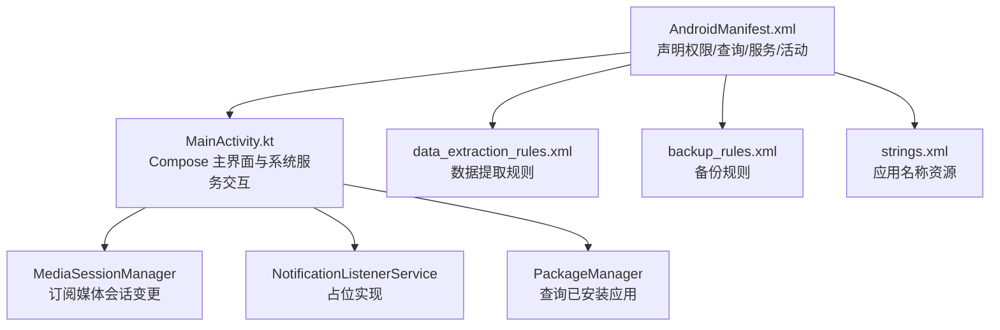
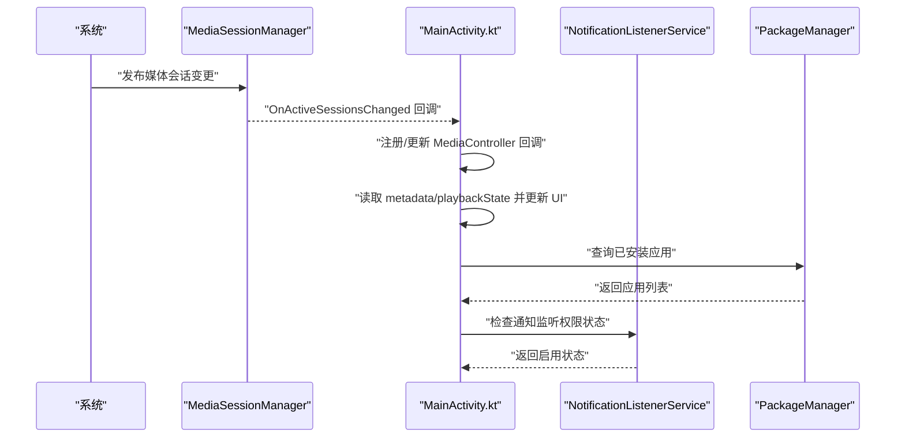
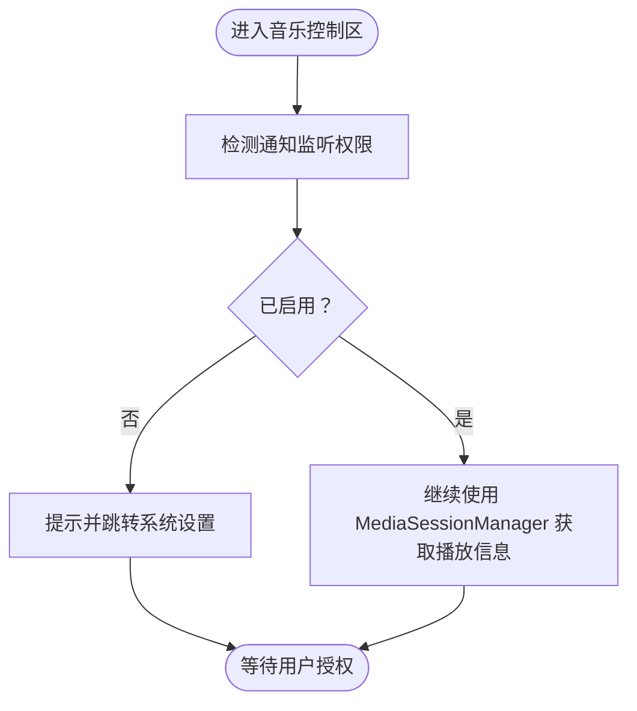
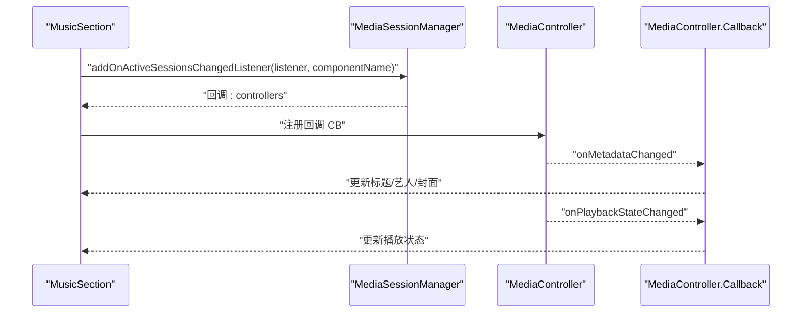
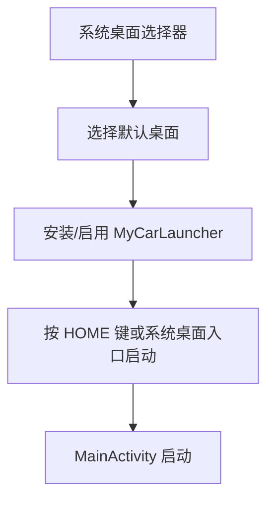
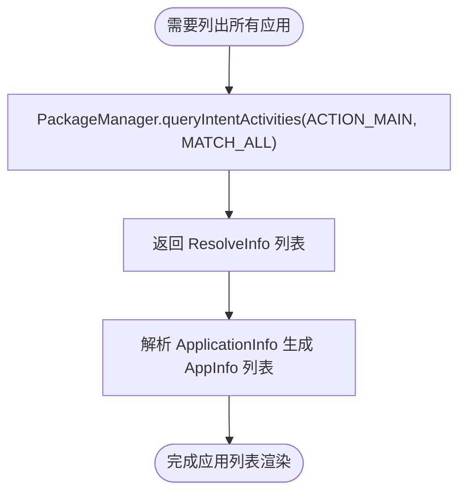
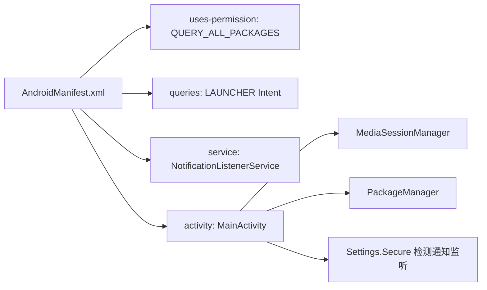

# 系统集成

<cite>
**本文引用的文件列表**
- [AndroidManifest.xml](file://app/src/main/AndroidManifest.xml)
- [MainActivity.kt](file://app/src/main/java/com/sephp/mycarlauncher/MainActivity.kt)
- [data_extraction_rules.xml](file://app/src/main/res/xml/data_extraction_rules.xml)
- [backup_rules.xml](file://app/src/main/res/xml/backup_rules.xml)
- [strings.xml](file://app/src/main/res/values/strings.xml)
</cite>

## 目录
1. [简介](#简介)
2. [项目结构](#项目结构)
3. [核心组件](#核心组件)
4. [架构总览](#架构总览)
5. [详细组件分析](#详细组件分析)
6. [依赖关系分析](#依赖关系分析)
7. [性能考量](#性能考量)
8. [故障排查指南](#故障排查指南)
9. [结论](#结论)
10. [附录](#附录)

## 简介
本文件聚焦于 MyCarLauncher 与 Android 系统的深度集成机制，围绕以下主题展开：
- NotificationListenerService 的配置与权限要求
- 通过 MediaSessionManager 获取媒体播放信息
- 应用启动器（HOME category）的集成方式
- QUERY_ALL_PACKAGES 权限的使用场景
- 权限请求的最佳实践与用户拒绝时的引导策略
- 与系统服务交互时的异常处理与安全注意事项

## 项目结构
MyCarLauncher 采用 Compose UI 驱动的主界面，包含“音乐控制区”“应用停靠栏”“应用列表”等模块；系统服务集成主要体现在：
- 在清单中声明并注册 NotificationListenerService
- 在 Activity 中通过 MediaSessionManager 订阅媒体会话变更
- 通过 HOME category 作为系统默认启动器参与桌面体验

图表来源
- [AndroidManifest.xml](file://app/src/main/AndroidManifest.xml#L1-L50)
- [MainActivity.kt](file://app/src/main/java/com/sephp/mycarlauncher/MainActivity.kt#L1-L120)
- [data_extraction_rules.xml](file://app/src/main/res/xml/data_extraction_rules.xml#L1-L19)
- [backup_rules.xml](file://app/src/main/res/xml/backup_rules.xml#L1-L13)
- [strings.xml](file://app/src/main/res/values/strings.xml#L1-L3)

章节来源
- [AndroidManifest.xml](file://app/src/main/AndroidManifest.xml#L1-L50)
- [MainActivity.kt](file://app/src/main/java/com/sephp/mycarlauncher/MainActivity.kt#L1-L120)

## 核心组件
- NotificationListenerService：在清单中声明为系统通知监听服务，并设置绑定权限。当前实现为空服务体，用于满足系统对通知监听服务的注册要求。
- MediaSessionManager：在主界面中通过该服务订阅媒体会话变更，动态获取当前播放的元数据与播放状态。
- HOME 启动器：MainActivity 同时声明了 LAUNCHER 和 HOME category，使其可作为系统默认桌面。
- QUERY_ALL_PACKAGES：用于查询设备上所有已安装的应用包名，支持应用列表与停靠应用的加载。

章节来源
- [AndroidManifest.xml](file://app/src/main/AndroidManifest.xml#L1-L50)
- [MainActivity.kt](file://app/src/main/java/com/sephp/mycarlauncher/MainActivity.kt#L254-L381)

## 架构总览
下图展示了从系统到应用的关键交互路径：系统通过 MediaSessionManager 发布媒体会话变更，应用通过回调更新 UI；同时，应用通过 PackageManager 查询应用列表，支持用户选择停靠应用。

图表来源
- [MainActivity.kt](file://app/src/main/java/com/sephp/mycarlauncher/MainActivity.kt#L254-L381)
- [AndroidManifest.xml](file://app/src/main/AndroidManifest.xml#L1-L50)

## 详细组件分析

### NotificationListenerService 集成与权限
- 清单声明
  - 服务类型：NotificationListenerService
  - 绑定权限：BIND_NOTIFICATION_LISTENER_SERVICE
  - 导出属性：exported=true
  - 动作过滤：android.service.notification.NotificationListenerService
- 当前实现
  - 仅继承基类，未覆盖具体方法，用于满足系统注册要求
- 权限校验
  - 应用在进入音乐控制区时检测通知监听是否启用，若未启用则提示并跳转至系统设置页面

图表来源
- [AndroidManifest.xml](file://app/src/main/AndroidManifest.xml#L24-L33)
- [MainActivity.kt](file://app/src/main/java/com/sephp/mycarlauncher/MainActivity.kt#L285-L317)
- [MainActivity.kt](file://app/src/main/java/com/sephp/mycarlauncher/MainActivity.kt#L377-L381)

章节来源
- [AndroidManifest.xml](file://app/src/main/AndroidManifest.xml#L24-L33)
- [MainActivity.kt](file://app/src/main/java/com/sephp/mycarlauncher/MainActivity.kt#L285-L317)
- [MainActivity.kt](file://app/src/main/java/com/sephp/mycarlauncher/MainActivity.kt#L377-L381)

### MediaSessionManager 媒体播放信息获取
- 服务获取
  - 通过 Context 获取 MEDIA_SESSION_SERVICE
  - 使用 ComponentName 指向 MusicNotificationListener（即便其为空实现）
- 会话订阅
  - 注册 OnActiveSessionsChangedListener，当有活跃会话时自动回调
  - 初次获取时主动查询 getActiveSessions，选择首个控制器
- 回调处理
  - 注册 MediaController.Callback，监听元数据变化与播放状态变化
  - 更新 UI 状态（标题、艺人、是否播放），异步加载专辑封面
- 安全性
  - 对 SecurityException 进行捕获，避免崩溃

图表来源
- [MainActivity.kt](file://app/src/main/java/com/sephp/mycarlauncher/MainActivity.kt#L254-L351)

章节来源
- [MainActivity.kt](file://app/src/main/java/com/sephp/mycarlauncher/MainActivity.kt#L254-L351)

### 应用启动器（HOME category）集成
- 清单中 MainActivity 同时声明 MAIN、LAUNCHER、HOME、DEFAULT category
- 作用
  - 使应用可作为系统默认桌面参与启动流程
  - 与系统桌面交互时，遵循 HOME 启动器的生命周期与显示逻辑

图表来源
- [AndroidManifest.xml](file://app/src/main/AndroidManifest.xml#L35-L47)

章节来源
- [AndroidManifest.xml](file://app/src/main/AndroidManifest.xml#L35-L47)

### QUERY_ALL_PACKAGES 权限使用场景
- 清单中声明该权限，且使用 tools:ignore 忽略静态检查
- 使用场景
  - 查询设备上所有已安装应用，构建应用列表与停靠应用选择器
  - 通过 PackageManager.queryIntentActivities 与 MATCH_ALL 标志配合，确保返回所有匹配项

图表来源
- [AndroidManifest.xml](file://app/src/main/AndroidManifest.xml#L5-L6)
- [MainActivity.kt](file://app/src/main/java/com/sephp/mycarlauncher/MainActivity.kt#L422-L431)

章节来源
- [AndroidManifest.xml](file://app/src/main/AndroidManifest.xml#L5-L6)
- [MainActivity.kt](file://app/src/main/java/com/sephp/mycarlauncher/MainActivity.kt#L422-L431)

### 权限请求最佳实践与用户拒绝引导
- 通知监听权限
  - 进入音乐控制区时检测 enabled_notification_listeners
  - 若未启用，弹出提示并跳转系统设置页面
- QUERY_ALL_PACKAGES
  - 由于该权限属于特殊权限，建议在首次需要时进行引导说明
  - 可在应用内提供“帮助/说明”页面，解释为何需要该权限（如应用列表、停靠应用）
- 用户拒绝后的策略
  - 提供明确的引导文案与操作按钮，指向系统设置
  - 在设置返回后再次检测权限状态并提示结果
  - 对于非关键功能，可降级展示（例如仅显示占位符）

章节来源
- [MainActivity.kt](file://app/src/main/java/com/sephp/mycarlauncher/MainActivity.kt#L285-L317)
- [AndroidManifest.xml](file://app/src/main/AndroidManifest.xml#L5-L6)

### 与系统服务交互的异常处理与安全考虑
- 异常处理
  - 对 SecurityException 进行捕获，避免因权限不足导致崩溃
  - 对应用图标加载失败等异常进行容错处理
- 安全考虑
  - 仅在必要时请求敏感权限，并提供清晰的用途说明
  - 使用最小权限原则，避免过度申请
  - 对外部输入（如应用图标）进行空值与异常保护
  - 对系统设置跳转进行健壮性判断

章节来源
- [MainActivity.kt](file://app/src/main/java/com/sephp/mycarlauncher/MainActivity.kt#L316-L321)
- [MainActivity.kt](file://app/src/main/java/com/sephp/mycarlauncher/MainActivity.kt#L260-L269)

## 依赖关系分析
- 清单层
  - uses-permission: QUERY_ALL_PACKAGES
  - queries: 限定系统能发现的 LAUNCHER 类型 Intent
  - service: NotificationListenerService，绑定权限 BIND_NOTIFICATION_LISTENER_SERVICE
  - activity: MainActivity，声明 HOME/LAUNCHER/DEFAULT category
- 代码层
  - MainActivity 依赖 Context 获取 MediaSessionManager
  - 通过 PackageManager 查询应用列表
  - 通过 Settings.Secure 检查通知监听权限

图表来源
- [AndroidManifest.xml](file://app/src/main/AndroidManifest.xml#L1-L50)
- [MainActivity.kt](file://app/src/main/java/com/sephp/mycarlauncher/MainActivity.kt#L254-L381)

章节来源
- [AndroidManifest.xml](file://app/src/main/AndroidManifest.xml#L1-L50)
- [MainActivity.kt](file://app/src/main/java/com/sephp/mycarlauncher/MainActivity.kt#L254-L381)

## 性能考量
- 媒体会话订阅
  - 使用 OnActiveSessionsChangedListener 能够及时响应媒体切换，避免轮询带来的开销
  - 初次获取会话后立即注册回调，减少 UI 延迟
- 图标与封面加载
  - 封面加载在 IO 线程执行，避免阻塞 UI
  - 对异常进行吞吐，保证 UI 流畅
- 应用列表
  - 使用异步加载与分页网格渲染，降低首屏压力

章节来源
- [MainActivity.kt](file://app/src/main/java/com/sephp/mycarlauncher/MainActivity.kt#L254-L351)
- [MainActivity.kt](file://app/src/main/java/com/sephp/mycarlauncher/MainActivity.kt#L260-L269)
- [MainActivity.kt](file://app/src/main/java/com/sephp/mycarlauncher/MainActivity.kt#L422-L431)

## 故障排查指南
- 无法显示音乐信息
  - 检查通知监听权限是否开启
  - 若未开启，根据提示跳转系统设置并重新进入页面
- 无法获取应用列表
  - 确认 QUERY_ALL_PACKAGES 权限已授予
  - 检查 PackageManager 查询逻辑是否被拦截或抛出异常
- 崩溃或无响应
  - 关注 SecurityException 捕获点，确认权限相关分支
  - 检查 MediaController 回调注册与注销时机

章节来源
- [MainActivity.kt](file://app/src/main/java/com/sephp/mycarlauncher/MainActivity.kt#L285-L317)
- [MainActivity.kt](file://app/src/main/java/com/sephp/mycarlauncher/MainActivity.kt#L316-L321)
- [AndroidManifest.xml](file://app/src/main/AndroidManifest.xml#L5-L6)

## 结论
MyCarLauncher 通过合理的清单配置与系统服务集成，实现了：
- 通知监听服务的正确声明与权限绑定
- 基于 MediaSessionManager 的媒体播放信息实时获取
- 作为 HOME 启动器参与系统桌面体验
- 对 QUERY_ALL_PACKAGES 权限的合理使用与引导策略

在实际部署中，建议持续关注权限策略与用户体验的平衡，完善权限说明与回退逻辑，确保在不同 Android 版本与设备上的稳定性。

## 附录
- 数据提取与备份规则
  - data_extraction_rules.xml：定义云端/传输时的数据提取策略（示例文件）
  - backup_rules.xml：定义自动备份的内容（示例文件）
- 应用名称资源
  - strings.xml：应用名称字符串资源

章节来源
- [data_extraction_rules.xml](file://app/src/main/res/xml/data_extraction_rules.xml#L1-L19)
- [backup_rules.xml](file://app/src/main/res/xml/backup_rules.xml#L1-L13)
- [strings.xml](file://app/src/main/res/values/strings.xml#L1-L3)