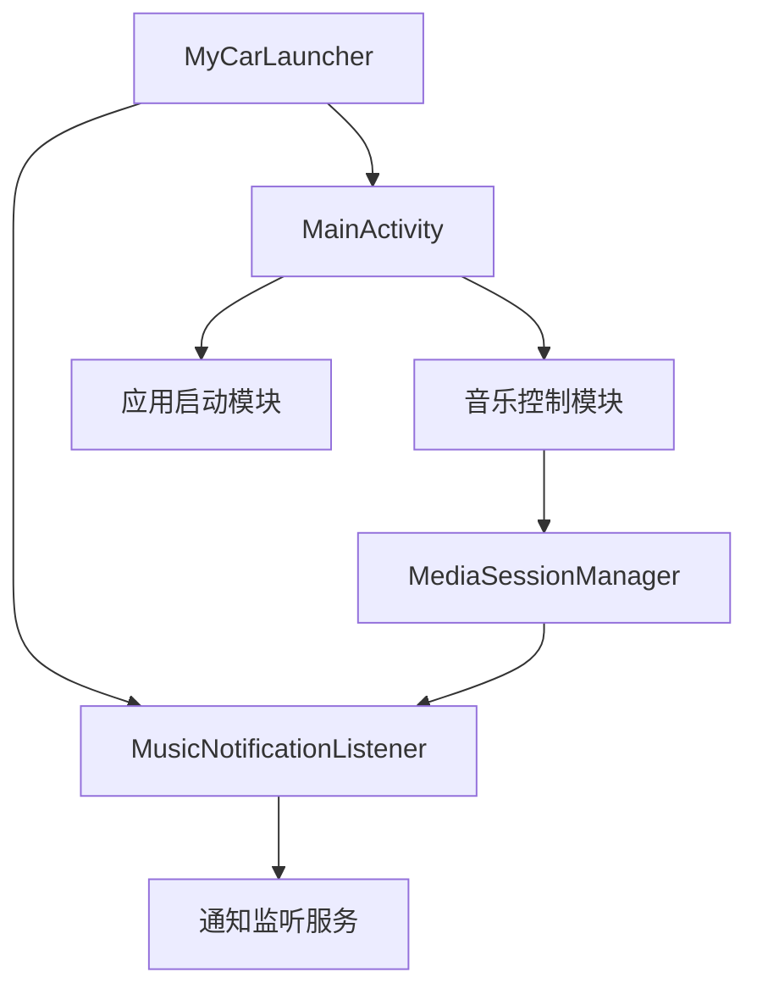
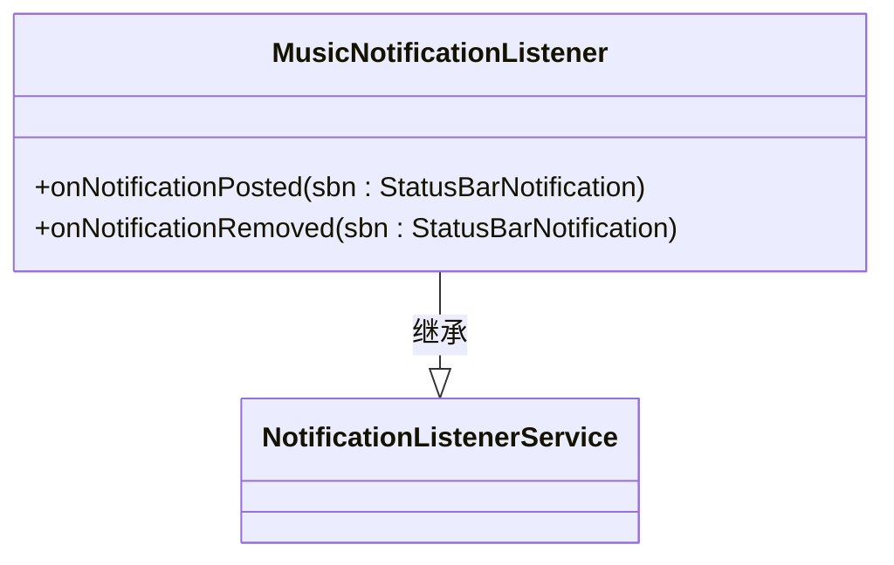
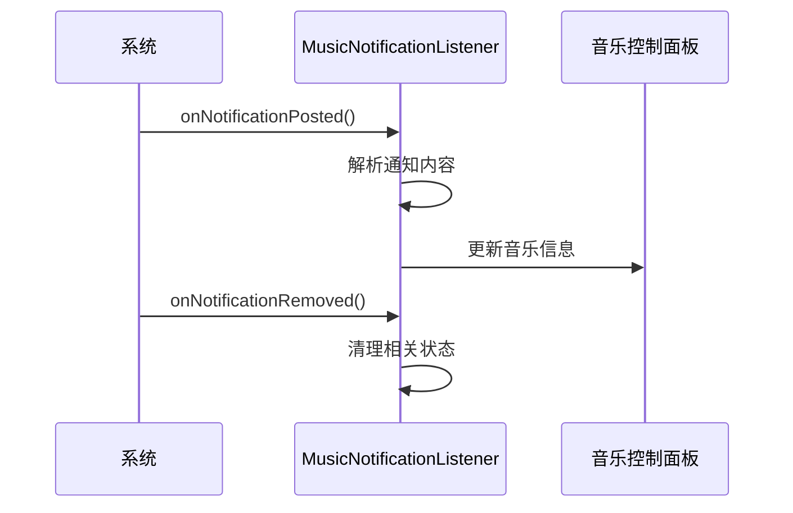

# 通知集成

<cite>
**本文档引用的文件**  
- [AndroidManifest.xml](file://app/src/main/AndroidManifest.xml)
- [MainActivity.kt](file://app/src/main/java/com/sephp/mycarlauncher/MainActivity.kt)
- [MusicNotificationListener.class](file://app/build/tmp/kotlin-classes/debug/com/sephp/mycarlauncher/MusicNotificationListener.class)
</cite>

## 目录
1. [项目结构](#项目结构)
2. [核心组件](#核心组件)
3. [通知监听服务声明](#通知监听服务声明)
4. [权限配置与安全控制](#权限配置与安全控制)
5. [通知事件处理逻辑](#通知事件处理逻辑)
6. [用户权限引导流程](#用户权限引导流程)
7. [兼容性与常见问题](#兼容性与常见问题)

## 项目结构
MyCarLauncher项目采用标准的Android项目结构，主要功能集中在`app/src/main`目录下。应用的核心功能包括车载启动器界面、应用管理以及音乐播放状态监控。通知集成功能主要通过`MusicNotificationListener`服务实现，该服务继承自Android系统的`NotificationListenerService`，用于监听系统通知并获取音乐播放信息。

**图示来源**  
- [AndroidManifest.xml](file://app/src/main/AndroidManifest.xml#L25-L33)
- [MainActivity.kt](file://app/src/main/java/com/sephp/mycarlauncher/MainActivity.kt#L64-L73)

## 核心组件
项目的核心组件包括主活动`MainActivity`和音乐通知监听器`MusicNotificationListener`。`MainActivity`负责构建用户界面，包括应用坞、地图区域和音乐控制面板。音乐控制面板通过`MediaSessionManager`与系统媒体会话进行交互，获取当前播放的音乐信息。`MusicNotificationListener`作为后台服务，继承自`NotificationListenerService`，用于监听系统通知，特别是音乐播放应用的通知。

**本节来源**  
- [MainActivity.kt](file://app/src/main/java/com/sephp/mycarlauncher/MainActivity.kt#L64-L73)
- [MusicNotificationListener.class](file://app/build/tmp/kotlin-classes/debug/com/sephp/mycarlauncher/MusicNotificationListener.class)

## 通知监听服务声明
在`AndroidManifest.xml`中，`MusicNotificationListener`服务通过`<service>`标签进行声明。该服务必须设置`android:permission="android.permission.BIND_NOTIFICATION_LISTENER_SERVICE"`权限，以确保只有系统可以绑定此服务。同时，`android:exported="true"`属性允许其他应用组件访问该服务。服务的`<intent-filter>`中声明了`android.service.notification.NotificationListenerService`动作，使系统能够识别该服务为通知监听服务。

**图示来源**  
- [AndroidManifest.xml](file://app/src/main/AndroidManifest.xml#L25-L33)

## 权限配置与安全控制
为了使用通知监听功能，应用必须在`AndroidManifest.xml`中声明`BIND_NOTIFICATION_LISTENER_SERVICE`权限。此权限属于系统级权限，用户必须在系统设置中手动授予。服务的`android:exported="true"`属性虽然允许外部访问，但由于绑定权限的限制，只有系统可以实际绑定该服务，确保了安全性。此外，应用还声明了`QUERY_ALL_PACKAGES`权限，用于查询设备上所有已安装的应用程序。

**本节来源**  
- [AndroidManifest.xml](file://app/src/main/AndroidManifest.xml#L5-L6)
- [AndroidManifest.xml](file://app/src/main/AndroidManifest.xml#L28-L29)

## 通知事件处理逻辑
`MusicNotificationListener`类重写了`onNotificationPosted`和`onNotificationRemoved`方法。当系统有新的通知发布时，`onNotificationPosted`方法被调用；当通知被移除时，`onNotificationRemoved`方法被调用。在当前实现中，这两个方法体为空，但可以在此处添加逻辑来处理音乐播放应用的通知，提取播放状态、歌曲标题、艺术家等信息，并通过`MediaSessionManager`更新UI。

**图示来源**  
- [MainActivity.kt](file://app/src/main/java/com/sephp/mycarlauncher/MainActivity.kt#L383-L385)

## 用户权限引导流程
应用在启动时会检查用户是否已授予通知访问权限。通过`isNotificationListenerEnabled`函数，应用查询系统设置中的`enabled_notification_listeners`列表，判断自身包名是否在其中。如果权限未启用，应用会显示一个Toast提示用户，并通过`Intent(Settings.ACTION_NOTIFICATION_LISTENER_SETTINGS)`跳转到系统通知权限设置页面，引导用户手动开启权限。

**本节来源**  
- [MainActivity.kt](file://app/src/main/java/com/sephp/mycarlauncher/MainActivity.kt#L377-L381)
- [MainActivity.kt](file://app/src/main/java/com/sephp/mycarlauncher/MainActivity.kt#L286-L288)

## 兼容性与常见问题
在不同Android版本中，通知监听服务的行为可能略有差异。从Android 4.3（API 18）开始引入`NotificationListenerService`，因此应用需要确保最低API级别不低于18。在Android 13（API 33）及以上版本中，应用需要声明`POST_NOTIFICATIONS`运行时权限。常见问题包括用户忘记开启权限、其他应用占用通知监听服务等。解决方案包括提供清晰的权限引导、定期检查权限状态以及在权限被拒绝时给出明确的错误提示。

**本节来源**  
- [MainActivity.kt](file://app/src/main/java/com/sephp/mycarlauncher/MainActivity.kt#L377-L381)
- [AndroidManifest.xml](file://app/src/main/AndroidManifest.xml#L5-L6)