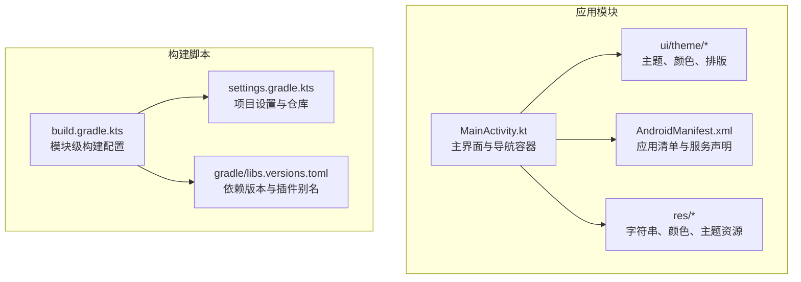
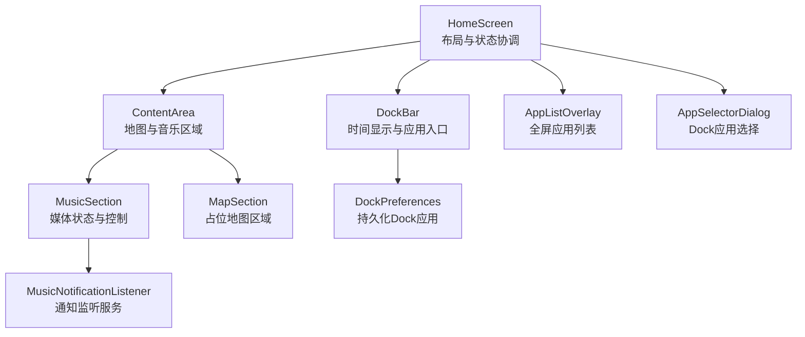
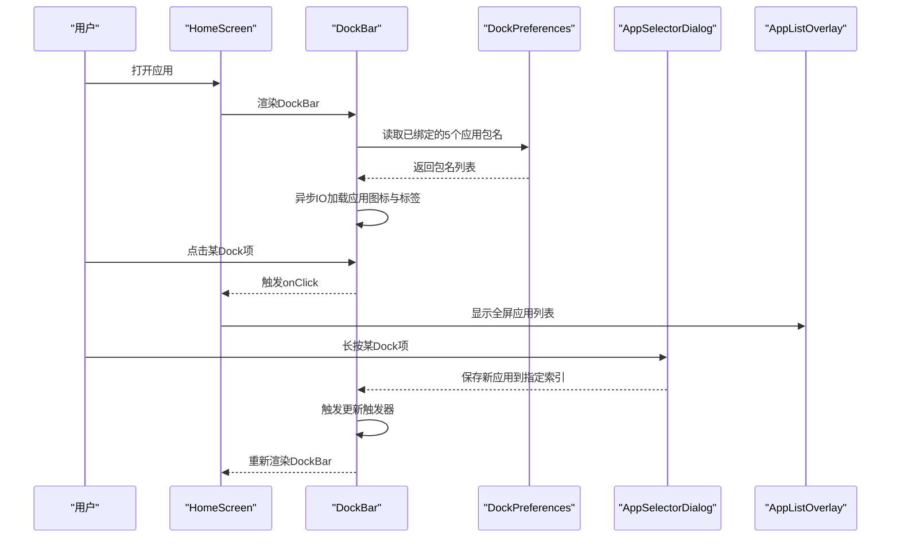
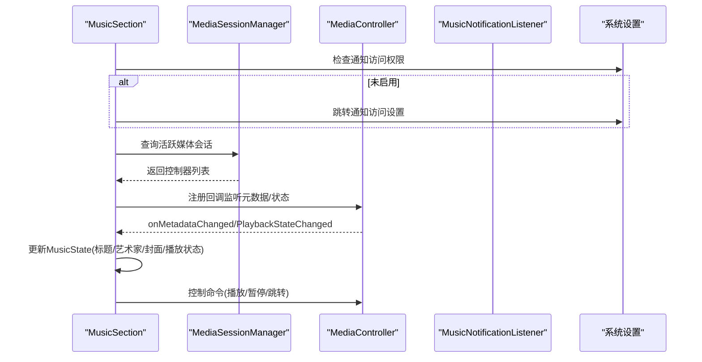
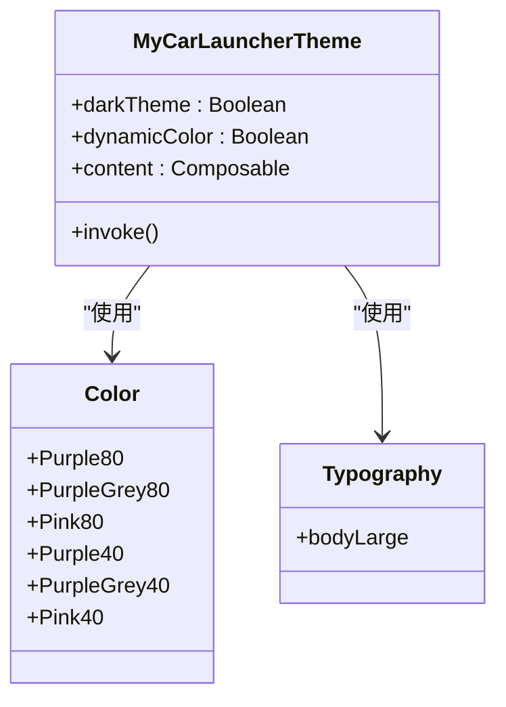
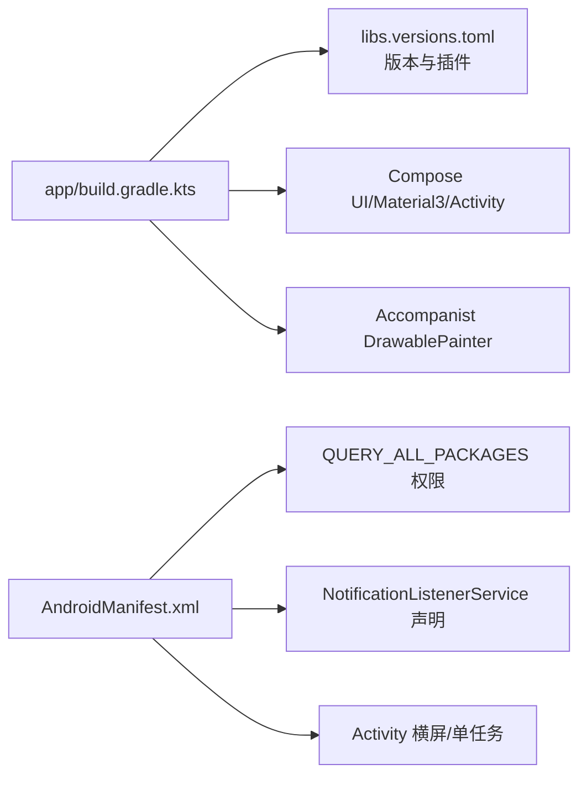

# 项目概述

<cite>
**本文引用的文件**
- [MainActivity.kt](file://app/src/main/java/com/sephp/mycarlauncher/MainActivity.kt)
- [Theme.kt](file://app/src/main/java/com/sephp/mycarlauncher/ui/theme/Theme.kt)
- [Color.kt](file://app/src/main/java/com/sephp/mycarlauncher/ui/theme/Color.kt)
- [Type.kt](file://app/src/main/java/com/sephp/mycarlauncher/ui/theme/Type.kt)
- [AndroidManifest.xml](file://app/src/main/AndroidManifest.xml)
- [build.gradle.kts](file://app/build.gradle.kts)
- [settings.gradle.kts](file://settings.gradle.kts)
- [gradle/libs.versions.toml](file://gradle/libs.versions.toml)
- [strings.xml](file://app/src/main/res/values/strings.xml)
- [colors.xml](file://app/src/main/res/values/colors.xml)
- [themes.xml](file://app/src/main/res/values/themes.xml)
</cite>

## 目录
1. [简介](#简介)
2. [项目结构](#项目结构)
3. [核心组件](#核心组件)
4. [架构总览](#架构总览)
5. [详细组件分析](#详细组件分析)
6. [依赖分析](#依赖分析)
7. [性能考虑](#性能考虑)
8. [故障排查指南](#故障排查指南)
9. [结论](#结论)
10. [附录](#附录)

## 简介
MyCarLauncher 是一个面向车载场景的 Android 启动器应用，旨在通过简洁直观的界面与安全的交互方式，降低驾驶过程中的注意力分散风险。项目采用 Jetpack Compose 进行声明式 UI 开发，结合 Material Design 3 的设计语言，并以 Kotlin 为主要编程语言，确保跨平台一致性与可维护性。系统核心由“Dock 栏”、“音乐控制区”、“地图区域”和“全屏应用列表”四大模块构成，围绕单向数据流与状态管理策略组织，既满足初学者快速上手，也为高级开发者提供清晰的架构决策依据。

## 项目结构
项目采用标准 Android Gradle 工程结构，核心代码位于 app 模块中，主题与样式集中在 ui/theme 包下，资源文件位于 res 目录。构建脚本通过 Gradle 和版本目录统一管理依赖与插件。



图表来源
- [MainActivity.kt](file://app/src/main/java/com/sephp/mycarlauncher/MainActivity.kt#L63-L118)
- [Theme.kt](file://app/src/main/java/com/sephp/mycarlauncher/ui/theme/Theme.kt#L36-L58)
- [AndroidManifest.xml](file://app/src/main/AndroidManifest.xml#L15-L47)
- [build.gradle.kts](file://app/build.gradle.kts#L1-L65)
- [settings.gradle.kts](file://settings.gradle.kts#L1-L24)
- [gradle/libs.versions.toml](file://gradle/libs.versions.toml#L1-L35)

章节来源
- [MainActivity.kt](file://app/src/main/java/com/sephp/mycarlauncher/MainActivity.kt#L63-L118)
- [AndroidManifest.xml](file://app/src/main/AndroidManifest.xml#L15-L47)
- [build.gradle.kts](file://app/build.gradle.kts#L1-L65)
- [settings.gradle.kts](file://settings.gradle.kts#L1-L24)
- [gradle/libs.versions.toml](file://gradle/libs.versions.toml#L1-L35)

## 核心组件
- 主界面容器 HomeScreen：负责布局组织与状态协调，承载 Dock 栏与内容区域。
- Dock 栏 DockBar：固定宽度的左侧工具条，包含时间显示、应用快捷入口与“全部应用”入口。
- 内容区域 ContentArea：垂直分隔的地图区域与音乐控制区。
- 音乐控制区 MusicSection：展示专辑封面、歌曲信息与播放控制按钮；通过媒体会话监听音乐状态变化。
- 全屏应用列表 AppListOverlay：覆盖屏幕的网格化应用列表，支持一键启动并关闭。
- 应用选择对话框 AppSelectorDialog：用于为 Dock 栏占位符绑定应用。
- 主题系统 MyCarLauncherTheme：基于 Material 3 的深浅色与动态色方案，适配系统主题。

章节来源
- [MainActivity.kt](file://app/src/main/java/com/sephp/mycarlauncher/MainActivity.kt#L75-L118)
- [MainActivity.kt](file://app/src/main/java/com/sephp/mycarlauncher/MainActivity.kt#L136-L206)
- [MainActivity.kt](file://app/src/main/java/com/sephp/mycarlauncher/MainActivity.kt#L228-L244)
- [MainActivity.kt](file://app/src/main/java/com/sephp/mycarlauncher/MainActivity.kt#L252-L351)
- [MainActivity.kt](file://app/src/main/java/com/sephp/mycarlauncher/MainActivity.kt#L388-L405)
- [MainActivity.kt](file://app/src/main/java/com/sephp/mycarlauncher/MainActivity.kt#L448-L463)
- [Theme.kt](file://app/src/main/java/com/sephp/mycarlauncher/ui/theme/Theme.kt#L36-L58)

## 架构总览
系统采用“声明式 UI + 单向数据流”的架构模式：
- 声明式 UI：使用 Jetpack Compose 组合函数描述界面，状态驱动渲染。
- 单向数据流：状态集中于 Composable 层，通过 remember/mutableState 管理，避免直接修改共享对象。
- 状态管理策略：利用 LaunchedEffect/DisposableEffect 执行副作用（如异步加载、注册回调），并在作用域结束时清理。
- 组件解耦：各模块通过参数传递与回调通信，减少耦合度。



图表来源
- [MainActivity.kt](file://app/src/main/java/com/sephp/mycarlauncher/MainActivity.kt#L75-L118)
- [MainActivity.kt](file://app/src/main/java/com/sephp/mycarlauncher/MainActivity.kt#L136-L206)
- [MainActivity.kt](file://app/src/main/java/com/sephp/mycarlauncher/MainActivity.kt#L228-L244)
- [MainActivity.kt](file://app/src/main/java/com/sephp/mycarlauncher/MainActivity.kt#L252-L351)
- [MainActivity.kt](file://app/src/main/java/com/sephp/mycarlauncher/MainActivity.kt#L388-L405)
- [MainActivity.kt](file://app/src/main/java/com/sephp/mycarlauncher/MainActivity.kt#L448-L463)
- [AndroidManifest.xml](file://app/src/main/AndroidManifest.xml#L25-L33)

## 详细组件分析

### Dock 栏与时间显示
- 功能要点
  - 固定宽度的 Dock 栏，左侧时间显示区域，右侧垂直排列 5 个应用入口。
  - 支持长按 Dock 应用项打开应用选择器，实现动态绑定。
  - Dock 应用加载采用 IO 线程异步执行，避免阻塞主线程。
- 设计原则
  - 简洁直观：图标尺寸统一，留白充足，便于驾驶时快速识别。
  - 安全优先：点击与长按行为分离，减少误触概率。
- 关键实现路径
  - DockBar 组合函数与 DockAppItem 组合函数
  - DockPreferences 对 Dock 应用的持久化读写
  - DockTimeDisplay 使用协程每秒刷新时间显示



图表来源
- [MainActivity.kt](file://app/src/main/java/com/sephp/mycarlauncher/MainActivity.kt#L136-L206)
- [MainActivity.kt](file://app/src/main/java/com/sephp/mycarlauncher/MainActivity.kt#L440-L446)
- [MainActivity.kt](file://app/src/main/java/com/sephp/mycarlauncher/MainActivity.kt#L448-L463)
- [MainActivity.kt](file://app/src/main/java/com/sephp/mycarlauncher/MainActivity.kt#L120-L134)

章节来源
- [MainActivity.kt](file://app/src/main/java/com/sephp/mycarlauncher/MainActivity.kt#L136-L206)
- [MainActivity.kt](file://app/src/main/java/com/sephp/mycarlauncher/MainActivity.kt#L440-L446)
- [MainActivity.kt](file://app/src/main/java/com/sephp/mycarlauncher/MainActivity.kt#L448-L463)
- [MainActivity.kt](file://app/src/main/java/com/sephp/mycarlauncher/MainActivity.kt#L120-L134)

### 音乐控制区与媒体会话集成
- 功能要点
  - 展示专辑封面、标题与艺术家信息，提供上一首/播放/暂停/下一首控制。
  - 通过 MediaSessionManager 获取当前活跃的媒体控制器，注册回调监听元数据与播放状态变化。
  - 若未启用通知访问权限，引导用户前往设置开启。
- 设计原则
  - 低耦合：UI 与媒体会话逻辑分离，通过回调更新状态。
  - 可靠性：异常处理与资源释放（注销回调）保证稳定性。
- 关键实现路径
  - MusicSection 组合函数与 MusicControlButton 组合函数
  - MusicNotificationListener 服务声明
  - isNotificationListenerEnabled 辅助函数



图表来源
- [MainActivity.kt](file://app/src/main/java/com/sephp/mycarlauncher/MainActivity.kt#L252-L351)
- [AndroidManifest.xml](file://app/src/main/AndroidManifest.xml#L25-L33)

章节来源
- [MainActivity.kt](file://app/src/main/java/com/sephp/mycarlauncher/MainActivity.kt#L252-L351)
- [AndroidManifest.xml](file://app/src/main/AndroidManifest.xml#L25-L33)

### 全屏应用列表与应用选择对话框
- 功能要点
  - AppListOverlay 以半透明背景覆盖全屏，居中显示网格化应用列表，点击即启动并关闭 Overlay。
  - AppSelectorDialog 提供 Dock 占位符的应用选择界面，选择后写入偏好并触发 Dock 刷新。
- 设计原则
  - 无侵入式覆盖：点击空白区域即可关闭，避免多余操作。
  - 高效浏览：网格布局与滚动优化，适合车载场景快速定位。

```mermaid
flowchart TD
Start(["进入HomeScreen"]) --> ShowDock["渲染DockBar与内容区域"]
ShowDock --> ClickApps["点击\"全部应用\"入口"]
ClickApps --> Overlay["显示AppListOverlay"]
Overlay --> Choose["网格浏览应用"]
Choose --> Launch["点击应用启动"]
Launch --> CloseOverlay["关闭Overlay"]
CloseOverlay --> End(["回到HomeScreen"])
```

图表来源
- [MainActivity.kt](file://app/src/main/java/com/sephp/mycarlauncher/MainActivity.kt#L388-L405)
- [MainActivity.kt](file://app/src/main/java/com/sephp/mycarlauncher/MainActivity.kt#L407-L418)
- [MainActivity.kt](file://app/src/main/java/com/sephp/mycarlauncher/MainActivity.kt#L448-L463)

章节来源
- [MainActivity.kt](file://app/src/main/java/com/sephp/mycarlauncher/MainActivity.kt#L388-L405)
- [MainActivity.kt](file://app/src/main/java/com/sephp/mycarlauncher/MainActivity.kt#L407-L418)
- [MainActivity.kt](file://app/src/main/java/com/sephp/mycarlauncher/MainActivity.kt#L448-L463)

### 地图区域
- 功能要点
  - 当前为占位区域，预留地图能力扩展空间。
- 设计原则
  - 保持界面一致性，与音乐区同等权重，便于未来接入第三方地图服务或自定义地图组件。

章节来源
- [MainActivity.kt](file://app/src/main/java/com/sephp/mycarlauncher/MainActivity.kt#L236-L244)

### 主题与设计语言
- 设计语言
  - Material Design 3：使用 MaterialTheme 的颜色方案与排版体系，支持动态色与深浅主题切换。
- 主题实现
  - MyCarLauncherTheme：根据系统深浅主题与设备支持动态色条件选择颜色方案。
  - Color.kt/Type.kt：定义基础颜色与排版样式，供主题统一引用。



图表来源
- [Theme.kt](file://app/src/main/java/com/sephp/mycarlauncher/ui/theme/Theme.kt#L36-L58)
- [Color.kt](file://app/src/main/java/com/sephp/mycarlauncher/ui/theme/Color.kt#L1-L11)
- [Type.kt](file://app/src/main/java/com/sephp/mycarlauncher/ui/theme/Type.kt#L1-L34)

章节来源
- [Theme.kt](file://app/src/main/java/com/sephp/mycarlauncher/ui/theme/Theme.kt#L36-L58)
- [Color.kt](file://app/src/main/java/com/sephp/mycarlauncher/ui/theme/Color.kt#L1-L11)
- [Type.kt](file://app/src/main/java/com/sephp/mycarlauncher/ui/theme/Type.kt#L1-L34)

## 依赖分析
- 构建与插件
  - Android 应用插件、Kotlin Android 插件、Kotlin Compose 插件通过版本目录统一管理。
  - Compose 生态通过 BOM 管理版本，确保兼容性。
- 运行时依赖
  - AndroidX Compose UI、Material3、Activity Compose、Lifecycle Runtime KTX。
  - Accompanist Drawable Painter 用于 Drawable 在 Compose 中的绘制支持。
- 清单与权限
  - 申请 QUERY_ALL_PACKAGES 权限以便查询安装应用。
  - 声明 MusicNotificationListener 服务并绑定通知监听权限。
  - 设置 Activity 为横屏、单任务启动模式，适配车载场景。



图表来源
- [build.gradle.kts](file://app/build.gradle.kts#L1-L65)
- [gradle/libs.versions.toml](file://gradle/libs.versions.toml#L1-L35)
- [AndroidManifest.xml](file://app/src/main/AndroidManifest.xml#L1-L50)

章节来源
- [build.gradle.kts](file://app/build.gradle.kts#L1-L65)
- [gradle/libs.versions.toml](file://gradle/libs.versions.toml#L1-L35)
- [AndroidManifest.xml](file://app/src/main/AndroidManifest.xml#L1-L50)

## 性能考虑
- 异步加载与线程隔离
  - Dock 应用与音乐封面均在 IO 线程加载，避免阻塞主线程，保证 UI 流畅。
- 状态与副作用管理
  - 使用 LaunchedEffect/DisposableEffect 管理异步任务与回调注册/注销，减少内存泄漏风险。
- 资源与布局优化
  - 使用 LazyColumn/LazyVerticalGrid 实现虚拟化滚动，降低内存占用。
- 主题与渲染
  - Material 3 的统一排版与颜色体系减少重复计算，提升渲染效率。

## 故障排查指南
- 无法显示音乐信息
  - 现象：音乐区显示默认文案且无封面。
  - 排查：确认通知访问权限是否开启；若未开启，系统会弹出提示并引导至设置页面。
  - 参考实现路径：[通知权限检查与跳转](file://app/src/main/java/com/sephp/mycarlauncher/MainActivity.kt#L285-L290)
- 应用启动失败
  - 现象：点击应用无响应。
  - 排查：确认应用包名有效且存在启动意图；捕获异常并记录日志。
  - 参考实现路径：[应用启动与异常处理](file://app/src/main/java/com/sephp/mycarlauncher/MainActivity.kt#L433-L438)
- Dock 应用不显示
  - 现象：Dock 占位符未显示图标或名称。
  - 排查：检查 DockPreferences 是否正确保存；确认包名存在且可读。
  - 参考实现路径：[Dock 应用加载与异常处理](file://app/src/main/java/com/sephp/mycarlauncher/MainActivity.kt#L148-L166)
- 横屏与 HOME 行为
  - 现象：应用未作为系统启动器生效。
  - 排查：确认清单中 Activity 的 LAUNCHER/HOME 类别配置正确。
  - 参考实现路径：[Activity 清单配置](file://app/src/main/AndroidManifest.xml#L35-L47)

章节来源
- [MainActivity.kt](file://app/src/main/java/com/sephp/mycarlauncher/MainActivity.kt#L285-L290)
- [MainActivity.kt](file://app/src/main/java/com/sephp/mycarlauncher/MainActivity.kt#L433-L438)
- [MainActivity.kt](file://app/src/main/java/com/sephp/mycarlauncher/MainActivity.kt#L148-L166)
- [AndroidManifest.xml](file://app/src/main/AndroidManifest.xml#L35-L47)

## 结论
MyCarLauncher 通过简洁直观的界面与稳健的架构设计，为车载场景提供了安全、易用的启动器体验。Jetpack Compose 的声明式 UI、Material 3 的设计语言与 Kotlin 的现代特性共同构成了清晰、可维护的代码结构。Dock 栏、音乐控制区、地图区域与全屏应用列表四大模块围绕单向数据流与状态管理策略协同工作，既满足初学者快速上手，也为高级开发者提供了良好的扩展空间与实践范式。

## 附录
- 资源文件
  - 字符串资源：应用名称等
  - 颜色与主题：基础颜色与窗口背景设置
- 版本与插件
  - 通过版本目录统一管理依赖与插件版本，确保构建一致性

章节来源
- [strings.xml](file://app/src/main/res/values/strings.xml#L1-L3)
- [colors.xml](file://app/src/main/res/values/colors.xml#L1-L10)
- [themes.xml](file://app/src/main/res/values/themes.xml#L1-L8)
- [gradle/libs.versions.toml](file://gradle/libs.versions.toml#L1-L35)